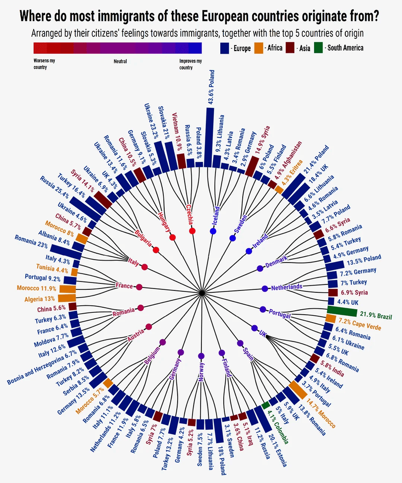

```{r setup, include=FALSE}
knitr::opts_chunk$set(out.width="100%", fig.align="center", fig.showtext=TRUE)
```

## Introduction 

This project recreates and then re-imagines a circular bar chart visualization showing European countries' attitudes toward immigration alongside their top 5 immigrant origin countries. The original graph, created by Reddit user killeradoom, combines 2018 data from the European Social Survey (2018) and Eurostat to present a comprehensive view of European immigration patterns. 

## Original Graph 

{.external width="100%"}

The original visualization presents a double "layered" circular bar chart. The graphs inner circle show European countries sentiments towards immigrants, as depicted by a blue to red color scale (informed by European Social Survey data). The outer circle displays a bar chart representing the top 5 immigration populations residing in each country, with each bar colored according the immigrant origin countries' continent. It was originally made using Flourish. While aesthetically pleasing due to its mandala-like appearance, it is difficult to interpret due to it's circular shape and doesn't immediately reveal any interesting data trends. 

### Libraries

```{r libraries}
library(tidyverse)
library(scales)     # For color gradients
library(ggnewscale) 
library(showtext)   # For custom fonts (google fonts)
library(patchwork)  # For legends
library(shadowtext) # For creating white outline
library(glue)       # For dynamic labels
library(ggtext)
```

### Font Setup 

I will be using "Oswald", which was identified as the font most similar to the original graph on google fonts.

```{r font-setup}
# Add Oswald font from Google Fonts
font_add_google("Oswald", "oswald")
showtext_auto()
showtext_opts(dpi = 300)  # Matching the ggsave DPI setting
```

### Data Preparation 

#### Inner Circle Data - ESS Data  

Information for the sentiment scale of immigrant recipient countries which make up the inner circle come for the European Social Survey (round 9, 2018). Because the original graph is from Reddit, I could not be sure how the attitude scale of the original was calculated. This was my best attempt at using the currently available data. This includes selecting relevant variables, normalizing them, and finding each country level average.

Here, I will leave this unrun code to show transparently how I cleaned by data without having to attach the original large file.

```{r ESS-data, eval=FALSE}
### INNER CIRCLE DATA

# Load ESS attitude data
ess9 <- read_csv("ESS9e03_2.csv")
#including the larger file to explain my data cleaning process

# Using all ESS questions regarding immigration and design weight variable
ess_attitudes_original <- ess9 |> 
  select(
    cntry,      #Country
    dweight,    # Design weight
    # Is/Does immigration.... 
    imbgeco,    # good for economy? (1-10)
    imwbcnt,    # country a better/worse place to live? (1 = worse, 10 = better)
    imueclt,    # enrich cultural life? (1-10)
    #...next questions are on different scale AND need to be reversed! 
    #1 = most positive 
    #Our country should... 
    imsmetn,    # Allow same ethnic group (1-4)
    imdfetn,    # Allow different ethnic group (1-4)
    impcntr     # Allow from poorer countries (1-4)
  )

# Now, reverse scale for questions where higher = more positive
ess_attitudes_rev <- ess_attitudes_original |> 
  mutate(
    imsmetn_rev = 5 - imsmetn,
    imdfetn_rev = 5 - imdfetn,
    impcntr_rev = 5 - impcntr
  )

# Calculate country-level average attitudes
country_attitudes <- ess_attitudes_rev |> 
  rowwise() |> 
  mutate(
    # Normalizing each question to 0-1 scale
    imbgeco_norm = imbgeco / 10,           
    imwbcnt_norm = imwbcnt / 10,           
    imueclt_norm = imueclt / 10,           
    imsmetn_norm = (imsmetn_rev - 1) / 3, 
    imdfetn_norm = (imdfetn_rev - 1) / 3,  
    impcntr_norm = (impcntr_rev - 1) / 3,  
    # Average all 6 normalized values across individual respondents
    person_avg = mean(c(imbgeco_norm, imwbcnt_norm, imueclt_norm, 
                        imsmetn_norm, imdfetn_norm, impcntr_norm), 
                      na.rm = TRUE)
  ) |> 
  ungroup() |> 
  group_by(cntry) |> 
  summarise( #creating average respondent attitude per receiving COUNTRY
    # WEIGHTED mean using design weight (dweight)
    avg_attitude = sum(person_avg * dweight, na.rm = TRUE) / sum(dweight, na.rm = TRUE)
  ) |> 
  mutate(
    attitude_normalized = (avg_attitude - min(avg_attitude)) / 
      (max(avg_attitude) - min(avg_attitude))
  )

#write_csv(country_attitudes, "country_attitudes_clean.csv")
```

And, here we load our simple data.

```{r clean-data}
country_attitudes <- read_csv("country_attitudes_clean.csv")
```

#### Outer Circle Data: Eurostat
The data for the outer circle of the graph (the top 5 immigrant populations in each recipient country and their percentage of the total immigrant population) comes from Eurostat (2018). This was much more straight forward than the ESS attitude calculation. Here, I merged the csv with the ESS data, added their full names corresponding to their country codes for labeling, and classified each by continent which will later determine each bars color.

```{r eurostat-data}
### OUTER CIRCLE DATA 

# Load Eurostat immigration data
immigration_data <- read_csv("top5_citizenship_by_country.csv")

# Merge data sets to a combined data set, reference column = the receiving country (inner circle)
combined_data <- immigration_data |> 
  left_join(country_attitudes, by = c("destination_country" = "cntry")) |> 
  drop_na() #not all countries represented 

# Add the full receiving country names - so they can later appear as label
combined_data <- combined_data |> 
  mutate(
    full_name = case_when(
      destination_country == "AT" ~ "Austria",
      destination_country == "BE" ~ "Belgium",
      destination_country == "CZ" ~ "Czechia",
      destination_country == "DE" ~ "Germany",
      destination_country == "DK" ~ "Denmark",
      destination_country == "ES" ~ "Spain",
      destination_country == "FI" ~ "Finland",
      destination_country == "FR" ~ "France",
      destination_country == "HU" ~ "Hungary",
      destination_country == "IE" ~ "Ireland",
      destination_country == "IS" ~ "Iceland",
      destination_country == "IT" ~ "Italy",
      destination_country == "NL" ~ "Netherlands",
      destination_country == "NO" ~ "Norway",
      destination_country == "PT" ~ "Portugal",
      destination_country == "SE" ~ "Sweden",
      TRUE ~ destination_country
    )
  )

# Classify origin countries by continent for coloring
# create a function to sort them also using case_when 

classify_continent <- function(code) {
  europe <- c("AL", "BA", "DE", "DK", "EE", "FI", "FR", "HR", "IT", 
              "LT", "LV", "NL", "PL", "PT", "RO", "RS", "SE", "SK", 
              "TR", "UA", "UK")
  africa <- c("CV", "DZ", "ER", "MA", "SO")
  asia <- c("AF", "CN", "IN", "IQ", "RU", "VN")
  s_america <- c("BR")
  
  case_when(
    code %in% europe ~ "Europe",
    code %in% africa ~ "Africa",
    code %in% asia ~ "Asia",
    code %in% s_america ~ "South America",
    TRUE ~ "Other"
  )
}

#finally, add to the combined_data 
combined_data <- combined_data |> 
  mutate(continent = classify_continent(citizenship))
```

### Ordering Data 

The next step after compiling a complete data frame was ordering the data of the inner circle by their attitudes. To inform this section, I followed tutorial 297 "Ordering Data" from the Data to Viz website's section on circular bar charts. 

```{r ordering-data}
### ORDERING DATA 

#new element with countries ordered by their attitudes
#includes also the countries' full names
country_order <- combined_data |> 
  distinct(destination_country, avg_attitude, attitude_normalized, full_name) |> 
  arrange(desc(attitude_normalized)) |>   # Order by attitude in descending order 
  mutate(country_id = row_number())  # Assign each receiving country an ID for easy coding by order

# Join country ID back to main data
# left join to bring the order back into our combined data 
# joined by receiving country
combined_data <- combined_data |> 
  left_join(country_order |>  select(destination_country, country_id), 
            by = "destination_country")

# Taken from tutorial 297 
# arranging each immigrant citizenship by percentage of immigrant population 
# done WITHIN receiving country that are ordered (desc) by attitude
combined_data <- combined_data |> 
  arrange(country_id, desc(percentage))
```

### Gaps Between Bars
Next, I had to assign each country a unique x position. This section was also informed by tutorial 297 from the data to viz R Graph Gallery. It's vital that each bar has it's exact position and unique sequential ID. Also, empty gaps are created to give space between bars when mapping. 

```{r formatting-gaps}

### ADD EMPTY BARS FOR GAPS BETWEEN GROUPS

# Assign unique ID to each bar
# This gives, "Each bar... a unique x position" (tutorial 297)
data <- combined_data |> 
  mutate(
    id = row_number()  # sequential ID
  )

# Calculate empty bars between groups
# "Data to viz" suggests adding empty rows to create gaps

empty_bar <- 3  # Number of empty positions between groups indicates the size of each gap

data <- data |> 
  mutate(
    # from tutorial 297: we create spacing through position calculation
    bar_position = id * (1 + empty_bar)
  )

#"data" is our final df that we will use in our plot!
```

### Labels: Positions and Angles
This section codes for the unique angels of all the country names in the original grpah. Each lies on a radial line coming from the center point and extending outwards. Tutorial 296 from the Data to Viz circular bar plot section informed this section: that each label must be calculated and it starts with computing it's specific angle. This tutorial also provided me a specific formula for calculating angles in circular barplots. Here, I also added the full names of each immigrant origin country. 

```{r positions-and-angles}
### CALCULATE LABEL POSITIONS AND ANGLES 

# Calculate center position for each destination country "group"
country_positions <- data |> 
  group_by(destination_country, country_id, full_name) |> 
  summarise(
    center_position = mean(bar_position),  # Average position of group
    .groups = "drop"
  ) |> 
  left_join(country_order |>  select(destination_country, attitude_normalized), 
            by = "destination_country")

# Calculate the unique "number" of each bar chart (refers to row) in our data
number_of_bar <- nrow(country_positions)

# angle formula from tutorial 296:
# "angle <- 90 - 360 * (label_data$id-0.5) / TOTAL positions
# "we subtract 0.5 because the letter must have the angle of the center of the bars"

country_positions <- country_positions |> 
  mutate(
    # Calculate angle based on actual position in the full circle
    total_positions = max(data$bar_position),
    base_angle = 90 - 360 * (center_position - 0.5) / total_positions,
    angle = case_when(
      base_angle < -90 | base_angle > 90 ~ base_angle + 180,
      TRUE ~ base_angle
    ),
    hjust_receiving = case_when(
      base_angle < -90 | base_angle > 90 ~ 1,
      TRUE ~ 0
    )
  )

# Adding center_position to main data for connecting lines
data <- data |> 
  left_join(country_positions |>  select(destination_country, center_position),
            by = "destination_country")

# Calculate angles for individual bars 
data <- data |> 
  mutate(
    base_bar_angle = 90 - 360 * (bar_position - 0.5) / max(bar_position),
    bar_angle = case_when(
      base_bar_angle < -90 | base_bar_angle > 90 ~ base_bar_angle + 180,
      TRUE ~ base_bar_angle
    ),
    hjust_bar = case_when(
      base_bar_angle < -90 | base_bar_angle > 90 ~ 1,
      TRUE ~ 0
    )
  )

# also adding, origin country full names
origin_country_names <- c(
  "AL" = "Albania", 
  "BA" = "Bosnia", 
  "DE" = "Germany", 
  "DK" = "Denmark", 
  "EE" = "Estonia", 
  "FI" = "Finland", 
  "FR" = "France",
  "HR" = "Croatia", 
  "IT" = "Italy", 
  "LT" = "Lithuania", 
  "LV" = "Latvia",
  "NL" = "Netherlands", 
  "PL" = "Poland", 
  "PT" = "Portugal", 
  "RO" = "Romania",
  "RS" = "Serbia", 
  "SE" = "Sweden", 
  "SK" = "Slovakia", 
  "TR" = "Turkey",
  "UA" = "Ukraine", 
  "UK" = "UK",
  "CV" = "Cape Verde", 
  "DZ" = "Algeria", 
  "ER" = "Eritrea",
  "MA" = "Morocco",
  "SO" = "Somalia", 
  "AF" = "Afghanistan", 
  "CN" = "China", 
  "IN" = "India",
  "IQ" = "Iraq", 
  "RU" = "Russia",
  "VN" = "Vietnam", 
  "BR" = "Brazil"
)

#adding origin country full names to data  
data <- data |> 
  mutate(origin_full_name = origin_country_names[citizenship])
```

### Gradient Colors
In this section, I define the colors for the "attitude scale" which colors the inner circle country labels as well as the corresponding dots. 

```{r gradient-colors}
### GRADIENT COLORS 

# Using scale_fill_gradient2() 

# label colors for receiving country labels only
pal <- gradient_n_pal(c("#be0e01", "#810180", "#0e00c3"), #colors taken directly from original image
                      values = c(0, 0.5, 1))

country_positions <- country_positions |> 
  mutate(
    # Rescale for label colors only 
    rescaled = (attitude_normalized - min(attitude_normalized)) / 
      (max(attitude_normalized) - min(attitude_normalized)),
    label_color = pal(rescaled)
  )
```

### Building the Plot
Now with all our data and elements fully prepared, we can start the process of creating our graph. 

#### Coord_polar
Our first step is to utilize the coord_polar function. This step follows tutorial 295 from the basic circular bar plot section of the Data to Viz website. Essentially, we plot the same as we would a standard barchart and use the function to wrap it into a circle. 

```{r coord_polar}
### BUILDING THE PLOT
p <- ggplot() +
## Coord_polar() : to make the chart circular
coord_polar(theta = "x", start = 0) +
  
  # Set axis limits
  # Tutorial 295: states the importance of the ylim() argument 
  #if ylim starts at 0 then the bars start at the center of the circle, ours need to be large
  scale_x_continuous(expand = c(0, 0)) +
  scale_y_continuous(limits = c(0, 210), expand = c(0, 0))   # this is my limit to show all elements of graph 
```

#### Graphing Stylistic Elements

Here we graph the central dot of the "mandala" shape, the attitude dots which are colored according to the countries attitudes towards immigration, and the radial lines from the center (including those from the center and those from the receiving countries to their corresponding immigration bars).

```{r lines-and-points}
# Multi-layer Graph Elements

# 1: Center dot
p <- p +
  geom_point(aes(x = 0, y = 0), size = 2, color = "black") +
  
# 2: radial lines from center 
# these go from central dot to the attitude dots 
geom_segment(data = country_positions,
             aes(x = center_position, xend = center_position, 
                 y = 0, yend = 60),
             color = "black", linewidth = 0.6) +
  
# 3a: singular lines extending from attitude dots to our "split point"
  geom_segment(data = country_positions,
               aes(x = center_position, xend = center_position,
                   y = 60, yend = 75),  # yend = 75 to split slightly "before" halfway to barchart
               color = "black", linewidth = 0.6) +
  
# 3b: Lines from determined "split point" connecting to the outer bars
  geom_segment(data = data,
               aes(x = center_position, xend = bar_position,
                   y = 75, yend = 120), #starting at "split point", ending at base of bars
               color = "black", linewidth = 0.4) +
  
# 4: Attitude dots with gradient colors 
# Using attitude_normalized directly with scale_fill_gradient2 funx
  geom_point(data = country_positions,
             aes(x = center_position, y = 60, #position on radial lines
                  fill = attitude_normalized),
             size = 4, shape = 21, stroke = 0) +
  
# Fill scale for attitude dots 
  #these are mapped here so that they sit on TOP of the lines! 
  scale_fill_gradient2(
    low = "#be0e01", 
    mid = "#810180", 
    high = "#0e01c2",
    midpoint = median(country_positions$attitude_normalized),
    # Re-scale to use full color range
    limits = range(country_positions$attitude_normalized), #to show variety in color!
    guide = "none"
  ) 
```

#### Recieving Labels
This section maps the inner ring country labels. It also uses the shadowtext function to create the labels with a white outline for increased legibility.

```{r inner-labels}
# Receiving Country Labels with White Outline 
# shadowtext package for clean white outline

# 5: Receiving country labels (gradient colored)
p <- p + 
  geom_shadowtext(data = country_positions,
                  aes(x = center_position, y = 65,
                      label = full_name,
                      color = label_color,
                      angle = angle,
                      hjust = hjust_receiving),
                  size = 3.5, 
                  fontface = "bold",
                  bg.colour = "white",  # White outline color
                  bg.r = 0.15,          # Outline thickness 
                  family = "oswald") +  # same font as rest of graph
  
  scale_color_identity() +  # indicates to use the gradient color scale 
  new_scale_color()     # to reset for next color scale 
```

#### Outer Barchart
This section maps the outer ringer of bar charts. It originally drew from tutorial 295 and 297 which teaches the use of geom_bar or geom_col for the creation of circular bar charts. However, I needed to use geom_segment to avoid the "coning" effect that is unavoidable when using geom_bar or geom_col. Instead of using geom_bar with stat="identity", which is recommended in the tutorial, I use geom_segment to have precise control over bar positioning.

```{r barchart}
### Outer Ring Bars 

# 6: Bar charts
p <- p + 
  geom_segment(data = data, #segment instead of bar/col
             aes(x = bar_position,
                 xend = bar_position,
                 y = 120,
                 yend = 120 + (percentage * 1.7), #"bar" length
                 color = continent), #colored by continent 
             linewidth = 6, #thick!
             lineend = "butt") + #this create a flat and straight end to the "bars"
  
  #continent color categories
  scale_color_manual( #colors taken from original graph with color picker
    values = c(
      "Europe" = "#010f7a", 
      "Africa" = "#da7100", 
      "Asia" = "#700004", 
      "South America" = "#015e1a"
    ), 
    name = ""
  ) 
```

#### Barchart Labels
This section creates the labels for the outer ring, which extend from the end of each bar chart. This involves using tools from tutorial 296 "labels with angle aesthetics". These labels must have both the country labels and also their percentage of the total immigrant population. 

```{r bar-labels}
### Bar Labels
# 7: Origin country labels on bars
p <- p + 
  geom_text(data = data,
          aes(x = bar_position,
              y = 120 + (percentage * 1.7) + 5,
              label = glue("{round(percentage, 1)}% {origin_full_name}"), #adds in percentage
              color = continent, # colored by the continent
              angle = bar_angle, # on same radial angle as the corresponding bar
              hjust = hjust_bar),
          size = 3.5, fontface = "bold") 
```

#### Theme and (Non)Titles
Here, I set the theme of the graph but also set the groundwork for the titles. The font is taken from Google fonts, and is called Oswald. The title and subtitles are added in the next section to ensure the legends fall below the titles but above the graph. 

```{r theme}
### THEME AND TITLES
p <- p +
  theme_void() + #all white background
  theme(
    plot.title = element_markdown(size = 26, hjust = 0.5,
                                  margin = margin(t = 5, b = 1),
                                  family = "oswald"),
    plot.subtitle = element_markdown(size = 18, hjust = 0.5,
                                     margin = margin(t = 1, b = 10),
                                     family = "oswald"),
    text = element_text(family = "oswald"),
    legend.position = "none",
    plot.margin = margin(t = 10, r = 0, b = 0, l = 0)
  ) +
  
  labs(
    #right now we leave these null! 
    #to make sure the legends appear under the title, we will use patchwork later 
    title = NULL, 
    subtitle = NULL
  )
```

#### Legends
Here, I use patchwork to create the two distinct legends (1 for continent classification and 1 for attitude scale). Also, with patchwork I can ensure their accurate placement under the title and subtitle. After creating the legends, I combine them together before combining into the main plot, and finally add the title and subtitle as well. 

```{r legends}
### LEGENDS 

# Legend 1: Attitude gradient scale 
legend1_data <- data.frame(x = 1:50, y = 1)  #1:50 determining length being about half of plot width
legend1 <- ggplot(legend1_data, aes(x = x, y = y, fill = x)) +
  geom_tile() +
  scale_fill_gradient2(low = "#be0e01", mid = "#810180", high = "#0e01c2", 
                       midpoint = 25) + 
  annotate("text", x = 1, y = -0.1, label = "Worsens my\ncountry", #\n to create unique break
           #x sets position of text under the legend
           hjust = 0, vjust = 1, size = 2.8, family = "oswald") +
  annotate("text", x = 25, y = -0.1, label = "Neutral", 
           hjust = 0.5, vjust = 1, size = 2.8, family = "oswald") +
  annotate("text", x = 50, y = -0.1, label = "Improves my\ncountry", 
           hjust = 1, vjust = 1, size = 2.8, family = "oswald") +
  coord_cartesian(ylim = c(-1, 1.5), clip = "off") +  # Extend y-axis to show labels below
  theme_void() +
  theme(legend.position = "none",
        plot.margin = margin(5, 5, 10, 5))  # Add slight margin for labels

# Legend 2: Continent Category with Colors
legend2_data <- data.frame( 
  continent = c("Europe", "Africa", "Asia", "South America"),
  color = c("#010f7a", "#da7100", "#700004", "#015e1a"),
  x = c(1, 3, 5, 7),  # spread to fit labels between squares 
  y = 1
)
legend2 <- ggplot(
  legend2_data, aes(x = x, y = y, fill = continent)) +
  geom_tile(
    width = 0.8, height = 0.8, color = "black", linewidth = 0.3) +  # width = height to create squares
  geom_text(aes(x = x + 0.5, y = y, label = paste("-", continent)), #here I also add "-" before each continent
            hjust = 0, vjust = 0.5, size = 2.8, family = "oswald") +  # labels to the right of the squares
  scale_fill_manual(values = c("Europe" = "#010f7a", "Africa" = "#da7100", 
                               "Asia" = "#700004", "South America" = "#015e1a")) + 
  #filled according to continent
  coord_cartesian(xlim = c(0.5, 9.5), ylim = c(0.5, 1.5)) +
  theme_void() +
  theme(legend.position = "none",
        plot.margin = margin(5, 5, 10, 5))

# combine legends side by side before combining to main plot
legends <- legend1 + legend2 + plot_layout(widths = c(1.5, 1))

# combine legends to the main plot 
final_plot <- legends / p + 
  plot_layout(heights = c(0.5, 10)) +
  plot_annotation(
    title = "**Where do most immigrants of these European countries originate from?**",
    subtitle = "Arranged by their citizens' feelings towards immigrants, together with the top 5 countries of origin",
    theme = theme(
      plot.title = element_markdown(size = 26, hjust = 0.5,
                                    margin = margin(t = 5, b = 1),
                                    family = "oswald"),
      plot.subtitle = element_markdown(size = 18, hjust = 0.5,
                                       margin = margin(t = 1, b = 10),
                                       family = "oswald")
    )
  )
```

#### Printing Recreation
Here, we print to see our final product. 

```{r print-rec, fig.showtext=TRUE, fig.width=11, fig.height=14, preview=TRUE}
# Display plot
print(final_plot)
```
## Improvement 

### Improvement Introduction

While visually pleasing, the original graph doesn't immediately reveal any interesting trends in the data. Therefore, for my improvement, I decided to make a comprehensive scatter plot that more clearly shows why this data may be interesting to us. I utilized the previous elements of content classification and immigrants origins, but I revamped the way we see them and what they can reveal to us about immigration sentiment. 

I used immigrants origins to calculate and immigrants average distance to their home country from their new country of residence, using the coordinates of capital cities. This average distance is displayed on the X-axis. 
The Y axis still demonstrates the recipients country's sentiment scores, from most negative being at 0 to most positive. 
I also created a color classification, that divides immigrant destination countries into receiving their top 5 immigration populations only from other European countries, or from multiple other countries. 

It's important to note that my model found an R correlation of only 0.54. For some fields this might be considered not as impressive, but I found it higher than expected as a single variable predictor in the social sciences while attempting to predict something as nuanced as a "sentiment". It's also important to note this is only a correlation.

### Libraries 

Here, I load the new libraries that I will need. This includes the rnaturalearth and geosphere packages which will help me calculate the average distances between destination countries and immigrants home countries. 

```{r libraries-imp}
library(geosphere)
library(ggrepel)
library(showtext)
library(rnaturalearth)
library(rnaturalearthdata)
library(sf)
```

### Font Set-up

I decided to use a different font for my recreation. I am using "Marcellus" from Google_fonts

```{r font-imp}
font_add_google("Marcellus", "marcellus")
showtext_auto()
showtext_opts(dpi = 300)
```

### Coordinates from Natural Earth Database 
Next, I will use Natural Earth, which is a free map database, to calculate the average distances immigrants travel to each country. I will approximate by using the coordinates of capital cities. At the end of the segment, I have a table of the studies relevant countries and their capital cities to use to calculate distances between immigrant origin countries and destination countries. 

```{r coordinates-imp}

#Downloads a data set of all populated places (cities) in the world from Natural Earth, a free map database.
cities <- ne_download(scale = 110, type = 'populated_places', 
                      category = 'cultural', returnclass = 'sf')

capitals_raw <- cities |> #this filters for capital cities
  filter(FEATURECLA == "Admin-0 capital") |> 
  st_drop_geometry() |> 
  select(NAME, ISO_A2, LATITUDE, LONGITUDE) # this selects the relevant variables. 

needed_countries <- c( #selecting the countries I need from my original data set 
  "AT", "BE", "CZ", "DE", "DK", "ES", 
  "FI", "FR", "HU", "IE", "IS", "IT", 
  "NL", "NO", "PT", "SE","AL", "BA", 
  "EE", "HR", "LT", "LV", "PL", "RO", 
  "RS", "SK", "TR", "UA", "GB", #GB = UK in this package 
  "CV", "DZ", "ER", "MA", "SO", "AF", 
  "CN", "IN", "IQ", "RU", "VN", "BR"
)

country_coords <- capitals_raw |> # keeps the capital cities from the countries above
  filter(ISO_A2 %in% needed_countries) |> 
  mutate(
    country_code = ISO_A2,
    lat = LATITUDE,
    lon = LONGITUDE,
    capital_name = NAME
  ) |> 
  select(country_code, capital_name, lat, lon) |> 
  as.data.frame()

if("GB" %in% country_coords$country_code) { #coding for UK instead of GB
  country_coords <- country_coords |> 
    mutate(country_code = if_else(country_code == "GB", "UK", country_code))
}
```

### Calculating New Metrics 
This section uses distHaversine and coordinates from capital cities to calculate the distances between each immigrant origin country and it's corresponding destination. Then, I calculate the average distance "home" for immigrants in the top 5 population for each of our destination countries represents, along with other important variables such as max and min distance, percentage of immigrants from Europe vs not from Europe, as well as the absolute count of immigrants within the top 5 immigrant populations for each country, which is important later for determining the size of our dots. Essentially, this section calculates the summary statistics of my data. 
It's important to not that I made the conscious chose to exclude Brazilian immigrants in Portugal from the data. This was due to the fact it was the only South American country represented in the data, and the fact that these two cultures share a common native language. I was concerned it would have a significant effect on our findings. 

```{r new-metrics-imp}
# CALCULATE METRICS (Population Volume and Continent Diversity classification)

destination_metrics <- combined_data |> 
  left_join(#this matches each DESTINATION country with it's capital
    country_coords, by = c("destination_country" = "country_code")) |> 
  rename(
    dest_lat = lat, dest_lon = lon, dest_capital = capital_name) |> #renames columns
  left_join(#matches IMMIGRANTS country with coordinates of capital cities
    country_coords, by = c("citizenship" = "country_code")) |> 
  rename(
    origin_lat = lat, origin_lon = lon, origin_capital = capital_name) |> #renames columns
  rowwise() |> 
  mutate( #calculating the distance between each immigrant origin and it's destination country
    distance_km = distHaversine( 
      c(dest_lon, dest_lat),
      c(origin_lon, origin_lat)
    ) / 1000
  ) |> 
  
  ungroup() |> 
  filter(citizenship != "BR") |> #Here I filter out Brazilian Immigrants
  group_by(destination_country, avg_attitude) |> 
  summarise( #calculating... 
    avg_distance = weighted.mean(distance_km, w = percentage, na.rm = TRUE), #avg distance
    max_distance = max(distance_km, na.rm = TRUE), #max distance
    min_distance = min(distance_km, na.rm = TRUE), #min distance
    num_continents = n_distinct(continent), #how many distinct continents in each country's top 5 immigrant pops
    pct_europe = sum(percentage[continent == "Europe"], na.rm = TRUE), #percentage top 5 immigrants from Europe
    pct_non_europe = 100 - pct_europe, #percentage top 5 immigrants NOT from Europe
    top5_population_total = sum(population, na.rm = TRUE), #sum of top 5 immigrant pops
    .groups = "drop"
  )

destination_metrics <- destination_metrics |> 
  mutate(
    full_name = case_when( #converting country codes to full names
      destination_country == "AT" ~ "Austria",
      destination_country == "BE" ~ "Belgium",
      destination_country == "CZ" ~ "Czechia",
      destination_country == "DE" ~ "Germany",
      destination_country == "DK" ~ "Denmark",
      destination_country == "ES" ~ "Spain",
      destination_country == "FI" ~ "Finland",
      destination_country == "FR" ~ "France",
      destination_country == "HU" ~ "Hungary",
      destination_country == "IE" ~ "Ireland",
      destination_country == "IS" ~ "Iceland",
      destination_country == "IT" ~ "Italy",
      destination_country == "NL" ~ "Netherlands",
      destination_country == "NO" ~ "Norway",
      destination_country == "PT" ~ "Portugal",
      destination_country == "SE" ~ "Sweden",
      TRUE ~ destination_country
    ), #countries labeled as either "Europe Only" or "Multiple Continents"
    diversity_type = if_else(num_continents == 1, "Europe Only", "Multiple Continents")
  ) #this is dermined by whether their top 5 immigrant pops come all come Europe or not. 
```


### Correlation Code 
This code calculates the correlation coefficient between the two variables of interest: the attitude of countries towards immigration and the average distance between immigrants home country and their destination country. It leaves us with 0.54, meaning that countries with more distant immigrant populations tend to have more positive attitudes toward immigration. 

```{r cor-avg-dist-imp}
cor_avg_distance <- cor(destination_metrics$avg_attitude, 
                        destination_metrics$avg_distance, 
                        use = "complete.obs") # we will only use rows with both variables available
```

### Plotting Scatterplot 

#### Background Grid Gradient

This could section calculates the range for our x and y axis so that I can appropriately graph the background grid, which I want to be filled with a gradient color reflecting sentiments towards immigrants (same as the y axis)

```{r background-imp}
# this defines the plot ranges for ...
attitude_range <- range(destination_metrics$avg_attitude) #y axis
distance_range <- range(destination_metrics$avg_distance) #x axis

background_grid <- expand.grid(
  # x axis: start at 0 km and extend slightly past the max distance
  avg_distance = seq(0, distance_range[2] * 1.05, length.out = 100),
  # y axis: cover the entire normalized attitude range from 0 to 1
  avg_attitude = seq(0, 1, length.out = 200) 
)
```

#### Principle Elements

This section plots the principle elements of the plots. This includes it's axis, it's gradient background, quadrant lines, the regression line and the points which have their size reflecting the total immigrant population count (in the top 5 immigrant populations). 

```{r principle-elements-imp}
plot_distance <- ggplot(destination_metrics, #our data
                        aes(x = avg_distance, y = avg_attitude)) + #the "bare bones" of the plot
  #sets up the x and y axis
  
  # 1. creates tons of small tiles that cover the entire background with the gradient based on avg_attitude
  geom_tile(data = background_grid, 
            aes(x = avg_distance, y = avg_attitude, fill = avg_attitude),
            alpha = 0.15) + #alpha: makes transparency
  
  # 2. defines the fill scale for the background gradient with scale_fill_gradient2
  scale_fill_gradient2(
    low = "#be0e01", #most negative attitudes
    mid = "white",
    high = "#27AE60", #most positive attitudes
    midpoint = median(destination_metrics$avg_attitude), 
    guide = "none" # indicates for no legend to be included
  ) +
  
  # 3. resets new_scale_color() to change colors for lines and points
  ggnewscale::new_scale_color() +  
  
  # 4. adds horizontal and vertical median lines - divides graph into quadrants
  geom_hline(yintercept = median(destination_metrics$avg_attitude), #horizontal line
             linetype = "longdash", color = "grey40", alpha = 0.7) +
  geom_vline(xintercept = median(destination_metrics$avg_distance), #vertical line
             linetype = "longdash", color = "grey40", alpha = 0.7)

### Next: adding the regression line and points
plot_distance <- plot_distance +
  # 5. adds the linear model line
  geom_smooth(method = "lm", 
              color = "#1F7A8C", 
              linewidth = 1, 
              alpha = 0.15,
              fullrange = TRUE) + #stretches to cover whole graph
  # 6. adds the points 
  geom_point(aes(size = top5_population_total, #dots relative to pop size
                 color = diversity_type),
             alpha = 0.8,
             stroke = 1)
```

#### Country Labels 

This section defines the labels for each dot. I would like to continue editing this to make them look cleaner. I will need to get creative to think of ways to keep them legible and looking clean. For now, I have attached the labels individually below because it led me to better results, but I am keeping this here for reference. 

```{r country-labels-imp}
#plot_distance <- plot_distance + 
  #geom_text_repel(aes(label = full_name), #full names of the country as labels
                 # size = 5, 
                 # fontface = "bold", 
                 # color = "black",
                 # family = "marcellus",
                 # bg.color = "white",
                 # bg.r = 0.15)
```

#### Attitude Label Annotations

Here, I add individual annotations to indicate more clearly the attitude gradient on the y axis. I also decided to individually add the country annotation labels to give the graph a cleaner look. 

```{r att-label-anno-imp}
plot_distance <- plot_distance + 
  # adds "Negative Attitude" label 
  annotate("text", x = 350, y = 0.45, label = "'Worsens My Country'", 
           size = 6, fontface = "bold", family = "marcellus") +
  # adds "Positive Attitude" label 
  annotate("text", x = 350, y = 0.85, label = "'Improves My Country'", 
           size = 6, fontface = "bold", family = "marcellus") + 
  
  # adds country labels one by one!
  annotate("text", x = 740, y = 0.585, label = "Austria", 
           size = 6, fontface = "bold", family = "marcellus") + 
  
  annotate("text", x = 940, y = 0.6, label = "Belgium", 
           size = 6, fontface = "bold", family = "marcellus") +
  
  annotate("text", x = 2111, y = 0.48, label = "Czechia", 
           size = 6, fontface = "bold", family = "marcellus") +
  
  annotate("text", x = 1000, y = 0.645, label = "Denmark", 
           size = 6, fontface = "bold", family = "marcellus") +
  
  annotate("text", x = 1163 , y = 0.593, label = "Finland", 
           size = 6, fontface = "bold", family = "marcellus") +
  
  annotate("text", x = 1602, y = 0.59, label = "France", 
           size = 6, fontface = "bold", family = "marcellus") +
  
  annotate("text", x = 1338, y = 0.7, label = "Germany", 
           size = 6, fontface = "bold", family = "marcellus") +
  
  annotate("text", x = 2450, y = 0.73, label = "Hungary", 
           size = 6, fontface = "bold", family = "marcellus") +

  annotate("text", x = 2800, y = 0.815, label = "Iceland", 
           size = 6, fontface = "bold", family = "marcellus") +
  
  annotate("text", x = 2062, y = 0.705, label = "Ireland", 
           size = 6, fontface = "bold", family = "marcellus") +

   annotate("text", x = 2000, y = 0.615, label = "Italy", 
           size = 6, fontface = "bold", family = "marcellus") +
  
     annotate("text", x = 1075 , y = 0.6607, label = "Netherlands", 
           size = 5, fontface = "bold", family = "marcellus") +
  
   annotate("text", x = 863 , y = 0.71	, label = "Norway", 
           size = 6, fontface = "bold", family = "marcellus") +
  
  annotate("text", x = 2808 , y = 0.755, label = "Portugal", 
           size = 6, fontface = "bold", family = "marcellus") +
  
  annotate("text", x = 2243 , y = 0.8	, label = "Spain", 
           size = 6, fontface = "bold", family = "marcellus") +
  
  annotate("text", x = 3081 , y = 0.70		, label = "Sweden", 
           size = 6, fontface = "bold", family = "marcellus") 

```

#### Scaling and Legends Customization 

Here, I create the legend and coloring of the points based on their continent classification according the continent of origins of the immigrant populations. Then, I created the size of the dots according to the countries immigration population size. Finally, I made the stylistic choice to remove the Y axis labeling details.

```{r scaling-legends-imp}
# Continent Diversity Classification Coloring
plot_distance <- plot_distance + 
   scale_color_manual(
    values = c("Multiple Continents" = "#DA4167", "Europe Only"= "#0e00c3"),
        name = "Diversity of Immigrant Origins",
    guide = guide_legend(override.aes = list(size = 20, shape = 15))  #overrides to create big legend, also using a square (shape)
  ) 

# Size Scale According to Immigrant Population
plot_distance <- plot_distance + 
  # Update size scale for population volume 
  scale_size_continuous(range = c(3, 25), # controls dot size scale
                        name = "Immigrant Count: Top 5 Populations", #legend title
                        labels = label_number(big.mark = ",", suffix = " people", scale_cut = cut_short_scale()), #adds commas, adds "people", uses abbrevs.
                        guide = guide_legend(override.aes = list(shape = 1, fill = NA, color = "black"))) + #only black outline
  
  scale_x_continuous(labels = comma_format(suffix = " km")) # creates x axis formats for labels

# Removing Attitude Axis Details
plot_distance <- plot_distance + 
  scale_y_continuous(
    breaks = NULL  # Remove all Y axis labels - already added an annotations
  )

```

#### Theme

This section applies the minimal theme, as well as a few customizations of the sizes, spaces, and colors for all text elements of the graph. 

```{r theme-imp}
plot_distance <- plot_distance + 
  theme_minimal() +
  theme(
    # Global font
    text = element_text(family = "marcellus"),
    # Titles
    plot.title = element_text(size = 26, face = "bold", hjust = 0, margin = margin(b = 5)),
    plot.subtitle = element_text(size = 20, hjust = 0, margin = margin(b = 15)),
    plot.caption = element_text(size = 15, hjust = 0, color = "grey40", margin = margin(t = 10)),
    # Axes
    axis.title = element_text(size = 18, face = "bold"),
    axis.title.x = element_text(margin = margin(t = 15)),
    axis.title.y = element_text(margin = margin(r = 15)),
    axis.text = element_text(size = 18),
    # Legends
    legend.position = "right",
    legend.title = element_text(size = 17, face = "bold"),
    legend.text = element_text(size = 17),
    legend.spacing.y = unit(2, "cm"),
    legend.key.size = unit(1.2, "cm"),
    # Grid and background
    panel.grid.major.x = element_blank(),
    panel.grid.major.y = element_line(color = "grey80", linetype = "dotted"),
    plot.margin = margin(10, 20, 20, 20),
    plot.background = element_rect(fill = "white", color = NA)
  )
```

### Titles and Labels

This section specifies our titles and graph labels. 

```{r titles-labels-imp}
plot_distance <- plot_distance + 
  labs(
    title = "Immigration Attitudes, Geographic Distance, and Immigrant Volume in Europe",
    subtitle = sprintf("Correlation: r = %.2f | R² = %.2f", cor_avg_distance, cor_avg_distance^2),
    x = "Average Distance from Top 5 Immigrant Countries (km)",
    y = "Attitude Towards Immigration",
    caption = "Data: ESS (Round 9) & Eurostat 2018 | Coordinates: Natural Earth Data Database | Brazilian Immigrants Excluded"
  )
```

### Visible Plotting Window

This section solidifies the visual plotting window, or what can be seen after the code is run.

```{r visible-plot-imp}
plot_distance <- plot_distance + 
  # Use coord_cartesian to control the visible region
  coord_cartesian( #zooms our view
    ylim = c(0.4, 0.9), #limits of attitude scale shown in plot
    expand = FALSE)
```


### Printing Improvement Plot 
Here, we print the final product. 

```{r imp-print, fig.width=18, fig.height=10, out.width="100%"} 
print(plot_distance)
```

### Final Notes 
I would like to continue to tweak the graph improvement to make it easier to interpret. I will also be including an interpretation and limitation section in my finalize project. 

I originally started with a horizontal stacked bar chart as my improvement, and still have that code, but I thought this scatter plot might show a more interesting side to the data.

Some things to mention:
This found correlation could be due to many reasons... 
Selection effect: Immigrants who travel further distances may be more highly motivated or skilled, which could lead to more positive perceptions.
Cultural similarity: Countries that are closer geographically might have historical tensions that influence immigration tolerance.
Economic factors: Countries that attract long-distance migrants might have stronger economies that make people feel more secure about immigration. 
