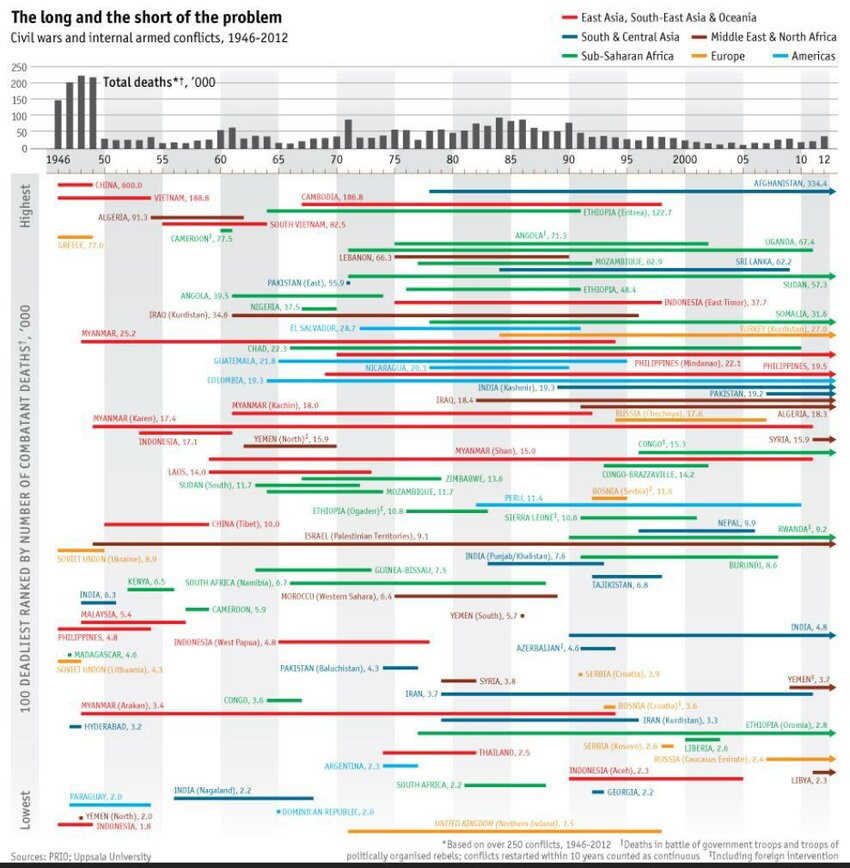

```{r setup, include=FALSE}
knitr::opts_chunk$set(out.width="100%", fig.align="center", fig.showtext=TRUE)
```

## Introduction

### Background

The Economist introduced this graph on civil wars in an article on the duration and deadliness of civil wars. The graph visualizes the length of the 100 deadliest civil wars and internal armed conflicts from 1946-2012, as well as the battle death in total each year and for each of the 100 conflicts. It is based on data from the UCDP/PRIO Armed Conflict data set.

Most recently this data was used in another Economist article on the deadliest conflicts of the year in 2023, where the main takeaway was that the most documented conflicts might not always be the deadliest.

### Original graph

The original graph consists of two plots. One plot on the top showing total deaths for all civil wars per year from 1946-2012, with year on the x-axis and death toll on the y-axis. The other plot visualizes the duration and deadliness of the top 100 deadliest civil wars from 1946-2012. the y-axis represents the death toll rank, while the x-axis is the exact same as in the top plot with years. The lines represent each civil war and the length of them shows the duration of the conflict. Moreover, the colors represent the region and the numbers on the labels beside the state name is deaths in thousands for that exact conflict.

The graph is trying to convey the deadliness and duration of civil wars from post-war times to modern times. By combining information on total deaths over time with details about individual conflicts, it allows the reader to see both broad trends and specific examples. In this way, the graph tries to connect changes in global conflict over time with the severity and duration of individual civil wars.

The main reason for deciding on this graph is because it tries to show a lot of interesting information in a visual way. However, the original version includes so much data that it becomes cluttered and hard to interpret. The goal of this project was therefore to recreate the graph and then improve it, to show that one can still communicate the main information by reducing and simplifying, and in fact make the visualization easier to read.

{.external width="100%"}

## Data preparation

### Loading packages

To start of I began with loading the necessary packages for data processing and visualization.

The tidyverse package provides the foundations for essential packages like dplyr and ggplot2. I used dplyr to clean, filter, and manipulate my data. For creating my visualizations i used ggplot2.

The cowplot package was used to help with the composition of the different parts of the plot. Two key function were used, get_legend() extracted individual legend components to create a custom three-row legend, and ggdraw() combined with draw_label() constructed the footer containing citations and explanatory notes. The ggrepel helped with positioning the lables so they would not overlap in the improvement of the plot.

Finally, the patchwork package was used to complete the final graph by combining the five separate part, the title, legend, death plot, civil war plot, and footer together.

```{r loading-libraries, warning = FALSE, message = FALSE}


library(tidyverse)
library(cowplot) 
library(patchwork)
library(ggrepel)


```

### Getting the data

To replicate the original visualization’s battle death statistics for the period 1946–2012, I relied on two primary sources, the Uppsala Conflict Data Program (UCDP) Battle-Related Deaths dataset and the PRIO Battle Deaths dataset. To improve reproducibility and keep the main analysis script concise, all data cleaning and aggregation steps were handled in a separate wrangling script.

In the wrangling stage, I first filtered both datasets to include only civil wars, defined as conflicts coded as type 3 or 4. For the UCDP data, which provides yearly best estimates of battle-related deaths, I aggregated deaths by year across all qualifying conflicts and converted the totals to thousands to match the scale used in the original visualization.

The PRIO dataset required additional preprocessing due to potential duplicate conflict–year observations. To address this, I first grouped the data by conflict identifier and year and extracted the maximum reported death estimate for each conflict-year combination. These values were then summed by year and converted to thousands. The PRIO data was restricted to the period 1946–1988, where it provides historical coverage that complements the UCDP data.

The resulting yearly death totals from both sources were saved as processed CSV files and later merged in the main analysis script. The two datasets were combined using a full join and arranged chronologically, producing a continuous time series of total battle deaths from 1946 to 2012, with PRIO data covering earlier years and UCDP data covering later decades.

It is important to note that the resulting death totals differ from those shown in the original Economist graph, in some years by up to approximately 150,000 deaths. These discrepancies likely stem from differences in aggregation methods, such as how overlapping or long-running conflicts are combined, how deaths are allocated across years, and how uncertainty in casualty estimates is handled. The original authors may also have relied on different versions of the datasets or applied additional editorial adjustments that are not publicly documented. This highlights the challenges of reproducing complex visualizations when methodological decisions are not fully transparent.

```{r loading-data}

uppsaladeaths <- read.csv("clean_data/uppsaladeaths.csv")
priodeaths <- read.csv("clean_data/priodeaths.csv")

deathtotal <- uppsaladeaths |> 
  full_join(priodeaths) |> 
  arrange(year) 
```

### Creating new data set

For the data on the civil wars, the original plot used data from the UCDP/PRIO Armed Conflict data set. I started of with cleaning the data set and joining it with the data sets on battle deaths. I quickly realized that their methods for defining a civil war in terms of duration and deaths were difficult to grasp, and even though i tried several times to replicate the same data as in the graph, I failed.

In the end, I decided on reading directly of the original graph and manually making a data set with the location, region, start year, end year, and number of deaths for the 100 deadliest conflicts from 1946-2012.

```{r creating-data}

civil_wars_data <- data.frame(
  location = c(
    # East Asia, South-East Asia & Oceania (21 conflicts)
    "China", "China (Tibet)", "Vietnam", "South Vietnam", "Cambodia", 
    "Indonesia", "Indonesia", "Indonesia (East-Timor)", "Indonesia (West-Papua)", 
    "Indonesia (Aceh)", "Myanmar", "Myanmar (Kachin)", "Myanmar (Karen)", 
    "Myanmar (Shan)", "Myanmar (Arakan)", "Philippines", "Philippines", 
    "Philippines (Mindanao)", "Laos", "Malaysia", "Thailand",
    
    # South & Central Asia (17 conflicts)
    "Afghanistan", "Sri Lanka", "Pakistan (East)", "Pakistan", 
    "Pakistan (Balochistan)", "India (Kashmir)", "India (Punjab/Khalistan)", 
    "India", "India", "India (Nagaland)", "Nepal", "Tajikistan", 
    "Azerbaijan", "Iran", "Iran (Kurdistan)", "Hyderabad", "Georgia",
    
    # Sub-Saharan Africa (31 conflicts)
    "Ethiopia (Eritrea)", "Ethiopia", "Ethiopia (Ogaden)", "Ethiopia (Oromia)", 
    "Cameroon", "Cameroon", "Angola", "Angola", "Uganda", "Mozambique", 
    "Mozambique", "Sudan", "Sudan (South)", "Nigeria", "Somalia", "Chad", 
    "Congo", "Congo", "Congo-Brazzaville", "Madagascar", "Zimbabwe", 
    "Sierra Leone", "Liberia", "Rwanda", "Burundi", "Guinea-Bissau", 
    "Kenya", "South Africa", "South Africa (Namibia)",
    
    # Middle East & North Africa (15 conflicts)
    "Algeria", "Algeria", "Lebanon", "Iraq", "Iraq (Kurdistan)", 
    "Yemen (North)", "Yemen (North)", "Yemen (South)", "Yemen", 
    "Syria", "Syria", "Israel (Palestinian Territories)", 
    "Morocco (Western Sahara)", "Libya",
    
    # Europe (11 conflicts)
    "Greece", "Turkey (Kurdistan)", "Russia (Chechnya)", 
    "Russia (Caucasus Emirate)", "Bosnia (Serbia)", "Bosnia (Croatia)", 
    "Soviet Union (Ukraine)", "Soviet Union (Lithuania)", "Serbia (Croatia)", 
    "Serbia (Kosovo)", "United Kingdom (Northern Ireland)",
    
    # Americas (7 conflicts)
    "El Salvador", "Guatemala", "Nicaragua", "Colombia", "Peru", 
    "Argentina", "Paraguay", "Dominican Republic"
  ),
  
  start_year = c(
    # East Asia, South-East Asia & Oceania
    1946, 1950, 1946, 1955, 1967,
    1954, 1946, 1975, 1965, 1990,
    1948, 1961, 1949, 1959, 1949,
    1947, 1969, 1970, 1959, 1949, 1974,
    
    # South & Central Asia
    1978, 1984, 1971, 2007,
    1974, 1989, 1983, 1983, 1952,
    1948, 1956, 1996, 1993, 1979,
    1979, 1948, 1992,
    
    # Sub-Saharan Africa
    1964, 1976, 1977, 1978,
    1960, 1958, 1961, 1975, 1975,
    1977, 1964, 1971, 1964, 1967,
   1988, 1967, 1997, 1964, 1993,
    1948, 1968, 1992, 2000, 1990,
    1991, 1963, 1953, 1982, 1966,
    
    # Middle East & North Africa
    1954, 1991, 1975, 1982, 1961,
    1962, 1948, 1986, 2009,
   2011, 1979, 1948,
    1975, 2011,
    
    # Europe
    1946, 1984, 1994, 2007,
    1992, 1993, 1946, 1946,
    1991, 1998, 1971,
    
    # Americas
    1972, 1965, 1978, 1964,
    1982, 1974, 1947, 1965
  ),
  
  end_year = c(
    # East Asia, South-East Asia & Oceania
    1949, 1958, 1954, 1964, 1998,
    1961, 1946, 1998, 1978, 2005,
    1993, 1992, 2011, 2011, 1993,
    1953, 2012, 2012, 1973, 1957, 1982,
    
    # South & Central Asia
    2012, 2009, 1971, 2012,
    1977, 2012, 1993, 2012, 1990,
    1968, 2006, 1998, 1994,
    2011, 1997, 1949, 1993,
    
    # Sub-Saharan Africa
    1991, 1991, 1984, 2012,
    1961, 1959, 1974, 2002, 2011,
    1992, 1974, 2012, 1973, 1970,
    2012, 2010, 2012, 1967, 2002,
    1948, 1979, 2002, 2003, 2012,
   2008, 1974, 1957, 1989, 1988,
    
    # Middle East & North Africa
    1962, 2012, 1990, 2012, 1996,
    1970, 1948, 1986, 2012,
    2012, 1982, 2012,
    1989, 2012,
    
    # Europe
    1949, 2012, 2008, 2012,
    1995, 1994, 1950, 1948,
    1991, 1999, 1998,
    
    # Americas
    1991, 1990, 1990, 2012,
    2010, 1978, 1958, 1965
  ),
  
  deaths_thousands = c(
    # East Asia, South-East Asia & Oceania
    600.0, 10.0, 188.6, 82.5, 186.8, 17.1, 1.8, 37.7, 4.8, 2.3, 
    25.2, 18.0, 17.4, 15.0, 3.4, 19.5, 4.8, 22.1, 14.0, 5.4, 2.5,
    
    # South & Central Asia
    334.4, 62.2, 55.9, 19.2, 4.3, 19.3, 7.6, 4.8, 6.3, 2.2, 
    9.9, 6.8, 4.6, 3.7, 3.3, 3.2, 2.2,
    
    # Sub-Saharan Africa
    122.7, 48.4, 10.8, 2.8, 77.5, 5.9, 39.5, 71.3, 67.4, 62.9, 
    11.7, 57.3, 11.7, 37.5, 31.6, 22.3, 15.3, 3.6, 14.2, 4.6, 
    13.6, 10.6, 2.6, 9.2, 8.6, 7.5, 6.5, 2.2, 6.7,
    
    # Middle East & North Africa
    91.3, 18.3, 66.3, 18.4, 34.6, 15.9, 2.0, 5.7, 3.7, 15.9, 
    3.8, 9.3, 6.4, 2.3,
    
    # Europe
    77.0, 27.0, 17.6, 2.4, 11.6, 3.6, 8.9, 4.3, 3.9, 2.6, 1.5,
    
    # Americas
    28.7, 21.8, 20.3, 19.3, 11.4, 2.3, 2.0, 2.0
  ),
  
  region = c(
    # East Asia, South-East Asia & Oceania (21)
    rep("East Asia, South-East Asia & Oceania", 21),
    
    # South & Central Asia (17)
    rep("South & Central Asia", 17),
    
    # Sub-Saharan Africa (29)
    rep("Sub-Saharan Africa", 29),
    
    # Middle East & North Africa (14)
    rep("Middle East & North Africa", 14),
    
    # Europe (11)
    rep("Europe", 11),
    
    # Americas (8)
    rep("Americas", 8)
  ),
  
  stringsAsFactors = FALSE
) |> 
  arrange(desc(deaths_thousands))

```

### Preparing the data

After getting all the necessary data, I prepared it to be plotted. I began with creating a new variable containing the label for each civil war with the location and number of deaths per thousand.

```{r plot-prep}

plot_data <- civil_wars_data |>
  mutate(
    rank = row_number(),  
    label = paste0(location, ", ", deaths_thousands)
  )

```

For the colors of the regions I used a color identificator to find the correct hex color code for each region which matched the original graph. I then made a vector with these colors to be used later for the plot and the legend.

```{r region-colors}

region_colors <- c(
  "East Asia, South-East Asia & Oceania" = "#cd2f39",
  "South & Central Asia" = "#19647d",
  "Middle East & North Africa" = "#833d33",
  "Sub-Saharan Africa" = "#269963",
  "Europe" = "#da9c48",
  "Americas" = "#33a5c1"
)
```

Next, I added a light grey background shading to visually separate every 5th year. I defined the start with xmin and the end with xmax. These values were then stored in a function that would add these grey rectangles to the background of the plots with geom_rect.

```{r grey-lines}

grey_xmin <- c(1950, 1960, 1970, 1980, 1990, 2000, 2010)
grey_xmax <- c(1955, 1965, 1975, 1985, 1995, 2005, 2012)


grey_strips <- data.frame(
  xmin = grey_xmin,
  xmax = grey_xmax
)

add_decade_shading <- function() {
  geom_rect(
    data = grey_strips,
    aes(xmin = xmin, xmax = xmax, ymin = -Inf, ymax = Inf),
    inherit.aes = FALSE,
    fill = "grey90",
    alpha = 0.5
  )
}
```

## Graph replication

After retrieving and preparing the data it was time for the replication of the original graph, which consisted of two different plots patched together into one. I therefore had to recreate the plot on total deaths first, then the one on the civil wars before I combined them together and added a separate legend, footer, and title.

### Death plot

I started off with the plot on the total number of battle deaths from civil wars each year from 1946-2012. The year is mapped to the x-axis and the total number of deaths to the y-axis. The y-axis is scaled with breaks at 100-death intervals to improve readability, while the x-axis includes all years in the range but omits labels to avoid clutter. Finally, the coordinate limits are set to slightly extend beyond the data range, with axis expansion disabled for a cleaner appearance.

```{r deathplot-cords&axes, fig.width=6, fig.height=2}

deathplot <- ggplot(deathtotal) +
  aes(x = year, y = totaldeaths) +
 scale_y_continuous(
    breaks = seq(0, 400, 100),
    labels = c(0, 100, 200, 300, 400)
  ) +
  scale_x_continuous(
    breaks = 1946:2012,
    labels = NULL,
  )  +
  coord_cartesian(xlim=c(1942,2014), expand=FALSE)

deathplot
```

I then built upon the base plot by adding light grey background shading to indicate five-year intervals using the custom add_decade_shading() function. The total number of deaths per year is displayed using geom_col with a dark grey fill. Finally, I added a text annotation to label the y-axis units and clarify that the values are shown in thousands.

```{r deathplot-data, fig.width=6, fig.height=2}

deathplot <- deathplot +
  add_decade_shading() +
  geom_col(fill = "gray40", 
           width = 0.7) +
  annotate(
    "text",
    x = 1949,
    y = 400,
    label = "Total deaths*†, '000",
    hjust = -0.2,
    vjust = 3,
    size = 3.5,
    fontface = "bold",
    color = "black",
    family = "sans"  
  )

deathplot

```

Lastly, I applied a customized minimal theme to simplify the plot, removing unnecessary x-axis elements, refining grid lines, and adjusting spacing for a cleaner visual presentation.

```{r deathplot-themes, fig.width=6, fig.height=2}

deathplot <- deathplot +
   theme_minimal() +
theme(
 
  axis.title.x = element_blank(),
  axis.text.x = element_blank(),
  axis.ticks.x = element_blank(),
  
  # Text styling
  axis.text.y = element_text(size = 9),
  axis.title.y = element_blank(),
  
  # Background colors
  panel.background = element_rect(fill = "white", color = NA),
  plot.background = element_rect(fill = "white", color = NA),
  
  # Grid lines 
  panel.grid.major.y = element_line(color = "grey85", linewidth = 0.3),
  panel.grid.minor = element_blank(),
  panel.grid.major.x = element_blank(),
  
  # Add bottom border line
  axis.line.x = element_line(color = "black", linewidth = 0.5),
  
  # Margins
  plot.margin = margin(t = 5, b = 5)
)

deathplot

```

### Civil war plot

I then created a civil war timeline plot in which each conflict is positioned by its start year on the x-axis and ranked on the y-axis. The x-axis is displayed at the top of the plot and labeled selectively to highlight key years while avoiding overcrowding. The y-axis is reversed so that higher-ranked conflicts appear closer to the top, and axis labels are removed to maintain a clean layout. The coordinate limits are manually set to provide consistent spacing around the data and to allow annotations to extend beyond the plotting area. Finally, regions are distinguished using a manual color scale, ensuring consistent region colors across all figures.

```{r civilwars-cords&axes, fig.width=8, fig.height=10}

civilwar_plot <- ggplot(plot_data, 
                        aes(x = start_year, y = rank, colour = region)) +
  scale_x_continuous(
    breaks = 1946:2012,
    labels = c("1946","", "", "",
               "50", "", "", "", "", 
               "55","","","","", 
               "60", "","","","",
               "65","","","","", 
               "70","","","","", 
               "75","","","","",
               "80","","","","",
               "85", "","","","",
               "90","","","","", 
               "95","","","","", 
               "2000","","","","", 
               "05","","","","", 
               "10", "", "12"),
    position = "top",  

  ) +
  scale_y_reverse(
    breaks = c(1, 100),
    labels = NULL
  ) +
  coord_cartesian(
    xlim = c(1942, 2014),
    ylim = c(0, 103),
    expand = FALSE,
    clip = "off"
  ) +
  scale_color_manual(values = region_colors, name = NULL) 

civilwar_plot
```

Further, I extended the civil war timeline by adding background shading to visually separate time periods, again using the add_decade_shading() function. An additional shaded rectangle was placed before 1946 to create space for explanatory annotations. Vertical text annotations were added along the left side of the plot to describe the ranking scale, clarify the deaths as thousands, and indicate the highest and lowest ranks. Subtle grey rectangles were also added at the top to connect it with the death plot. Finally, text labels were placed at the end year of each conflict to identify individual civil wars directly within the plot.

```{r civilwar-annotation, fig.width=8, fig.height= 10}

 civilwar_plot <- civilwar_plot +
   add_decade_shading() +
  annotate("rect", 
           xmin=1940, xmax=1944, 
           ymin=0,ymax=100, 
           alpha=0.4, 
           fill="grey90") +
  annotate(
    "text",
    x = 1942,            
    y = 50,              
    label = "100 deadliest ranked by number of combatant deaths (*†, '000)",
    hjust = 0.5,           
    angle = 90,          
    size = 4,
    color = "#565b5d",
    fontface = "bold"
  ) +
  annotate(
    "text",
    x = 1942,            
    y = 90,              
    label = "Lowest",
    angle = 90,
    hjust = 1,           
    size = 4,
    color = "#565b5d",
    fontface = "bold"
  ) +
  annotate(
    "text",
    x = 1942,           
    y = 5,              
    label = "Highest",
    angle = 90,
    hjust = 1,           
    size = 4,
    color = "#565b5d",
    fontface = "bold"
  ) +
  annotate("rect",
           xmin=c(1946, 1955, 1965, 1975, 1985, 1995, 2005),
           xmax = c(1950, 1960, 1970, 1980, 1990, 2000, 2010),
           ymin=c(-5), ymax=c(0),
           alpha=0.2, fill="darkgrey")+
  # Labels
  geom_text(
    aes(x = end_year, label = label),
    hjust = 0.5,
    vjust = -0.5,
    size = 2,  
    nudge_x = 0.5,
    check_overlap = FALSE,
    show.legend = FALSE
  )
 
civilwar_plot
```

It was then time to plot the data segments with start year and end year placed along the y-axis depending on their rank. Conflicts that had year coded as 2012 were still ongoing and was therefore visualised with an arrow at the end, because of this I had to plot that data i its own segment.

```{r civilwar-data, fig.width=8, fig.height= 10}


 civilwar_plot <- civilwar_plot +
   geom_segment(aes(xend = end_year, yend = rank),
               linewidth = 1,
               data = filter(plot_data, end_year < 2012),
               show.legend = FALSE) + 
  # Segments with arrows for ongoing conflicts
  geom_segment(aes(xend = end_year, yend = rank),
               linewidth = 1,
               data = filter(plot_data, end_year == 2012),
               arrow = arrow(length = unit(0.15, "cm"),
                             ends = "last",
                             type = "closed"),
               show.legend = FALSE)

civilwar_plot
```

Lastly I applied a minimal theme similar to the one in the deathplot. Major and minor grid lines were removed. The y-axis text was formatted in bold, and the x-axis was displayed at the top with bold tick labels. Plot margins were slightly adjusted to improve spacing, and the legend was removed as I was later gonna create a separate legend to match the original graph.

```{r civilwar-themes, fig.width=8, fig.height= 10}

  civilwar_plot <- civilwar_plot +
   theme_minimal() +
  theme(panel.grid.major = element_blank(), 
        panel.grid.minor = element_blank(),
        axis.text.y = element_text(face = "bold", size = 9),  
        axis.title.y = element_blank(), 
        axis.ticks.y = element_blank(),
        axis.title.x.top = element_blank(),
        axis.text.x.top = element_text(face = "bold", size = 9),
        axis.ticks.x.top = element_line(color = "black", linewidth = 0.5),
        axis.line.x.top = element_line(color = "black", linewidth = 0.5),
        plot.margin = margin(t = 5, r = 5, l = 8),
        legend.position = "none") 

civilwar_plot
 
```

## Combining the plots

The final visualization was made by combining the different components of the graph into one. The title, custom legend, death plot, civil war plot, and the footer was created as separate objects to better recreate the original layout and alignments.

### Footer

The footer was created using ggdraw with two captions added by using draw_label. The data source caption is left aligned at the bottom of the graph, while the methodological note is right-aligned. The text has a small sans-serif font size and grey color.

```{r footer}

left_caption <- "Source: PRIO, Uppsala University"
right_caption <- paste(
  "* Based on over 250 conflicts, 1946-2012",
  "† Deaths in battle of government troops and troops of\n",
  "politically organised groups: conflicts related within",
  "10 years counted as one"
)

footer <- ggdraw() + 
  draw_label(left_caption, x = 0.01, hjust = 0, size = 8, color = "gray30", fontfamily = "sans") +
  draw_label(right_caption, x = 0.99, hjust = 1, size = 8, color = "gray30", fontfamily = "sans")
```

### Legend

The legend was manually constructed in three rows using get_legend() in order to more accurately replicate the original legend. Each row was generated by creating a dummy object with region mapped to colour and displayed using geom_line(). A manual color scale was applied to match the original plot. The three legend rows were combined vertically using plot_grid() to create a single custom legend.

```{r legend, warning = FALSE, message = FALSE}


# Row 1: East Asia alone
legend_row1 <- get_legend(
  ggplot(data.frame(x = 1, y = 1, region = "East Asia, South-East Asia & Oceania"), 
         aes(x, y, color = region)) +
    geom_line(linewidth = 1) +  
    scale_color_manual(values = region_colors, name = NULL) +
    theme(
      text = element_text(family = "sans"),
      legend.position = "top",
      legend.direction = "horizontal",
      legend.text = element_text(size = 7),     
      legend.key.width = unit(0.5, "cm"),        
      legend.key.height = unit(0.3, "cm"),       
      legend.spacing.x = unit(0.2, "cm")
    )
)

# Row 2: South & Central Asia + Middle East & North Africa
legend_row2 <- get_legend(
  ggplot(data.frame(x = 1:2, y = 1:2, 
                    region = c("South & Central Asia", "Middle East & North Africa")), 
         aes(x, y, color = region)) +
    geom_line(linewidth = 1) +  
    scale_color_manual(values = region_colors, 
                       limits = c("South & Central Asia", "Middle East & North Africa"),
                       name = NULL) +
    theme(
      text = element_text(family = "sans"),
      legend.position = "top",
      legend.direction = "horizontal",
      legend.text = element_text(size = 7),      
      legend.key.width = unit(0.5, "cm"),       
      legend.key.height = unit(0.3, "cm"),       
      legend.spacing.x = unit(0.2, "cm")
    )
)

# Row 3: Sub-Saharan Africa + Europe + Americas
legend_row3 <- get_legend(
  ggplot(data.frame(x = 1:3, y = 1:3, 
                    region = c("Sub-Saharan Africa", "Europe", "Americas")), 
         aes(x, y, color = region)) +
    geom_line(linewidth = 1) +  
    scale_color_manual(values = region_colors,
                       limits = c("Sub-Saharan Africa", "Europe", "Americas"),
                       name = NULL) +
    theme(
      text = element_text(family = "sans"),
      legend.position = "top",
      legend.direction = "horizontal",
      legend.text = element_text(size = 7),      
      legend.key.width = unit(0.5, "cm"),        
      legend.key.height = unit(0.3, "cm"),       
      legend.spacing.x = unit(0.2, "cm")
    )
)

custom_legend <- plot_grid(
  legend_row1,
  legend_row2,
  legend_row3,
  ncol = 1,
  align = "v",
  rel_heights = c(0.5, 0.5, 0.5) 
)

```

### Title

The title was created as a separate ggplot object to allow precise control over layout and typography. The main title and subtitle were added using labs(), with a bold, left-aligned headline and a smaller, grey subtitle to establish visual hierarchy. A void theme removed all non-text elements, ensuring the title functions purely as a typographic component. Custom margins were applied to align the title cleanly with the legend and plots below in the final stacked layout.

```{r title}

title_plot <- ggplot() + 
  labs(title = "The long and the short of the problem",
       subtitle = "Civil wars and internal armed conflicts, 1946-2012") +
  theme_void() +
  theme(
    text = element_text(family = "sans"),
    plot.title = element_text(face = "bold", size = 12, hjust = 0, color = "black" ),
    plot.subtitle = element_text(size = 8, color = "gray40", hjust = 0, face = "bold"),
    plot.margin = margin(5, 5, 5, 10)
  )
   
```

## Final plot

Finally, I combined all components into a single plot. The title and custom legend were placed side by side at the top, followed by the annual battle deaths plot, the civil war duration plot, and a footer containing sources and notes. Relative heights were manually adjusted using plot_layout() to emphasize the main civil war panel while keeping contextual elements compact.

Consequently, while the overall layout and information hierarchy resemble the original, the final figure differs in certain details. Label placement was automated to avoid overlaps, which means they are not positioned exactly as in the original; the font is not identical, and the total deaths values are slightly different because of variations in data sources, preprocessing decisions, and aggregation methods. Additionally, the grey background shading does not replicate the original gradient, where the top was darker and gradually became lighter toward the bottom These factors together make the visualization a faithful but not exact reproduction.

```{r combined-plot, fig.width=8, fig.height= 10, preview=TRUE}

 finishedplot <- (wrap_elements(title_plot) | wrap_elements(custom_legend)) /
   deathplot /
   civilwar_plot /
   wrap_elements(footer) +
   plot_layout(
      heights = c(0.4, 0.6, 5, 0.03),  
    widths = c(1.5, 1)
   )
 
finishedplot
```

## Graph improvement

Moreover, after replicating the original graph it was time for the improvement. The original graph conveys several dimensions simultaneously, including conflict duration, total yearly deaths, ranking of deaths in each civil war, and regional distribution. While this is informative, it also makes it more challenging to interpret because of the overload of informaton.The primary goal of the improved version is therefore to reduce cognitive load while retaining the most analytically relevant information.

### Adjusting the data

This code calculates each conflict’s duration, identifies the deadliest and longest conflicts within each region, and creates a conflict_label that assigns labels only to these key conflicts. This highlights the most analytically relevant conflicts in the plot, reducing clutter and cognitive load. ungroup() ensures subsequent operations are not restricted by region.

```{r data-improvement}

 duration_data <- plot_data |> 
  mutate(
    duration = end_year - start_year,  
  ) |> 
  group_by(region) |> 
  mutate(
    is_deadliest = deaths_thousands == max(deaths_thousands),
    is_longest = duration == max(duration),  
    # Create label
    conflict_label = case_when(
      is_deadliest & is_longest ~ label,
      is_deadliest ~ label,
      is_longest ~ label,
      TRUE ~ NA_character_
    )
  ) |> 
  ungroup()
```

### Improved graph

In the improved graph, conflicts are no longer shown as lines ranked by deadliness. Instead, each conflict is represented as a point, with the point size indicating the duration of the conflict in years and the color reflecting the number of deaths using a red color scale. The y-axis shows deaths on a logarithmic scale to accommodate the wide range of values, while the x-axis represents time. Vertical gray lines separate each decade, providing temporal reference. In the background, the total annual deaths worldwide are displayed as a gray area and line, giving contextual framing for individual conflicts. Regions are separated using facet_wrap(), allowing easier comparison across regions while reducing visual clutter. Labels are added only to the deadliest or longest conflicts in each region to highlight the most analytically relevant events without overloading the plot. This approach balances information richness with clarity, retaining key insights while improving interpretability.

```{r final-improvement, fig.width=11, fig.height= 10}

Second_improvement <- ggplot() +
  geom_vline(
    xintercept = c(1946, 1950, 1960, 1970, 1980, 1990, 2000, 2010),
    color = "gray70",
    linewidth = 0.4,
    alpha = 0.6
  ) +
  # Line for total deaths per year
  geom_area(data = deathtotal,
            aes(x = year, y = totaldeaths),
            fill = "gray85", 
            alpha = 0.3)    +  

geom_line(data = deathtotal,
          aes(x = year, y = totaldeaths),
          color = "gray60", 
          linewidth = 0.8,
          alpha = 0.6) +
  
  # Points for individual conflicts
  geom_point(data = duration_data,
             aes(x = start_year, y = deaths_thousands, 
                 size = duration, colour = deaths_thousands),
             alpha = 0.7) +
  # Add labels for deadliest and longest conflicts
  geom_text_repel(
    data = filter(duration_data, !is.na(conflict_label)),
    aes(x = start_year, y = deaths_thousands, label = conflict_label),
    size = 2.5,
    color = "black",
    box.padding = 0.5,
    point.padding = 0.3,
    segment.color = "gray40",
    segment.size = 0.3,
    max.overlaps = 20,
    min.segment.length = 0
  ) +
  geom_text(
    data = data.frame(
      x = c(1948, 1955, 1965, 1975, 1985, 1995, 2005, 2011),
      y = 450,  
      label = c("40s", "50s", "60s", "70s", "80s", "90s", "00s", "10s")
    ),
    aes(x = x, y = y, label = label),
    color = "gray50",
    size = 3,
    vjust = 0,
    inherit.aes = FALSE
  ) +
 scale_color_gradient(
  low = "#fee5d9",
  high = "#99000d",
  name = "Deaths\n(thousands)",
  trans = "log10",
  limits = c(1, 600),  
  breaks = c(1, 10, 50, 100, 600),
  labels = scales::comma
) +

  scale_size_continuous(range = c(2, 15), name = "Duration\n(years)") +
  scale_y_log10(
    labels = scales::comma,
    breaks = c(1, 10, 100, 600)
  ) +
  scale_x_continuous(
    breaks = seq(1946,2012,10)
    
  ) +
  coord_cartesian(xlim = c(1944, 2014), ylim = c(-4, 800), expand = FALSE) +
  
  facet_wrap(~region, ncol = 2) +
  
  labs(
    title = "Civil War Duration, Deadliness, and Total Annual Deaths",
    subtitle = 
    "Gray area shows total deaths per year; colored points show individual conflict;
     
     The bigger and the darker the point is the longer and deadlier the conflict is.
    
     The longest and the deadliest conflict in each region is labeled",
    x = NULL,
    y = "Deaths (log)"
  ) +
  theme_minimal() +
  theme(
    text = element_text(family = "sans"),
    
    panel.background = element_blank(),
    plot.background = element_blank(),
    
    panel.grid.major = element_blank(),
    panel.grid.minor = element_blank(),
    
    
    strip.background = element_blank(), 
    strip.text = element_text(
      color = "gray20", 
      face = "bold", 
      size = 11,
      hjust = 0,          
      margin = margin(b = 10)
    ),
    
    plot.title = element_text(size = 16, face = "bold", color = "gray20", margin = margin(b = 10)),
    plot.subtitle = element_text(size = 10, color = "gray40", margin = margin(b = 0)),
    
    axis.title = element_text(color = "gray40", size = 11, face = "bold"),
    axis.text = element_text(color = "gray40", size = 9),
    
    legend.position = "top",
    legend.justification = "right",
    legend.direction = "horizontal",  
    legend.box = "vertical",         
    legend.title = element_text(size = 9, face = "bold"),
    legend.text = element_text(size = 6),
    legend.background = element_blank(),
    legend.spacing.y = unit(0.2, "cm"),
    
    plot.margin = margin(t = 30, r = 15, b = 5, l = 10)
  )

second_improved <- Second_improvement / footer +
  plot_layout(
    heights = c(2, 0.1)
  )

second_improved
```

## Conclusion

This project aimed to replicate and improve an Economist visualization of civil war duration and deadliness from 1946 to 2012. The original graph conveys a large amount of information, but overlapping elements make interpretation difficult, especially in the lower panel.

Reproducing the graph was challenging due to limited transparency in the original data processing, including conflict definitions, overlapping conflicts, and battle death aggregation. These methodological uncertainties led to differences between my reconstructed totals and the original figures, highlighting how sensitive conflict data are to analytical choices.

The improved visualization emphasizes clarity and interpretability. Key conflicts are selectively labeled based on deadliness and duration, total annual deaths provide context without overwhelming the plot, and consistent scales across regions prevent misleading comparisons. Conflict duration and deadliness are encoded through point size and color, while faceting reduces visual clutter. Although some temporal and regional details are de-emphasized, this approach makes patterns easier to detect.
