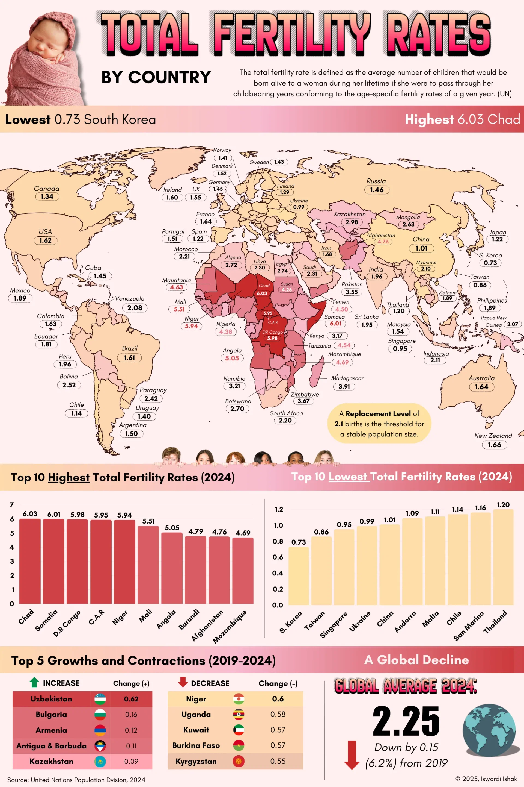
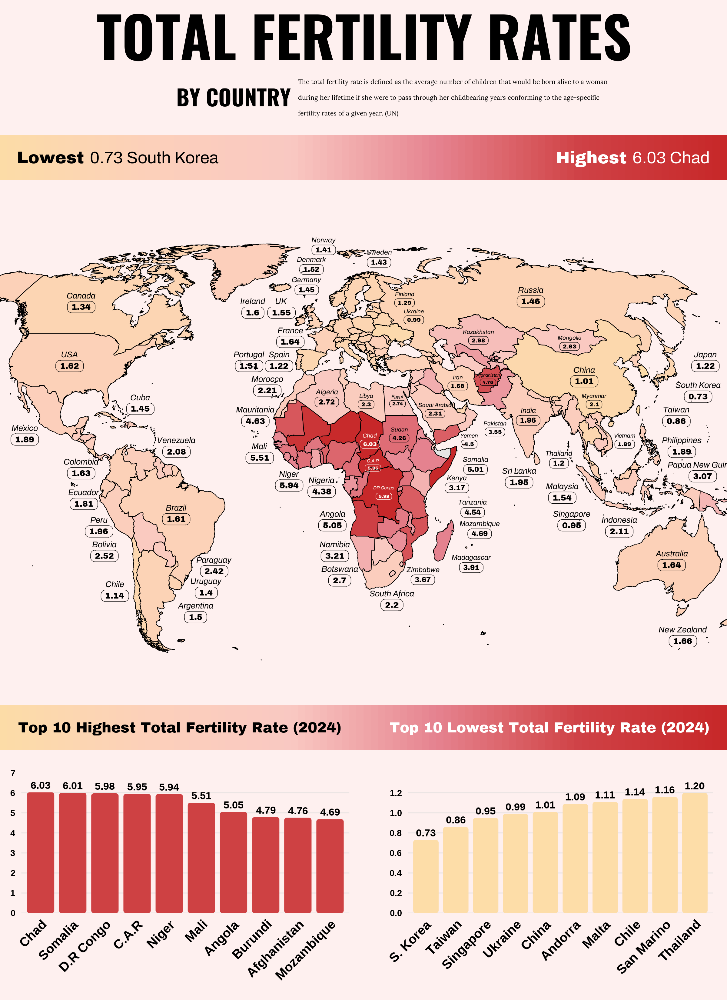
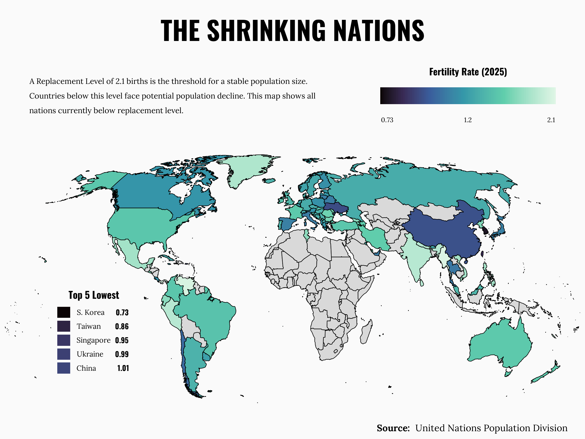

Distill is a publication format for scientific and technical writing, native to the web.

Learn more about using Distill at <https://rstudio.github.io/distill>.


## Introduction

The total fertility rate is a demographic indicator. This metric is crucial for understanding population dynamics and planning for future societal needs.

For this project, I selected an infographic by Iswardi Ishak that visualizes global fertility rates using a choropleth map combined with ranking charts. The visualization tries to communicate the contrast between high-fertility regions (primarily in Sub-Saharan Africa) and low-fertility regions (East Asia and Europe).

## Original Chart

The following infographic was created by Iswardi Ishak using UN Population Division data for 2024.

```{r original-chart, echo=FALSE}

```

**Source:** Iswardi Ishak, 2024


## Replication

### Loading Libraries

We begin by loading the necessary packages for data manipulation, spatial analysis, and visualization.

```{r load-libraries, message=FALSE, warning=FALSE}
library(sf)
library(rnaturalearth)
library(rnaturalearthdata)
library(ggplot2)
library(tidyverse)
library(cowplot)
library(stringr)
library(showtext)
library(sysfonts)
library(ggchicklet)
library(ggtext)
```

### Data Preparation

We use the "rnaturalearth" package to obtain world geometries and join them with the United Nations Population Division fertility rate data. Some ISO codes need manual correction for countries like Kosovo, France, and Norway.

```{r data-manipulation, message=FALSE, warning=FALSE}
world <- ne_countries(scale = "medium", returnclass = "sf")

geo_world <- world |>
  select(geounit, iso3 = iso_a3) |>
  mutate(
    iso3 = case_when(
      geounit == "Kosovo" ~ "XKX",
      geounit == "France" ~ "FRA",
      geounit == "Norway" ~ "NOR",
      TRUE ~ iso3
    )
  )

fertility_rate <- read_csv("data/un_fertility_rates.csv")

fertility_rate_2024 <- fertility_rate |>
  filter(Time == 2024) |>
  select(Location, iso3 = Iso3, Value)

db <- geo_world |>
  left_join(fertility_rate_2024, by = "iso3") |>
  select(country = geounit, iso3, value = Value, geometry) |>
  filter(iso3 != "ATA") |>
  mutate(value = round(value, 2))
```

We define the countries that have labels displayed on the map by their ISO3 name code.

```{r iso-codes}
iso_map_plot <- c(
  "AFG", "DZA", "AGO", "ARG", "AUS", "BOL", "BWA", "BRA", "CAN", "CAF", 
  "TCD", "CHL", "CHN", "COL", "CUB", "COD", "DNK", "ECU", "EGY", "FIN", 
  "FRA", "DEU", "IND", "IDN", "IRN", "IRL", "JPN", "KAZ", "KEN", "LBY", 
  "MDG", "MYS", "MLI", "MRT", "MEX", "MNG", "MAR", "MOZ", "MMR", "NAM", 
  "NZL", "NER", "NGA", "NOR", "PAK", "PNG", "PRY", "PER", "PHL", "PRT", 
  "RUS", "SAU", "SGP", "SOM", "ZAF", "KOR", "ESP", "LKA", "SDN", "SWE", 
  "TWN", "TZA", "THA", "UKR", "GBR", "USA", "URY", "VEN", "VNM", "YEM", 
  "ZWE"
)

db <- db |> 
  mutate(
    show_label = iso3 %in% iso_map_plot,
    .after = value
  ) |>
  mutate(
    country = case_when(
      country == "United States of America" ~ "USA",
      country == "Democratic Republic of the Congo" ~ "DR Congo",
      country == "Central African Republic" ~ "C.A.R",
      country == "United Kingdom" ~ "UK",
      TRUE ~ country
    )
  )
```

### Manual Label Positioning System

One of the key challenges in replicating this visualization was positioning labels for each country. Rather than relying on automatic centroid placement, I created a manual positioning system that allows fine-tuned control over each label's location, size, color, and offset from the coordinate point.

```{r manual-positions}
manual_positions <- tibble::tribble(
  ~iso3,  ~lon,    ~lat,    ~label_size, ~label_color, ~value_color, ~label_offset,
  
  # Americas
  "MEX",  -110,    16,      7,           "black",      "black",      200000,
  "USA",  -100,    40,      7,           "black",      "black",      200000,
  "CAN",  -110,    60,      7,           "black",      "black",      200000,
  "CUB",  -68,     26,      7,           "black",      "black",      200000,
  "COL",  -88,     5,       7,           "black",      "black",      200000,
  "VEN",  -53,     12,      7,           "black",      "black",      200000,
  "ECU",  -87,     -5,      7,           "black",      "black",      200000,
  "PER",  -82,     -14,     7,           "black",      "black",      200000,
  "BRA",  -53,     -10,     7,           "black",      "black",      200000,
  "BOL",  -81,     -22,     7,           "black",      "black",      200000,
  "PRY",  -40,     -27,     7,           "black",      "black",      200000,
  "CHL",  -80,     -35,     7,           "black",      "black",      200000,
  "ARG",  -50,     -42,     7,           "black",      "black",      200000,
  "URY",  -44,     -34,     7,           "black",      "black",      200000,
  
  # Europe
  "IRL",  -30,     58,      7,           "black",      "black",      200000,
  "GBR",  -17,     58,      7,           "black",      "black",      200000,
  "PRT",  -28,     40,      7,           "black",      "black",      200000,
  "ESP",  -16,     40,      7,           "black",      "black",      200000,
  "FRA",  -12,     48,      7,           "black",      "black",      200000,
  "DEU",  -6,      66,      6,           "black",      "black",      175000,
  "DNK",  -4,      74,      6,           "black",      "black",      175000,
  "NOR",  3,       83,      6,           "black",      "black",      175000,
  "SWE",  34,      77,      6,           "black",      "black",      175000,
  "FIN",  40,      61,      5,           "black",      "black",      150000,
  "UKR",  42,      55,      5,           "black",      "black",      150000,
  "RUS",  100,     62,      7,           "black",      "black",      200000,
  
  # Africa
  "MAR",  -20,     32,      7,           "black",      "black",      200000,
  "DZA",  3,       28,      6,           "black",      "black",      175000,
  "LBY",  18,      27,      5,           "black",      "black",      150000,
  "EGY",  30,      27,      4,           "black",      "black",      125000,
  "MRT",  -24,     22,      7,           "black",      "black",      200000,
  "MLI",  -22,     10,      7,           "black",      "black",      200000,
  "NER",  -11,     1,       7,           "black",      "black",      200000,
  "TCD",  19,      14,      5,           "#FFFDF5",    "#FFFDF5",    150000,
  "SDN",  30,      16,      5,           "black",      "black",      150000,
  "NGA",  1,       -1,      7,           "black",      "black",      200000,
  "CAF",  20,      6,       4,           "#FFFDF5",    "#FFFDF5",    125000,
  "COD",  24,      -3,      4,           "#FFFDF5",    "#FFFDF5",    150000,
  "AGO",  5,       -12,     7,           "black",      "black",      200000,
  "TZA",  57,      -8,      6,           "black",      "black",      175000,
  "KEN",  51,      0,       6,           "black",      "black",      175000,
  "SOM",  58,      6,       6,           "black",      "black",      175000,
  "NAM",  6,       -22,     7,           "black",      "black",      200000,
  "BWA",  8,       -30,     7,           "black",      "black",      200000,
  "ZWE",  40,      -30,     6,           "black",      "black",      175000,
  "MOZ",  60,      -15,     6,           "black",      "black",      175000,
  "ZAF",  29,      -38,     7,           "black",      "black",      200000,
  "MDG",  58,      -26,     6,           "black",      "black",      175000,
  
  # Asia and Middle East
  "SAU",  44,      24,      5,           "black",      "black",      150000,
  "YEM",  56,      14,      5,           "black",      "black",      150000,
  "IRN",  54,      33,      5,           "black",      "black",      150000,
  "AFG",  66,      34,      4,           "black",      "black",      125000,
  "PAK",  66,      18,      5,           "black",      "black",      150000,
  "IND",  79,      22,      6,           "black",      "black",      175000,
  "LKA",  74,      2,       7,           "black",      "black",      200000,
  "KAZ",  67,      48,      5,           "black",      "black",      150000,
  "MNG",  104,     46,      5,           "black",      "black",      150000,
  "CHN",  104,     35,      7,           "black",      "black",      200000,
  "MMR",  105,     27,      5,           "black",      "black",      150000,
  "THA",  89,      8,       6,           "black",      "black",      175000,
  "VNM",  114,     14,      5,           "black",      "black",      150000,
  "MYS",  90,      -3,      7,           "black",      "black",      200000,
  "SGP",  94,      -12,     7,           "black",      "black",      200000,
  "IDN",  112,     -14,     7,           "black",      "black",      200000,
  "PHL",  135,     12,      7,           "black",      "black",      200000,
  "TWN",  135,     22,      7,           "black",      "black",      200000,
  "KOR",  146,     30,      7,           "black",      "black",      200000,
  "JPN",  155,     40,      7,           "black",      "black",      200000,
  
  # Oceania
  "AUS",  134,     -25,     7,           "black",      "black",      200000,
  "PNG",  142,     4,       7,           "black",      "black",      200000,
  "NZL",  155,     -50,     7,           "black",      "black",      200000
)
```

The coordinates are then transformed from WGS84 (longitude/latitude) to the Robinson projection, which is the same projection used for the map.

```{r robinson-transform}
manual_positions_sf <- manual_positions |>
  st_as_sf(coords = c("lon", "lat"), crs = 4326) |>
  st_transform(crs = "+proj=robin") |>
  mutate(
    lon_robin = st_coordinates(geometry)[,1],
    lat_robin = st_coordinates(geometry)[,2]
  ) |>
  st_drop_geometry()

final_db <- db |> 
  left_join(manual_positions_sf, by = "iso3")
```

### Visual Settings

The color palette replicates the original's gradient from light yellow to dark red. I used Google Fonts (Archivo and Archivo Black) to match the typographic style.

```{r color-settings}
color_palette <- c("#FCDCA7","#FCD0BA","#F9C8C2","#E58390","#CF4146","#C72729")

background_colour <- "#FEF0EF"
background_color <- "#FEF0EF"

font_add_google(name = "Archivo Black", family = "archivoblack")
font_add_google(name = "Archivo", family = "archivo")
showtext_auto()

font_regular <- "archivo"
font_bold <- "archivoblack"
```

### Building the Map

The map uses "geom_sf" for the choropleth base, with "geom_text" for country names and "geom_label" for the fertility rate values. The "scale_size_identity()" and "scale_color_identity()" functions allow us to use the exact values specified in our manual positions table.

```{r map-plot, fig.width=10, fig.height=8}
labels_data <- final_db |> filter(show_label == TRUE)

map_plot <- ggplot(final_db) +
  geom_sf(aes(fill = value), color = "black", size = 0.25) +
  
  geom_text(
    data = labels_data,
    aes(x = lon_robin, y = lat_robin + label_offset, label = country, 
        size = label_size, color = label_color),
    fontface = "italic",
    family = font_regular
  ) +
  
  geom_label(
    data = labels_data,
    aes(x = lon_robin, y = lat_robin - label_offset, label = value, 
        size = label_size, color = value_color),
    fontface = "bold",
    family = font_bold,
    fill = NA,
    label.size = 0.15,
    label.padding = unit(c(0.1, 0.15, 0.1, 0.15), "lines")
  ) +
  
  scale_size_identity() +
  scale_color_identity() +
  scale_fill_gradientn(
    colours = color_palette,
    na.value = "grey90"
  ) +
  
  theme_minimal() +
  theme(
    plot.background = element_rect(fill = background_colour, color = NA),
    axis.text = element_blank(),
    axis.title = element_blank(),
    panel.grid = element_blank(),
    legend.position = "none"
  ) +
  coord_sf(crs = "+proj=robin")
```

### Bar Plots

The original includes two gradient bars that serve as both legend and section dividers. These are created using "geom_tile" to simulate a color gradient.

```{r bar-plots}
text_size <- 14.5
text_size2 <- 12.5

bar_plot <- ggplot() +
  geom_tile(
    data = data.frame(
      x = seq(0, 1, length.out = 100),
      y = 0.5,
      fill = seq(0, 1, length.out = 100)
    ),
    aes(x = x, y = y, fill = fill),
    height = 1,
    width = 0.0101
  ) +
  scale_fill_gradientn(colours = color_palette) +
  
  annotate("text", x = 0.02, y = 0.5, label = "Lowest", 
           family = font_bold, fontface = "bold", color = "black", hjust = 0, size = text_size) +
  annotate("text", x = 0.12, y = 0.5, label = "0.73 South Korea", 
           family = font_regular, color = "black", hjust = 0, size = text_size) +
  annotate("text", x = 0.865, y = 0.5, label = "Highest", 
           family = font_bold, fontface = "bold", color = "white", hjust = 1, size = text_size) +
  annotate("text", x = 0.98, y = 0.5, label = "6.03 Chad", 
           family = font_regular, color = "white", hjust = 1, size = text_size) +
  
  scale_x_continuous(expand = c(0, 0)) +
  scale_y_continuous(expand = c(0, 0)) +
  theme_void() +
  theme(legend.position = "none", plot.margin = margin(0, 0, 0, 0, "pt"))

bar_plot2 <- ggplot() +
  geom_tile(
    data = data.frame(
      x = seq(0, 1, length.out = 100),
      y = 0.5,
      fill = seq(0, 1, length.out = 100)
    ),
    aes(x = x, y = y, fill = fill),
    height = 1,
    width = 0.0101
  ) +
  scale_fill_gradientn(colours = color_palette) +
  
  annotate("text", x = 0.02, y = 0.5, label = "Top 10 Highest Total Fertility Rate (2024)", 
           family = font_bold, color = "black", hjust = 0, size = text_size2) +
  annotate("text", x = 0.98, y = 0.5, label = "Top 10 Lowest Total Fertility Rate (2024)", 
           family = font_bold, color = "white", hjust = 1, size = text_size2) +
  
  scale_x_continuous(expand = c(0, 0)) +
  scale_y_continuous(expand = c(0, 0)) +
  theme_void() +
  theme(legend.position = "none", plot.margin = margin(0, 0, 0, 0, "pt"))
```

### Ranking Charts

The Top 10 highest and lowest fertility rate countries are displayed using bar charts with "ggchicklet" for slightly rounded corners.

```{r ranking-plots}
ranking_label_size <- 9
ranking_axis_x_size <- 32
ranking_axis_y_size <- 22

data_high <- data.frame(
  Country = c("Chad", "Somalia", "D.R Congo", "C.A.R", "Niger", 
              "Mali", "Angola", "Burundi", "Afghanistan", "Mozambique"),
  Value = c(6.03, 6.01, 5.98, 5.95, 5.94, 5.51, 5.05, 4.79, 4.76, 4.69)
)
data_high$Country <- factor(data_high$Country, levels = data_high$Country)

data_low <- data.frame(
  Country = c("S. Korea", "Taiwan", "Singapore", "Ukraine", "China", 
              "Andorra", "Malta", "Chile", "San Marino", "Thailand"),
  Value = c(0.73, 0.86, 0.95, 0.99, 1.01, 1.09, 1.11, 1.14, 1.16, 1.20)
)
data_low$Country <- factor(data_low$Country, levels = data_low$Country)

col_high_bar <- "#CE4143"
col_low_bar  <- "#FDDDA8"

p_high <- ggplot(data_high, aes(x = Country, y = Value)) +
  geom_chicklet(fill = col_high_bar, width = 0.85, radius = grid::unit(2, "pt"), color = NA) +
  geom_text(aes(label = sprintf("%.2f", Value)), vjust = -0.5, size = ranking_label_size, fontface = "bold") +
  scale_y_continuous(limits = c(0, 7), expand = c(0, 0), breaks = seq(0, 7, 1)) +
  theme_minimal(base_family = "sans") +
  theme(
    plot.background = element_blank(),
    panel.background = element_blank(),
    axis.title = element_blank(),
    axis.text.x = element_text(color = "black", size = ranking_axis_x_size, face = "bold", angle = 45, hjust = 1),
    axis.text.y = element_text(color = "black", size = ranking_axis_y_size, face = "bold"),
    panel.grid.major.x = element_blank(),
    panel.grid.minor = element_blank(),
    panel.grid.major.y = element_line(color = "gray85", linewidth = 0.3)
  )

p_low <- ggplot(data_low, aes(x = Country, y = Value)) +
  geom_chicklet(fill = col_low_bar, width = 0.85, radius = grid::unit(2, "pt"), color = NA) +
  geom_text(aes(label = sprintf("%.2f", Value)), vjust = -0.5, size = ranking_label_size, fontface = "bold") +
  scale_y_continuous(limits = c(0, 1.4), expand = c(0, 0), breaks = seq(0, 1.2, 0.2)) +
  theme_minimal(base_family = "sans") +
  theme(
    plot.background = element_blank(),
    panel.background = element_blank(),
    axis.title = element_blank(),
    axis.text.x = element_text(color = "black", size = ranking_axis_x_size, face = "bold", angle = 45, hjust = 1),
    axis.text.y = element_text(color = "black", size = ranking_axis_y_size, face = "bold"),
    panel.grid.major.x = element_blank(),
    panel.grid.minor = element_blank(),
    panel.grid.major.y = element_line(color = "gray85", linewidth = 0.3)
  )

ranking_grid <- plot_grid(p_high, NULL, p_low, ncol = 3, align = "h", axis = "tb", rel_widths = c(1, 0.0, 1))

ranking_plot <- ggdraw(ranking_grid) +
  theme(plot.background = element_rect(fill = background_colour, color = NA))
```

### Header

The header includes the main title, subtitle, and a descriptive text explaining the metric.

```{r header-plot}
font_add_google("Oswald", family = "title_bold_font")
font_add_google("Lora", family = "title_regular_font")
showtext_auto()

title_bold_font <- "title_bold_font"
title_regular_font <- "title_regular_font"

title_size <- 140
subtitle_size <- 55
desc_size <- 16

text_title <- "TOTAL FERTILITY RATES"
text_subtitle <- "BY COUNTRY"
text_desc <- "The total fertility rate is defined as the average number of children that would be born alive to a woman during her lifetime if she were to pass through her childbearing years conforming to the age-specific fertility rates of a given year. (UN)"
text_desc_wrapped <- str_wrap(text_desc, width = 105)

header_plot <- ggdraw() +
  theme(plot.background = element_rect(fill = "#FEF0EF", color = NA)) + 
  draw_label(text_title, x = 0.5, y = 0.75, hjust = 0.5, size = title_size, 
             fontface = "bold", fontfamily = title_bold_font, color = "black") +
  draw_label(text_subtitle, x = 0.40, y = 0.35, hjust = 1, size = subtitle_size, 
             fontface = "bold", fontfamily = title_bold_font, color = "black") +
  draw_label(text_desc_wrapped, x = 0.41, y = 0.35, hjust = 0, size = desc_size, 
             fontface = "plain", fontfamily = title_regular_font, color = "black", lineheight = 0.65)
```

### Final Assembly

Using cowplot's "ggdraw()" and "draw_plot()" functions, we assemble all components into the final infographic.

```{r final-assembly, fig.width=8, fig.height=11}
final_plot <- ggdraw() +
  theme(plot.background = element_rect(fill = background_colour, color = NA)) +
  draw_plot(header_plot, x = 0, y = 0.85, width = 1, height = 0.15) +
  draw_plot(bar_plot, x = 0, y = 0.82, width = 1, height = 0.045) +
  draw_plot(map_plot, x = 0, y = 0.26, width = 0.88, height = 0.58, scale = 1.68) +
  draw_plot(bar_plot2, x = 0, y = 0.25, width = 1, height = 0.045) +
  draw_plot(ranking_plot, x = 0, y = 0, width = 1, height = 0.36, hjust = 0.01, vjust = 0.35)
```

### Exporting the Replication

```{r save-replication}
ggsave("fertility_infographic.png", final_plot, width = 8, height = 11, dpi = 300)
```

```{r show-replication, echo=FALSE}

```

### Limitations and weaknesses of the plot

The plot has clean typography and a balanced layout that make the infographic visually appealing. However, with 70+ labels on the map, some regions become difficult to read. In terms of color scale, the linear gradient may not effectively show variations in the lower range of fertility rates. Regarding storytelling, the visualization doesn't focus on any particular narrative or trend, and the excess of information can be overwhelming, making it harder to communicate a clear message.


## Improvement: The Shrinking Nations

For the improvement, I chose to focus on storytelling. The visualization may look simpler, but simplicity can open a window to tell a more focused story that communicates a clear idea more effectively. In this case, I decided to use the same dataset, but addressing only countries below the replacement level. This threshold is critical because populations with fertility rates below this level will eventually decline without immigration. Instead of showing all fertility rates, we highlight only countries facing potential population decline. A logarithmic color scale was applied to bring better contrast among low-fertility countries. Only the Top 5 lowest countries are labeled, reducing visual clutter. 2025 projections from the same UN dataset were used for an up-to-date result.

### Data Preparation

We filter the data to show only countries below the replacement level, setting others to NA (which will appear in grey).

```{r improvement-data, message=FALSE, warning=FALSE}
fertility_rate_2025 <- fertility_rate |>
  filter(Time == 2025) |>
  select(Location, iso3 = Iso3, Value)

db2 <- geo_world |>
  left_join(fertility_rate_2025, by = "iso3") |>
  select(country = geounit, iso3, value = Value, geometry) |>
  filter(iso3 != "ATA") |>
  mutate(value = round(value, 2))

improvement_db <- db2 |>
  mutate(value_display = if_else(value < 2.1, value, NA))
```

### Visual Settings for Improvement

```{r improvement-settings}
font_add_google("Oswald", family = "title_bold_font")
font_add_google("Lora", family = "title_regular_font")
showtext_auto()

title_bold_font <- "title_bold_font"
title_regular_font <- "title_regular_font"

background_colour <- "#FAFAFA"
```

### Top 5 Ranking Annotation

We create a small ranking chart to be embedded directly on the map, showing the 5 countries with the lowest fertility rates.

```{r ranking-annotation}
top5_low <- data.frame(
  rank = 1:5,
  country = c("S. Korea", "Taiwan", "Singapore", "Ukraine", "China"),
  value = c(0.73, 0.86, 0.95, 0.99, 1.01)
)

ranking_top5 <- ggplot(top5_low, aes(y = reorder(country, -rank))) +
  geom_tile(aes(x = 0, fill = value), width = 0.3, height = 0.8) +
  geom_text(aes(x = 0.3, label = country), hjust = 0, size = 8, family = title_regular_font) +
  geom_text(aes(x = 1.5, label = sprintf("%.2f", value)), hjust = 1, size = 8, 
            fontface = "bold", family = title_bold_font) +
  scale_fill_viridis_c(option = "mako", trans = "log10", limits = c(0.73, 2.1)) +
  scale_x_continuous(limits = c(-0.2, 1.6)) +
  labs(title = "Top 5 Lowest") +
  theme_void() +
  theme(
    legend.position = "none",
    plot.title = element_text(family = title_bold_font, face = "bold", size = 30, hjust = 0.5),
    plot.background = element_rect(fill = background_colour, color = NA)
  )
```

We position the ranking in the Pacific Ocean, to the left of South America.

```{r ranking-position}
ranking_pos <- tibble(lon = -125, lat = -20) |>
  st_as_sf(coords = c("lon", "lat"), crs = 4326) |>
  st_transform(crs = "+proj=robin") |>
  mutate(
    x = st_coordinates(geometry)[,1],
    y = st_coordinates(geometry)[,2]
  ) |>
  st_drop_geometry()
```

### Improved Map

```{r improvement-map}
improvement_map <- ggplot(improvement_db) +
  geom_sf(aes(fill = value_display), color = "black", size = 0.25) +
  scale_fill_viridis_c(option = "mako", trans = "log10", na.value = "grey85") +
  annotation_custom(
    grob = ggplotGrob(ranking_top5),
    xmin = ranking_pos$x - 2500000,
    xmax = ranking_pos$x + 2500000,
    ymin = ranking_pos$y - 2500000,
    ymax = ranking_pos$y + 2500000
  ) +
  theme_minimal() +
  theme(
    plot.background = element_rect(fill = background_colour, color = NA),
    axis.text = element_blank(),
    axis.title = element_blank(),
    panel.grid = element_blank(),
    legend.position = "none"
  ) +
  coord_sf(crs = "+proj=robin")
```

### Header for Improvement

```{r improvement-header}
text_title <- "THE SHRINKING NATIONS"
text_explanation <- "A Replacement Level of 2.1 births is the threshold for a stable population size. Countries below this level face potential population decline. This map shows all nations currently below replacement level."
text_explanation_wrapped <- str_wrap(text_explanation, width = 80)

legend_bar <- ggplot() +
  geom_tile(
    data = data.frame(
      x = seq(0, 1, length.out = 100),
      y = 0.5,
      fill = seq(0.73, 2.1, length.out = 100)
    ),
    aes(x = x, y = y, fill = fill),
    height = 0.7,
    width = 0.0101
  ) +
  scale_fill_viridis_c(option = "mako", trans = "log10") +
  annotate("text", x = 0, y = -0.5, label = "0.73", size = 7, hjust = 0, family = title_regular_font) +
  annotate("text", x = 0.5, y = -0.5, label = "1.2", size = 7, hjust = 0.5, family = title_regular_font) +
  annotate("text", x = 1, y = -0.5, label = "2.1", size = 7, hjust = 1, family = title_regular_font) +
  annotate("text", x = 0.5, y = 1.5, label = "Fertility Rate (2025)", size = 10, hjust = 0.5, 
           family = title_bold_font, fontface = "bold") +
  scale_x_continuous(expand = c(0, 0)) +
  scale_y_continuous(expand = c(0, 0), limits = c(-1, 2)) +
  theme_void() +
  theme(legend.position = "none")

header_plot_improvement <- ggdraw() +
  theme(plot.background = element_rect(fill = background_colour, color = NA)) +
  draw_label(text_title, x = 0.5, y = 0.85, hjust = 0.5, size = 80, fontface = "bold", 
             fontfamily = title_bold_font, color = "black") +
  draw_label(text_explanation_wrapped, x = 0.05, y = 0.4, hjust = 0, vjust = 0.5, size = 24, 
             fontface = "plain", fontfamily = title_regular_font, color = "black", lineheight = 0.5) +
  draw_plot(legend_bar, x = 0.65, y = 0.15, width = 0.3, height = 0.5)
```

### Footer

```{r improvement-footer}
footer_plot <- ggplot() +
  annotate("text", x = 0.70, y = 0.5, label = "Source:", size = 10, hjust = 1, 
           fontface = "bold", family = title_regular_font, color = "black") +
  annotate("text", x = 0.71, y = 0.5, label = "United Nations Population Division", size = 10, 
           hjust = 0, family = title_regular_font, color = "black") +
  scale_x_continuous(limits = c(0, 1), expand = c(0, 0)) +
  scale_y_continuous(limits = c(0, 1), expand = c(0, 0)) +
  theme_void() +
  theme(plot.background = element_rect(fill = background_colour, color = NA))
```

### Final Assembly

```{r improvement-final}
final_improvement <- ggdraw() +
  theme(plot.background = element_rect(fill = background_colour, color = NA)) +
  draw_plot(header_plot_improvement, x = 0, y = 0.65, width = 1, height = 0.33) +
  draw_plot(improvement_map, x = 0, y = 0.05, width = 1, height = 0.63, scale = 1.1) +
  draw_plot(footer_plot, x = 0, y = 0, width = 1, height = 0.05)
```

### Exporting the Improvement

```{r save-improvement}
ggsave("shrinking_nations.png", final_improvement, width = 8, height = 6, dpi = 300)
```

```{r show-improvement, echo=FALSE}

```

### Limitations

By focusing only on below-replacement countries, we lose the global perspective that shows the contrast with high-fertility nations. The 2.1 replacement level used as threshold is a simplification; actual replacement levels vary by country based on mortality rates. Additionally, the static nature of the visualization doesn't capture how countries have moved relative to this threshold over time, which could provide valuable context about demographic trends.


