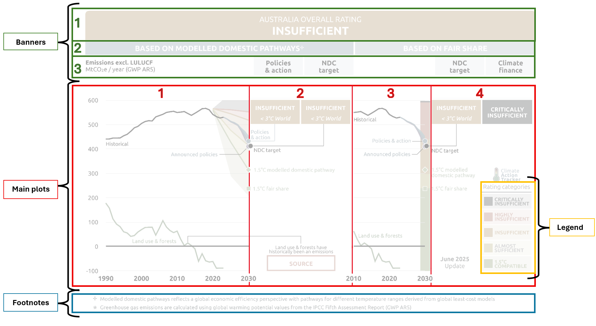

```{r setup, include=FALSE}
knitr::opts_chunk$set(out.width="100%", fig.align="center", fig.showtext=TRUE)
```


## Introduction

The CAT Project monitors government climate policies, actions and announcements to evaluate alignment with the Paris Agreement (2015) goal of limiting warming to 1.5-2°C. CAT analyses 34 countries that account for 85% of global emissions. The primary analysis for each country is assessing government action to limiting global warming. Emission gaps are calculated for each nation using emission projections and climate models to assess current policies, actions and announcements, compared to domestic and global temperature requirements.

The chosen graph for this replication is the Australian country profile. The graph (Figure 1.) details an evaluation of the emissions trajectory achievable with Australia's current climate targets, action and policies, against what is needed to domestically, and globally, limit global warming to 1.5°C (as per the Paris Agreement, 2015).

Figure 1. Australian Country Profile (original graph) {.external width="100%"}


## Data and Packages

All data used to make the graph was available on the website (<https://climateactiontracker.org/countries/australia/>). Two excel files were used: 
1. CAT assessment data (CAT_AssessmentData_AUS.xlxs): contains the historical emissions, policy projections, and target values used in the country profile chart. 
2. Country emissions data (Countryemissions_AUSdata.xlxs): contains the modelled domestic pathways and equity (fair share) boundaries. 


The data processing has been included in a separate file (datascript.R) due to the length of the code and being unable to create one data frame for all necessary data to be included on the graph. The primary processing required for the data was filtering the relevant years and variables, and required extensive reshaping using pivot_longer() and pivot_wider() to ensure that each observation was usable for replicating the graph. There were some missing data points for the year 2023 from the main CAT assessment dataset which were manually added using the data available in the Country emissions dataset.


```{r libraries}
library(ggplot2)
library(tidyr)
library(patchwork)
library(ggtext)
library(ggpubr)
library(grid)
library(showtext)
library(cowplot)
```

```{r load-data}
# load data from Rscript 
source("datascript.R")
```

## Outline of the code chunks 

To approach the replication I decided to deconstruct the graph into portions, then join each individual component together using patchwork. 
Figure 2. below depicts each individual section that was made before adding them together. I began by making the three banners (green) using the grid and ggplot2 package, and the footnotes (blue) also using ggplot2. Next I began with the main plots, all of these main plots of the chart were created using ggplot2. The graphs (red, numbers 1 and 3) were made first and then the left and right annotations space were made (red, numbers 2 and 4). Finally, I created the legend using the grid package, and then used the annotations_custom function to inset the grob as a fixed element into the right side annotations plot (red, number 4).

Once all of these components were complete I used the patchwork package to combine the portions.

Figure 2. Sections for recreating the original chart (original graph) {.external width="100%"}


## Replicating the Graph

In order to recreate the appropriate spaces for the graph replication, I began by examining the original graph using Paint to identify its width and height. The original image size of the graph was large measuring at 21.34 inches wide and 12.7 inches high (I have halved this for this replication). Due to the sizes and spacing of each component being unconventional, I also measured each of the individual components relative to their position in the original chart. I then attempted to use these sizing throughout the replication when adding the portions together (see Figure 2.). I also used paint to determine the colours needed for each component of the graph. Following this, I identified a similar font in the graph using the Adobe fonts - Visual search and loaded the font. 

```{r font}
# Font for the graph replication 
font_add_google(name = "Ubuntu", 
                family = "Ubuntu", 
                regular.wt = 400)
showtext_auto()
```


### Banners
(top banner, modelled domestic and fair share, heading banner and footnote)

The banner layout is constructed by creating several self-contained graphical elements and then assembling them into rows. The top banner is built on an empty ggplot canvas using fixed 0–1 coordinates, where a rounded rectangle is drawn with a grid grob and the text is added using annotate(). 
The following banners rely more heavily on grid, with each coloured strip created as a grobTree that combines a background rectangle and centred text. These grobs are converted into ggplot objects using as_ggplot() and arranged horizontally with patchwork, using fixed widths (in inches) and small margin adjustments to reproduce the proportions of the original CAT design. 

```{r banners}
# Top Banner 
top_banner_f <- ggplot() +
  scale_x_continuous(limits = c(0,1)) +
  scale_y_continuous(limits = c(0,1)) +
  theme_void() +
  theme(plot.background = element_rect(fill = NA, 
                                       color = NA)) +
  annotation_custom(
    grob = roundrectGrob(
      r = unit(0.1, "snpc"),  # Rounded corners
      gp = gpar(fill = "#F2AC48", col = "#F2AC48")),
    ymin = -0.3, ymax = 1,
    xmin = -0.01, xmax = 1.005) +
  annotate("text", x = 0.5, y = 0.65,
           label = "AUSTRALIA OVERALL RATING",
           color = "white", size = 4.5,
           family = "Ubuntu") +
  annotate("text", x = 0.5, y = 0.25,
           label = "INSUFFICIENT",
           color = "white", size = 6.5, 
           fontface = "bold",
           family = "Ubuntu")

top_banner <- free(top_banner_f + 
                     plot_layout(widths = unit(
                       11.54,"inches")))

# Modelled domestic and fair share (blue banners) 
bb_left <- grobTree(
  rectGrob(gp = gpar(fill = "#83AFCB", col = NA)),
  textGrob("BASED ON MODELLED DOMESTIC PATHWAYS +",
           x = 0.48, y = 0.5,
           just = "centre",
           gp = gpar(col = "white",
                    fontsize = 11.5,
                    fontface = "bold",
                    fontfamily = "Ubuntu")))  
bb_left_g <-as_ggplot(bb_left) + 
  theme(plot.margin = unit(c(0,0.035,0,0), "inches"))

bb_right <- grobTree(
  rectGrob(gp = gpar(fill = "#A7C6DA", col = NA)),
  textGrob("BASED ON FAIR SHARE",
           x = 0.48, y = 0.5,
           just = "centre",
           gp = gpar(col = "white",
                    fontsize = 11.5,
                    fontface = "bold",
                    fontfamily = "Ubuntu")))
bb_right_g <- as_ggplot(bb_right)

second_banner <- free(bb_left_g + 
  bb_right_g  +
  plot_layout(nrow = 1, 
              widths = unit(c(6.325,4.34), "inches"))+
  theme(plot.margin = unit(c(0.035,0,0,0), "inches")))

# Heading banner (third banner) 
plot_title <- grobTree(
  rectGrob(x = -0.01,
           width = 1,
           gp = gpar(fill = "white", col = NA)),
  textGrob("Emissions excl. LULUCF",
           x = -0.01, y = 0.70,
           hjust = 0,
           gp = gpar(col = "black",
                    fontsize = 10,
                    fontface = "bold",
                    fontfamily = "Ubuntu")),
  textGrob(bquote(MtCO[2]*e / year ~ (GWP ~ AR5)),
           x = -0.01, y = 0.35,
           hjust = 0,
           gp = gpar(col = "black",
                    fontsize = 10,
                    fontfamily = "Ubuntu")))
plot_title_g <- as_ggplot(plot_title)

########## Light blue headings ####################
# policies and action
pna_b3 <- grobTree(
  rectGrob(gp = gpar(fill = "#E5EEF4", col = NA)),
  textGrob("Policies\n& action",
           x = 0.5, 
           y = 0.5,
           just = "centre", 
           gp = gpar(col = "black",
                    fontsize = 11,
                    fontface = "bold",
                    lineheight = 0.8,
                    fontfamily = "Ubuntu")))  
pna_b3_g <- as_ggplot(pna_b3) 

# NDC Target 
ndc_b3 <- grobTree(
  rectGrob(gp = gpar(fill = "#E5EEF4", col = NA)),
  textGrob("NDC\ntarget",
           x = 0.5, 
           y = 0.5,
           just = "centre", 
           gp = gpar(col = "black",
                    fontsize = 11,
                    fontface = "bold",
                    lineheight = 0.8,
                    fontfamily = "Ubuntu"))) 
ndc_b3_g_1 <- as_ggplot(ndc_b3) + 
     theme(plot.margin = margin(0,0,0,0.035, "inches")) 
  
ndc_b3_g_2 <- as_ggplot(ndc_b3) + 
     theme(plot.margin = margin(0,0.035,0,0, "inches"))

blank_b3 <- ggplot() +
  theme_void() + 
     theme(plot.margin = margin(0,0,0,0.03, "inches"))

# Climate Finance 
cf_b3 <- grobTree(
  rectGrob(gp = gpar(fill = "#E5EEF4", col = NA)),
  textGrob("Climate\nfinance",
           x = 0.5, 
           y = 0.5,
           just = "centre", 
           gp = gpar(col = "black",
                    fontsize = 10,
                    fontface = "bold",
                    lineheight = 0.8,
                    fontfamily = "Ubuntu"))) 
cf_b3_g <- as_ggplot(cf_b3)

# Add top banners together 
third_banner <- free(
  plot_title_g + 
  pna_b3_g + 
  ndc_b3_g_1 + 
  blank_b3 +
  ndc_b3_g_2 + 
  cf_b3_g + 
  plot_layout(nrow = 1, 
              widths = unit(c(3.925, 1.16, 1.162, 1.91, 1.155, 1.18), "inches")) +
  theme(plot.margin = unit(c(0.035,0,0.035,0), "inches")))

# Bottom descriptions - footnotes
bottom_banner_f <- ggplot() +
  scale_x_continuous(limits = c(-0.01, 1)) +
  scale_y_continuous(limits = c(0, 1)) +
  theme_void() +
  theme(plot.background = element_rect(fill = NA, 
                                       color = NA),
        margins = margin(0,0,0.35,0, unit = "inches")) +
  annotate("text", x = -0.01, y = 0.75, 
           label = "+ Modelled domestic pathways reflects a global economic efficiency perspective with pathways for different temperature ranges derived from global least-cost models",
           color = "#3C494E", size = 3.5, 
           fontface = "plain",
           family = "Ubuntu",
           hjust = 0.04) +
  annotate("text", x = -0.01, y = 0.2,
           label = "* Greenhouse gas emissions are calculated using global warmning potential values from the IPCC Fifth Assessment Report (GWP AR5)",
           color = "#3C494E", size = 3.5, 
           fontface = "plain",
           family = "Ubuntu",
           hjust = 0.05)
```


### Modelled Domestic Pathways: Main plot - Left Graph

The left graph for the main plot (Red 1 in Figure 2.) was constructed incrementally, starting with a base plot to set the aesthetics. The order following the base plot was chosen strategically to ensure components were layered appropriately for mimicking the original graph.
The base plot defines the temporal and emissions scales, removes non-essential elements, and establishes a clean background with light horizontal grid lines and the zero-reference line. I added the rating categories first as semi-transparent ribbons, ensuring they sit behind all other elements and the boundary lines then placed on top. I then added the historical and LULUCF emissions and placed their corresponding text annotations. I added the connecting lines using geom_path(), which included the first half of the source annotation line needed for the second main plot.  
Future projections and targets are introduced in the final layers. Policy and action pathways are shown as shaded ribbons to communicate uncertainty, with a central line indicating the mid-range trajectory. Distinct point markers highlight key 2030 values, including current policies, planned policies, and the NDC target, while '1.5°C compatible' benchmarks are emphasised using different point shapes. 

```{r left_graph_base}
#First plot - base
p1 <- ggplot() +
  scale_x_continuous(
    limits = c(1990, 2031),
    breaks = seq(1990, 2030, by = 10)) +
  scale_y_continuous(
    limits = c(-100, 600),
    breaks = seq(-100, 600, by = 100)) +
  theme(
    text = element_text(family = "Ubuntu"),
    axis.title = element_blank(),
    panel.background =  element_blank(),
    panel.grid.major.x = element_blank(),
    panel.grid.major.y = element_line(colour = "#D5D5D5", 
                                      linewidth = 0.3),
    axis.text.y = element_text(size = 11,
                   margin = margin(0,.4,0,0, "cm"), 
                   colour = "black"), 
    axis.text.x = element_text(size = 12, 
                              face = "bold",
                              margin = margin(0.3,0,0,0, "cm"),
                              colour = "black"),
    axis.ticks = element_blank(),
    plot.margin = margin(0,0,0,0.07, "inches")) +
  coord_cartesian(
    xlim = c(1990,2030),
    clip = "off", 
    expand = FALSE) +
  # Add a horizontal line at zero for reference
  geom_hline(yintercept = 0, 
             linetype = "solid", 
             color = "black", 
             linewidth = 1) 
```

#### Adding the data

```{r left_graph}
# Create plot with rating bands
p2 <- p1 +
  # Rating bands (drawn first so they're in background)
  # Critically insufficient (top)
  geom_ribbon(data = country,
              aes(x = year, 
                  ymin = `Highly insufficient`, 
                  ymax = pmin(`Upper limit`, 600)),
              fill = "#606060", alpha = 0.4) +
  # Highly insufficient
  geom_ribbon(data = country,
              aes(x = year, 
                  ymin = Insufficient, 
                  ymax = `Highly insufficient`),
              fill = "#EF694A", 
              alpha = 0.4) +
  # Insufficient
  geom_ribbon(data = country,
              aes(x = year, 
                  ymin = `Almost sufficient`, 
                  ymax = Insufficient),
              fill = "#F2AC48", alpha = 0.4) +
  # Almost sufficient
  geom_ribbon(data = country,
              aes(x = year, 
                  ymin = `1.5C compatible`, 
                  ymax = `Almost sufficient`),
              fill = "#F2E464", alpha = 0.4) +
  # 1.5C compatible (bottom)
  geom_ribbon(data = country,
              aes(x = year, 
                  ymin = `Lower limit`, 
                  ymax = `1.5C compatible`),
              fill = "#B0CB67", 
              alpha = 0.4)
# Add lines to rating category bands 
p3 <- p2 + 
  geom_line(data = country,
            aes(x = year, 
                y = `Highly insufficient`),
            color = "#EF694A",
            linewidth = 1) +
    geom_line(data = country,
            aes(x = year, 
                y = `Insufficient`),
            color = "#F2AC48",
            linewidth = 1) +
    geom_line(data = country,
            aes(x = year, 
                y = `Almost sufficient`),
            color = "#F2E464",
            linewidth = 1) +
    geom_line(data = country,
            aes(x = year, 
                y = `1.5C compatible`),
            color = "#B0CB67",
            linewidth = 1)
# History line 
p4 <- p3 + 
  geom_line(data = historical_exc, 
            aes(x = year, 
                y = emissions),
            linewidth = 1, 
            color = "black") + 
    # Add labels for the series
    annotate("text", 
             x = 1990, 
             y = 420, 
             label = "Historical", 
             hjust = 0, size = 3.5, 
             family = "Ubuntu")
# LULUCF line 
p5 <- p4 + 
  geom_line(data = lulucf, 
            aes(x = year, y = emissions),
            linewidth = 1, color = "#65A653") +
  # Add labels for the series
  annotate("text", 
           x = 1997, 
           y = 15, 
           label = "Land use & forests", 
           size = 3.5, 
           color = "#65A653", 
           hjust = 0, 
           vjust = 0,
           family = "Ubuntu") 
# Announced policies annotation
p6 <- p5 +
  annotate("text", 
           x = 2021, 
           y = 385, 
           label = "Announced policies", 
           hjust = 1, 
           vjust = 1, 
           size = 3.5, 
           color = "#4F8EB5",
           family = "Ubuntu")
# Connecting lines from points to labels
p7 <- p6 +
  geom_path(
    data = line1p, 
    aes(x = year, y = emissions), 
    color = "black", linewidth = 0.3) +
  geom_path(
    data = line2p, 
    aes(x = year, y = emissions), 
    color = "black", linewidth = 0.3)
# Policies & action band and line
p8 <- p7 +
  geom_ribbon(data = policies,
              aes(x = year, 
                  ymin = `Total, excl LULUCF, Min`, 
                  ymax = `Total, excl LULUCF, Max`),
              fill = "#4F8EB5", alpha = 0.95) + 
  geom_line(data = planned,
            aes(x = year, 
                y = `Total, excl LULUCF, Min`),
            linewidth = 1,
            color = "#795AA1") +
  geom_line(data = policies, 
            aes(x = year, 
                y = mid_range),
            linewidth = 1, 
            color = "#4F8EB5") +
  geom_point(data = policies |> 
               filter(year == 2030),
             aes(x = year, 
                 y = mid_range),
             color = "white",
             fill = "#4F8EB5",
             shape = 21,
             stroke = 0.5,
             size = 3.75) +
  geom_point(data = planned |> 
               filter(year == 2030),
             aes(x = year, 
                 y = `Total, excl LULUCF, Min`),
             color = "white",
             fill = "#795AA1",
             shape = 21,
             stroke = 0.5,
             size = 3.75)
# Add NDC geom point
p9 <- p8 + 
  geom_point(data = ndc_value,
    aes(x = year + 0.6, 
        y = emissions),  
    size = 3.75, 
    color = "white", 
    fill = "black",
    shape = 21,
    stroke = 0.5)
# Adding 1.5C geom points
p10 <- p9 + 
  geom_point(data = mod_1.5,
            aes(x = year, 
                y = emissions),
            size = 3.5,
            color = "white",
            fill = "#B0CB67",
            shape = 23,
            stroke = 0.5)  + 
  geom_point(data = fair,
             aes(x = year, 
                 y = emissions), 
            size = 3.5,
            color = "white",
            fill = "#B0CB67",
            shape = 22,
            stroke = 0.5)
```

Figure 3. Modelled Domestic Pathways: Main plot - Left graph completed
```{r left_graph_fin, fig.width=10.66, fig.height=6.35}
# Theme only to format interim output 
p10 + theme(
  plot.margin = margin(t = 0.5, r = 6, b = 0.5, l = 0.5, unit = "inches"))
```


### Based on Fair Share: Main Plot - Right Graph

The right side graph of the main plot (Red 3 from Figure 2.), based on fair share, was made in a similar fashion as outline above for the modelled domestic pathways graph (main plot - left graph). The base plot was created first to match the aesthetics of the orginal image, then components added incrementally with strategic layering. The rating bands (bar) in this graph instead represent the fair share, but the rest of the data for the fair share was the same as the modelled domestic pathways but beginning from the year 2010, rather than 1990.  


```{r right_graph_base}
#First plot - base
f1 <- ggplot() +
  scale_x_continuous(
    breaks = seq(2010, 2030, by = 10),
    limits = c(2010, 2031.5)) +
  scale_y_continuous(
    limits = c(-100, 600),
    breaks = seq(-100, 600, by = 100), 
    labels = NULL) +
  labs(
    x = NULL,
    y = NULL) +
  theme(
    panel.background =  element_blank(),
    panel.grid.major.x = element_blank(),
    panel.grid.major.y = element_line(colour = "#D5D5D5", 
                                      linewidth = 0.3),
    axis.title.y = element_blank(), 
    axis.ticks = element_blank(), 
    axis.text.x = element_text(size = 12, 
                              face = "bold",
                              margin = margin(0.2,0,0,0, "cm"),
                              colour = "black"),
    plot.margin = margin(0,0,0,0.07, "inches"), 
    text = element_text(family = "Ubuntu")) +
  coord_cartesian(
    xlim = c(2010,2030),
    clip = "off", 
    expand = FALSE)
```

#### Adding the data

```{r right_graph}
f2 <- f1 +
  geom_rect(data = fair_bars, 
           aes(x = year,
               ymin = ymin,
               ymax = emissions,
               fill = scenario, 
               width = 2.75), 
           colour = NA) + 
  scale_fill_manual(
    values = c("1.5C compatible" = "#B0CB67",
               "Almost sufficient" = "#F2E464",
               "Insufficient" = "#F2AC48",
               "Highly insufficient" = "#EF694A",
               "Critically insufficient" = "#575F62")) +
  theme(legend.position = "none")
f3 <- f2 +
  geom_hline(yintercept = seq(-100, 600, by = 100), 
             colour = "#D5D5D5",
             linewidth = 0.3) +
  # Add a horizontal line at zero for reference
  geom_hline(yintercept = 0, 
             linetype = "solid", 
             color = "black", 
             linewidth = 0.8)
# History line 
f4 <- f3 + 
  geom_line(data = hist_fair, 
            aes(x = year, 
                y = emissions),
            linewidth = 1, 
            color = "black") + 
    annotate("text", 
             x = 2010, 
             y = 520, 
             label = "Historical", 
             hjust = 0, size = 3.5, 
             family = "Ubuntu")
## LULUCF line (green, thinner)
f5 <- f4 + 
  geom_line(data = lulucf_hist, 
            aes(x = year, y = emissions),
            linewidth = 1, color = "#65A653") +
  # Add text labels for the series
  annotate("text", 
           x = 2011.5, 
           y = 45, 
           label = "Land use & forests", 
           size = 3.5, 
           hjust = 0,
           color = "#65A653",
           family = "Ubuntu") 
# Connecting lines from points to labels
f6 <- f5 +
  geom_path(
    data = line1f, 
    aes(x = year, y = emissions), 
    color = "black", linewidth = 0.3) +
  geom_path(
    data = line2f, 
    aes(x = year, y = emissions), 
    color = "black", linewidth = 0.3)
# Announced policies and pna annotations
f7 <- f6 +
  annotate("text",   # Labels
           x = 2025.5, 
           y = 385, 
           label = "Announced policies", 
           hjust = 1, 
           vjust = 1,
           size = 3.5, 
           color = "#4F8EB5", 
           family = "Ubuntu") +
  annotate("text", 
           x = 2025.5, 
           y = 432.5334, 
           label = "Policies & action", 
           size = 3.5, 
           color = "#4F8EB5", 
           hjust = 1,
           family = "Ubuntu") 
# Policies & action band and line
f8 <- f7 +
  geom_ribbon(data = policies,
              aes(x = year, 
                  ymin = `Total, excl LULUCF, Min`, 
                  ymax = `Total, excl LULUCF, Max`),
              fill = "#4F8EB5", alpha = 0.9) + 
  geom_line(data = planned,
            aes(x = year, 
                y = `Total, excl LULUCF, Min`),
            linewidth = 1,
            color = "#795AA1") +   
  geom_line(data = policies, 
            aes(x = year, 
                y = mid_range),
            linewidth = 1, 
            color = "#4F8EB5") + 
  geom_point(data = policies |> 
               filter(year == 2030),
             aes(x = year, 
                 y = mid_range),
             color = "white",
             fill = "#4F8EB5",
             shape = 21,
             stroke = 0.5,
             size = 3.75) +
  geom_point(data = planned |> 
               filter(year == 2030),
             aes(x = year, 
                 y = `Total, excl LULUCF, Min`),
             color = "white",
             fill = "#795AA1",
             shape = 21,
             stroke = 0.5,
             size = 3.75)
# Add NDC geom point
f9 <- f8 + 
  geom_point(data = ndc_value,
    aes(x = year + 0.5, y = emissions),  
    size = 3.75, 
    color = "white", 
    fill = "black",
    shape = 21,
    stroke = 0.5) 
# Add 1.5C shapes 
f10 <- f9 + 
  geom_point(data = mod_1.5,
            aes(x = year, 
                y = emissions),
            size = 3.5,
            color = "white",
            fill = "#B0CB67",
            shape = 23,
            stroke = 0.5) +
  geom_point(data = fair,
             aes(x = year, 
                 y = emissions), 
            size = 3.5,
            color = "white",
            fill = "#B0CB67",
            shape = 22,
            stroke = 0.5)
```

Figure 4. Based on Fair Share: Main plot - Right graph completed 
```{r right_graph_fin, fig.width=10.66, fig.height=6.35}
# Theme only to format interim output 
f10 + theme(
  plot.margin = margin(t = 0.5, r = 3, b = 0.5, l = 6, unit = "inches"))
```


### Left Space (annotations)
Red 2, Figure 2 
This code creates a dedicated annotation panel (used as the left label space beside the main chart) by starting with an empty ggplot canvas and then drawing everything manually with annotate(). The base plot (l1) defines the coordinate system for the panel that matches the coordinate system of the main graph (2030–2050 on the x-axis and −100 to 600 on the y-axis) to enable alignment when adding the plots together. Because the entire panel is positioned by manually coded coordinates, a main limitation is that it required many small changes to match the replication appropriately. 

```{r left_annotations}
# Base plot
l1 <- ggplot() +
  scale_x_continuous(
    breaks = seq(2030,2050, by = 10),
    limits = c(2029, 2050)) +
  scale_y_continuous(
    limits = c(-100, 600),
    breaks = seq(-100, 600, by = 100)) +
  theme_void() +
  coord_cartesian(
    xlim = c(2030,2050),
    clip = "off", 
    expand = FALSE)
############# Left space labels #######################
# Main plot with side panel annotations
l2 <- l1 +
# Policies & action box
  annotate(
    geom = "rect", 
    xmin = 2030.4, xmax = 2040, 
    ymin = 502, ymax = 600,
    fill = "#F2AC48", color = "#F2AC48", 
    linewidth = 0.3) +
  annotate(
    geom = "text", 
    x = 2035.28, y = 565, 
    label = "INSUFFICIENT",
    size = 3.5, color = "white", 
    fontface = "bold",
    family = "Ubuntu") +
  annotate(
    geom = "text", 
    x = 2035.28, y = 525, 
    label = "< 3\u00B0C World", 
    size = 3.5, color = "white", 
    fontface = "italic", 
    family = "Ubuntu") +
# NDC target box
  annotate(
    geom = "rect", 
    xmin = 2040.35, xmax = 2050, 
    ymin = 502, ymax = 600,
    fill = "#F2AC48", color = "#F2AC48", 
    linewidth = 0.3) +
  annotate(
    geom = "text", 
    x = 2045.13, y = 565, 
    label = "INSUFFICIENT",
    size = 3.5, color = "white", 
    fontface = "bold",
    family = "Ubuntu") +
  annotate(
    geom = "text", 
    x = 2045.13, y = 525, 
    label = "< 3\u00B0C World",
    size = 3.5, color = "white", 
    fontface = "italic",
    family = "Ubuntu") +
# Source box and label 
  annotate(
    geom = "rect", 
    xmin = 2033.5, xmax = 2047.9, 
    ymin = -100, ymax = -40,
    fill = "white", color = "#EF694A", 
    linewidth = 1.2) +
  annotate(
    geom = "text", 
    x = 2040, y = 10, 
    label = " Land use & forests have\n
    historically been an emissions",
    size = 3, color = "black", 
    hjust = 0.5, 
    vjust = 1, 
    lineheight = 0.5,
    family = "Ubuntu") +
  annotate(
    geom = "text", 
    x = 2040, y = -70, 
    label = "SOURCE",
    size = 3.5, color = "#EF694A", 
    fontface = "bold",
    hjust = 0.5,
    family = "Ubuntu")
# Policies and action (label for blue dot in p10 graph) 
l3 <- l2 + 
  annotate(
    geom = "text", 
    x = 2030.4, y = 457,
    label = "Policies\n& action", 
    size = 3.5, color = "#4F8EB5", 
    hjust = 0, 
    lineheight = 0.8,
    family = "Ubuntu") +  
#NDC Label (label for black dot in p10)
  annotate(
    geom = "text",
    x = 2031, y = 402, 
    label = "NDC target",
    size = 3.5, colour = "black", 
    hjust = 0, 
    vjust = 1,
    family = "Ubuntu") +
# Left labels (1.5 C mod - diamond) 
  annotate(
    geom = "text",
    x = 2031, y = 314.84, 
    label = "1.5\u00B0C modelled domestic pathway",
    size = 3.5, color = "#88B572", 
    hjust = 0,
    family = "Ubuntu") +
# 1.5 C fair - square 
  annotate(
    geom = "text", 
    x = 2031, y = 237.8754, 
    label = "1.5\u00B0C fair share",
    size = 3.5, color = "#88B572", 
    hjust = 0,
    family = "Ubuntu") 
# Connecting lines from points to labels
l4 <- l3 +
  geom_path(
    data = line1, 
    aes(x = year, y = emissions), 
    color = "#4F8EB5", linewidth = 0.3) +
  geom_path(
    data = line2, 
    aes(x = year, y = emissions), 
    color = "black", linewidth = 0.3) +
  geom_path(
    data = line3, 
    aes(x = year, y = emissions), 
    colour = "black", linewidth = 0.3) 
```

Figure 5.
```{r left_annotations_fin, fig.width= 10.66, fig.height=6.35}
l4 + theme(
  plot.margin = margin(t = 0.5, r = 4, b = 0.5, l = 4, unit = "inches"))
```


### Right Space (annotations)
This section was made for the same purpose and way as above. I used geom_richtext() for the “June 2025 update” label so the weight could be changed within the one text string and not require two different annotations and manual placements. The legend was built separately as a grob and then inserted into the ggplot annotation panel using annotation_custom().   

```{r right_annotations}
# Base plot
r1 <- ggplot() +
  scale_x_continuous(
    breaks = seq(2030,2050, by = 10),
    limits = c(2029, 2051)) +
  scale_y_continuous(
    limits = c(-100, 600),
    breaks = seq(-100, 600, by = 100)) +
  theme_void() +
  coord_cartesian(
    xlim = c(2030,2050),
    clip = "off", 
    expand = FALSE)

################# Left space labels #############
r2 <- r1 +
# NDC target box
  annotate(
    geom = "rect", 
    xmin = 2031.4, xmax = 2040.38, 
    ymin = 502, ymax = 600,
    fill = "#F2AC48", color = "#F2AC48", 
    linewidth = 0.3) +
  annotate(
    geom = "text", 
    x = 2035.9, y = 565, 
    label = "INSUFFICIENT",
    size = 3.5, color = "white", 
    fontface = "bold",
    family = "Ubuntu") +
  annotate(
    geom = "text", 
    x = 2035.9, y = 525, 
    label = "< 3\u00B0C World", 
    size = 3.5, color = "white", 
    fontface = "italic",
    family = "Ubuntu") +
# Climate finance 
  annotate(
    geom = "rect", 
    xmin = 2040.71, xmax = 2050, 
    ymin = 502, ymax = 600,
    fill = "#575F62", color = "#575F62", 
    linewidth = 0.3) +
  annotate(
    geom = "text", 
    x = 2045.6, y = 550, 
    label = "CRITICALLY\nINSUFFICIENT",
    size = 3.5, color = "white", 
    fontface = "bold", 
    lineheight = 0.8,
    family = "Ubuntu") +  
  geom_richtext(
    aes(x = 2035.5, y = -45), 
    fill = NA, label.colour = NA,
    label = "**June 2025**<br>Update",
    size = 3.5, color = "#575F62",
    lineheight = 0.5,
    family = "Ubuntu", 
    hjust = 0.5)
#NDC Label (label for black dot in p10)
r3 <- r2 + 
  annotate(
    geom = "text",
    x = 2031.25, y = 402, 
    label = "NDC target",
    size = 3.5, colour = "black", 
    hjust = "left",
    vjust = "top",
    family = "Ubuntu") + 
# Left labels (1.5 C mod - diamond) 
  annotate(
    geom = "text",
    x = 2031.25, y = 305, 
    label = "1.5\u00B0C modelled\ndomestic pathway",
    size = 3.5, color = "#88B572", 
    hjust = "left",
    vjust = 0.5,
    lineheight = 0.8,
    family = "Ubuntu") +
# 1.5 C fair - square 
  annotate(
    geom = "text", 
    x = 2031.25, y = 237.8754, 
    label = "1.5\u00B0C fair share",
    size = 3.5, color = "#88B572", 
    hjust = "left",
    family = "Ubuntu") 
r4 <- r3 +
  geom_path(
    data = line1_r, 
    aes(x = year, y = emissions), 
    color = "black", linewidth = 0.3) 
```

### Legend

```{r legend}
legend_grob <- grobTree(
# Title
  textGrob("Rating categories", x = 0.025, y = 1,
           gp = gpar(fontsize = 10, 
                     col = "#3C494E",
                     fontfamily = "Ubuntu"),
           hjust = 0),
# Title underline
  linesGrob(x = c(0, 1), y = c(0.94, 0.94),
            gp = gpar(col = "#575F62", 
                      lwd = 2, 
                      lineend = "square")),
#Critically Insufficient 
  #background
  rectGrob(x = 0, y = 0.911, 
           width = 1, height = 0.168,
           gp = gpar(fill = "#575F62", 
                     col = NA, 
                     alpha = 0.2), 
           just = c(0,1)),
  #box
  rectGrob(x = 0.033, y = 0.878, 
           width = 0.185, height = 0.11,
           gp = gpar(fill = "#575F62", 
                     col = "white"),
           just = c(0,1)),
  #text
  textGrob("CRITICALLY\nINSUFFICIENT", 
           x = 0.26, y = 0.87, 
           gp = gpar(fontsize = 9, 
                     fontface = "bold", 
                     col = "#575F62", 
                     lineheight = 0.8,
                     fontfamily = "Ubuntu"),
           just = c(0,1)),
#Highly Insufficient 
  #background
  rectGrob(x = 0, y = 0.724, 
           width = 1, height = 0.168,
           gp = gpar(fill = "#EF694A", col = NA, 
                     alpha = 0.2), 
           just = c(0,1)),
  #box
  rectGrob(x = 0.033, y = 0.693, 
           width = 0.185, height = 0.11,
           gp = gpar(fill = "#EF694A", 
                     col = "white"),
           just = c(0,1)),
  #text
  textGrob("HIGHLY\nINSUFFICIENT", 
           x = 0.26, y = 0.683,
           gp = gpar(fontsize = 9, 
                     fontface = "bold", 
                     col = "#EF694A", 
                     lineheight = 0.8,
                     fontfamily = "Ubuntu"),
           just = c(0,1)),
#Insufficient 
  #background
  rectGrob(x = 0, y = 0.537, 
           width = 1, height = 0.168,
           gp = gpar(fill = "#F2AC48", 
                     col = NA, 
                     alpha = 0.2),
           just = c(0,1)),
  #box
  rectGrob(x = 0.033, y = 0.506, 
           width = 0.185, height = 0.11,
           gp = gpar(fill = "#F2AC48", 
                     col = "white"), 
           just = c(0,1)),
  #text
  textGrob("INSUFFICIENT", 
           x = 0.26, y = 0.466,
           gp = gpar(fontsize = 9, 
                     fontface = "bold", 
                     col = "#F2AC48",
                     fontfamily = "Ubuntu"),
           just = c(0,1)),
#Almost Sufficient 
  #background
  rectGrob(x = 0, y = 0.35, 
           width = 1, height = 0.168,
           gp = gpar(fill = "#F2E464", 
                     col = NA, 
                     alpha = 0.2),
           just = c(0,1)),
  #box
  rectGrob(x = 0.033, y = 0.319, 
           width = 0.185, height = 0.11,
           gp = gpar(fill = "#F2E464", 
                     col = "white"),
           just = c(0,1)),
  #text
  textGrob("ALMOST\nSUFFICIENT", 
           x = 0.26, y = 0.31,
           gp = gpar(fontsize = 9, 
                     fontface = "bold", 
                     col = "#9A9FA1", 
                     lineheight = 0.8,
                     fontfamily = "Ubuntu"),
           just = c(0,1)),
#1.5°C Compatible 
  #background
  rectGrob(x = 0, y = 0.163, 
           width = 1, height = 0.168,
           gp = gpar(fill = "#B0CB67", 
                     col = NA, 
                     alpha = 0.2),
           just = c(0,1)),
  #box
  rectGrob(x = 0.033, y = 0.132, 
           width = 0.185, height = 0.11,
           gp = gpar(fill = "#B0CB67", 
                     col = "white"),
           just = c(0,1)),
  #text
  textGrob("1.5\u00B0C\nCOMPATIBLE", 
           x = 0.26, y = 0.123,
           gp = gpar(fontsize = 9, 
                     fontface = "bold", 
                     col = "#B0CB67", 
                     lineheight = 0.8,
                     fontfamily = "Ubuntu"),
           just = c(0,1)))

##############################################
## Add legend to right side annotations plot 
r5 <- r4 +
  annotation_custom(
    grob = legend_grob,
    xmin = 2040.71,  
    xmax = 2050,  
    ymin = -100,   
    ymax = 250)
```

Figure 6
```{r right_legend_fin, fig.width= 10.66, fig.height=6.35}
r5 + theme(
  plot.margin = margin(t = 0.5, r = 0, b = 0.5, l = 8, unit = "inches"))
```


#### Main plot completed

The main plots were added together prior to adding the banners.

Figure 7
```{r main_plot, fig.width=10.66, fig.height=4.4}
graphs <- free(
  p10 + l4 + f10 + r5 +  
  plot_layout(nrow = 1, 
              widths = unit(c(3.42, 
                              2.39, 
                              1.7, 
                              2.55),"inches")))
graphs
```

## Final Plot - Recreation

The banners were added to the plot and heights specified for the overall layout and completed recreation. 

Figure 8
```{r fig.width=10.66, fig.height=6.35}
final <- top_banner/
  second_banner/ third_banner/ 
  graphs / bottom_banner_f +
  plot_layout(heights = unit(c(0.71,0.325,0.5, 4.4, 0.41), "inches"),
              nrow = 5,
              ncol = 1)
final
```


A limitation of combining grid, ggplot2, and patchwork is that each system handles sizing and layout differently, therefore when adding everything together there was no consistent baseline to align each element to. Furthermore, the spacing that was required for the graph replication was not standard for any of the packages. As a result, precise alignment across banners required extensive manual tuning of widths and margins. This was mostly completed through extensive micro-adjustments in the spacing by a visual comparison of the output to the original graph. 

## Improvement

Overall, the original graph has some limitations in the clarity of its design. The most prominent issue that I identified was the information overload. A large number of visual elements (bands, lines, ribbons, markers, annotations, and labels) are all presented simultaneously, in loud colours, which compete for attention and makes it difficult to quickly identify what the graph is about and what the most important aspect of the graph is. The panel layout also fragments the visual flow and contributes to visual clutter and wasted space, where large areas are reserved for explanatory text while the actual data elements relevant to the graph compete for limited central space. 

Due to this, the improvement is mostly focused on slight modifications to improve its clarity and the graph was made in a similar way and using similar elements to the original graph. 

### Main plot
```{r improvement_main, fig.width=7, fig.height=5}

m1 <- ggplot() +
  scale_x_continuous(
    limits = c(2010, 2050), 
    breaks = seq(2010, 2030, by = 10)) +
  scale_y_continuous(
    limits = c(-100, 699),
    breaks = seq(-100, 600, by = 100)) +
  labs(title = "Australian Emissions", 
       subtitle = expression(MtCO[2]*e / year ~ (GWP ~ AR5))) +
  theme(
    plot.title = element_text(size = 10, face = "bold"),
    plot.subtitle = element_text(size = 9),
    panel.background = element_rect(fill = "grey90",
                                    color = NA),
    plot.background = element_rect(fill = "grey90",
                                   color = NA),
    panel.grid.major.x = element_blank(),
    panel.grid.major.y = element_line(colour = "grey", 
                                      linewidth = 0.3),
    panel.grid.minor = element_line(colour = 
                                        "grey90"),
    axis.text.y = element_text(size = 9,
                              colour = "#1D252A",
                              margin = margin(0,0.1,0,0, "inches")),
    axis.text.x = element_text(size = 10, 
                              face = "bold",
                              margin = margin(0.1,0,0,0, "inches"),
                              colour = "#1D252A"),
    axis.title.x = element_blank(),
    axis.title.y = element_blank(),
    axis.ticks = element_blank()
    ) +
  coord_cartesian(
    xlim = c(2010,2030),
    ylim = c(-100, 600),
    clip = "off",
    expand = FALSE) 
 ### ADD , "Modelled Domestic Pathways"

# Add coloured areas (so they are underneath)
m2 <- m1 + 
  geom_ribbon(data = dom_data |> 
                filter(year >= 2024),
              aes(x = year, 
                  ymin = 0, 
                  ymax = emissions),
              fill = "#81B18E", alpha = 0.6) + 
  geom_ribbon(data = fair_data |> 
                filter(year >= 2024), 
              aes(x = year,
                  ymin = 0,
                  ymax = emissions),
              fill = "#A3B4AC", alpha = 0.6)
# Add historical data, LULUCF data and 0 ref line
m3 <- m2 +  
  geom_line(data = country_1 |>  
              filter(scenario == "Historical", 
                     year >= 2010,
                     sector == "Economy-wide, excluding LULUCF"),
            aes(x = year, 
                y = emissions),
            linewidth = 1, 
            color = "#36454F") + 
  geom_line(data = country_1 |>  
              filter(scenario == "Historical", 
                     year >= 2010,
                     sector == "LULUCF"),
            aes(x = year, 
                y = emissions),
            linewidth = 1, color = "#36454F") +
  geom_ribbon(data = country_1 |>  
              filter(scenario == "Historical", 
                     year >= 2010,
                     sector == "LULUCF"),
              aes(x = year, 
                  ymin = 0, 
                  ymax = emissions), 
              fill = "#839AAA", alpha = 0.5) + 
  geom_hline(yintercept = 0, 
             linetype = "solid", 
             color = "#1D252A", 
             linewidth = 0.8)
# add 1.5 compatible line and policy 
m4 <- m3 + 
    geom_line(data = dom_data,
            aes(x = year, y = emissions),
            color = "#81B18E",
            linewidth = 1, 
            linetype = 2) +
  geom_ribbon(data = policies_r,
              aes(x = year, 
                  ymin = `Current Policy, Min`, 
                  ymax = `Current Policy, Max`),
              fill = "#F5BD84", alpha = 0.6) + 
  geom_line(data = policies_r, 
            aes(x = year, 
                y = mid_range),
            linewidth = 1, 
            color = "#F5BD84") +
  geom_line(data = fair_data, 
            aes(x = year,
                y = emissions), 
            colour = "#364F4D", 
            linewidth = 0.5, 
            linetype = 2) +
  geom_vline(xintercept = 2024, 
             colour = "#1D252A") +
  geom_text(aes(x = 2024.1, y = 625), label = "Modelled Domestic Pathways (from 2024)", 
            size = 3.5, fontface = "bold", 
            vjust = 0,
            hjust = 0)
```

### Annotations

```{r improvement_annotations, fig.width=7, fig.height=5}

m5 <- m4 + 
  annotate("text",
           x = 2010, 
           y = 520,
           label = "Historical",
           hjust = 0, size = 3, 
           colour = "#36454F") + 
  annotate("text", 
           x = 2010, 
           y = 85, 
           label = "Land use & forests", 
           size = 3, 
           hjust = 0,
           color = "#36454F") +
  geom_richtext(aes(x = 2023.7, y = 294.41,
                 label = "Required for **global** 1.5\u00B0C target"),
             size = 3,
             color = "#364F4D",
             hjust = 1,
             vjust = 1,
             fill = "grey90",
             label.padding = unit(0.1, "lines")) +
  geom_label(aes(x = 2011.3, y = 45,
                 label = "Transition from source to sink"),
             size = 3,
             color = "#36454F",
             fontface = "italic",
             hjust = 0,
             fill = "grey90",
             label.padding = unit(0.1, "lines"),
             linewidth = 0.25, 
             lineheight = 0.3) 
m6 <- m5 + 
  geom_rect(data = bar_ratings,
            aes(xmin = 2030, 
                xmax = 2030.5,
                ymin = ymin, ymax = emissions, 
                fill = scenario),
            colour = NA,
            alpha = 0.6) +
  scale_fill_manual(
    values = c("1.5C compatible" = "#81B18E",
               "Almost sufficient" = "#F5E091", #OR darker F1C43B "#FAF5BA"
               "Insufficient" = "#F5BD84",
               "Highly insufficient" = "#EB8562",
               "Critically insufficient" = "#E15656")) + 
  theme(legend.position = "none")

```

### Right side annotations
```{r improvement_annotationsR, fig.width=7, fig.height=5}
m7 <- m6 + 
  geom_label(data = policies_r |>  
               filter(year == 2030),
               aes(x = 2030.5, y = mid_range+2,
                 label = "Current Policies & Action Pathway"),
             size = 3,
             color = "#EF963E",
             fontface = "bold",
             hjust = 0,
             vjust = 0.1,
             fill = "white",
             label.padding = unit(0.25, "lines"),
             linewidth = 0.25,
            lineheight = 0.8) +
  geom_label(data = country_1 |> 
               filter(year == 2030,
                      scenario == "NDC Unconditional, Max"),
             aes(x = 2030.5, y = emissions - 2,
                 label = "2030 National Target (NDC)             "),
             size = 3,
             color = "#1D252A",
             fontface = "bold",
             hjust = 0,
             vjust = 0.9,
             fill = "white",
             label.padding = unit(0.25, "lines"),
             linewidth = 0.25,
            lineheight = 0.8) + 
   geom_richtext(data = dom_data |> 
              filter(year == 2030),
            aes(x = year + 0.5, 
                y = emissions,
                 label = "Required for **domestic** 1.5\u00B0C target "),
             size = 3,
             color = "#3E6548", 
             hjust = 0,
             vjust = 1,
             fill = "grey90",
             label.padding = unit(0.25, "lines"),
             lineheight = 0.8)
# Add points 
m8 <- m7 + 
  geom_point(data = policies_r |> 
               filter(year == 2030),
             aes(x = year +0.2, 
                 y = mid_range),
             color = "#1D252A",
             fill = "#EF963E",
             shape = 21,
             stroke = 0.2,
             size = 3.5) +
  geom_point(data = country_1 |> 
               filter(year == 2030,
                      scenario == "NDC Unconditional, Max"),
             aes(x = year +0.2, y = emissions), 
             size = 3.5, 
             color = "#1D252A", 
             fill = "#1D252A",
             shape = 21,
             stroke = 0.2)  + 
  geom_point(data = dom_data |> 
               filter(year == 2030),
            aes(x = year + 0.2, 
                y = emissions),
            size = 3.5,
            color = "#1D252A",
            fill = "#81B18E",
            shape = 23,
            stroke = 0.2) + 
  theme(plot.margin = margin(t = 0.05, r = 2.25, b = 0.05, l = 0.05, unit = "inches"))
```

### Legend (left graph)

```{r improvement_legend, fig.width=7, fig.height=5}

legend_redo_grob <- grobTree(
# Title
  textGrob("Rating categories", x = 0.025, y = 1,
           gp = gpar(fontsize = 10, 
                     col = "#3C494E"),
           hjust = 0),
# Title underline
  linesGrob(x = c(0, 1), y = c(0.94, 0.94),
            gp = gpar(col = "#575F62", 
                      lwd = 2, 
                      lineend = "square")),
#Critically Insufficient 
  #background
  rectGrob(x = 0, y = 0.911, 
           width = 1, height = 0.168,
           gp = gpar(fill = "grey90", 
                     col = "#3C494E", 
                     alpha = 0.2), 
           just = c(0,1)),
  #box
  rectGrob(x = 0.033, y = 0.878, 
           width = 0.1, height = 0.11,
           gp = gpar(fill = "#E15656", 
                     col = "#E15656",
            alpha = 0.6),
           just = c(0,1)),
  #text
  textGrob("Critically insufficient (> 4\u00B0C)", 
           x = 0.15, y = 0.85, 
           gp = gpar(fontsize = 9, 
                     # fontface = "bold", 
                     col = "#B21F1F", 
                     lineheight = 0.8),
           just = c(0,1)),
#Highly Insufficient 
  #background
  rectGrob(x = 0, y = 0.724, 
           width = 1, height = 0.168,
           gp = gpar(fill = "grey90", col = "#3C494E", 
                     alpha = 0.2), 
           just = c(0,1)),
  #box
  rectGrob(x = 0.033, y = 0.693, 
           width = 0.1, height = 0.11,
           gp = gpar(fill = "#EB8562", 
                     col = "#EB8562",
                     alpha = 0.6),
           just = c(0,1)),
  #text
  textGrob("Highly insufficient (< 4\u00B0C)    ", 
           x = 0.15, y = 0.663,
           gp = gpar(fontsize = 9, 
                     # fontface = "bold", 
                     col = "#EF694A", 
                     lineheight = 0.8),
           just = c(0,1)),
#Insufficient 
  #background
  rectGrob(x = 0, y = 0.537, 
           width = 1, height = 0.168,
           gp = gpar(fill = "white", 
                     col = "#EF963E"),
           just = c(0,1)),
  #box
  rectGrob(x = 0.033, y = 0.506, 
           width = 0.1, height = 0.11,
           gp = gpar(fill = "#F5BD84", 
                     col = "#F5BD84",
                     alpha = 0.6), 
           just = c(0,1)),
  #text
  textGrob("Insufficient (< 3\u00B0C)   ", 
           x = 0.15, y = 0.477,
           gp = gpar(fontsize = 9, 
                     fontface = "bold", 
                     col = "#EF963E",
                     lineheight = 0.8),
           just = c(0,1)),
#Almost Sufficient 
  #background
  rectGrob(x = 0, y = 0.35, 
           width = 1, height = 0.168,
           gp = gpar(fill = "grey90", 
                     col = "#3C494E", 
                     alpha = 0.2),
           just = c(0,1)),
  #box
  rectGrob(x = 0.033, y = 0.319, 
           width = 0.1, height = 0.11,
           gp = gpar(fill = "#F5E091", 
                     col = "#F5E091",
                     alpha = 0.6),
           just = c(0,1)),
  #text
  textGrob("Almost sufficient (< 2\u00B0C)     ", 
           x = 0.15, y = 0.29,
           gp = gpar(fontsize = 9, 
                     # fontface = "bold", 
                     col = "#756A4F", 
                     lineheight = 0.8),
           just = c(0,1)),
#1.5°C Compatible 
  #background
  rectGrob(x = 0, y = 0.163, 
           width = 1, height = 0.168,
           gp = gpar(fill = "grey90", 
                     col = "#3C494E", 
                     alpha = 0.2),
           just = c(0,1)),
  #box
  rectGrob(x = 0.033, y = 0.132, 
           width = 0.1, height = 0.11,
           gp = gpar(fill = "#81B18E", 
                     col = "#81B18E",
                     alpha = 0.6),
           just = c(0,1)),
  #text
  textGrob("1.5\u00B0C compatible (< 1.5\u00B0C)", 
           x = 0.15, y = 0.103,
           gp = gpar(fontsize = 9, 
                     # fontface = "bold", 
                     col = "#3E6548", 
                     lineheight = 0.8),
           just = c(0,1)))


legend_redo <- as_ggplot(legend_redo_grob) + 
  theme(plot.background = element_rect(fill = "grey90",
                                   color = NA)) 
m9 <- m8 +
  annotation_custom(
    grob = legend_redo_grob,
    xmin = 2031.2,  
    xmax = 2040,  
    ymin = -100,   
    ymax = 200)
```

### Banner

```{r improvement_banner, fig.width=8, fig.height=0.5}
banner_r <- ggplot() +
  theme_void() +
  theme(plot.background = element_rect(fill = "#F5BD84", 
                                       color = NA)) +
  annotate("text", x = 0.7, y = 0.7, 
           label = "AUSTRALIA OVERALL RATING",
           color = "#36454F", size = 4) +
  annotate("text", x = 0.7, y = 0.25,
           label = "INSUFFICIENT", 
           color = "#36454F", size = 5, fontface = "bold") +
  coord_cartesian(xlim = c(0,1), ylim = c(0,1))
```

### Final Improvement Graph

The revised version of the graph aims to improve clarity by reducing visual complexity and placing greater emphasis on the most relevant elements. One key change is the removal of most historical emissions data from 1990-2010. In the original graph, the extended historical timeline adds some historical context/tracking, but does not directly support the main focus on current policy alignment and future targets. By concentrating on more recent years, the revised graph draws attention to the period most relevant for policy assessment and makes overall patterns easier to interpret.

Clarity is also improved by bringing the overall rating (“Insufficient”) into clearer focus and by reducing the number of policy pathways shown. Removing the announced policies line simplifies the comparison, allowing greater emphasis on the relationship between current policies, the 2030 NDC, and the 1.5°C-compatible pathway. Likewise, retaining only the 1.5°C fair-share benchmark, rather than the full set of rating bands, reduces visual clutter while keeping the most relevant reference point. In the original chart, the number of rating bands and supplementary panels made the reading sequence less clear and weakened the connection between the ratings and the data. The revised design places the remaining benchmarks more directly within the main plotting area, supporting a more straightforward reading from recent trends to future requirements. Overall, these changes aim to prioritise interpretability, helping the graph communicate the extent of misalignment with a 1.5°C pathway more clearly.

```{r improvement_graph, fig.width=7, fig.height=5}
redo <- banner_r / m9 + #trbl
  plot_layout(heights = c(0.5, 4.5))
redo
```


## Improvement 2: Fair Share data 
This graph shows CAT fair-share ratings for the world’s 30 highest-emitting countries from 2021 to 2030, based on modelled emissions relative to equity-based 1.5°C benchmarks. Unlike the first improvement, which focused on the Australian domestic pathways, this improvement introduces a cross-country comparison, allowing all major emitters to be assessed simultaneously within the same visual framework.

### Data processing
The data for this graph is still obtained from the CAT organisation but includes the modelled domestic pathways for current policies and fair-share boundaries for all countries assessed. The dataset originally contained 41 countries, however the top 30 were chosen for representation in this graph to enhance clarity in the visualisation. Furthermore, Ukraine was omitted, as emission tracking has been discontinued due to the current and ongoing war. 
Several transformations were applied to create new variables that enabled the plotting of gradients for the coloured category ratings and column widths based on the total amount of CO₂ each country was expected to emit for the year 2030. Column widths were scaled using a square root transformation of ranked 2030 emissions, which visually emphasises the disproportionate impact of top emitters (such as China and the United States) without allowing them to dominate the layout entirely. 
Column widths were determined by ranking the countries from 1 to 30 that were predicted by 2030 to have the highest to lowest emissions based on their current policy. 
A square root transformation was then applied to the emission rankings to emphasise visual differences between top emitting countries (e.g., China and the United States), while maintaining distinction among lower ranked countries. Colour gradients were applied within each rating category to encode how far a country sits within its assigned band for a given year, providing additional resolution beyond the discrete classification. Threshold values for category boundaries were derived directly from the modelled policy upper and lower boundaries and applied to each countries equity-based emissions limits.

### Final Improvement Graph 2

This improvement aims to broaden the global emissions requirements (fair-share) to be inclusive of the top 30 major emitters who have committed to the 2015 Paris Agreement and allow for relative differences in responsibility and action to be assessed more directly. 

```{r fair_share_plot, fig.width=9, fig.height=5}
# Gradient legend
gradient_legend <- ggplot(data.frame(x = 0:999,  # 1000 values (0 to 999)
  y = rep(1.3)), aes(x = x, fill = x, 
                y = y)) +
  geom_tile(height = 0.5) +
  scale_fill_gradientn(
    colors = c("#E8F5E9", "#C8E6C9", "#A5D6A7", "#FFF9C4",  # 1.5C
               "#FFF9C4", "#FFE082", "#FFCC80",              # Almost
               "#FFCC80", "#FFB74D", "#EF9A9A",              # Insufficient
               "#EF9A9A", "#E57373", "#EF5350",              # Highly
               "#EF5350", "#C62828"),                        # Critically
    guide = "none") +
  annotate("text", x = 100, y = 1.3, 
           label = "1.5°C\ncompatible", 
           size = 2.75, 
           color = "black", 
           lineheight = 0.8) +
  annotate("text", x = 300, y = 1.3, 
           label = "Almost\nsufficient", 
           size = 2.75,
           color = "black", 
           lineheight = 0.8) +
  annotate("text", x = 500, y = 1.3, 
           label = "Insufficient", 
           size = 2.75, 
           color = "black", 
           lineheight = 0.8) +
  annotate("text", x = 700, y = 1.3, 
           label = "Highly\ninsufficient", 
           size = 2.75,  
           color = "black", 
           lineheight = 0.8) +
  annotate("text", x = 900, y = 1.3, 
           label = "Critically\ninsufficient", 
           size = 2.75, 
           color = "white", 
           lineheight = 0.8) + 
 annotate("rect",
          xmin = -0.04,
          xmax = 1000,
          ymin = 1.05,
          ymax = 1.55, 
          colour = "black",
          fill = NA,
          linewidth = 0.6) +
  coord_cartesian(xlim = c(-0.04, 1000), 
                  ylim = c(1.05, 1.55), clip = "off") +
  theme_void() 
# Column width legend
width_legend <- ggplot() +
  annotate("rect", 
           xmin = c(0, 1.2, 2.87),
           xmax = c(0.5, 2.17, 4.67), # column width values 
           ymin = 0.4, ymax = 0.65,
           fill = "grey30", color = "white") +
  annotate("text", 
           x = c(0.25, 3.77), y = 0.37,
           label = c("Lowest\n(MAR)","Highest\n(CHN)"),
           size = 2.75, vjust = 1, lineheight = 0.8) +
  # Arrow
  annotate("segment", 
           x = 0.95, xend = 2.8, 
           y = 0.25, yend = 0.25,
           arrow = arrow(length = unit(0.05, "inches"), type = "open"),
           size = 0.3) +
  annotate("text", 
           x = -1.5, y = 0.87,
           label = expression(bold(
             Column~width~"="~Estimated~MtCO[2]*e~by~"2030")),
           size = 2.75, 
           hjust = 0) +
  coord_cartesian(xlim = c(-1.5, 6),
                  ylim = c(-0.1, 1),
                  clip = "off") +
  theme_void() + 
  theme(panel.border = element_rect(color = "black", 
                                    fill = NA, 
                                    linewidth = 0.6))
# Main plot 
main_plot <- ggplot(final_global, 
         aes(y = year, 
             fill = gradient_colour)) +
  geom_rect(aes(
    xmin = x_start,
    xmax = x_end,
    ymin = year - 0.5,
    ymax = year + 0.5), colour = "white", linewidth = 0.5) +
  scale_fill_identity() + 
  scale_x_continuous(
    breaks = final_global$x_center,
    labels = final_global$Country) +
  scale_y_continuous(breaks = seq(2021, 2030, by = 1),
                     limits = c(2020.5, 2031)) +
  labs(
    title = "Climate Action Ratings by Country",
    subtitle = "Modelled emissions & ratings based on countries' current policies relative to global 1.5°C Paris Agreement target requirements",
    x = "Country",
    y = "Year",
    tag = "Modelled emissions calculated using GWP AR5 \nSource: Climate Action Tracker (December 2025)") + 
  theme_minimal() +
  coord_cartesian(xlim = c(0, 30.5),
                  expand = FALSE, 
                  clip = "off") +
  theme(
    plot.title = element_text(face = "bold", size = 10, 
                              margin = margin(b = 5)),
    plot.subtitle = element_text(size = 9, colour = "grey30", 
                                 margin = margin(b = 15)),
    plot.tag = element_text(size = 8, colour = "grey30",
                            hjust = 0,
                            margin = margin(t = 10)),
    plot.tag.position= c(0.06, -0.05),
    axis.text.x = element_text(size = 8,
                               hjust = 0.5, vjust = 0.5,
                               angle = 90),
    axis.text.y = element_text(size = 8,
                               hjust = 1, vjust = 1,
                               face = c("plain", "plain", 
                                        "plain", "plain", 
                                        "plain", "plain", 
                                        "plain", "plain", 
                                        "plain", "bold")), #bold 2030
    axis.title.y = element_text(size = 9, 
                                face = "bold",
                                margin = margin(r = 5)),
    axis.title.x = element_text(size = 9, 
                                face = "bold", 
                                margin = margin(t = 5)),
    panel.grid = element_blank(),
    plot.margin = margin(0.1, 0.9, 0.5, 0.2, 
                         unit = "inches"), #trbl
    plot.background = element_rect(fill = "white", 
                                   colour = NA)) +
  annotate("text", 
           x = 30.25, y = 2021, 
           label = "Actual Country\nEmissions", 
           size = 2.75, 
           hjust = 0, vjust = 0.5, 
           lineheight = 0.8) + 
  annotate("rect",
            xmin = -0.04,
            xmax = 33.3,
            ymin = 2020.5,
            ymax = 2021.5, 
            colour = "black",
            fill = NA,
            linewidth = 0.6)

global_rep <- ggdraw() +
  draw_plot(main_plot, 
            x = 0, y = 0, 
            width = 1, height = 1) +
  draw_plot(gradient_legend, 
            x = 0.036, y = 0.848, 
            width = .895, height = 0.05) +
  draw_plot(width_legend, 
            x = 0.71, y = 0.01, 
            width = 0.265, height = 0.1)
global_rep
```

