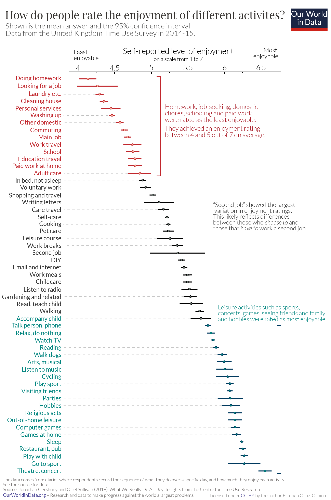

```{r setup, include=FALSE}
knitr::opts_chunk$set(
  fig.width  = 8.5,
  fig.height = 12.85,  # 1.51 * width
  dpi        = 300,
  out.width  = "100%",
  fig.align  = "center",
  warning    = FALSE,
  message    = FALSE)
```


## Introduction

This chart shows how people in the UK rate the **enjoyment of different daily activities** on a scale from 1 to 7.  
Each point represents the mean enjoyment rating for an activity, and the horizontal line indicates the 95% confidence interval around that mean.

My goal in this section is to:

- reconstruct the original chart as faithfully as possible,
- document all data-preparation and plotting steps,
- and highlight the main patterns in the resulting visualization.

{.external width="100%"}

## Getting the Data

The dataset used for this replication is stored locally as an Excel file and contains one row per activity. Since no data was made available by Our World in Data the Excel file was created manually. The file is an enriched version of the UK Time Use Survey summary table and includes:

- the activity label (Activity),
- the mean enjoyment score (Mean),
- the lower and upper bound of the 95% confidence interval (CI_low, CI_high),
- and a custom ordering variable to reproduce the intended ranking in the figure.

## Recreating the Graph

### Required Libraries
- readxl: Imports Excel files (.xlsx) directly into R data frames, enabling straightforward ingestion of the survey dataset without intermediate conversion steps.
- dplyr: Provides a clear “verb”-based grammar for data preparation (e.g., sorting, filtering, creating new variables), used here to structure and label activities consistently for plotting.
- ggplot2: Core visualization framework used to build the figure layer-by-layer (guidelines, confidence intervals, mean markers, and labels) with consistent aesthetic mapping.
- cowplot: Supports composition of multiple ggplot objects; used here to combine the title/subtitle header panel with the main chart into one aligned graphic.
- grid: Supplies low-level graphical utilities (e.g., unit() for precise tick/spacing control), used for fine-tuning axis and layout details.

---
output: html_document
---


```{r libraries, message=FALSE, warning=FALSE}
library(readxl)
library(dplyr)
library(ggplot2)
library(cowplot)
library(grid)
```

### Data loading and  preparation
This step loads the activity-level summary statistics and sets a fixed order so the y-axis matches the reference figure.

```{r data_prep, message=FALSE, warning=FALSE}
df <- read_excel("enjoyment_uk_time_use.xlsx", sheet = "data") %>%
  arrange(Reihenfolge) %>%
  mutate(
    # Reverse factor levels so the first activity appears at the top
    Activity  = factor(Activity, levels = rev(Activity)),

    # Assign each activity to one of three color groups (low / mid / high enjoyment)
    color_grp = case_when(
      Activity %in% c(
        "Doing homework","Looking for a job","Laundry etc.","Cleaning house",
        "Personal services","Washing up","Other domestic","Commuting",
        "Main job","Work travel","School","Education travel",
        "Paid work at home","Adult care"
      ) ~ "Low",
      Activity %in% c(
        "Accompany child","Talk person, phone","Relax, do nothing","Watch TV",
        "Reading","Walk dogs","Arts, musical","Listen to music","Cycling",
        "Play sport","Visiting friends","Parties","Hobbies","Religious acts",
        "Out-of-home leisure","Computer games","Games at home","Sleep",
        "Restaurant, pub","Play with child","Go to sport","Theatre, concert"
      ) ~ "High",
      TRUE ~ "Mid"
    )
  )

# Color palette 
pal <- c("Low" = "#C1272D", "Mid" = "#000000", "High" = "#00847E")
```

### Callout placement
The annotations are anchored to specific activities. We translate activity labels into numeric y-positions so annotate() can place brackets precisely.

```{r callout_positions, message=FALSE, warning=FALSE}
y_of <- function(lbl) {
  y <- match(lbl, levels(df$Activity))
  if (is.na(y)) stop(paste0("Label not found in Activity levels: ", lbl))
  y
}

# Low-enjoyment bracket range
y_low_top     <- y_of("Doing homework")
y_low_bottom  <- y_of("Adult care")
y_low_text    <- (y_low_top + y_low_bottom) / 2

# Mid callout around "Second job"
y_mid_anchor  <- y_of("Second job")
y_mid_top     <- y_of("Work breaks") + 0.45
y_mid_bottom  <- y_mid_anchor - 0.20
y_mid_text    <- (y_mid_top + y_mid_bottom) / 2 + 0.05

# High-enjoyment bracket range
y_high_top    <- y_of("Accompany child")
y_high_bottom <- y_of("Theatre, concert")
y_high_text   <- y_high_top + 1.95
```

### Ploting the graph
This block builds the figure with all its single elements: dotted baseline, CI bars, mean markers, manual activity labels, and the three narrative callouts.

```{r plot, fig.width=8.5, fig.height=12.85, dpi=300, message=FALSE, warning=FALSE}
# Visual tuning 
pt_size   <- 2.6
pt_stroke <- 1.0
ci_lwd    <- 1.05
dot_lwd   <- 0.35

x_min      <- 4.0
x_max_tick <- 6.5
x_max      <- 6.65
x_guide    <- x_min + 0.05

# Callout positions 
x_br_low   <- 5.17; x_txt_low  <- 5.30
x_br_mid   <- 6.07; x_txt_mid  <- 6.20
x_br_high  <- 6.65; x_txt_high <- 5.80

p_core <- ggplot(df, aes(x = Mean, y = Activity)) +

  # Dotted guide line from 4.0 to the activity mean
  geom_segment(
    aes(x = x_guide, xend = Mean, colour = color_grp),
    linewidth = dot_lwd,
    linetype  = "41",
    alpha     = 0.55
  ) +

  # 95% confidence interval 
  geom_errorbarh(
    aes(xmin = CI_low, xmax = CI_high, colour = color_grp),
    height    = 0,
    linewidth = ci_lwd
  ) +

  # Mean point 
  geom_point(
    aes(colour = color_grp),
    shape  = 21,
    fill   = "white",
    stroke = pt_stroke,
    size   = pt_size
  ) +

  # Manual activity labels 
  geom_text(
    aes(x = x_min, label = Activity, colour = color_grp),
    hjust = 1.05,
    vjust = 0.50,
    size  = 3.05
  ) +

  # Callout arrows

  annotate("segment", x = x_br_low, xend = x_br_low, y = y_low_top, yend = y_low_bottom,
           linewidth = 0.75, colour = pal["Low"]) +
  annotate("segment", x = x_br_low, xend = x_br_low - 0.045, y = y_low_top, yend = y_low_top,
           linewidth = 0.75, colour = pal["Low"]) +
  annotate("segment", x = x_br_low, xend = x_br_low - 0.045, y = y_low_bottom, yend = y_low_bottom,
           linewidth = 0.75, colour = pal["Low"]) +
  annotate(
    "text",
    x = x_txt_low, y = y_low_text,
    label = "Homework, job-seeking, domestic\nchores, schooling and paid work\nwere rated as the least enjoyable.\nThey achieved an enjoyment rating\nbetween 4 and 5 out of 7 on average.",
    hjust = 0, vjust = 0.5,
    size = 3.15, colour = pal["Low"], lineheight = 1.12
  ) +

  annotate("segment", x = x_br_mid, xend = x_br_mid, y = y_mid_top, yend = y_mid_bottom,
           linewidth = 0.65, colour = pal["Mid"]) +
  annotate("segment", x = x_br_mid, xend = x_br_mid + 0.060, y = y_mid_bottom, yend = y_mid_bottom,
           linewidth = 0.65, colour = pal["Mid"]) +
  annotate(
    "text",
    x = x_txt_mid, y = y_mid_text,
    label = "\"Second job\" showed the largest\nvariation in enjoyment ratings.\nThis likely reflects differences\nbetween those who choose to and\nthose who have to work a second job.",
    hjust = 0, vjust = 0.5,
    size = 3.15, colour = pal["Mid"], lineheight = 1.12
  ) +

  annotate("segment", x = x_br_high, xend = x_br_high, y = y_high_top, yend = y_high_bottom,
           linewidth = 0.75, colour = pal["High"]) +
  annotate("segment", x = x_br_high, xend = x_br_high - 0.060, y = y_high_top, yend = y_high_top,
           linewidth = 0.75, colour = pal["High"]) +
  annotate("segment", x = x_br_high, xend = x_br_high - 0.060, y = y_high_bottom, yend = y_high_bottom,
           linewidth = 0.75, colour = pal["High"]) +
  annotate(
    "text",
    x = x_txt_high, y = y_high_text,
    label = "Leisure activities such as sports,\nconcerts, games, seeing friends and family\nand hobbies were rated as most enjoyable.",
    hjust = 0, vjust = 0.5,
    size = 3.15, colour = pal["High"], lineheight = 1.12
  ) +

  scale_color_manual(values = pal, guide = "none") +
  scale_x_continuous(
    limits   = c(x_min, x_max),
    breaks   = seq(x_min, x_max_tick, by = 0.5),
    position = "top",
    expand   = expansion(mult = c(0.02, 0.02))
  ) +
  scale_y_discrete(expand = expansion(mult = c(0.01, 0.04))) +
  labs(x = NULL, y = NULL) +
  theme_minimal(base_size = 11) +
  theme(
    panel.grid.major.x = element_blank(),
    panel.grid.minor.x = element_blank(),
    panel.grid.major.y = element_blank(),
    panel.grid.minor.y = element_blank(),

    axis.text.y  = element_blank(),
    axis.ticks.y = element_blank(),

    axis.text.x.top = element_text(color = "grey25", size = 10, margin = margin(b = 6)),
    axis.line.x.top  = element_line(color = "black", linewidth = 0.9),
    axis.ticks.x.top = element_line(color = "black", linewidth = 0.6),
    axis.ticks.length.x.top = unit(-4, "pt"),

    plot.margin = margin(t = 8, r = 130, b = 14, l = 160)
  ) +
  coord_cartesian(clip = "off") +

  annotate(
    "text", x = x_min, y = Inf,
    label = "Least\nenjoyable",
    hjust = 0.5, vjust = -1.35,
    size = 3.3, color = "grey35", lineheight = 1.05
  ) +
  annotate(
    "text", x = (x_min + x_max_tick)/2, y = Inf,
    label = "Self-reported level of enjoyment\non a scale from 1 to 7",
    hjust = 0.5, vjust = -1.15,
    size = 4.4, color = "grey35", lineheight = 1.10
  ) +
  annotate(
    "text", x = x_max_tick, y = Inf,
    label = "Most\nenjoyable",
    hjust = 0.5, vjust = -1.35,
    size = 3.3, color = "grey35", lineheight = 1.05
  )

header <- ggdraw() +
  draw_label(
    "How do people rate the enjoyment of different activities?",
    x = 0.01, y = 0.92,
    hjust = 0, vjust = 1,
    fontface = "bold",
    size = 20
  ) +
  draw_label(
    "Shown is the mean answer and the 95% confidence interval.\nData from the UK Time Use Survey (2014–15).",
    x = 0.01, y = 0.58,
    hjust = 0, vjust = 0.6,
    size = 11,
    color = "grey35",
    lineheight = 1.15
  )

plot_grid(
  header, p_core,
  ncol = 1,
  rel_heights = c(0.14, 0.86)
)
```

## Alternative for better Readability and improved Overview

### Prepare new grouping & ordering
I reuse the existing `df` from the replication part and only add the overarching group. This keeps the data consistent and avoids re-loading the file.

```{r alt1_prepare_v5, message=FALSE, warning=FALSE}
if (!exists("df")) stop("Object `df` not found. Run the earlier data_prep chunk first.")
if (!exists("pal")) pal <- c("Low" = "#C1272D", "Mid" = "#000000", "High" = "#00847E")

group_col <- intersect(
  c(
    "Übergeordnete Gruppe","Uebergeordnete Gruppe","Uebergeordnete_Gruppe","Übergeordnete_Gruppe",
    "OverarchingGroup","overarching_group","ActivityGroup","activity_group",
    "SuperGroup","super_group","MainGroup","main_group","Group","group","Category","category","CATEGORY"
  ),
  names(df)
)[1]
if (is.na(group_col)) stop("Overarching group column not found in `df`.")

order_col <- intersect(c("Reihenfolge","Order","order","Rank","rank","Sort","sort","Index","index"), names(df))[1]

df_plot <- df %>%
  filter(!is.na(Activity)) %>%
  mutate(
    super_grp    = as.character(.data[[group_col]]),
    Activity_lbl = as.character(Activity)
  )

if (is.na(order_col)) {
  df_plot <- df_plot %>% mutate(.tmp_order = row_number())
  order_col <- ".tmp_order"
}

super_levels <- df_plot %>%
  arrange(.data[[order_col]]) %>%
  distinct(super_grp) %>%
  pull(super_grp) %>%
  .[!is.na(.)]

df_plot <- df_plot %>%
  mutate(
    super_grp = factor(super_grp, levels = super_levels),
    color_grp = factor(color_grp, levels = c("Low","Mid","High"))
  ) %>%
  arrange(super_grp, .data[[order_col]])
```

### Custom positions for clean spacing
Each activity gets a fixed row, and I add a small gap whenever a new overarching group starts. This makes the grouping visible without extra gridlines or labels inside the data area.

```{r alt1_spacing_v5, message=FALSE, warning=FALSE}
row_step  <- 1.00
group_gap <- row_step * 1.30

df_plot <- df_plot %>%
  mutate(
    row_id    = row_number(),
    new_group = row_id > 1L & as.character(super_grp) != as.character(lag(super_grp)),
    cum_gap   = cumsum(if_else(new_group, group_gap, 0)),
    y_pos     = (row_id - 1L) * row_step + cum_gap
  )

y_max <- max(df_plot$y_pos)
df_plot <- df_plot %>% mutate(y = y_max - y_pos + 1)

band_half <- 0.50 * row_step
band_df <- df_plot %>%
  arrange(desc(y)) %>%
  mutate(band_id = row_number()) %>%
  filter(band_id %% 2 == 0) %>%
  transmute(ymin = y - band_half, ymax = y + band_half)

grp_ranges <- df_plot %>%
  group_by(super_grp) %>%
  summarise(
    y_top   = max(y),
    y_bot   = min(y),
    y_mid   = (y_top + y_bot) / 2,
    grp_lbl = as.character(first(super_grp)),
    .groups = "drop"
  )
```

### Plot the new graph
I keep the data layers on the right (means + intervals) and move the structure into the left margin (activity labels, brackets, group names). The legend below gives a quick read of the three color bands.

```{r alt1_plot_v5, fig.width=8.5, fig.height=12.85, dpi=300, message=FALSE, warning=FALSE}
pt_size   <- 2.6
pt_stroke <- 1.0
ci_lwd    <- 1.05
dot_lwd   <- 0.35

x_min      <- 4.0
x_max_tick <- 6.5
x_max      <- 6.70
x_guide    <- x_min + 0.05

x_act_txt <- x_min - 0.08
x_grp_br  <- x_min - 1.25
x_grp_txt <- x_min - 1.58
grp_tick  <- 0.05

# "Overarching Groups" label in the left margin 

x_og      <- x_grp_txt - 1.0
y_og      <- max(df_plot$y) + row_step * 1.55
y_ul      <- y_og - row_step * 0.65
x_ul_from <- x_og + 0.0
x_ul_to   <- x_og + 1.05

p_alt <- ggplot(df_plot, aes(x = Mean, y = y)) +

  geom_rect(
    data = band_df,
    aes(xmin = -Inf, xmax = Inf, ymin = ymin, ymax = ymax),
    inherit.aes = FALSE,
    fill  = "grey97",
    alpha = 0.90
  ) +

  geom_segment(
    aes(x = x_guide, xend = Mean, yend = y, colour = color_grp),
    linewidth = dot_lwd,
    linetype  = "41",
    alpha     = 0.55
  ) +

  geom_segment(
    aes(x = CI_low, xend = CI_high, yend = y, colour = color_grp),
    linewidth = ci_lwd
  ) +

  geom_point(
    aes(colour = color_grp),
    shape  = 21,
    fill   = "white",
    stroke = pt_stroke,
    size   = pt_size
  ) +

  geom_text(
    aes(x = x_act_txt, label = Activity_lbl, colour = color_grp),
    hjust = 1.00,
    vjust = 0.50,
    size  = 2.95
  ) +

  geom_segment(
    data = grp_ranges,
    aes(x = x_grp_br, xend = x_grp_br, y = y_top, yend = y_bot),
    inherit.aes = FALSE,
    linewidth = 0.85,
    colour = "grey35"
  ) +
  geom_segment(
    data = grp_ranges,
    aes(x = x_grp_br, xend = x_grp_br + grp_tick, y = y_top, yend = y_top),
    inherit.aes = FALSE,
    linewidth = 0.85,
    colour = "grey35"
  ) +
  geom_segment(
    data = grp_ranges,
    aes(x = x_grp_br, xend = x_grp_br + grp_tick, y = y_bot, yend = y_bot),
    inherit.aes = FALSE,
    linewidth = 0.85,
    colour = "grey35"
  ) +

  geom_text(
    data = grp_ranges,
    aes(x = x_grp_txt, y = y_mid, label = grp_lbl),
    inherit.aes = FALSE,
    hjust = 1,
    vjust = 0.5,
    size  = 3.05,
    colour = "grey25",
    fontface = "bold"
  ) +

  annotate(
    "text",
    x = x_og, y = y_og,
    label = "Overarching Groups",
    hjust = 0, vjust = 0.5,
    size = 3.4, colour = "grey25", fontface = "bold"
  ) +
  annotate(
    "segment",
    x = x_ul_from, xend = x_ul_to, y = y_ul, yend = y_ul,
    linewidth = 0.8, colour = "grey25"
  ) +

  scale_color_manual(values = pal, guide = "none") +
  scale_x_continuous(
    breaks   = seq(x_min, x_max_tick, by = 0.5),
    position = "top",
    expand   = expansion(mult = c(0.02, 0.02))
  ) +
  scale_y_continuous(
    breaks = NULL,
    expand = expansion(mult = c(0.01, 0.04))
  ) +
  labs(x = NULL, y = NULL) +
  theme_minimal(base_size = 11) +
  theme(
    panel.grid.major.x = element_blank(),
    panel.grid.minor.x = element_blank(),
    panel.grid.major.y = element_blank(),
    panel.grid.minor.y = element_blank(),

    axis.text.y  = element_blank(),
    axis.ticks.y = element_blank(),

    axis.text.x.top = element_text(color = "grey25", size = 10, margin = margin(b = 6)),
    axis.line.x.top  = element_line(color = "black", linewidth = 0.9),
    axis.ticks.x.top = element_line(color = "black", linewidth = 0.6),
    axis.ticks.length.x.top = unit(-4, "pt"),

    plot.margin  = margin(t = 8, r = 40, b = 6, l = 320)
  ) +
  coord_cartesian(xlim = c(x_min, x_max), clip = "off") +

  annotate(
    "text", x = x_min, y = Inf,
    label = "Least\nenjoyable",
    hjust = 0.5, vjust = -1.35,
    size = 3.3, color = "grey35", lineheight = 1.05
  ) +
  annotate(
    "text", x = (x_min + x_max_tick)/2, y = Inf,
    label = "Self-reported level of enjoyment\non a scale from 1 to 7",
    hjust = 0.5, vjust = -1.15,
    size = 4.4, color = "grey35", lineheight = 1.10
  ) +
  annotate(
    "text", x = x_max_tick, y = Inf,
    label = "Most\nenjoyable",
    hjust = 0.5, vjust = -1.35,
    size = 3.3, color = "grey35", lineheight = 1.05
  )

header_alt <- ggdraw() +
  draw_label(
    "How do people rate the enjoyment of different activities?",
    x = 0.01, y = 0.92,
    hjust = 0, vjust = 1,
    fontface = "bold",
    size = 20
  ) +
  draw_label(
    "Shown is the mean answer and the 95% confidence interval.\nData from the UK Time Use Survey (2014–15).",
    x = 0.01, y = 0.58,
    hjust = 0, vjust = 0.6,
    size = 11,
    color = "grey35",
    lineheight = 1.15
  )

leg_box_w <- 0.10
leg_box_h <- 0.18

legend_alt <- ggdraw() +
  draw_grob(
    grid::rectGrob(
      x = 0.25, y = 0.55, width = leg_box_w, height = leg_box_h,
      gp = grid::gpar(fill = pal["Low"], col = NA)
    )
  ) +
  draw_label("< 4.75", x = 0.25 + 0.08, y = 0.55, hjust = 0, vjust = 0.5, size = 12) +
  draw_grob(
    grid::rectGrob(
      x = 0.50, y = 0.55, width = leg_box_w, height = leg_box_h,
      gp = grid::gpar(fill = pal["Mid"], col = NA)
    )
  ) +
  draw_label("\u2264 5.50", x = 0.50 + 0.08, y = 0.55, hjust = 0, vjust = 0.5, size = 12) +
  draw_grob(
    grid::rectGrob(
      x = 0.75, y = 0.55, width = leg_box_w, height = leg_box_h,
      gp = grid::gpar(fill = pal["High"], col = NA)
    )
  ) +
  draw_label("> 5.50", x = 0.75 + 0.08, y = 0.55, hjust = 0, vjust = 0.5, size = 12)

plot_grid(
  header_alt, p_alt, legend_alt,
  ncol = 1,
  rel_heights = c(0.14, 0.78, 0.08)
)
```


### Group summary table
I add a compact summary per overarching group to support the visual pattern with a few simple numbers. Highlighting the highest and lowest average mean makes the ranking explicit at a glance.

```{r alt1_table, echo=FALSE, message=FALSE, warning=FALSE}
library(kableExtra)

tbl_num <- df_plot %>%
  group_by(super_grp) %>%
  summarise(
    n_activities = n(),
    mean_avg     = mean(Mean, na.rm = TRUE),
    median_avg   = median(Mean, na.rm = TRUE),
    min_mean     = min(Mean, na.rm = TRUE),
    max_mean     = max(Mean, na.rm = TRUE),
    .groups = "drop"
  )

imax <- which.max(tbl_num$mean_avg)
imin <- which.min(tbl_num$mean_avg)

fmt_val <- function(x) format(round(x, 2), nsmall = 2)

tbl_out <- tbl_num %>%
  mutate(
    mean_disp = case_when(
      row_number() == imax ~ cell_spec(fmt_val(mean_avg), bold = TRUE, color = "white", background = "#2E7D32"),
      row_number() == imin ~ cell_spec(fmt_val(mean_avg), bold = TRUE, color = "white", background = "#C62828"),
      TRUE ~ cell_spec(fmt_val(mean_avg))
    )
  ) %>%
  transmute(
    `Overarching group`            = as.character(super_grp),
    `# Activities`                 = n_activities,
    `Mean (avg across activities)` = mean_disp,
    `Median`                       = fmt_val(median_avg),
    `Min mean`                     = fmt_val(min_mean),
    `Max mean`                     = fmt_val(max_mean)
  )

out_fmt <- if (knitr::is_latex_output()) "latex" else "html"

knitr::kable(
  tbl_out,
  format   = out_fmt,
  escape   = FALSE,
  booktabs = TRUE
) %>%
  kable_styling(full_width = FALSE)
```


## Brief critique and improvement rationale
The chart enables quick comparisons across many activities, but it is fairly hand-tuned. Custom spacing, manual label placement, and off-plot elements improve readability, yet they also make the workflow fragile if the dataset changes (renamed activities, new rows, different ordering).

Two choices were deliberate:

- Three-group colour encoding: I restrict the palette to low / mid / high enjoyment to make the overall pattern easy to scan while keeping exact means readable.
- Uncertainty shown, but secondary: Confidence intervals remain visible as a credibility cue, but the mean points stay visually dominant to emphasise ranking and relative differences.

Future improvements

- Make layout more data-driven: derive margins/positions from label length and group size so the plot adapts automatically to changes.
- Split by group (small multiples): one panel per overarching group to reduce density and speed up within-group comparisons.

Distill is a publication format for scientific and technical writing, native to the web.

Learn more about using Distill at <https://rstudio.github.io/distill>.


