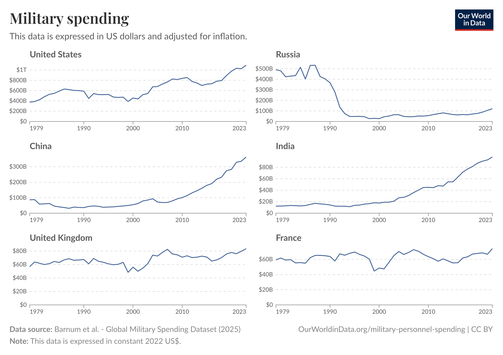

```{r setup, include=FALSE}
knitr::opts_chunk$set(
  out.width   = "100%",
  fig.align   = "center",
  fig.showtext = TRUE,
  echo        = TRUE,
  message     = FALSE,
  warning     = FALSE
)

library(tidyverse)
library(patchwork)

# light grey background used in the improved chart
bg_col <- "#F5F5F5"
```

## Introduction

This project reproduces and extends a chart on military spending from
*Our World in Data* (OWID). The original chart shows inflation–adjusted
military expenditure for six countries (United States, Russia, China,
India, United Kingdom, and France) from 1979 to 2023.

The goals of this project are:

- to **reproduce** the original visualization as closely as possible;
- to **critically assess** its design choices; and
- to **propose improved visualizations** that make the underlying
  patterns easier to interpret.

## Original chart

{.external width="100%"}

The original chart arranges the six countries in a 3x2 grid of small
multiples. Each panel shows military spending over time, adjusted for
inflation and expressed in US dollars. The design makes it relatively
easy to see trends within each country, but it is harder to directly
compare levels and growth rates across countries.

In the rest of the article I first reproduce this chart using the public
dataset provided by OWID, and then propose an alternative visualization
that makes cross–country comparisons more straightforward. Then, I propose two further possible alternatives.

## Data and preparation

```{r load-data}
ms <- readr::read_csv("military-spending-gmsd.csv",
                      show_col_types = FALSE)

glimpse(ms)
```

The dataset contains one row per country and year, with military spending
given in constant US dollars.

For this project I focus on the six countries that appear in the
original chart and convert spending to **billions of US dollars** to
match the scale in the figure.

```{r prepare-data}
countries_focus <- c(
  "United States", "Russia", "China",
  "India", "United Kingdom", "France"
)

ms_clean <- ms %>%
  filter(Entity %in% countries_focus) %>%
  mutate(
    country = factor(
      Entity,
      levels = c(
        "United States",
        "Russia",
        "China",
        "India",
        "United Kingdom",
        "France"
      )
    ),
    spending_billion = `Military expenditure (constant US$)` / 1e9
  )

# Helper for y-axis labels: 200 -> $200B, 1200 -> $1.2T
format_spend <- function(x) {
  ifelse(
    x >= 1000,
    paste0("$", x / 1000, "T"),
    paste0("$", x, "B")
  )
}
```

## Replicating the original small–multiples chart

In this section I recreate the original 3×2 grid of country panels.  
The goal is to match the Our World in Data chart as closely as possible,
using a helper function for a single country and then combining six
panels into a grid.

### Step 1: Define the helper function:

- `bg_rep`, the white background color used for all panels, and  
- `make_country_plot()`, a function that:
  - filters the data to one country,  
  - draws the time series of `spending_billion` over `Year`, and  
  - sets axes and theme to match the original chart.

```{r replication-setup}
# White background for the replicated chart
bg_rep <- "white"

# Helper function: create the panel for a single country
make_country_plot <- function(ctry) {
  ggplot(
    filter(ms_clean, country == ctry),
    aes(x = Year, y = spending_billion)
  ) +
    geom_line(color = "steelblue", linewidth = 0.8) +
    scale_x_continuous(
      breaks = c(1979, 1990, 2000, 2010, 2023),
      limits = c(1979, 2023),
      expand = expansion(mult = c(0, 0))
    ) +
    scale_y_continuous(
      limits = c(0, NA),
      labels = format_spend,
      expand = expansion(mult = c(0, 0.05))
    ) +
    labs(
      tag = ctry,
      x   = NULL,
      y   = NULL
    ) +
    theme_minimal(base_size = 12) +
    theme(
      panel.background   = element_rect(fill = bg_rep, colour = NA),
      plot.background    = element_rect(fill = bg_rep, colour = NA),
      panel.grid.major.x = element_blank(),
      panel.grid.minor.x = element_blank(),
      panel.grid.major.y = element_line(
        linetype = "dashed",
        colour   = "grey80"
      ),
      panel.grid.minor.y = element_blank(),
      axis.text.x        = element_text(colour = "grey30"),
      axis.text.y        = element_text(colour = "grey30"),
      # move country label up and slightly right
      plot.tag           = element_text(
        hjust   = 0,
        face    = "bold",
        size    = 12,
        family = "sans"
      ),
      plot.tag.position  = c(0.03, 1.10),
      plot.margin        = margin(t = 30, r = 5, b = 10, l = 45)
    )
}
```

### Step 2: Create one panel per country
Here I call `make_country_plot()` once for each country in the original
figure. This reuses exactly the same plotting logic six times, which
keeps the code short and ensures that all panels share identical scales
and styling.

```{r replication-single-panels}
p_us <- make_country_plot("United States")
p_ru <- make_country_plot("Russia")
p_cn <- make_country_plot("China")
p_in <- make_country_plot("India")
p_uk <- make_country_plot("United Kingdom")
p_fr <- make_country_plot("France")
```

### Step 3: Arrange panels in a 3×2 grid
In this chunk I combine the six panels into a 3×2 grid using the
`patchwork` operators:

- `|` puts two panels side by side (columns),  
- `/` stacks rows on top of each other.

The result is the same small–multiples layout as in the Our World in
Data chart.

```{r replication-grid, fig.width=10, fig.height=7}
p_countries <- (p_us | p_ru) /
  (p_cn | p_in) /
  (p_uk | p_fr)

p_countries
```

### Step 4: Add shared title and subtitle
Finally, I add a shared title and subtitle using `plot_annotation()`.
The additional `theme()` call customises the title and subtitle
appearance and makes sure the overall background is also white. The last
line prints `p_replication`, so the completed replication plot appears
in the knitted document.

```{r replication-final, fig.width=10, fig.height=7}
p_replication <- p_countries +
  plot_annotation(
    title    = "Military spending",
    subtitle = "This data is expressed in US dollars and adjusted for inflation."
  ) &
  theme(
    plot.background = element_rect(fill = bg_rep, colour = NA),
    plot.title = element_text(
      hjust  = 0,
      colour = "grey20",
      face   = "bold",
      size   = 20,
      family = "serif"
    ),
    plot.subtitle = element_text(
      hjust  = 0,
      colour = "grey40",
      size   = 12,
      family = "sans"
    )
  )

p_replication
```


## Improved visualization: all countries in one chart

The small–multiples design makes it easy to focus on one country at a
time, but it is harder to compare levels and growth rates across
countries. As an alternative, I plot all six countries in a single chart
and enrich the context with a few key historical events.

### Step 1: Palette and overall y-axis

In this first chunk I define:

- `okabe_ito`, a colourblind-friendly palette that assigns one colour to
  each country; and  
- `y_max`, the rounded maximum of `spending_billion`, used to set a
  common y-axis limit for all countries in the combined chart.

```{r improved-setup}
# Colorblind-friendly palette (Okabe–Ito)
okabe_ito <- c(
  "United States"   = "#E69F00",
  "Russia"          = "#56B4E9",
  "China"           = "#009E73",
  "India"           = "#CC79A7",
  "United Kingdom"  = "#0072B2",
  "France"          = "#D55E00"
)

# Maximum y value (rounded) for the plot
y_max <- ceiling(
  max(ms_clean$spending_billion, na.rm = TRUE) / 100
) * 100
```

### Step 2: Line-end labels

This chunk prepares the labels that appear at the **end of each line**:

- `labels_raw` keeps only the last year available for each country.  
- For countries with similar spending (France, UK, India, Russia),
  I slightly **stagger** the y-positions (`label_y`) using `min_small`
  and `step_small` so their labels do not overlap.  
- `label_text` shortens “United Kingdom” to “UK” to keep the label
  compact.

The resulting data frame `labels_df` is later used in `geom_text()` to
write country names directly next to the lines instead of using a legend.

```{r improved-labels}
labels_raw <- ms_clean %>%
  dplyr::group_by(country) %>%
  dplyr::filter(Year == max(Year)) %>%
  dplyr::ungroup()

small_countries <- c("France", "United Kingdom", "India", "Russia")

min_small <- min(
  labels_raw$spending_billion[labels_raw$country %in% small_countries]
) - 20
step_small <- 28

labels_df <- labels_raw %>%
  dplyr::mutate(
    label_text = dplyr::if_else(
      country == "United Kingdom",
      "UK",
      as.character(country)
    ),
    label_y = dplyr::case_when(
      country == "France"         ~ min_small + 0 * step_small,
      country == "United Kingdom" ~ min_small + 1 * step_small,
      country == "India"          ~ min_small + 2 * step_small,
      country == "Russia"         ~ min_small + 3 * step_small,
      TRUE                        ~ spending_billion
    )
  )
```

### Step 3: Annotating key historical events

Here I define `events_df`, a small tibble with:

- `year`: the x-position of the event (vertical dashed line), and  
- `label`: short descriptions that will be written near the top of the
  plot.

These events provide context and help explain some of the changes in
military spending over time.

```{r improved-events}
events_df <- tibble::tibble(
  year  = c(1990, 2001, 2017),
  label = c(
    "End of Cold War",
    "9/11 attacks",
    "Trump 1st presidency"
  )
)
```

### Step 4: Putting everything together in one chart

The final chunk builds the actual chart:

- `ggplot(ms_clean, aes(...)) + geom_line()` draws the six time series
  of spending in a single plot, coloured by country using `okabe_ito`.
- `geom_segment()` and the first `geom_text()` layer use `events_df` to
  draw vertical dashed lines and their textual labels for key events.
- The second `geom_text()` layer uses `labels_df` to place country
  labels at the end of each line, removing the need for a legend.
- `scale_x_continuous()` and `scale_y_continuous()` control the axes and
  use `format_spend` to format dollar amounts.
- `scale_colour_manual(values = okabe_ito)` enforces the chosen palette.
- The `labs()` and `theme()` calls set the title, subtitle and visual
  style, including a light grey background (`bg_col`) and centred,
  bold title.

```{r improved-all-countries, fig.width=10, fig.height=6, preview=TRUE}
y_lim <- y_max * 1.08

ggplot(
  ms_clean,
  aes(x = Year, y = spending_billion, colour = country)
) +
  geom_line(linewidth = 0.9) +
  geom_segment(
    data = events_df,
    aes(
      x = year, xend = year,
      y = 0,    yend = y_lim * 0.96
    ),
    inherit.aes = FALSE,
    linetype = "dashed",
    colour = "grey60"
  ) +
  geom_text(
    data = events_df,
    aes(
      x = year,
      y = y_lim * 0.985,
      label = label
    ),
    inherit.aes = FALSE,
    vjust = 0, 
    size = 3.4,
    family = "sans",
    fontface = "bold",
    colour = "grey40"
  ) +
  geom_text(
    data = labels_df,
    aes(
      x = Year,
      y = label_y,
      label = label_text
    ),
    hjust = 0,
    nudge_x = 0.5,
    size = 3.4,
    show.legend = FALSE
  ) +
  scale_x_continuous(
    breaks = c(1979, 1990, 2000, 2010, 2023),
    limits = c(1979, 2025),
    expand = expansion(mult = c(0, 0))
  ) +
  scale_y_continuous(
    limits = c(0, y_lim),
    breaks = seq(0, y_max, by = 200),
    labels = format_spend,
    expand = expansion(mult = c(0, 0.05))
  ) +
  scale_colour_manual(values = okabe_ito, name = NULL) +
  coord_cartesian(clip = "off") +
  labs(
    title = "Military spending",
    subtitle = paste(
      "Six countries, constant 2022 US dollars.",
      "Lines show annual military expenditure;",
      "vertical dashed lines mark key geopolitical events."
    ),
    x = NULL,
    y = NULL
  ) +
  theme_minimal(base_size = 12) +
  theme(
    panel.background   = element_rect(fill = bg_col, colour = NA),
    plot.background    = element_rect(fill = bg_col, colour = NA),
    panel.grid.major.x = element_blank(),
    panel.grid.minor.x = element_blank(),
    panel.grid.major.y = element_line(
      linetype = "dashed",
      colour  = "grey80"
    ),
    panel.grid.minor.y = element_blank(),
    axis.text          = element_text(colour = "grey30"),
    legend.position    = "none",
    plot.margin        = margin(t = 15, r = 60, b = 10, l = 10),
    plot.title = element_text(
      hjust  = 0,
      colour = "grey20",
      face   = "bold",
      size   = 18,
      family = "serif"
    ),
    plot.subtitle = element_text(
      hjust  = 0,
      colour = "grey40",
      size   = 11,
      family = "sans"
    )
  )
```

Because all countries share the same axes, it becomes easier to compare
both **absolute levels** and **trends** across the six countries than in
the original small-multiples design.

## Alternatives
The Graph still has weaknesses. Firstly, it gets difficult to read the development from Russia, India, UK and France. So an alternative to the absolut y-axis might make sense. Secondly, it fails to depict the relative development. Therefore, two alternatives are introduced.

### Alternative 1: Logarithmic y-axis

The absolute plot with all six countries in one panel makes it easy to
compare spending levels, but the United States dominates the scale.
Spending in China and India is much smaller in absolute terms, even
though their **growth rates** are very large.

A common way to emphasise *proportional* changes is to use a logarithmic
y-axis. On a log scale, equal vertical distances correspond to equal
percentage changes. This makes it easier to compare growth patterns
across countries, at the cost of making absolute differences in levels
less intuitive.

```{r log-scale-plot, fig.width=10, fig.height=6}
min_pos <- min(
  ms_clean$spending_billion[ms_clean$spending_billion > 0],
  na.rm = TRUE
)

y_lim_log <- y_max * 1.20

log_breaks <- c(10, 20, 50, 100, 200, 500, 1000)
log_breaks <- log_breaks[log_breaks >= min_pos & log_breaks <= y_lim_log]

ggplot(
  ms_clean,
  aes(x = Year, y = spending_billion, colour = country)
) +
  geom_line(linewidth = 0.9) +
  geom_segment(
    data = events_df,
    aes(
      x = year, xend = year,
      y = min_pos, yend = y_lim_log * 0.96
    ),
    inherit.aes = FALSE,
    linetype = "dashed",
    colour = "grey60"
  ) +
  geom_text(
    data = events_df,
    aes(
      x = year,
      y = y_lim_log * 0.985,
      label = label
    ),
    inherit.aes = FALSE,
    vjust = 0,
    size = 3.4,
    family = "sans",
    fontface = "bold",
    colour = "grey40"
  ) +
  geom_text(
    data = labels_df,
    aes(x = Year, y = label_y, label = label_text),
    hjust = 0,
    nudge_x = 0.5,
    size = 3.4,
    show.legend = FALSE
  ) +
  scale_x_continuous(
    breaks  = c(1979, 1990, 2000, 2010, 2023),
    limits  = c(1979, 2025),
    expand  = expansion(mult = c(0, 0))
  ) +
  scale_y_log10(
    limits = c(min_pos, y_lim_log),
    breaks = log_breaks,
    labels = format_spend,
    expand = expansion(mult = c(0, 0.05))
  ) +
  scale_colour_manual(values = okabe_ito, name = NULL) +
  coord_cartesian(clip = "off") +
  labs(
    title = "Military spending (log scale)",
    subtitle = paste(
      "Same axis scale for all six countries,",
      "logarithmic y-axis (constant 2022 US dollars)."
    ),
    x = NULL,
    y = NULL
  ) +
  theme_minimal(base_size = 12) +
  theme(
    panel.background   = element_rect(fill = bg_col, colour = NA),
    plot.background    = element_rect(fill = bg_col, colour = NA),
    panel.grid.major.x = element_blank(),
    panel.grid.minor.x = element_blank(),
    panel.grid.major.y = element_line(
      linetype = "dashed",
      colour  = "grey80"
    ),
    panel.grid.minor.y = element_blank(),
    axis.text          = element_text(colour = "grey30"),
    legend.position    = "none",
    plot.margin        = margin(t = 15, r = 60, b = 10, l = 10),
    plot.title = element_text(
      hjust  = 0,
      colour = "grey20",
      face   = "bold",
      size   = 18,
      family = "serif"
    ),
    plot.subtitle = element_text(
      hjust  = 0,
      colour = "grey40",
      size   = 11,
      family = "sans"
    )
  )
```

The log-scale version is less insightful because the non-linear y-axis is harder to interpret and visually compresses differences between countries. It highlights proportional growth, but the distorted axis can easily confuse readers who want to compare actual spending levels.

### Alternative 2: Relative change since 1979 (index plot)

Another way to emphasise relative change is to normalise each country’s
spending to a common starting value. Here I set spending in 1979 to
**100** for each country and plot an index over time. A value of 200
means that spending has doubled relative to 1979.

This design deliberately hides information about absolute levels and
focuses instead on the question: *who has grown the most since 1979?*
It highlights that countries like China and India have experienced
much faster proportional increases than more established military powers.

```{r index-1979-plot, fig.width=10, fig.height=6}
ms_index <- ms_clean %>%
  dplyr::filter(!is.na(spending_billion)) %>%
  dplyr::group_by(country) %>%
  dplyr::mutate(
    base_1979 = spending_billion[Year == 1979][1]
  ) %>%
  dplyr::filter(!is.na(base_1979) & base_1979 > 0) %>%
  dplyr::mutate(
    spending_index = spending_billion / base_1979 * 100
  ) %>%
  dplyr::ungroup() %>%
  dplyr::filter(!is.na(spending_index))

y_max_idx <- ceiling(
  max(ms_index$spending_index, na.rm = TRUE) / 50
) * 50

y_lim_idx <- y_max_idx * 1.08

labels_idx <- ms_index %>%
  dplyr::group_by(country) %>%
  dplyr::filter(Year == max(Year)) %>%
  dplyr::ungroup() %>%
  dplyr::mutate(
    label_text = dplyr::if_else(
      country == "United Kingdom",
      "UK",
      as.character(country)
    )
  )

events_idx <- tibble::tibble(
  year  = c(1990, 2001, 2017),
  label = c(
    "End of Cold War",
    "9/11 attacks",
    "Trump 1st presidency"
  )
)

ggplot(
  ms_index,
  aes(x = Year, y = spending_index, colour = country)
) +
  geom_line(linewidth = 0.9) +
  geom_segment(
    data = events_idx,
    aes(
      x = year, xend = year,
      y = 0,    yend = y_lim_idx * 0.96
    ),
    inherit.aes = FALSE,
    linetype = "dashed",
    colour = "grey60"
  ) +
  geom_text(
    data = events_idx,
    aes(
      x = year,
      y = y_lim_idx * 0.985,
      label = label
    ),
    inherit.aes = FALSE,
    vjust = 0,
    size = 3.4,
    family = "sans",
    fontface = "bold",
    colour = "grey40"
  ) +
  geom_text(
    data = labels_idx,
    aes(
      x = Year,
      y = spending_index,
      label = label_text
    ),
    hjust = 0,
    nudge_x = 0.5,
    size = 3.4,
    show.legend = FALSE
  ) +
  scale_x_continuous(
    breaks  = c(1979, 1990, 2000, 2010, 2023),
    limits  = c(1979, 2025),
    expand  = expansion(mult = c(0, 0))
  ) +
  scale_y_continuous(
    limits  = c(0, y_lim_idx),
    breaks  = seq(0, y_max_idx, by = 50),
    labels  = function(x) paste0(round(x), " (1979 = 100)"),
    expand  = expansion(mult = c(0, 0.05))
  ) +
  scale_colour_manual(values = okabe_ito, name = NULL) +
  coord_cartesian(clip = "off") +
  labs(
    title = "Military spending indexed to 1979 = 100",
    subtitle = paste(
      "Relative change in military spending.",
      "Each country starts at 100 in 1979."
    ),
    x = NULL,
    y = NULL
  ) +
  theme_minimal(base_size = 12) +
  theme(
    panel.background   = element_rect(fill = bg_col, colour = NA),
    plot.background    = element_rect(fill = bg_col, colour = NA),
    panel.grid.major.x = element_blank(),
    panel.grid.minor.x = element_blank(),
    panel.grid.major.y = element_line(
      linetype = "dashed",
      colour  = "grey80"
    ),
    panel.grid.minor.y = element_blank(),
    axis.text          = element_text(colour = "grey30"),
    legend.position    = "none",
    plot.margin        = margin(t = 15, r = 60, b = 10, l = 10),
    plot.title = element_text(
      hjust  = 0,
      colour = "grey20",
      face   = "bold",
      size   = 18,
      family = "serif"
    ),
    plot.subtitle = element_text(
      hjust  = 0,
      colour = "grey40",
      size   = 11,
      family = "sans"
    )
  )
```

The indexed chart clearly shows relative growth, but it hides all information about the actual size of military budgets. This makes it good for ranking growth rates, but less suitable than the main improved chart if we care about both growth **and** the absolute scale of spending.

## Conclusions and further work

Replicating the original chart shows that small multiples work well for seeing each country separately, but make cross-country comparisons harder. The improved combined chart, with a shared scale, line-end labels and event annotations, makes it much easier to compare both levels and trends across all six countries at once.

The log-scale and indexed alternatives are useful for exploring specific questions about proportional growth, but their axes are less intuitive and hide absolute spending levels, so they work better as complementary views than as the main figure. As next steps, one could normalise spending by GDP or population, add more countries or alliances, or build an interactive version that lets readers switch between these different perspectives.
