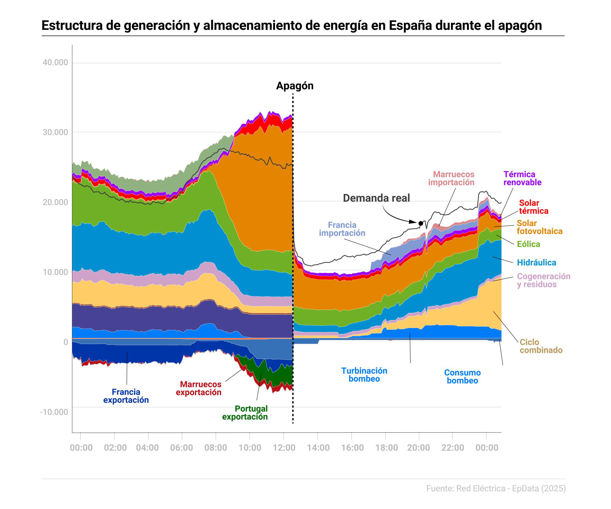
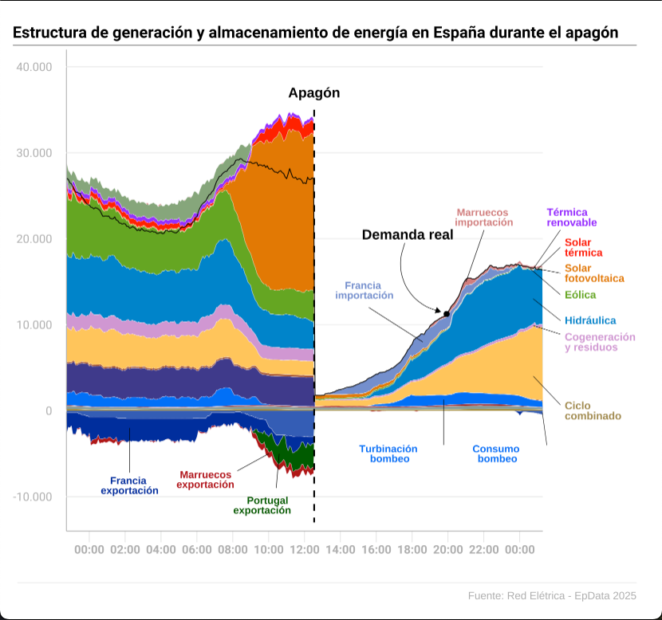

```{r setup, include = FALSE}
knitr::opts_chunk$set(out.width="100%", fig.align="center", fig.showtext=TRUE)
```

## Introduction

Beginning on April 28th, 2025 at 12:33 CEST (local time), Spain, parts of Portugal, and parts of France suffered complete shutdown of the electricity grid which lasted nearly ten hours. Trains ceased to run, radio and cellular signals shut down, shops returned to a cash-based system, and Spain's nuclear power plants were taken off the grid automatically. The BBC estimates that the blackout caused a €1.6 billion hit to the Spanish economy.

Hours after the collapse, constituents demanded answers and looked to Spain's sole Transmission System Operator (TSO), Red Eléctrica. The company is responsible for transmitting, organizing, and securing electrical supply to all of Spain's mainland and islands. In the days following April 28th, there was a frenzy of press conferences, news announcements, and statements from Red Eléctrica to answer the question: how did this happen?

Red Eléctrica has [publicly available generation data](https://demanda.ree.es/visiona/peninsula/nacionalau/acumulada/2025-04-28) that tracks types of generation and storage. The Europa Press quickly used this data [to create graphics](https://www.europapress.es/economia/noticia-graficos-asi-desplomo-energia-electrica-apagon-20250429111043.html#google_vignette) hoping to provide context for the blackout. On April 29th, they published an area graph of generation and storage of energy in Spain during the blackout.

### Original Graph

{.external width="100%"}

There are some obvious issues with this graph: it's density of information makes it difficult to read and comprehend. The graph tracks 15 types of energy and storage along with real time demand over time. There is also a line marking the moment of the blackout. The overwhelming amount of information makes it difficult to understand at a glance.

However, there are larger issues when the graph is studied in more detail. As seen later on, the data is manipulated (without disclosure). The lines pointing to "Turbinación bombeo" and "Consumo bombeo" do not align with their labels. There are a number of areas without labels, such as the light green part in the upper left hand corner. All of these leave much room for improvement, which will be seen after the initial recreation.

### Libraries

`Tidyverse` cleaned and modified the data.

`Lubridate` handled the x axis which was date-time. This is a subset of tidyverse.

`GGplot2` provided the graphics. This is a subset of tidyverse.

`Scales` allows some styling of the scales.

`Patchwork` is relevant for the improvement, as it allows graphs to be plotted side-by-side.

`Grid` plots custom annotations outside the plot area.

```{r libraries}
library(tidyverse)
library(scales)
library(patchwork)
library(grid)
```

### Data

#### Data Access

As mentioned before, Red Eléctrica [offers access](https://demanda.ree.es/visiona/peninsula/nacionalau/acumulada/2025-04-28) to their historical generation and storage data as convenient .csv files. While most of the data is contained in "Estructura de generación", "Estructura de almacenamiento" provides turbinación bombeo, consumo bombeo, entrega de baterías, and carga de baterías. "Seguimiento de la demanda de energía eléctria" provides the data for the "real demand" line.

```{r datasets}
generacion <- read.csv(file = "data/Custom-Report-2025-04-28-Estructura de generación (MW).csv")
almacenamiento <- read.csv(file = "data/Custom-Report-2025-04-28-Estructura de almacenamiento (MW).csv")
demanda <- read.csv(file = "data/Custom-Report-2025-04-28-Seguimiento de la demanda de energía eléctrica (MW).csv")
```

#### Issues with the Data Used in the Graph

When looking at the original graph and the replicated graph, it is clear the data is not the same. Pay attention to the information after the "Apagón" line.

| Original Graph | Replicated Graph |
|------------------------------------|------------------------------------|
| {.external alt="Original chart. Source: https://www.europapress.es/economia/noticia-graficos-asi-desplomo-energia-electrica-apagon-20250429111043.html" width="100%"} | {.external alt="Replicated chart." width="100%"} |

When comparing both graphs, the lefthand side of the graph - the data before the blackout - is nearly identical between the two graphs. The righthand side of the graph - after the blackout - is starkly different between the original and replicated graphs.

The prevailing theory is that the data was manipulated in the original graph in order to better distinguish the labels. In the replicated graph, some areas are too small to properly label.

However, the original graph makes no indication of this change in the graph or in the accompanying webpage. It also lists the x axis as the same time frames, and the y axis as the same scales. Since replicating the modification would be a game of trial and error - not to mention unethical - it was excluded from the replication. The replicated graph uses the original, unedited data gathered from Red Eléctrica.

#### Data Cleanup

The original graph uses a subset of variables from the generation and demand data sets. These datasets were combined into one using "Hora" or hour.

```{r remove_columns}
# --------
# Remove Unnecessary Columns
# --------

generacion <- generacion |>
  select(
    Hora,
    Marruecos.importación,
    Portugal.importación,
    Francia.importación,
    Térmica.renovable,
    Solar.térmica,
    Solar.fotovoltaica,
    Eólica,
    Cogeneración.y.residuos,
    Turbina.de.gas,
    Motores.diésel,
    Turbina.de.vapor,
    Ciclo.combinado,
    Carbón,
    Nuclear,
    Hidráulica,
    Francia.exportación,
    Marruecos.exportación,
    Portugal.exportación,
    Andorra.exportación)
demanda <- demanda |>
  select(Hora, Real)

# --------
# Combining Data
# --------

full_data <- generacion |>
  full_join(almacenamiento, by = "Hora")

# --------
# Pivot Longer
# --------

full_data <- full_data |>
  pivot_longer(
    cols = c(
      Marruecos.importación,
      Portugal.importación,
      Francia.importación,
      Térmica.renovable,
      Solar.térmica,
      Solar.fotovoltaica,
      Eólica,
      Cogeneración.y.residuos,
      Turbina.de.gas,
      Motores.diésel,
      Turbina.de.vapor,
      Ciclo.combinado,
      Carbón,
      Nuclear,
      Turbinación.bombeo,
      Entrega.de.baterías,
      Hidráulica,
      Carga.de.baterías,
      Consumo.bombeo,
      Francia.exportación,
      Marruecos.exportación,
      Portugal.exportación,
      Andorra.exportación),
    names_to = "Type",
    values_to = "Rating")

# --------
# Filter Data
# --------

full_data <- full_data |>
  filter(Hora >= as.POSIXct("2025-04-27 22:45", tz = "Europe/Madrid") &
           Hora <= as.POSIXct("2025-04-29 01:15", tz = "Europe/Madrid"))

demanda <- demanda |>
  filter(Hora >= as.POSIXct("2025-04-27 22:45", tz = "Europe/Madrid") &
           Hora <= as.POSIXct("2025-04-29 01:15", tz = "Europe/Madrid"))
```

The variable "Type" was set as a factor to properly order the areas as they appear in the graph. "Rating" was ensured to be numeric for the y graph, and "Hora" was set to a date-time variable with as.POSIXct().

```{r data_refinement}
# --------
# Set Type as Factor
# --------

full_data$Type <- factor(full_data$Type, ordered = FALSE)
full_data <- full_data |>
  mutate(
    Type = fct_relevel(Type,
                       "Marruecos.importación",
                       "Portugal.importación",
                       "Francia.importación",
                       "Térmica.renovable",
                       "Solar.térmica",
                       "Solar.fotovoltaica",
                       "Eólica",
                       "Hidráulica",
                       "Cogeneración.y.residuos",
                       "Ciclo.combinado",
                       "Carbón",
                       "Nuclear",
                       "Turbinación.bombeo",
                       "Turbina.de.gas",
                       "Motores.diésel",
                       "Turbina.de.vapor",
                       "Entrega.de.baterías",
                       "Carga.de.baterías",
                       "Andorra.exportación",
                       "Marruecos.exportación",
                       "Portugal.exportación",
                       "Francia.exportación",
                       "Consumo.bombeo"
    )
  )

# --------
# Set Rating as Numeric
# --------

full_data$Rating <- as.numeric(full_data$Rating)

# --------
# Set Real as Numeric
# --------

demanda$Real <- as.numeric(demanda$Real)

# --------
# Set Hora as Date
# --------

full_data <- full_data |>
  mutate(
    Hora = as.POSIXct(Hora, format = "%Y-%m-%d %H:%M", tz = "Europe/Madrid")
  )
demanda <- demanda |>
  mutate(
    Hora = as.POSIXct(Hora, format = "%Y-%m-%d %H:%M", tz = "Europe/Madrid")
  )
```

In the end, "full_data" represents the energy production and storage. It consists of three variables:

`Hora` \<- The date and time of the reading

`Type` \<- The type of energy being generated.

`Rating` \<- The rating of the type of energy.

```{r show_full_data}
head(full_data)
```

"Demanda" has the date and time of the energy demand, and the variable "real" represents the real demand for energy in megawatts.

```{r show_demanda}
head(demanda)
```

## Creating the Plot

### Fonts

The original fonts in the graph were Avenir Next. However, due to licensing and copyright, it was replaced with Roboto from Google fonts which has open licensing.

```{r fonts}
sysfonts::font_add_google("Roboto", family="roboto")
showtext::showtext_auto()
```

### Geom Area

GGplot was used to set the x axis as time, the y axis as Rating (in Megawatts), and fill to Type. The lines were colored to white to match the original graph.

```{r basic_plot, fig.width = 6.82, fig.height = 6.37}
final <- ggplot() +
  # area lines
  geom_area(
    data = full_data,
    aes(
      x = Hora,
      y = Rating,
      fill = Type),
    color = "white", # line color
    lwd = 0.1) # line width
final
```

### Scales & Colors

Colors were manually set using scale_fill_manual.

The legend and labels for both scales were removed.

The limits for the y scale were set to -10,000 and 40,000 to match the graph. The separator for thousands, ",", was changed to "." to match the graph.

The x scale limits were set in date and time format. The division was also set to 2 hours to have the correct number of breaks. Finally, the formatting was set to only show the time.

```{r scaling, fig.width = 6.82, fig.height = 6.37}
final <- final +
  # colors
  scale_fill_manual(values = c(
    Marruecos.importación = "#d68888",
    Portugal.importación = "#91b086",
    Francia.importación =  "#809ad3",
    Térmica.renovable = "#9e00ff",
    Solar.térmica = "#ff0400",
    Solar.fotovoltaica = "#e58401",
    Eólica = "#70b026",
    Cogeneración.y.residuos = "#d6a1d7",
    Turbina.de.gas = "#ab2822",
    Motores.diésel = "#92a59f",
    Turbina.de.vapor = "#aa8f2e",
    Ciclo.combinado = "#ffcc66",
    Carbón = "#ad5a32",
    Nuclear = "#474296",
    Turbinación.bombeo = "#007cf8",
    Entrega.de.baterías = "#2a6495",
    Hidráulica = "#018fd1",
    Carga.de.baterías = "#a3c0d8",
    Consumo.bombeo = "#3b68bd",
    Francia.exportación = "#0035a7",
    Marruecos.exportación = "#b91017",
    Portugal.exportación = "#006600",
    Andorra.exportación = "#211e83")
  ) +
  # unhides annotations outside graph
  coord_cartesian(clip = "off") +
  # remove legend
  guides(fill = "none") +
  # remove labels for scales
  labs(x = NULL,
       y = NULL) +
  # adds . to y scale
  scale_y_continuous(
    labels = label_number(big.mark = ".", decimal.mark = ","),
    breaks = c(-10000, 0, 10000, 20000, 30000, 40000),
    expand = expansion(mult = c(0.02, 0.10))
  ) +
  # sets x scale
  scale_x_datetime(
    timezone = "Europe/Madrid",
    breaks = seq(
      from = as.POSIXct("2025-04-28 00:00", tz = "Europe/Madrid"),
      to   = as.POSIXct("2025-04-29 00:00", tz = "Europe/Madrid"),
      by   = "2 hours"
    ),
    labels = function(x) format(x, "%H:%M"),
    expand = c(0,0)
  )
final
```

### Theme

The theme removed the plot's grid lines, changed the color of the axis, modified the tick length and color, and set a global default for the fonts. It also modified the padding in order to add space for the external annotations.

```{r basic_theming, fig.width = 6.82, fig.height = 6.37}
final <- final +
  theme(
    # removes background grey
    panel.background =
      element_rect(fill = "white"),
    # changes line color
    panel.grid.major.y =
      element_line(color = "#d6d6d6", linewidth = 0.2),
    # remove axis tick y
    axis.ticks.y =
      element_line(color = "#ffffff"),
    # changes axis tick color
    axis.ticks.x =
      element_line(color = "#b8b8b8", linewidth = 0.1),
    # changes axis length
    axis.ticks.length =
      unit(.3, "cm"),
    # changes axis line
    axis.line =
      element_line(color = "#b8b8b8", linewidth = 0.3),
    # remove x grid
    panel.grid.major.x =
      element_line(color = "#ffffff00"),
    # set global font family
    text =
      element_text(family = "roboto"),
    # set title size and weight
    plot.title =
      element_text(size = 12,
                   face = "bold",
                   hjust = -0.2),
    plot.title.position = "plot",
    # set x and y axis color
    axis.text =
      element_text(color = "#b8b8b8"),
    axis.text.x =
      element_text(face = "bold"),
    # set caption color
    plot.caption =
      element_text(color = "#b8b8b8"),
    # padding of plot
    plot.margin = margin(20, # top
                         90, # right
                         45, # bottom
                         0 # left
                         )
    )
final
```

### Internal Annotations

Internal annotations refers to those that were plotted within the graph space. Each internal text annotation was given an x and y coordinate, a text color, a size, and a label. Each internal line annotation was given an x and y coordinate, an ending x and y coordinate, a line color of black, and a line width of 0.2.

```{r internal_annotations, fig.width = 6.82, fig.height = 6.37}
final <- final +
  # annotations
  # demanda real line
  geom_line(
    data = demanda,
    aes(x = Hora, y = Real),
    color = "black",
    linewidth = 0.3) +
  # title
  ggtitle("Estructura de generación y almacenamiento de energía en España durante el apagón") +
  # apagón
  geom_segment(
    aes(
      x = as.POSIXct("2025-04-28 12:32", tz = "Europe/Madrid"),
      xend = as.POSIXct("2025-04-28 12:32", tz = "Europe/Madrid"),
      y = 35000,
      yend = -13000),
    linetype = "dashed",
    linewidth = 0.6
  ) +
  annotate(
    "text",
    x = as.POSIXct("2025-04-28 12:32", tz = "Europe/Madrid"),
    y = 37000,
    label = "Apagón",
    color = "black",
    size = 3.7,
    fontface = "bold"
  ) +
  # demanda real
  annotate(
    "text",
    x = as.POSIXct("2025-04-28 17:45", tz = "Europe/Madrid"),
    y = 20500,
    label = "Demanda real",
    color = "black",
    size = 3.7,
    fontface = "bold"
  ) +
  annotate(
    geom = "curve",
    x = as.POSIXct("2025-04-28 17:35", tz = "Europe/Madrid"),
    xend = as.POSIXct("2025-04-28 19:35", tz = "Europe/Madrid"),
    y = 19500,
    yend = 11500,
    color = "black",
    arrow = arrow(length = unit(0.15, "cm"), type="closed"),
    linewidth = 0.2
  ) +
  annotate(
    geom = "point",
    x = as.POSIXct("2025-04-28 19:55", tz = "Europe/Madrid"),
    y = 11250,
    color = "black",
    size = 1.5
  ) +
  # francia importacion
  annotate(
    "text",
    x = as.POSIXct("2025-04-28 15:20", tz = "Europe/Madrid"),
    y = 14000,
    label = "Francia \nimportación",
    color = "#809ad3",
    size = 2.7,
    fontface = "bold",
    hjust = 0.5,
    lineheight = 0.8
  ) +
  annotate(
    "segment",
    x = as.POSIXct("2025-04-28 15:35", tz = "Europe/Madrid"),
    xend = as.POSIXct("2025-04-28 18:35", tz = "Europe/Madrid"),
    y = 12000,
    yend = 8000,
    color = "black",
    linewidth = 0.2
  ) +
  # Marruecos importación
  annotate(
    "text",
    x = as.POSIXct("2025-04-28 22:00", tz = "Europe/Madrid"),
    y = 22500,
    label = "Marruecos \nimportación",
    color = "#d68888",
    size = 2.7,
    fontface = "bold",
    hjust = 0.5,
    lineheight = 0.8
  ) +
  annotate(
    "segment",
    x = as.POSIXct("2025-04-28 22:00", tz = "Europe/Madrid"),
    xend = as.POSIXct("2025-04-28 21:00", tz = "Europe/Madrid"),
    y = 21000,
    yend = 15000,
    color = "black",
    linewidth = 0.2
  ) +
  # francia exportacion
  annotate(
    "text",
    x = as.POSIXct("2025-04-28 02:15", tz = "Europe/Madrid"),
    y = -8700,
    label = "Francia \nexportación",
    color = "#0035a7",
    size = 2.7,
    fontface = "bold",
    hjust = 0.5,
    lineheight = 0.8
  ) +
  annotate(
    "segment",
    x = as.POSIXct("2025-04-28 02:15", tz = "Europe/Madrid"),
    xend = as.POSIXct("2025-04-28 02:15", tz = "Europe/Madrid"),
    y = -2000,
    yend = -7200,
    color = "black",
    linewidth = 0.2
  ) +
  # marruecos exportacion
  annotate(
    "text",
    x = as.POSIXct("2025-04-28 08:05", tz = "Europe/Madrid"),
    y = -8000,
    label = "Marruecos \nexportación",
    color = "#b91017",
    size = 2.7,
    fontface = "bold",
    hjust = 1,
    lineheight = 0.8
  ) +
  annotate(
    "segment",
    x = as.POSIXct("2025-04-28 08:15", tz = "Europe/Madrid"),
    xend = as.POSIXct("2025-04-28 10:00", tz = "Europe/Madrid"),
    y = -7000,
    yend = -5000,
    color = "black",
    linewidth = 0.2
  ) +
  # portugal exportacion
  annotate(
    "text",
    x = as.POSIXct("2025-04-28 11:15", tz = "Europe/Madrid"),
    y = -11000,
    label = "Portugal \nexportación",
    color = "#006600",
    size = 2.7,
    fontface = "bold",
    hjust = 1,
    lineheight = 0.8
  ) +
  annotate(
    "segment",
    x = as.POSIXct("2025-04-28 10:25", tz = "Europe/Madrid"),
    xend = as.POSIXct("2025-04-28 10:35", tz = "Europe/Madrid"),
    y = -9000,
    yend = -5000,
    color = "black",
    linewidth = 0.2
  ) +
  # turbinacion bombeo
  annotate(
    "text",
    x = as.POSIXct("2025-04-28 16:45", tz = "Europe/Madrid"),
    y = -5000,
    label = "Turbinación \nbombeo",
    color = "#007cf8",
    size = 2.7,
    fontface = "bold",
    hjust = 0.5,
    lineheight = 0.8
  ) +
  annotate(
    "segment",
    x = as.POSIXct("2025-04-28 19:45", tz = "Europe/Madrid"),
    xend = as.POSIXct("2025-04-28 19:45", tz = "Europe/Madrid"),
    y = -4000,
    yend = 1300,
    color = "black",
    linewidth = 0.2
  ) +
  # Consumo bombeo
  annotate(
    "text",
    x = as.POSIXct("2025-04-28 22:45", tz = "Europe/Madrid"),
    y = -5000,
    label = "Consumo \nbombeo",
    color = "#007cf8",
    size = 2.7,
    fontface = "bold",
    hjust = 0.5,
    lineheight = 0.8
  )
final
```

### External Annotations

The most difficult part of this graph were annotations set outside the plot of the graph. Four functions were attempted: `annotate()`, `annotation_custom()`, `grid.text()` and `geom_text()`.

#### Attempt 1: Annotate()

`Annotate()` worked well for annotations within the plot. However, it did not appear when the x and y values of the annotation were pushed beyond the limits of the plot.

#### Attempt 2: Annotate_custom()

`Annotation_custom()` required the use of `unit(value, NPC)` as the x and y coordinate values. This meant that the text would respond to the preview panel size and not stay fixed to the graph. Below is an example of annotations fixing to the panel size and not the graph.

{.external width="100%"}

`Annotation_custom()` was also struggling to work with `coord_cartesian(clip = "off")` meaning the annotations would not appear even when clipping was off.

#### Attempt 3: Grid.text()

`Grid.text()` was working with `coord_cartesian(clip = "off")`, however it still required the use of `unit(value, NPC)`, meaning it would respond with the browser size.

#### Attempt 4: Geom_text() and Geom_segment()

Finally, `geom_text()` and `geom_segment()` were used to add lines and words outside of the plot. While this resulted in a file of 5.2 MB, it allowed the graph to annotations needed outside of the plot while maintaining the as.POSIXct x scale units.

Each external text annotation was given an x and y coordinate, a text color, a size, label, font family, line height, and horizontal adjustment (to ensure proper alignment - left, right, or center). While line height, size, and font family could've been combined into a global class, preliminary investigations did not yield a straightforward way to do this.

Each external line annotation had an x and y coordinate, an ending x and y coordinate, and a line width. Again, line width could have been combined into a global class, but preliminary investigations proved unfruitful.

Finally, the title was treated with `ggtitle()` instead of `geom_text()`. Initially, `geom_text()` was struggling to push the title so far out of the y axis, and `ggtitle()` was working better.

```{r external_annotations, fig.width = 6.82, fig.height = 6.37}
final <- final +
  # termica renovable text
  annotation_custom(
    grob = textGrob(
      "Térmica \nrenovable",
      hjust = 0,
      gp = gpar(
        col = "#9e00ff",
        fontsize = 8,
        family = "roboto",
        fontface = "bold",
        lineheight = 0.8)),
    xmin = as.POSIXct("2025-04-29 01:30", tz = "Europe/Madrid"),
    xmax = as.POSIXct("2025-04-29 01:30", tz = "Europe/Madrid"),
    ymin = 22500,
    ymax = 22500
  ) +
  # solar termica text
  annotation_custom(
    grob = textGrob(
      "Solar \ntérmica",
      hjust = 0,
      gp = gpar(
        col = "#ff0400",
        fontsize = 8,
        family = "roboto",
        fontface = "bold",
        lineheight = 0.8)),
    xmin = as.POSIXct("2025-04-29 02:30", tz = "Europe/Madrid"),
    xmax = as.POSIXct("2025-04-29 02:30", tz = "Europe/Madrid"),
    ymin = 19000,
    ymax = 19000
  ) +
  # solar fotovoltaica text
  annotation_custom(
    grob = textGrob(
      "Solar \nfotovoltaica",
      hjust = 0,
      gp = gpar(
        col = "#e58401",
        fontsize = 8,
        family = "roboto",
        fontface = "bold",
        lineheight = 0.8)),
    xmin = as.POSIXct("2025-04-29 02:30", tz = "Europe/Madrid"),
    xmax = as.POSIXct("2025-04-29 02:30", tz = "Europe/Madrid"),
    ymin = 16000,
    ymax = 16000
  ) +
  # eólica text
  annotation_custom(
    grob = textGrob(
      "Eólica",
      hjust = 0,
      gp = gpar(
        col = "#70b026",
        fontsize = 8,
        family = "roboto",
        fontface = "bold",
        lineheight = 0.8)),
    xmin = as.POSIXct("2025-04-29 02:30", tz = "Europe/Madrid"),
    xmax = as.POSIXct("2025-04-29 02:30", tz = "Europe/Madrid"),
    ymin = 13500,
    ymax = 13500
  ) +
  # hidráulica text
  annotation_custom(
    grob = textGrob(
      "Hidráulica",
      hjust = 0,
      gp = gpar(
        col = "#018fd1",
        fontsize = 8,
        family = "roboto",
        fontface = "bold",
        lineheight = 0.8)),
    xmin = as.POSIXct("2025-04-29 02:30", tz = "Europe/Madrid"),
    xmax = as.POSIXct("2025-04-29 02:30", tz = "Europe/Madrid"),
    ymin = 10500,
    ymax = 10500
  ) +
  # cogeneracion y residuos text
  annotation_custom(
    grob = textGrob(
      "Cogeneración \ny residuos",
      hjust = 0,
      gp = gpar(
      col = "#d6a1d7",
      fontsize = 8,
      family = "roboto",
      fontface = "bold",
      lineheight = 0.8)),
    xmin = as.POSIXct("2025-04-29 02:30", tz = "Europe/Madrid"),
    xmax = as.POSIXct("2025-04-29 02:30", tz = "Europe/Madrid"),
    ymin = 8000,
    ymax = 8000
  ) +
  # Ciclo combinado text
  annotation_custom(
    grob = textGrob(
      "Ciclo \ncombinado",
      hjust = 0,
      gp = gpar(
        col = "#ab9559",
        fontsize = 8,
        family = "roboto",
        fontface = "bold",
        lineheight = 0.8)),
    xmin = as.POSIXct("2025-04-29 02:30", tz = "Europe/Madrid"),
    xmax = as.POSIXct("2025-04-29 02:30", tz = "Europe/Madrid"),
    ymin = 0,
    ymax = 0
  ) +
  # caption text
  annotation_custom(
    grob = textGrob(
      "Fuente: Red Elétrica - EpData 2025",
      hjust = 1,
      gp = gpar(
        col = "#b8b8b8",
        fontsize = 8,
        family = "roboto",
        lineheight = 0.8)),
    xmin = as.POSIXct("2025-04-29 06:30", tz = "Europe/Madrid"),
    xmax = as.POSIXct("2025-04-29 06:30", tz = "Europe/Madrid"),
    ymin = -21500,
    ymax = -21500
  ) +
  # caption line
  annotation_custom(
    grob = linesGrob(
      x = unit(c(0,1), "npc"),
      y = unit(c(0.5,0.5), "npc"),
      gp = gpar(col = "#e2e2e2", lwd = 0.5)
    ),
    xmin = as.POSIXct("2025-04-27 20:00", tz = "Europe/Madrid"),
    xmax = as.POSIXct("2025-04-29 06:30", tz = "Europe/Madrid"),
    ymin = -20000,
    ymax = -20000
  ) +
  # title line
  annotation_custom(
    grob = linesGrob(
      x = unit(c(0,1), "npc"),
      y = unit(c(0.5,0.5), "npc"),
      gp = gpar(col = "#000000", lwd = 0.5)
    ),
    xmin = as.POSIXct("2025-04-27 19:45", tz = "Europe/Madrid"),
    xmax = as.POSIXct("2025-04-29 06:30", tz = "Europe/Madrid"),
    ymin = 42500,
    ymax = 42500
  ) +
  # consumo bombeo line
  annotation_custom(
    grob = linesGrob(
      x = unit(c(1,0), "npc"),
      y = unit(c(0,1), "npc"),
      gp = gpar(col = "#000000", lwd = 0.5)
    ),
    xmin = as.POSIXct("2025-04-29 01:15", tz = "Europe/Madrid"),
    xmax = as.POSIXct("2025-04-29 01:30", tz = "Europe/Madrid"),
    ymin = -4000,
    ymax = -200
  ) +
  # ciclo combinado line
  annotation_custom(
    grob = linesGrob(
      x = unit(c(1,0), "npc"),
      y = unit(c(0,1), "npc"),
      gp = gpar(col = "#000000", lwd = 0.5)
    ),
    xmin = as.POSIXct("2025-04-29 00:45", tz = "Europe/Madrid"),
    xmax = as.POSIXct("2025-04-29 02:15", tz = "Europe/Madrid"),
    ymin = 4000,
    ymax = 700
  ) +
  # cogeneracion y residuos line
  annotation_custom(
    grob = linesGrob(
      x = unit(c(1,0), "npc"),
      y = unit(c(0,1), "npc"),
      gp = gpar(col = "#000000", lwd = 0.5)
    ),
    xmin = as.POSIXct("2025-04-29 00:45", tz = "Europe/Madrid"),
    xmax = as.POSIXct("2025-04-29 02:15", tz = "Europe/Madrid"),
    ymin = 9900,
    ymax = 8900
  ) +
  # hidraulica line
  annotation_custom(
    grob = linesGrob(
      x = unit(c(1,0), "npc"),
      y = unit(c(0,1), "npc"),
      gp = gpar(col = "#000000", lwd = 0.5)
    ),
    xmin = as.POSIXct("2025-04-29 00:45", tz = "Europe/Madrid"),
    xmax = as.POSIXct("2025-04-29 02:15", tz = "Europe/Madrid"),
    ymin = 13000,
    ymax = 10500
  ) +
  # eolica line
  annotation_custom(
    grob = linesGrob(
      x = unit(c(1,0), "npc"),
      y = unit(c(0,1), "npc"),
      gp = gpar(col = "#000000", lwd = 0.5)
    ),
    xmin = as.POSIXct("2025-04-29 00:35", tz = "Europe/Madrid"),
    xmax = as.POSIXct("2025-04-29 02:15", tz = "Europe/Madrid"),
    ymin = 16500,
    ymax = 13500
  ) +
  # solar fotovoltaica line
  annotation_custom(
    grob = linesGrob(
      x = unit(c(1,0), "npc"),
      y = unit(c(0,1), "npc"),
      gp = gpar(col = "#000000", lwd = 0.5)
    ),
    xmin = as.POSIXct("2025-04-29 01:00", tz = "Europe/Madrid"),
    xmax = as.POSIXct("2025-04-29 02:15", tz = "Europe/Madrid"),
    ymin = 16500,
    ymax = 16000
  ) +
  # solar termica line
  annotation_custom(
    grob = linesGrob(
      x = unit(c(1,0), "npc"),
      y = unit(c(1,0), "npc"),
      gp = gpar(col = "#000000", lwd = 0.5)
    ),
    xmin = as.POSIXct("2025-04-29 01:00", tz = "Europe/Madrid"),
    xmax = as.POSIXct("2025-04-29 02:15", tz = "Europe/Madrid"),
    ymin = 16500,
    ymax = 19000
  ) +
  # solar termica renovable
  annotation_custom(
    grob = linesGrob(
      x = unit(c(1,0), "npc"),
      y = unit(c(1,0), "npc"),
      gp = gpar(col = "#000000", lwd = 0.5)
    ),
    xmin = as.POSIXct("2025-04-29 00:45", tz = "Europe/Madrid"),
    xmax = as.POSIXct("2025-04-29 02:15", tz = "Europe/Madrid"),
    ymin = 16500,
    ymax = 21000
  )
final
```

## Improvement

### Visual Critique of Existing Graph

The original graph utilizes an area graph, which represents a total area over time, subdivided into smaller areas and distinguished by colors. While this was the correct choice for the data, there are too many types of energy represented in the graph for the distinctions to be meaningful. Some areas are so small that they are seemingly invisible.

The other issues with this graph - misplaced annotations and missing annotations - are addressed in the improvement.

### Audience Analysis

[Europa Press](https://www.europapress.es/economia/noticia-graficos-asi-desplomo-energia-electrica-apagon-20250429111043.html#google_vignette), a Spanish news source, published the original graph. Based on Europa Press' audience, it is assumed this graph was intended for a general audience who would have limited understanding of energy production and storage. The main goal is to understand what types of energy were being produced at the time of and shortly after the blackout.

*Note: While usually the graph would be replicated and improved in Spanish to match the source, since this is an English-speaking masters program, the graph improvement was completed in English.*

### Variable Analysis

The original graph replication was completed without detailed analysis of the variables. In order to improve the graph, the variables of the original data sets were analyzed to determine if any excluded would be relevant, and to determine how to better categorize the data.

#### Demanda

`Real` \<- Real represents the actual demand for energy from Spanish households, businesses, municipal buildings, hospitals, and other constituents. This is measured using meters and sensors.

`Prevista` \<- Prevista is the forecasted demand set by Red Eléctrica. This is predicted based on historical patterns, weather, and yesterday’s demand.

`Programada` \<- Programada represents the planned demand in the market. This is the energy that has been planned and agreed upon by energy providers. It determines which plants will run and provide energy.

#### Almacenamiento

`Consumo.bombeo` \<- Pumped-hydro storage is a system with water stored at two heights. When there is extra energy in the grid from other sources, the system spends that energy pushing water from the lower reservoir to the higher reservoir so it can be released at a future time. This is called pumping consumption (Consumo bombeo). The data recorded in this variable tracks the amount spent in this process. That is why it is always zero or negative, since it is taking energy from the grid.

`Turbinación.bombeo` \<- Pumped-hydro storage is a system with water stored at two heights. When energy needs to be generated, the system pushes water from the higher reservoir to the lower reservoir. This is called pumped-hydro generation (turbinación bombeo). Pumped-hydro storage has ways of monitoring demand and releases stored energy into the system when needed. This variable tracks the amount of energy being produced by pumped-hydro. That is why it is positive or zero.

`Carga.de.baterías` \<- Battery energy storage systems (BESS) are similar to pumped-hydro storage. In this case, excess energy from the grid is being stored in batteries. This variable tracks the amount of energy being take from the grid and stored in batteries (meaning it is negative or zero).

`Entrega.de.baterías` \<- Battery discharge (entrega de baterías) means energy is being delivered to the system from storage. Both battery discharge and battery charging values are extremely low (-5 to 10), which means they will not be well represented in a plot with the other variables.

#### Generación

`Eólica` \<- Eólica is the energy being generated by wind power. This makes up a large portion of Spain’s energy production. This is considered a renewable energy source.

`Nuclear` \<- Nuclear is the energy being generated by nuclear power. While not the first or second highest energy source, it still makes up a large portion of Spain’s energy production. This is not considered a renewable energy source.

`Carbón` \<- Carbón is the energy being generated by coal. This is not a large energy source for Spain. This is not considered a renewable energy source.

`Solar.fotovoltaica` \<- This is the energy produced by solar panels. It’s output can be volatile since it relies on sunshine. Around noon, this hit a peak production of 17,000 MW. It is a renewable energy.

`Solar.térmica` \<- This is also solar energy, but with a different process. Mirrors are used to concentrate sunlight, use heat to produce steam, and use that steam to drive a turbine. This is a more stable type of solar energy, but its peak output was only 1,000 MW, much less than that of solar panels.

`Térmica.renovable` \<- This is energy produced by burning biomass (agricultural waste or wood pellets), biogas (a renewable gas fuel produced when organic material, such as that in landfills, breaks down without oxygen), and renewable waste. The energy is then used to power a turbine. It is considered renewable since the fuel is replenished biologically. It is not a major energy source for Spain.

`Cogeneracion.y.residuos` \<- This is similar to the process of Renewable thermal energy in that it burns a fuel source to produce heat that is converted to energy, however the process itself produces electricity and the sources do not have to be renewable. The sources burned could be natural gas, diesel, biomass, or municipal solid waste. This represents a larger portion of Spain’s energy production. It is not renewable energy.

`Ciclo.combinado` \<- Ciclo combinado represents the energy produced by gas power plants. This is a larger producer than nuclear, but not as productive as wind or solar. This is not considered a renewable energy source.

`Motores.diesels` \<- This is the energy produced by diesel power plants, similar to ciclo.combinado, but represents a very small portion of Spain’s energy production. This is not a renewable energy source.

`Turbina.de.gas` \<- Gas turbine is a device that converts gas, usually natural gas, into mechanical energy that drives a generator and produces electricity. It also makes up a small portion of Spain’s energy production. This is not a renewable energy source.

`Turbina.de.vapor` \<- Steam turbine is similar the gas turbine, but it uses thermal steam to power the generator. The source of the steam can be fossil fuels, nuclear energy, or solar power. It also represents a small portion of Spain’s energy production. This is not a renewable energy source since it pulls from both renewable and non-renewable sources.

`Generación.auxiliar` \<- This is energy produced by backup equipment in a facility, plant, or system. Since it is zero, we will remove it from the data set.

`Hidráulica` \<- This energy is produced from a water-powered turbine, usually from a natural source such as a river or reservoir. This is a huge part of Spain’s energy production. This is a renewable energy source.

`Intercambios.int` \<- This is the net exchange of energy between countries, however it does not equal the net exchange of imports and exports for Andorra, France, Morocco, and Portugal, so it must be including other countries. This is not an energy source, but rather represents a flow of energy.

Imports and Exports \<- Portugal, France, Andorra, and Morocco have variables for both imports and exports. The importation of energy is energy that is imported into the country to be used by the system. The exportation of energy is energy being sold or delivered out of Spain for use elsewhere. In this data set, the importation variables are all positive (or zero) and the exportation variables are all negative (or zero).

### Data Changes

Re-importing the data allows for reprocessing.

```{r re_import_data}
# --------
# Import Data
# --------

generacion <- read.csv(file = "data/Custom-Report-2025-04-28-Estructura de generación (MW).csv")
almacenamiento <- read.csv(file = "data/Custom-Report-2025-04-28-Estructura de almacenamiento (MW).csv")
demanda <- read.csv(file = "data/Custom-Report-2025-04-28-Seguimiento de la demanda de energía eléctrica (MW).csv")

```

#### Removing Consumo Bombeo and Carga.de.baterías

From the analysis of variables, it is clear that two variables were erroneously included in the original graph: consumo bombeo and carga de baterías. These are distinct from the rest because they are not ways of producing energy, and represent one half of a process to store energy. The mixing of storage and production makes the original graph dense and difficult to interpret. These variables will not be included in the improved version.

```{r remove_columns_2}
# --------
# Remove Unnecessary Columns
# --------

generacion <- generacion |>
  select(-Intercambios.int, -Generación.auxiliar)
demanda <- demanda |>
  select(Hora, Real)
almacenamiento <- almacenamiento |>
  select(-Carga.de.baterías, -Consumo.bombeo)

# --------
# Filter Data
# --------

generacion <- generacion |>
  filter(Hora >= as.POSIXct("2025-04-27 22:45", tz = "Europe/Madrid") &
           Hora <= as.POSIXct("2025-04-29 01:15", tz = "Europe/Madrid"))

demanda <- demanda |>
  filter(Hora >= as.POSIXct("2025-04-27 22:45", tz = "Europe/Madrid") &
           Hora <= as.POSIXct("2025-04-29 01:15", tz = "Europe/Madrid"))

```

#### Combining Imports and Exports

In the original graph, imports and Exports are represented by separate areas. However, they are two halves of the same data and should be treated as such. Additionally, this can be confirmed by looking at the data itself, where missing values from Andorra imports is made up for with values in Andorra exports. See the example below.

{.external width="45%"}

In the improved version, imports and exports are combined.

```{r combine_imports}
# --------
# Combining Imports with the Exports
# --------

generacion <- generacion |>
  # andorra
  unite(Andorra, Andorra.importación, Andorra.exportación, sep = "_") |>
  mutate(Andorra = str_replace(Andorra, "0_0", "0")) |>
  mutate(Andorra = str_replace(Andorra, "0_", "")) |>
  mutate(Andorra = str_replace(Andorra, "_0", "")) |>
  # morocco
  unite(Marruecos, Marruecos.importación, Marruecos.exportación, sep = "_") |>
  mutate(Marruecos = str_replace(Marruecos, "0_0", "0")) |>
  mutate(Marruecos = str_replace(Marruecos, "0_", "")) |>
  mutate(Marruecos = str_replace(Marruecos, "_0", "")) |>
  # france
  unite(Francia, Francia.importación, Francia.exportación, sep = "_") |>
  mutate(Francia = str_replace(Francia, "0_0", "0")) |>
  mutate(Francia = str_replace(Francia, "0_", "")) |>
  mutate(Francia = str_replace(Francia, "_0", "")) |>
  # portugal
  unite(Portugal, Portugal.importación, Portugal.exportación, sep = "_") |>
  mutate(Portugal = str_replace(Portugal, "0_0", "0")) |>
  mutate(Portugal = str_replace(Portugal, "0_", "")) |>
  mutate(Portugal = str_replace(Portugal, "_0", ""))
```

#### Combining Solar.fotovoltaica and Solar.térmica

While potentially controversial, a trade-off here is made. Combining solar panel data and thermal solar data makes one larger and more readable area. Unfortunately, it means the data is less specific and less true to the original dataset. However, given that the audience is the general public, it is safe to assume they will not care to make the distinction between solar panels and solar processed with mirrors and that the benefits of combining the data outweighs the distinction between solar energy production. With a different audience, different assumptions would be made. Both solar variables are combined.

```{r combine_solar}
# --------
# Combine Solar
# --------

generacion <- generacion |>
  mutate(Solar = rowSums(across(c(Solar.fotovoltaica, Solar.térmica))) ) |>
  select(-Solar.fotovoltaica, -Solar.térmica)
```

These altered data points need to be converted to numerical variables.

```{r convert_numeric}
# --------
# Convert it to numeric
# --------

generacion$Andorra <- as.numeric(generacion$Andorra)
generacion$Portugal <- as.numeric(generacion$Portugal)
generacion$Marruecos <- as.numeric(generacion$Marruecos)
generacion$Francia <- as.numeric(generacion$Francia)
generacion$Solar <- as.numeric(generacion$Solar)
```

The same combining of data sets is completed as before.

```{r combining_data}
# --------
# Combining Data sets
# --------

combined_data <- generacion |>
  full_join(almacenamiento, by = "Hora")
```

#### Broad Energy Categories

For the improvement, four graphs will be needed. One main graph looks at renewable, non-renewable, stored energy, and imported energy sources as broad categories. Three smaller graphs break out the categories by sub-categories.

{.external width="100%"}

#### Data for the Main Graph

The below code combines the sub-categories into the broader categories of renewable production, non-renewable production, stored energy production, and imported energy production. The data is then transformed to have tidy data, and refactored to set the correct order.

```{r main_graph_data}
# --------
# Create Subset 1 Data for the Main Graph - Combine Data into Four Broad Categories
# --------

subset1 <- combined_data |>
  mutate(Renewable = rowSums(across(c(Hidráulica, Eólica, Solar, Térmica.renovable))) ) |>
  select(-Hidráulica, -Eólica, -Solar, -Térmica.renovable) |>
  mutate(Non_Renewable = rowSums(across(c(Ciclo.combinado, Nuclear, Cogeneración.y.residuos, Motores.diésel, Carbón, Turbina.de.gas, Turbina.de.vapor))) ) |>
  select(-Ciclo.combinado, -Nuclear, -Cogeneración.y.residuos,
         -Motores.diésel, -Carbón, -Turbina.de.gas, -Turbina.de.vapor) |>
  mutate(Stored_Energy = rowSums(across(c(Turbinación.bombeo, Entrega.de.baterías))) ) |>
  select(-Turbinación.bombeo, -Entrega.de.baterías) |>
  mutate(Imported_Energy = rowSums(across(c(Portugal, Francia, Andorra, Marruecos))) ) |>
  select(-Portugal, -Francia, -Andorra, -Marruecos)

# --------
# Pivot Longer - Subset 1
# --------

subset1 <- subset1 |>
  pivot_longer(
    cols = c(
      Renewable,
      Non_Renewable,
      Stored_Energy,
      Imported_Energy),
    names_to = "Type",
    values_to = "Rating")

# --------
# Refactor Subset 1
# --------

subset1$Type <- factor(subset1$Type, ordered = FALSE)
subset1 <- subset1 |>
  mutate(
    Type = fct_relevel(Type,
                       "Renewable",
                       "Non_Renewable",
                       "Stored_Energy",
                       "Imported_Energy"
    )
  )

# --------
# Set Rating as Numeric - Subset 1
# --------

subset1$Rating <- as.numeric(subset1$Rating)

# --------
# Set Hora as Date - Subset 1
# --------

subset1 <- subset1 |>
  mutate(
    Hora = as.POSIXct(Hora, format = "%Y-%m-%d %H:%M", tz = "Europe/Madrid")
  )
demanda <- demanda |>
  mutate(
    Hora = as.POSIXct(Hora, format = "%Y-%m-%d %H:%M", tz = "Europe/Madrid")
  )
```

#### Data for the Sub-Graphs

Pre-processing of the full_data data set is completed to be able to process it into smaller categories.

```{r data_refinement2}
# --------
# Creating Full_Data - Processing of the Subcategory Data 
# --------

# --------
# Pivot Longer
# --------

full_data <- combined_data |>
  pivot_longer(
    cols = c(
      Térmica.renovable,
      Solar,
      Eólica,
      Cogeneración.y.residuos,
      Turbina.de.gas,
      Motores.diésel,
      Turbina.de.vapor,
      Ciclo.combinado,
      Carbón,
      Nuclear,
      Hidráulica,
      Francia,
      Marruecos,
      Portugal,
      Andorra,
      Turbinación.bombeo,
      Entrega.de.baterías),
    names_to = "Type",
    values_to = "Rating")

# --------
# Set Type as Factor
# --------

full_data$Type <- factor(full_data$Type, ordered = FALSE)
full_data <- full_data |>
  mutate(
    Type = fct_relevel(Type,
                       "Hidráulica",
                       "Ciclo.combinado",
                       "Eólica",
                       "Solar",
                       "Nuclear",
                       "Cogeneración.y.residuos",
                       "Turbinación.bombeo",
                       "Motores.diésel",
                       "Térmica.renovable",
                       "Carbón",
                       "Turbina.de.gas",
                       "Turbina.de.vapor",
                       "Entrega.de.baterías",
                       "Portugal",
                       "Francia",
                       "Andorra",
                       "Marruecos"
    )
  )

# --------
# Set Rating as Numeric
# --------

full_data$Rating <- as.numeric(full_data$Rating)

# --------
# Set Hora as Date
# --------

full_data <- full_data |>
  mutate(
    Hora = as.POSIXct(Hora, format = "%Y-%m-%d %H:%M", tz = "Europe/Madrid")
  )
```

The data is divided into four subsets in order to build the four smaller graphs.

```{r data_subsets}
# --------
# Renewable Subset
# --------

renewable_data <- full_data |>
  filter (Type == "Hidráulica" | Type == "Eólica" | Type == "Solar" | Type == "Térmica.renovable")

# --------
# Non_renewable Subset
# --------

non_renewable_data <- full_data |>
  filter (Type == "Ciclo.combinado" | Type == "Nuclear" | Type == "Cogeneración.y.residuos"
          | Type == "Motores.diésel" | Type == "Carbón" | Type == "Turbina.de.gas"
          | Type == "Turbina.de.vapor")

# --------
# Stored_Energy Subset
# --------

stored_energy_data <- full_data |>
  filter (Type == "Turbinación.bombeo" | Type == "Entrega.de.baterías")

# --------
# Imported_Energy Subset
# --------

imported_energy_data <- full_data |>
  filter (Type == "Portugal" | Type == "Francia" | Type == "Andorra"
          | Type == "Marruecos")
```

Each graph will have its own dataset - the main plot will use `subset1`, the renewable graph will use `renewable_data`, non-renewable graph will use `non_renewable_data`, the stored energy graph will use `stored_energy_data`, and the imported energy graph will use `imported_energy_data`.

### Main Plot

```{r main_plot}
# --------
# Main Plot
# --------
combined <- 
  # data
  ggplot() +
  # area lines 
  geom_area(
    data = subset1, 
    aes(
      x = Hora,
      y = Rating,
      fill = Type),
    lwd = 0) + # line width
  geom_line(
    data = demanda, 
    aes(
      x = Hora,
      y = Real),
    color = "#000000",
    linewidth = 0.5) + # line width
  coord_cartesian(clip = "off") +
  # remove legend
  guides(fill = "none") +
  # remove labels for scales
  labs(x = NULL,
       y = NULL) +
  # sets x scale
  scale_x_datetime(
    breaks = seq(
      from = as.POSIXct("2025-04-28 00:00", tz = "Europe/Madrid"),
      to   = as.POSIXct("2025-04-29 00:00", tz = "Europe/Madrid"),
      by   = "2 hours"
    ),
    labels = function(x) format(x, "%H:%M"),
    limits = c(
      as.POSIXct("2025-04-27 23:45", tz="Europe/Madrid"),
      as.POSIXct("2025-04-29 00:30", tz="Europe/Madrid")
    ),
    expand = c(0, 0)
  ) +  
  # colors
  scale_fill_manual(values = c(
    Renewable = "#4CB944",
    Non_Renewable = "#246EB9",
    Stored_Energy = "#D58936",
    Imported_Energy = "#AA4465")
  ) +
  theme(
    # removes background grey
    panel.background = 
      element_rect(fill = "white"),
    # changes line color
    panel.grid.major.y = 
      element_line(color = "#d6d6d6", linewidth = 0.2),
    # remove axis tick y
    axis.ticks.y =
      element_line(color = "#ffffff"),
    # changes axis tick color
    axis.ticks.x = 
      element_line(color = "#b8b8b8", linewidth = 0.1),
    # changes axis length
    axis.ticks.length = 
      unit(.3, "cm"),
    # changes axis line
    axis.line = 
      element_line(color = "#b8b8b8", linewidth = 0.3),
    # remove x grid
    panel.grid.major.x = 
      element_line(color = "#ffffff00"),
    # set global font family
    text = 
      element_text(family = "roboto"),
    # set title size and weight
    plot.title = 
      element_text(size = 14, face = "bold"),
    plot.title.position = "plot",
    # set x and y axis color
    axis.text = 
      element_text(color = "#b8b8b8"),
    axis.text.x =
      element_text(face = "bold"),
    # set caption color
    plot.caption = 
      element_text(color = "#b8b8b8")
  ) +
  annotate(
    "text",
    x = as.POSIXct("2025-04-28 13:00", tz = "Europe/Madrid"),
    y = 19000,
    label = "Renewable Energy",
    color = "#4CB944",
    size = rel(3),
    fontface = "bold",
    hjust = 0,
    lineheight = 0.8
  ) +
  annotate(
    "text",
    x = as.POSIXct("2025-04-28 13:00", tz = "Europe/Madrid"),
    y = 6000,
    label = "Non-Renewable \nEnergy",
    color = "#246EB9",
    size = rel(3),
    fontface = "bold",
    hjust = 0,
    lineheight = 0.8
  ) +
  annotate(
    "text",
    x = as.POSIXct("2025-04-28 5:00", tz = "Europe/Madrid"),
    y = 32000,
    label = "Demand in Real Time",
    color = "#000000",
    size = rel(3),
    fontface = "bold",
    hjust = 0.5,
    lineheight = 0.8
  ) +
  annotate(
    "text",
    x = as.POSIXct("2025-04-28 12:35", tz = "Europe/Madrid"),
    y = 36000,
    label = "Blackout",
    color = "#000000",
    size = rel(3),
    fontface = "bold",
    hjust = 0.5,
    lineheight = 0.8
  ) +
  # demand in real time
  annotate(
    "segment",
    x = as.POSIXct("2025-04-28 6:25", tz = "Europe/Madrid"),
    xend = as.POSIXct("2025-04-28 8:10", tz = "Europe/Madrid"),
    y = 31300,
    yend = 29000,
    color = "black",
    linewidth = 0.2
  ) +
  annotate(
    "text",
    x = as.POSIXct("2025-04-28 16:00", tz = "Europe/Madrid"),
    y = -4000,
    label = "Stored Energy",
    color = "#D58936",
    size = rel(3),
    fontface = "bold",
    hjust = 0.5,
    lineheight = 0.8
  ) +
  annotate(
    "text",
    x = as.POSIXct("2025-04-28 20:00", tz = "Europe/Madrid"),
    y = -6000,
    label = "Imported Energy",
    color = "#AA4465",
    size = rel(3),
    fontface = "bold",
    hjust = 0.5,
    lineheight = 0.8
  ) +
  # renewable
  annotate(
    "segment",
    x = as.POSIXct("2025-04-28 12:00", tz = "Europe/Madrid"),
    xend = as.POSIXct("2025-04-28 12:45", tz = "Europe/Madrid"),
    y = 19000,
    yend = 19000,
    color = "black",
    linewidth = 0.2
  ) +
  # non renewable
  annotate(
    "segment",
    x = as.POSIXct("2025-04-28 12:00", tz = "Europe/Madrid"),
    xend = as.POSIXct("2025-04-28 12:45", tz = "Europe/Madrid"),
    y = 6000,
    yend = 6000,
    color = "black",
    linewidth = 0.2
  ) +
  annotate(
    "segment",
    x = as.POSIXct("2025-04-28 16:00", tz = "Europe/Madrid"),
    xend = as.POSIXct("2025-04-28 16:00", tz = "Europe/Madrid"),
    y = 1500,
    yend = -3500,
    color = "black",
    linewidth = 0.2
  ) +
  annotate(
    "segment",
    x = as.POSIXct("2025-04-28 20:00", tz = "Europe/Madrid"),
    xend = as.POSIXct("2025-04-28 20:00", tz = "Europe/Madrid"),
    y = 500,
    yend = -5500,
    color = "black",
    linewidth = 0.2
  ) +
  geom_segment(
    aes(
      x = as.POSIXct("2025-04-28 12:32", tz = "Europe/Madrid"),
      xend = as.POSIXct("2025-04-28 12:32", tz = "Europe/Madrid"),
      y = 35000,
      yend = -10000),
    linetype = "dashed",
    linewidth = 1.2
  )
combined
```

### Renewable Plot

```{r renewable}
# --------
# Renewable Plot
# --------
renewable <- 
  # data
  ggplot() +
  # area lines 
  geom_area(
    data = renewable_data, 
    aes(
      x = Hora,
      y = Rating,
      fill = Type),
    lwd = 0) + # line width
  coord_cartesian(clip = "off") +
  # remove legend
  guides(fill = "none") +
  # remove labels for scales
  labs(x = NULL,
       y = NULL,
       title = "Renewable Energy") +
  # sets x scale
  scale_x_datetime(
    breaks = seq(
      from = as.POSIXct("2025-04-28 00:00", tz = "Europe/Madrid"),
      to   = as.POSIXct("2025-04-29 00:00", tz = "Europe/Madrid"),
      by   = "4 hours"
    ),
    labels = function(x) format(x, "%H:%M"),
    limits = c(
      as.POSIXct("2025-04-27 23:45", tz="Europe/Madrid"),
      as.POSIXct("2025-04-29 00:30", tz="Europe/Madrid")
    ),
    expand = c(0, 0)
  ) +  
  # colors
  scale_fill_manual(values = c(
    Hidráulica = "#4CB944",
    Eólica = "#70c769",
    Solar = "#94d58f",
    Térmica.renovable = "#b7e3b4")
  ) +
  theme(
    # removes background grey
    panel.background = 
      element_rect(fill = "white"),
    # changes line color
    panel.grid.major.y = 
      element_line(color = "#d6d6d6", linewidth = 0.2),
    # remove axis tick y
    axis.ticks.y =
      element_line(color = "#ffffff"),
    # changes axis tick color
    axis.ticks.x = 
      element_line(color = "#b8b8b8", linewidth = 0.1),
    # changes axis length
    axis.ticks.length = 
      unit(.3, "cm"),
    # changes axis line
    axis.line = 
      element_line(color = "#b8b8b8", linewidth = 0.3),
    # remove x grid
    panel.grid.major.x = 
      element_line(color = "#ffffff00"),
    # set global font family
    text = 
      element_text(family = "roboto"),
    # set title size and weight
    plot.title = 
      element_text(size = 14, face = "bold"),
    plot.title.position = "plot",
    # set x and y axis color
    axis.text = 
      element_text(color = "#b8b8b8"),
    axis.text.x =
      element_text(face = "bold"),
    # set caption color
    plot.caption = 
      element_text(color = "#b8b8b8")
  ) +
  annotate(
    "text",
    x = as.POSIXct("2025-04-28 13:30", tz = "Europe/Madrid"),
    y = 25000,
    label = "Water-Powered Turbine",
    color = "#000000",
    size = rel(2.5),
    fontface = "bold",
    hjust = 0,
    lineheight = 0.8
  ) +
  annotate(
    "text",
    x = as.POSIXct("2025-04-28 13:30", tz = "Europe/Madrid"),
    y = 22000,
    label = "Wind",
    color = "#000000",
    size = rel(2.5),
    fontface = "bold",
    hjust = 0,
    lineheight = 0.8
  ) +
  annotate(
    "text",
    x = as.POSIXct("2025-04-28 13:30", tz = "Europe/Madrid"),
    y = 19000,
    label = "Solar",
    color = "#000000",
    size = rel(2.5),
    fontface = "bold",
    hjust = 0,
    lineheight = 0.8
  ) +
  annotate(
    "text",
    x = as.POSIXct("2025-04-28 13:30", tz = "Europe/Madrid"),
    y = 7000,
    label = "Renewable \nThermal",
    color = "#000000",
    size = rel(2.5),
    fontface = "bold",
    hjust = 0,
    lineheight = 0.8
  ) +
  annotate(
    "segment",
    x = as.POSIXct("2025-04-28 11:35", tz = "Europe/Madrid"),
    xend = as.POSIXct("2025-04-28 13:15", tz = "Europe/Madrid"),
    y = 25000,
    yend = 25000,
    color = "black",
    linewidth = 0.2
  ) +
  annotate(
    "segment",
    x = as.POSIXct("2025-04-28 11:35", tz = "Europe/Madrid"),
    xend = as.POSIXct("2025-04-28 13:15", tz = "Europe/Madrid"),
    y = 22000,
    yend = 22000,
    color = "black",
    linewidth = 0.2
  ) +
  annotate(
    "segment",
    x = as.POSIXct("2025-04-28 11:35", tz = "Europe/Madrid"),
    xend = as.POSIXct("2025-04-28 13:15", tz = "Europe/Madrid"),
    y = 19000,
    yend = 19000,
    color = "black",
    linewidth = 0.2
  ) +
  annotate(
    "segment",
    x = as.POSIXct("2025-04-28 11:30", tz = "Europe/Madrid"),
    xend = as.POSIXct("2025-04-28 13:15", tz = "Europe/Madrid"),
    y = 200,
    yend = 7000,
    color = "black",
    linewidth = 0.2
  )
renewable
```

### Non-Renewable Plot

```{r non_renewable}
# --------
# Non_Renewable Plot
# --------
non_renewable <- 
  # data
  ggplot() +
  # area lines 
  geom_area(
    data = non_renewable_data, 
    aes(
      x = Hora,
      y = Rating,
      fill = Type),
    lwd = 0) + # line width
  coord_cartesian(clip = "off") +
  # remove legend
  guides(fill = "none") +
  # remove labels for scales
  labs(x = NULL,
       y = NULL,
       title = "Non-Renewable Energy") +
  # sets x scale
  scale_x_datetime(
    breaks = seq(
      from = as.POSIXct("2025-04-28 00:00", tz = "Europe/Madrid"),
      to   = as.POSIXct("2025-04-29 00:00", tz = "Europe/Madrid"),
      by   = "4 hours"
    ),
    labels = function(x) format(x, "%H:%M"),
    limits = c(
      as.POSIXct("2025-04-27 23:45", tz="Europe/Madrid"),
      as.POSIXct("2025-04-29 00:30", tz="Europe/Madrid")
    ),
    expand = c(0, 0)
  ) +  
  # colors
  scale_fill_manual(values = c(
    Ciclo.combinado = "#16426f",
    Nuclear = "#1d5894",
    Cogeneración.y.residuos = "#246EB9",
    Motores.diésel = "#508bc7",
    Carbón = "#7ca8d5",
    Turbina.de.gas = "#a7c5e3",
    Turbina.de.vapor = "#d3e2f1")
  ) +
  theme(
    # removes background grey
    panel.background = 
      element_rect(fill = "white"),
    # changes line color
    panel.grid.major.y = 
      element_line(color = "#d6d6d6", linewidth = 0.2),
    # remove axis tick y
    axis.ticks.y =
      element_line(color = "#ffffff"),
    # changes axis tick color
    axis.ticks.x = 
      element_line(color = "#b8b8b8", linewidth = 0.1),
    # changes axis length
    axis.ticks.length = 
      unit(.3, "cm"),
    # changes axis line
    axis.line = 
      element_line(color = "#b8b8b8", linewidth = 0.3),
    # remove x grid
    panel.grid.major.x = 
      element_line(color = "#ffffff00"),
    # set global font family
    text = 
      element_text(family = "roboto"),
    # set title size and weight
    plot.title = 
      element_text(size = 14, face = "bold"),
    plot.title.position = "plot",
    # set x and y axis color
    axis.text = 
      element_text(color = "#b8b8b8"),
    axis.text.x =
      element_text(face = "bold"),
    # set caption color
    plot.caption = 
      element_text(color = "#b8b8b8")
  ) +
  annotate(
    "text",
    x = as.POSIXct("2025-04-28 02:00", tz = "Europe/Madrid"),
    y = 12500,
    label = "Gas Power \nPlants",
    color = "#000000",
    size = rel(2.5),
    fontface = "bold",
    hjust = 0.5,
    lineheight = 0.8
  ) +
  annotate(
    "text",
    x = as.POSIXct("2025-04-28 06:00", tz = "Europe/Madrid"),
    y = 11000,
    label = "Nuclear",
    color = "#000000",
    size = rel(2.5),
    fontface = "bold",
    hjust = 0.5,
    lineheight = 0.8
  ) +
  annotate(
    "text",
    x = as.POSIXct("2025-04-28 12:00", tz = "Europe/Madrid"),
    y = 10500,
    label = "Combined Heat \nand Power",
    color = "#000000",
    size = rel(2.5),
    fontface = "bold",
    hjust = 0.5,
    lineheight = 0.8
  ) +
  annotate(
    "text",
    x = as.POSIXct("2025-04-28 15:00", tz = "Europe/Madrid"),
    y = 4500,
    label = "Diesel \nPower \nPlants",
    color = "#000000",
    size = rel(2.5),
    fontface = "bold",
    hjust = 0.5,
    lineheight = 0.8
  ) +
  annotate(
    "text",
    x = as.POSIXct("2025-04-28 18:00", tz = "Europe/Madrid"),
    y = 8500,
    label = "Coal",
    color = "#000000",
    size = rel(2.5),
    fontface = "bold",
    hjust = 0.5,
    lineheight = 0.8
  ) +
  annotate(
    "text",
    x = as.POSIXct("2025-04-28 20:00", tz = "Europe/Madrid"),
    y = 10500,
    label = "Gas Turbine",
    color = "#000000",
    size = rel(2.5),
    fontface = "bold",
    hjust = 0.5,
    lineheight = 0.8
  ) +
  annotate(
    "text",
    x = as.POSIXct("2025-04-28 23:00", tz = "Europe/Madrid"),
    y = 12500,
    label = "Steam \nTurbine",
    color = "#000000",
    size = rel(2.5),
    fontface = "bold",
    hjust = 0.5,
    lineheight = 0.8
  ) +
  # gas power plants
  annotate(
    "segment",
    x = as.POSIXct("2025-04-28 02:00", tz = "Europe/Madrid"),
    xend = as.POSIXct("2025-04-28 02:00", tz = "Europe/Madrid"),
    y = 11000,
    yend = 9000,
    color = "black",
    linewidth = 0.2
  ) +
  # nuclear
  annotate(
    "segment",
    x = as.POSIXct("2025-04-28 06:00", tz = "Europe/Madrid"),
    xend = as.POSIXct("2025-04-28 06:00", tz = "Europe/Madrid"),
    y = 10000,
    yend = 5000,
    color = "black",
    linewidth = 0.2
  ) +
  # combined heat and power
  annotate(
    "segment",
    x = as.POSIXct("2025-04-28 12:00", tz = "Europe/Madrid"),
    xend = as.POSIXct("2025-04-28 12:00", tz = "Europe/Madrid"),
    y = 9000,
    yend = 2000,
    color = "black",
    linewidth = 0.2
  ) +
  # diesel power plants
  annotate(
    "segment",
    x = as.POSIXct("2025-04-28 15:00", tz = "Europe/Madrid"),
    xend = as.POSIXct("2025-04-28 15:00", tz = "Europe/Madrid"),
    y = 400,
    yend = 2500,
    color = "black",
    linewidth = 0.2
  ) +
  # coal
  annotate(
    "segment",
    x = as.POSIXct("2025-04-28 18:00", tz = "Europe/Madrid"),
    xend = as.POSIXct("2025-04-28 18:00", tz = "Europe/Madrid"),
    y = 7500,
    yend = 200,
    color = "black",
    linewidth = 0.2
  ) +
  # gas turbine
  annotate(
    "segment",
    x = as.POSIXct("2025-04-28 20:00", tz = "Europe/Madrid"),
    xend = as.POSIXct("2025-04-28 20:00", tz = "Europe/Madrid"),
    y = 9500,
    yend = 200,
    color = "black",
    linewidth = 0.2
  ) +
  # steam turbine
  annotate(
    "segment",
    x = as.POSIXct("2025-04-28 23:00", tz = "Europe/Madrid"),
    xend = as.POSIXct("2025-04-28 23:00", tz = "Europe/Madrid"),
    y = 11000,
    yend = 100,
    color = "black",
    linewidth = 0.2
  )
non_renewable
```

### Stored Energy Plot

```{r stored_energy}
# --------
# Stored_Energy Plot
# --------
stored_energy <- 
  # data
  ggplot() +
  # area lines 
  geom_area(
    data = stored_energy_data, 
    aes(
      x = Hora,
      y = Rating,
      fill = Type),
    lwd = 0) + # line width
  coord_cartesian(clip = "off") +
  # remove legend
  guides(fill = "none") +
  # remove labels for scales
  labs(x = NULL,
       y = NULL,
       title = "Stored Energy") +
  # sets x scale
  scale_x_datetime(
    breaks = seq(
      from = as.POSIXct("2025-04-28 00:00", tz = "Europe/Madrid"),
      to   = as.POSIXct("2025-04-29 00:00", tz = "Europe/Madrid"),
      by   = "4 hours"
    ),
    labels = function(x) format(x, "%H:%M"),
    limits = c(
      as.POSIXct("2025-04-27 23:45", tz="Europe/Madrid"),
      as.POSIXct("2025-04-29 00:30", tz="Europe/Madrid")
    ),
    expand = c(0, 0)
  ) +  
  # colors
  scale_fill_manual(values = c(
    Turbinación.bombeo = "#D58936",
    Entrega.de.baterías = "#e6b886")
  ) +
  theme(
    # removes background grey
    panel.background = 
      element_rect(fill = "white"),
    # changes line color
    panel.grid.major.y = 
      element_line(color = "#d6d6d6", linewidth = 0.2),
    # remove axis tick y
    axis.ticks.y =
      element_line(color = "#ffffff"),
    # changes axis tick color
    axis.ticks.x = 
      element_line(color = "#b8b8b8", linewidth = 0.1),
    # changes axis length
    axis.ticks.length = 
      unit(.3, "cm"),
    # changes axis line
    axis.line = 
      element_line(color = "#b8b8b8", linewidth = 0.3),
    # remove x grid
    panel.grid.major.x = 
      element_line(color = "#ffffff00"),
    # set global font family
    text = 
      element_text(family = "roboto"),
    # set title size and weight
    plot.title = 
      element_text(size = 14, face = "bold"),
    plot.title.position = "plot",
    # set x and y axis color
    axis.text = 
      element_text(color = "#b8b8b8"),
    axis.text.x =
      element_text(face = "bold"),
    # set caption color
    plot.caption = 
      element_text(color = "#b8b8b8")
  ) +
  annotate(
    "text",
    x = as.POSIXct("2025-04-28 7:00", tz = "Europe/Madrid"),
    y = 2300,
    label = "Pumped-Hydro Generation",
    color = "#000000",
    size = rel(2.5),
    fontface = "bold",
    hjust = 0.5,
    lineheight = 0.8
  ) +
  annotate(
    "segment",
    x = as.POSIXct("2025-04-28 7:00", tz = "Europe/Madrid"),
    xend = as.POSIXct("2025-04-28 7:00", tz = "Europe/Madrid"),
    y = 2100,
    yend = 600,
    color = "black",
    linewidth = 0.2
  ) +
  annotate(
    "text",
    x = as.POSIXct("2025-04-28 14:00", tz = "Europe/Madrid"),
    y = 1900,
    label = "Battery Discharge",
    color = "#000000",
    size = rel(2.5),
    fontface = "bold",
    hjust = 0.5,
    lineheight = 0.8
  ) +
  annotate(
    "segment",
    x = as.POSIXct("2025-04-28 14:00", tz = "Europe/Madrid"),
    xend = as.POSIXct("2025-04-28 14:00", tz = "Europe/Madrid"),
    y = 1700,
    yend = 0,
    color = "black",
    linewidth = 0.2
  )
stored_energy
```

### Imported Energy

```{r imported_energy}
# --------
# Imported_Energy Plot
# --------
imported_energy <- 
  # data
  ggplot() +
  # area lines 
  geom_area(
    data = imported_energy_data, 
    aes(
      x = Hora,
      y = Rating,
      fill = Type),
    lwd = 0) + # line width
  coord_cartesian(clip = "off") +
  # remove legend
  guides(fill = "none") +
  # remove labels for scales
  labs(x = NULL,
       y = NULL,
       title = "Imported Energy") +
  # sets x scale
  scale_x_datetime(
    breaks = seq(
      from = as.POSIXct("2025-04-28 00:00", tz = "Europe/Madrid"),
      to   = as.POSIXct("2025-04-29 00:00", tz = "Europe/Madrid"),
      by   = "4 hours"
    ),
    labels = function(x) format(x, "%H:%M"),
    limits = c(
      as.POSIXct("2025-04-27 23:45", tz="Europe/Madrid"),
      as.POSIXct("2025-04-29 00:30", tz="Europe/Madrid")
    ),
    expand = c(0, 0)
  ) +  
  # colors
  scale_fill_manual(values = c(
    Portugal = "#AA4465",
    Francia = "#bb6984",
    Andorra = "#cc8fa3",
    Marruecos = "#ddb4c1")
  ) +
  theme(
    # removes background grey
    panel.background = 
      element_rect(fill = "white"),
    # changes line color
    panel.grid.major.y = 
      element_line(color = "#d6d6d6", linewidth = 0.2),
    # remove axis tick y
    axis.ticks.y =
      element_line(color = "#ffffff"),
    # changes axis tick color
    axis.ticks.x = 
      element_line(color = "#b8b8b8", linewidth = 0.1),
    # changes axis length
    axis.ticks.length = 
      unit(.3, "cm"),
    # changes axis line
    axis.line = 
      element_line(color = "#b8b8b8", linewidth = 0.3),
    # remove x grid
    panel.grid.major.x = 
      element_line(color = "#ffffff00"),
    # set global font family
    text = 
      element_text(family = "roboto"),
    # set title size and weight
    plot.title = 
      element_text(size = 14, face = "bold"),
    plot.title.position = "plot",
    # set x and y axis color
    axis.text = 
      element_text(color = "#b8b8b8"),
    axis.text.x =
      element_text(face = "bold"),
    # set caption color
    plot.caption = 
      element_text(color = "#b8b8b8")
  ) +
  annotate(
    "text",
    x = as.POSIXct("2025-04-28 13:30", tz = "Europe/Madrid"),
    y = -3000,
    label = "Portugal",
    color = "#000000",
    size = rel(2.5),
    fontface = "bold",
    hjust = 0,
    lineheight = 0.8
  ) +
  annotate(
    "text",
    x = as.POSIXct("2025-04-28 13:30", tz = "Europe/Madrid"),
    y = -1750,
    label = "France",
    color = "#000000",
    size = rel(2.5),
    fontface = "bold",
    hjust = 0,
    lineheight = 0.8
  ) +
  annotate(
    "text",
    x = as.POSIXct("2025-04-28 12:45", tz = "Europe/Madrid"),
    y = 1500,
    label = "Andorra",
    color = "#000000",
    size = rel(2.5),
    fontface = "bold",
    hjust = 0.5,
    lineheight = 0.8
  ) +
  annotate(
    "text",
    x = as.POSIXct("2025-04-28 13:30", tz = "Europe/Madrid"),
    y = -500,
    label = "Morocco",
    color = "#000000",
    size = rel(2.5),
    fontface = "bold",
    hjust = 0,
    lineheight = 0.8
  ) +
  # Portugal
  annotate(
    "segment",
    x = as.POSIXct("2025-04-28 12:00", tz = "Europe/Madrid"),
    xend = as.POSIXct("2025-04-28 13:15", tz = "Europe/Madrid"),
    y = -3000,
    yend = -3000,
    color = "black",
    linewidth = 0.2
  ) +
  # France
  annotate(
    "segment",
    x = as.POSIXct("2025-04-28 11:30", tz = "Europe/Madrid"),
    xend = as.POSIXct("2025-04-28 13:15", tz = "Europe/Madrid"),
    y = -1750,
    yend = -1750,
    color = "black",
    linewidth = 0.2
  )  +
  # Andorra
  annotate(
    "segment",
    x = as.POSIXct("2025-04-28 12:45", tz = "Europe/Madrid"),
    xend = as.POSIXct("2025-04-28 12:45", tz = "Europe/Madrid"),
    y = 0,
    yend = 900,
    color = "black",
    linewidth = 0.2
  ) +
  # Morocco
  annotate(
    "segment",
    x = as.POSIXct("2025-04-28 12:00", tz = "Europe/Madrid"),
    xend = as.POSIXct("2025-04-28 13:15", tz = "Europe/Madrid"),
    y = -500,
    yend = -500,
    color = "black",
    linewidth = 0.2
  )
imported_energy
```

### Combining the Plots

In the original, there was only one ggplot needed to reconstruct the graph. This new version has four graphs laid out with a title across the top. Patchwork was utilized to combine the graphs.

```{r side_rail}
siderail <- renewable / non_renewable / imported_energy / stored_energy
siderail
```

```{r improvement, fig.width = 8, fig.height = 7, preview=TRUE}
improved <- combined + siderail +
    plot_layout(ncol = 2, widths = c(2,1)) +
  plot_annotation(
    title = str_wrap("Energy Production during the April 28th Blackout in Spain", width = 39), 
  theme = theme(
    plot.title = element_text(
      family = "roboto",
      size = rel(2),
      face = "bold",
      hjust = 0
    )))
improved
```
