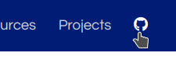
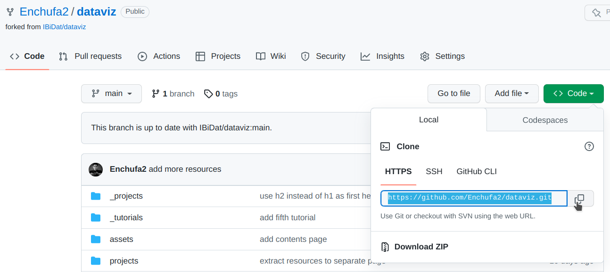
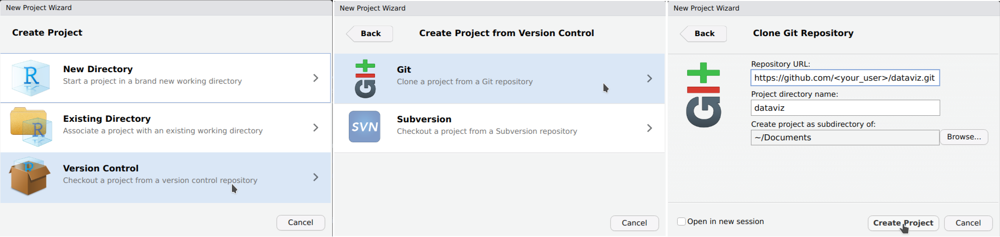
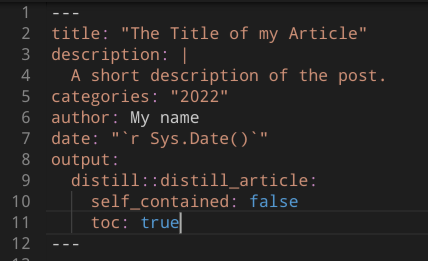
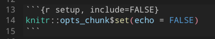
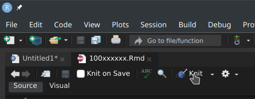
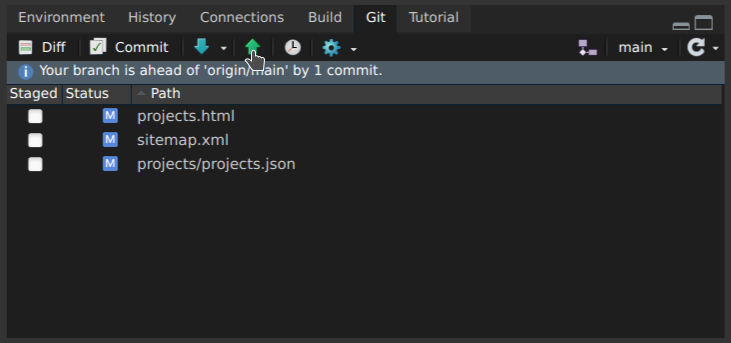
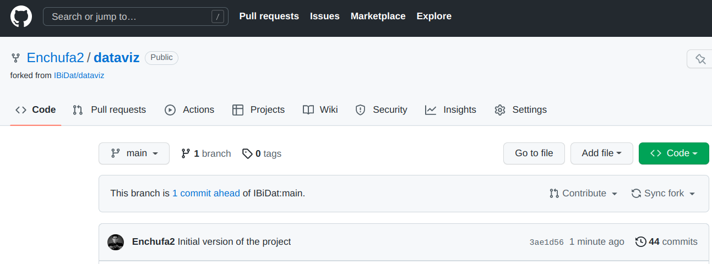

```{r setup, include=FALSE}
knitr::opts_chunk$set(echo=TRUE, eval=FALSE)
registerS3method("knit_print", "data.frame", function(x, ...) {
  rmarkdown:::knit_print.data.frame(rmarkdown::paged_table(x))
}, envir = asNamespace("knitr"))
```

Source: [`_tutorials/project/project.Rmd`](https://github.com/IBiDat/dataviz/blob/main/_tutorials/project/project.Rmd)

## Prerequisites

This tutorial assumes that you have a working installation of R and RStudio. For starters, you can read about the big picture motivation: [Why Git? Why GitHub?](https://happygitwithr.com/big-picture.html#big-picture), and here is a checklist of all the steps required to prepare for this tutorial.

1.  [Register a free GitHub account](https://happygitwithr.com/github-acct.html#github-acct) if you do not have one already.
2.  Install Git. There are specific instructions for [Windows](https://happygitwithr.com/install-git.html#install-git-windows), [macOS](https://happygitwithr.com/install-git.html#macos) and [Linux](https://happygitwithr.com/install-git.html#linux).
3.  [Introduce yourself to Git](https://happygitwithr.com/hello-git.html#hello-git).
4.  [Configure a personal access token](https://happygitwithr.com/https-pat.html#https-pat).
5.  Follow [this webinar](https://www.rstudio.com/resources/webinars/managing-part-2-github-and-rstudio/) to familiarize yourself with GitHub and RStudio's interface to Git.

It is also recommended that you read about [some Git basics](https://happygitwithr.com/git-intro.html).

## Creating the initial skeleton

### Forking the source code

This web page is a [Distill](https://rstudio.github.io/distill/) website, and as such it consists of a series of [R Markdown](https://rmarkdown.rstudio.com/) source files that are compiled into [HTML](https://en.wikipedia.org/wiki/HTML). Data projects, like any other software project, greatly benefits from [version control](https://en.wikipedia.org/wiki/Version_control), and this website is no exception. Its sources, along with the resulting HTML products, are hosted in (and published from) a GitHub repository. You can access this repository by clicking on the top-right logo.

```{r, echo=FALSE, eval=TRUE, fig.align="center", out.width="50%"}

```

Collaboration on GitHub, as in any other Git-based platform, is done via **Pull Requests**. Essentially, you work on a copy of the project, make changes, and then propose them to be included in the original repository. So in the first place, you need to **fork** the repository, meaning that you get a *copy* in your personal account that is *linked* to the original one, so that you can later submit your changes. To do this, just click the *fork* button in the [dataviz](https://github.com/IBiDat/dataviz) repository.

```{r, echo=FALSE, eval=TRUE, fig.align="center", out.width="50%"}
knitr::include_graphics("02-fork.png")
```

By clicking *Create fork*, you will be redirected to your new repository. Once there, click the green *Code* button and copy the HTTPS URL.

```{r, echo=FALSE, eval=TRUE, fig.align="center", out.width="100%", layout="l-page"}

```

### Creating a new project

Back in RStudio, start the dialog to create a new project.

```{r, echo=FALSE, eval=TRUE, fig.align="center", out.width="50%"}
knitr::include_graphics("04-new_project.png")
```

Now, select a *Version Control* project, managed by *Git*, and then paste the repository URL you copied in the last step. Adjust the destination path if required.

```{r, echo=FALSE, eval=TRUE, fig.align="center", out.width="100%", layout="l-page"}

```

If everything is properly configured, RStudio will download a copy of the GitHub's repository in your personal account to your PC (in Git terms, it will *clone* the remote repository locally), and the project will be opened.

### Adding your own article

Now it is time to generate some new content. To create the basic structure of visualization project, first install the `distill` R package, and then execute the following code:

```{r}
# install.packages("distill") # if required

distill::create_post(
  title = "The Title of my Article",
  collection = paste0("projects/", format(Sys.Date(), "%Y")),
  author = "My name",
  slug = NIA,
  date_prefix = NULL
)
```

where `NIA` should be your student identifier (i.e. the 9-digit identifier of the form `100xxxxxx`). If you inspect RStudio's *Files* pane, you will notice that a new directory `_projects/<year>/100xxxxxx` has been generated. The `Rmd` file with the same name under that directory is now open in the editor pane. Edit the file header as follows:

1.  Set a tentative title and description for your project. It does not need to be definitive, so do not take to much time thinking about this right now.
2.  Add `categories: "<year>"` below the description (substituting `<year>` by the current year, obviously).
3.  Set your full name.
4.  Set the date as follows: <code>date: &quot;&#96;r Sys.Date()&#96;&quot;</code>. In this way, the date of the article will be the date of the last compilation, which is convenient.
5.  Add `toc: true` to the `distill_article` options.

The header should look like this:

```{r, echo=FALSE, eval=TRUE, fig.align="center", out.width="50%"}

```

Also, remove the following part, because this prevents the R code chunks for being displayed in the article, and we want precisely the opposite:

```{r, echo=FALSE, eval=TRUE, fig.align="center", out.width="50%"}

```

Then save and hit the *knit* button to compile the document.

```{r, echo=FALSE, eval=TRUE, fig.align="center", out.width="50%"}

```

As a result, the article `_projects/<year>/100xxxxxx/100xxxxxx.html` has been generated.

### Committing and pushing the changes

Now it is time to tell Git what changes we want to incorporate. There is a new *Git* pane in RStudio in the top-right panel set. **Important:** you must always select **only** the files that were **modified under your NIA** (i.e., the `_projects/<year>/100xxxxxx` directory), and nothing else.

```{r, echo=FALSE, eval=TRUE, fig.align="center", out.width="70%"}
knitr::include_graphics("11-stage.png")
```

In the case above, mark as *Staged* only the yellow directories, ignoring the other files. Once checked, click the *Commit* button.

```{r, echo=FALSE, eval=TRUE, fig.align="center", out.width="70%"}
knitr::include_graphics("12-commit.png")
```

In the new dialogue, check once again that all files under your NIA---and only those--- are selected. Then, write a descriptive commit message and hit *Commit*.

```{r, echo=FALSE, eval=TRUE, fig.align="center", out.width="70%"}
knitr::include_graphics("13-commit.png")
```

Close the dialogue. Currently, you local copy of the repository contains the changes, but not the remote one on GitHub (the Git pane reads "Your branch is ahead of 'origin/main' by 1 commit"). To synchronize the changes, you need to click the *Push* button.

```{r, echo=FALSE, eval=TRUE, fig.align="center", out.width="70%"}

```

### Contributing your article

Finally, you can contribute your article by opening a Pull Request. In your fork, you will see that GitHub notices that your copy is 1 commit ahead of the original repository, and offers you to contribute.

```{r, echo=FALSE, eval=TRUE, fig.align="center", out.width="100%", layout="l-page"}

```

Click the *Contribute* button to start a new Pull Request.

```{r, echo=FALSE, eval=TRUE, fig.align="center", out.width="100%", layout="l-page"}
knitr::include_graphics("16-create_draft.png")
```

In this new dialogue,

1.  set the title to something like `Project - <your_name>`;
2.  you can write a description;
3.  ensure that "Allow edits by maintainers" is **checked**;
4.  click the down arrow in the green button to "create a draft pull request".

Then click *Create a draft pull request*. **Congratulations!** You have created your first Pull Request (i.e., something like [this](https://github.com/IBiDat/dataviz/pull/1)), and paved the way to contribute a visualization project for this course.

## Working on your project

Usually, Pull Requests contain a more complete version of the final contribution, but here we are learning. So far, we just created a skeleton of the article in "Draft" mode, and we will be adding content gradually.

### The Pull Request workflow

A Pull Request is a space where maintainers and collaborators work together to shape the final contribution:

1.  A collaborator commits some changes and asks for feedback.
2.  The maintainer reviews the changes and proposes corrections.

Note that, once the Pull Request is open, every commit that the collaborator pushes to their fork is automatically added to the Pull Request. So the cycle repeats until everybody is happy with the result, and the maintainer finally merges the Pull Request.

### Adding changes to the article

The workflow is pretty straightforward:

1.  Modify the `Rmd` file with text, code and images (external images need to be placed under `_projects/<year>/100xxxxxx/`, and then referenced by name in the `Rmd`).
2.  Compile the article by clicking the *Knit* button.
3.  Mark as *Staged* in the Git pane all (**and only**) the files under `_projects/<year>/100xxxxxx/`.
4.  Commit (with a descriptive commit message) and push.

Finally, when the project is finished, please click the **"Ready for review"** button in the Pull Request (at the bottom, on top of the comment box). Then I will check that everything is ok, ask for minor changes if required, and then merge the Pull Request and your project will be live!

## General guidelines

### Project guidelines

- **Commit messages are for future-you**. Put something descriptive of what you have done, so that, if future-you finds an issue and wants to undo something, it is easy to remember what each commit did. If you want to communicate with me, commit messages are not a good way; instead, the PR has a nice web interface where you can add comments (with Markdown syntax, yay!).

- **Use level 2 headings (`## Title`) as the highest level for headings**. In other words, please do not use level 1 headings in your posts (`# Title`), because the title of the post is already level 1, so it looks nicer if sections start one level below.
Note that you do not need to add `echo=TRUE` to every chunk, because they are shown by default.

- It is a good practice to set an initial chunk, right below the YAML header, as the following to ensure that images use the whole width available and are centered:

````r
`r ''````{r setup, include=FALSE}
knitr::opts_chunk$set(out.width="100%", fig.align="center")
```
````

- It is a good practice to set the whole width in Markdown images:

```markdown
{width="100%"}
```

- For external images (the ones that you downloaded from somewhere, such as the chart you are trying to replicate), it is a good practice to set the "external" class too:

```markdown
{.external width="100%"}
```

- In `distill` articles, you can set images and tables that span a width larger than the text column. It looks nicer e.g. for images that are very wide. There are a couple of examples in the Gapminder project. You can see how this is done in the Rmd, [here](https://github.com/IBiDat/dataviz/blob/main/_projects/gapminder/gapminder.Rmd#L265) and [here](https://github.com/IBiDat/dataviz/blob/main/_projects/gapminder/gapminder.Rmd#L291), just in case you want to use this feature.

- Note also the `preview=TRUE` option [here](https://github.com/IBiDat/dataviz/blob/main/_projects/gapminder/gapminder.Rmd#L265). Adding this option to a chunk makes the image produced by that chunk as the preview image for your article in the "Projects" gallery.

- **One of most important best practices is to limit the width of your code**. If you write code lines that are very long, they are harder to read. And especially in this case, these long lines will jump the width of the post and will be lost in the margin, outside of the visible area. So in general it is a good idea to break your lines of code at a maximum width. The common practice is to use a maximum width of 80 characters. There is an option in RStudio to show a visual guide in the editor for this limit. You can activate this in `Tools > Global Options > Code > Display > Show margin`. There is also a package called `styler` that allows you to style your document automatically. After installing the package, if you click "Addins" in the RStudio toolbar, there is a new addin called "Style active file". This could be a good starting point (although you may not like other styling options that this package applies).

### Presentation guidelines

- Once the project is finished and merged, you will need to prepare a short presentation.
The document format should be a presentation, but I do not particularly care about the file format. If you wish to try an R Markdown presentation, that is great; but a PowerPoint or PDF would be fine too.

- **Suggested structure**: 
  1. ~1 minute to present the selected chart, strengths and weaknesses; 
  2. ~2 minutes to present your replication work;
  3. ~2 minutes to present enhancements and alternatives.
  
- **Be brief**, it is 5 minutes, so do not try to explain everything, _there will be a post in our web for that_.

- **Do not show all the code**, _there will be a post in our web for that_. Just highlight some small portions of the code that you found specially tricky, challenging, clever...
