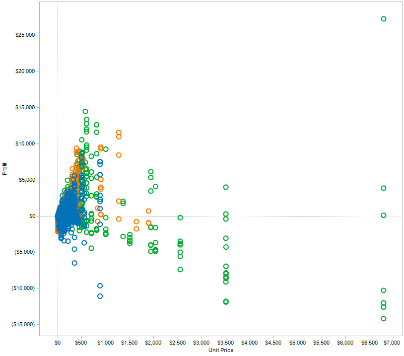
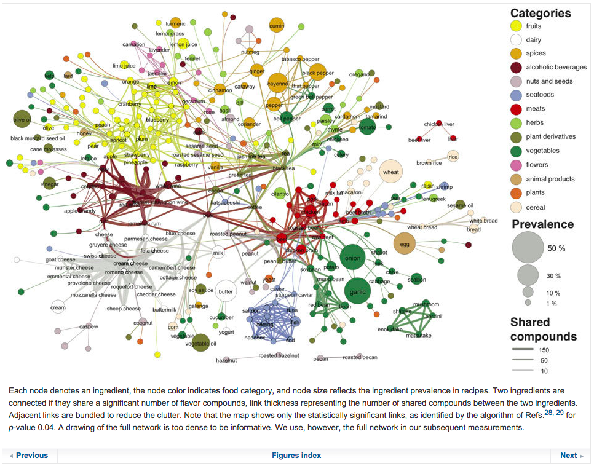

class: toc, base24, middle, clear

```{r setup, include=FALSE}
options(htmltools.dir.version=FALSE)
knitr::opts_chunk$set(message=FALSE, warning=FALSE, fig.align="center", dpi=150)

library(ggplot2)
theme_set(theme_gray(base_size=16))
```

```{r xaringanExtra, echo=FALSE}
xaringanExtra::use_share_again()
xaringanExtra::style_share_again(share_buttons="none")
xaringanExtra::use_scribble()
xaringanExtra::use_panelset(in_xaringan=TRUE)
```

---
class: intoc, inverse, center, middle

# Introduction to DataViz
## The What, the Why and the How

---

# What is a Graph?


--

.font170[
"Visual representation of information _to help people **make sense**
of complex phenomena through data_"
]

.right[—Enrico Bertini]

---
class: base24

# Acclaimed Historic Examples

- Joseph Priestley, 1765: first timeline chart as visual aid for his lectures

.center[]

---
class: base24

# Acclaimed Historic Examples

- William Playfair, 1786: first bar chart

.center[]

---
class: base24

# Acclaimed Historic Examples

- William Playfair, 1786: first line (timeseries) chart

.center[]

---
class: base24

# Acclaimed Historic Examples

- William Playfair, 1789: first pie chart (**sadly**)

.center[]

---
class: base24

# Acclaimed Historic Examples

- Florence Nightingale, 1858: polar area diagram that convinced the British
  Government to improve army hygiene

.center[]

---
class: base24

# Acclaimed Historic Examples

- John Snow, 1854: map of cholera cases that helped identify the source

.center[]

---
class: base24

# Acclaimed Historic Examples

- Charles Joseph Minard, 1869: first flow chart depicting Napoleon's 1812 Russian campaing

.center[]

---

# Why Graphs?


--

.font170[
Convert data that our working memory cannot retain into **direct visual stimuli**
that do not require "reading"
]

--

.font140[
- We have a poor working memory (~ 7 elements)...
]

--

.font140[
- but our eyes have **superpowers**!
  - ~ 30% of our brain is dedicated to visual processing
  - We can process ~ 100 Mbps
]

---

# Why Graphs?


.font170[
Visual reasoning is way **faster** and **more reliable** than mental reasoning
]

---

# Example: Find the Highest Number

.panelset[
.panel[.panel-name[Ready?]]
.panel[.panel-name[First try].remark-code[.font140[

|           |
|:---------:|
|    345    |
|    33.4   |
|  627.8654 |
| 1.0057632 |
|     9     |
|   9.5678  |
|    64.5   |
|    213    |
|    1000   |
| 125.89876 |

]]]
.panel[.panel-name[Second try].remark-code[.font140[

|         |
|--------:|
|   33.40 |
|  627.87 |
|    1.01 |
|    9.00 |
|  125.90 |
| 1000.00 |
|  345.00 |
|   64.50 |
|  213.00 |
|    9.57 |

]]]
.panel[.panel-name[Third try]
```{r example-barplot, echo=FALSE, fig.asp=0.7, out.width="80%"}
x <- c(33.40, 627.87, 1.01, 9.00, 125.90, 1000.00, 345.00, 64.50, 213.00, 9.57)
barplot(x)
```
]
]

---

# Example: The Game of 15

.footnote[From Prof. Pat Hanrahan's EuroVis'09 keynote talk]

.panelset[
.panel[.panel-name[Rules]
.font140[
1. There are 2 players

2. Each player takes a digit in turn

3. Once a digit is taken, it cannot be used again

4. The first player to get three digits that sum to 15 wins
]
.center.font200[
{1, 2, 3, 4, 5, 6, 7, 8, 9}
]
]
.panel[.panel-name[Another version]
.center[]
]
]

---

# Why Graphs?


.font170[
Visualization allows us to summarize information while retaining details...

... as such, it can reveal information that summary statistics may hide
]

---

# Example: Anscombe's Quartet


---

# Example: Datasaurus


---

# Why Graphs?


.font170[
Visualization can be faster than your eyes can move!
]

.font140[
- Preattentive features can be detected faster than eye movement (200 ms)
]

---

# Example: Preattentive Processing

.panelset[
.panel[.panel-name[Preattentive features]
.center[]
]
.panel[.panel-name[Serial search]
.center[]
]
]

---

# How to Make Graphs?


.font150.center[
Data -> **Mapping** -> **Visual Representation** -> Perception
]

--


.pull-left.font120[
- Opportunity + Responsibility
  - We can also easily fool ourselves
  - We need to know how our visual perception works
]
.pull-right.center[

]

---
class: base24

# Visual Representation


- Visual variables, marks and channels
- Their best use and limitations


.center[]

---
class: base24

# Visual Mapping


- How to best map data features to visual features
- What options are available (visualization toolbox)
- How computer algorithms realize the mapping and turn data into images

.center[]

---

# Effective Visualization


--

.font150[
- The extent to which it helps people carry out some data analysis or communication tasks better.
]

--

.font150[
- Better? Faster, more accurately, increased confidence, more insights, better decisions, etc.
]

--

.font150[
- It can be measured only in relation to these tasks and goals.
]

---
class: base24

# Principles of Graphical Excellence

.footnote[Tufte, E. R. (2018) _**The visual display of quantitative information**_. Graphics Press.]


--

- Graphical excellence is the **well-designed presentation** of **interesting
  data**—a matter of _substance_, of _statistics_, and of _design_.

--

- Graphical excellence consists of **complex ideas** communicated
  with **clarity, precision, and efficiency**.

--

- Graphical excellence is that which gives to the viewer the **greatest number
  of ideas** in the **shortest time** with the **least ink** in the **smallest space**.

--

- Graphical excellence is nearly always **multivariate**.

--

- And graphical excellence requires telling the **truth** about the data.

---
class: base24

# Summary

--

- A graph

  - is a **language** to encode information;
  - converts data into **direct visual stimuli** that do not require "reading";
  - has a purpose, which is to **communicate** a summary of **complex phenomena**
    without giving up on details.

--

- As a language, it has a series of elements, **visual features**.

--

- We need to learn what's the most appropriate use of such features, and what's
  the most effective way for **mapping** data features to visual features.

--

- A good visualization can only be measured in relation to its goals, and the
  **principles of graphical excellence** by Tufte are a good starting point as
  a reference.

---
class: intoc, inverse, center, middle

# Graphical Integrity
## How to Lie with Graphs

---
class: base24

# Bad Charts


- We live surrounded by bad charts

  - For many people, statistical charts = **lie**

--


- Deception vs. ineptitude
  - Lack of **quantitative skills**, _anumerism_
  - Lack of knowledge about **visual perception**
  - Lack of **visual skills**
  - Intention to **deceive**

---
class: base24

# Sources of Bad Charts

- For Tufte:

  - Distortion
  - Data variation
  - Visual area and numerical measure
  - Context

--

- But there are many more **common patterns**:

  - Bad representation (deception, sometimes)
  - Bad data
  - Too many data (optimism)
  - Too little data (optimism)
  - Hiding relevant data (deception)
  - Wrong representation (deception)
  - Creativity (without skill)

---

# Prologue: Pie Charts

.panelset[
.panel[.panel-name[See the pattern?]
.center[]
]
.panel[.panel-name[Second try]
.center[]
]
.panel[.panel-name[The only acceptable one]
.center[]
]
]

---

# Bad Representation: Areas

.panelset[
.panel[.panel-name[See the pattern?]
.center[]
]
.panel[.panel-name[Second try]
.center[]
]
]

---

# Bad Representation: Longitudes

.panelset[
.panel[.panel-name[Deception 1]
- Cutting the origin is the most common deception technique with bar plots


.pull-left[.center[]]
.pull-right[.center[]]
]
.panel[.panel-name[Deception 2]
.center[]
]
.panel[.panel-name[Ineptitude 1]
.center[]
]
.panel[.panel-name[Ineptitude 2]
- Some well-intentioned axis cuts may have nefarious consequences


.pull-left[.center[]]
.pull-right[.center[]]
]
]

---

# Bad Data

.panelset[
.panel[.panel-name[Population maps]
.center[]
]
.panel[.panel-name[Irrelevant data]
.center[]
]
.panel[.panel-name[Bonus]
.center[]
]
.panel[.panel-name[Non-comparable]
.center[]
]
.panel[.panel-name[Not related]
.center[]

- See [Spurious correlations](https://www.tylervigen.com/spurious-correlations) for more fun
]
]

---

# Too Many Data

.panelset[
.panel[.panel-name[Pie horror 1]
.center[]
]
.panel[.panel-name[Pie horror 2]
.center[]
]
]

---

# Too Little Data

.panelset[
.panel[.panel-name[Optimist 1]
.center[]
]
.panel[.panel-name[Optimist 2]
.center[]
]
.panel[.panel-name[Scientific optimist]
.center[]
]
.panel[.panel-name[+bad interpretation]
.center[]
]
]

---

# Hiding Relevant Data

.panelset[
.panel[.panel-name[No context]

.center[]
]
.panel[.panel-name[More context]

.center[]
]
.panel[.panel-name[Complete picture]

.center[]
]
.panel[.panel-name[Context!]
.center[]
]
]

---

# Wrong Representation

.panelset[
.panel[.panel-name[Level 1]
.center[]
]
.panel[.panel-name[Level 2]
.center[]
]
.panel[.panel-name[Level 3]
.center[]
]
.panel[.panel-name[Level 4]
.center[]
]
.panel[.panel-name[Level 5]
.center[]
]
.panel[.panel-name[Level 6]
.center[]
]
]

---

# Creativity

.panelset[
.panel[.panel-name[Level 1]
.center[]
]
.panel[.panel-name[Level 2]
.center[]
]
.panel[.panel-name[Level 3]
.center[]
]
.panel[.panel-name[Level 4]
.center[]
]
.panel[.panel-name[Level 5]
.center[]
]
.panel[.panel-name[Level 6]
.center[]
]
]

---

# Bonus: Scientific Horrors

.panelset[
.panel[.panel-name[3D]
.center[]
]
.panel[.panel-name[Linear relationship?]
.center[]
]
.panel[.panel-name[Quadratic relationship?]
.center[]
]
.panel[.panel-name[Other?]
.center[]
]
.panel[.panel-name[Whatever]
.center[]
]
]

---

# 12 Rules to Display Data Badly

.footnote[Wainer, H. (1984) **How to Display Data Badly**. _The American Statistician_ 38(2), pp. 137-147.]

--

.pull-left[
### Showing data

- Rule 1. Show as few data as possible (minimize the data density)
- Rule 2. Hide what data you do show (minimize the data-ink ratio)
]

--

.pull-right[
### Showing data accurately

- Rule 3. Ignore the visual metaphor altogether
- Rule 4. Only order matters
- Rule 5. Graph data out of context
]

--

### Showing data clearly

- Rule 6. Change scales in mid-axis
- Rule 7. Emphasize the trivial (ignore the important)
- Rule 8. Jiggle the baseline
- Rule 9. Austria first!
- Rule 10. Label illegibly, incompletely, incorrectly, and ambiguously
- Rule 11. More is murkier: more decimal places and more dimensions
- Rule 12. If it has been done well in the past, think of another way to do it

---

# Chart Rethinking: Exercise 1

.footnote[https://junkcharts.typepad.com]

.panelset[
.panel[.panel-name[Original]
.center[]
]
.panel[.panel-name[Iteration 1]
.center[]
]
.panel[.panel-name[Iteration 2]
.center[]
]
]

---

# Chart Rethinking: Exercise 2

.footnote[https://junkcharts.typepad.com]

.panelset[
.panel[.panel-name[Original]
.center[]
]
.panel[.panel-name[Iteration 1]
.center[]
]
.panel[.panel-name[Iteration 2]
.center[]
]
]

---

# Chart Rethinking: Exercise 3

.footnote[https://www.datanalytics.com/]

.panelset[
.panel[.panel-name[Original]
.center[]
]
.panel[.panel-name[Original]
.center[]
]
.panel[.panel-name[Iteration 1]
.center[]
]
]

---

# Chart Rethinking: Exercise 4

.footnote[https://junkcharts.typepad.com]

.panelset[
.panel[.panel-name[Original]
.center[]
]
.panel[.panel-name[Iteration 1]
.center[]
]
]

---

# Chart Rethinking: Exercise 5

.footnote[https://junkcharts.typepad.com]

.panelset[
.panel[.panel-name[Original]
.center[]
]
.panel[.panel-name[Iteration 1]
.center[]
]
.panel[.panel-name[A word of caution]
.center[]
]
]

---

# Chart Rethinking: Exercise 6

.footnote[Schwabish, J. A. (2014). _An Economist’s Guide to Visualizing Data_]

.panelset[
.panel[.panel-name[Original]
.center[]
]
.panel[.panel-name[Iteration 1]
.center[]
]
]

---

# Chart Rethinking: Exercise 7

.footnote[Schwabish, J. A. (2014). _An Economist’s Guide to Visualizing Data_]

.panelset[
.panel[.panel-name[Original]
.center[]
]
.panel[.panel-name[Iteration 1]
.center[]
]
]

---

# Chart Rethinking: Exercise 8

.footnote[Schwabish, J. A. (2014). _An Economist’s Guide to Visualizing Data_]

.panelset[
.panel[.panel-name[Original]
.center[]
]
.panel[.panel-name[Iteration 1]
.center[]
]
]

---
class: base24

# Summary

--

- We live surrounded by **bad charts**, either by deception or ineptitude.

--

- There are some **common patterns** to be aware of.<br>
  From those, we can distill a series of **basic rules**:

--

  - Pie charts are very rarely justified.
  - Areas are tricky.
  - 3D is rarely justified in 2D mediums.
  - Axes (cuts, scales...) should be clear.
  - Proper context should be shown when relevant.
  - Do not go beyond what data tells.
  - There are **well-established visual metaphors**.
      - E.g. up-down for positive-negative.
      - E.g. areas are perceived as whole quantities,<br>
        so cutting the axis is deceiving.

---
class: intoc, inverse, center, middle

# Graphical Perception
## Theory, Experimentation<br>and its Application to Data Display

---
class: base24

# Introduction

.footnote[Cleveland, W. S. (1985) _**The elements of graphing data**_. Wadsworth Inc.]


--

- When a graph is constructed, quantitative, categorical and ordinal data is
  **encoded** by symbols, geometry and color.

--

- _Graphical perception_ is the **visual decoding** of this encoded information.

--

- A graph is a _failure_ if the visual decoding fails.
  - No matter how intelligent the choice of information.
  - No matter how ingenious the encoding of information.
  - No matter how technologically impressive the production.

--

- Informed decisions about how to encode data must be based on knowledge of
  the visual decoding process.

---
class: base24

# Introduction

.footnote[Cleveland, W. S. (1985) _**The elements of graphing data**_. Wadsworth Inc.]

## Paradigm

1. A specification of **elementary graphical-perception tasks** (channels),<br>
  and an ordering of the tasks based on effectiveness.
  - Related to _pre-attentive vision_
  - As opposed to _graphical-cognition tasks_

2. A statement on the role of **distance** in graphical perception.

3. A statement on the role of **detection** in graphical perception.


The paradigm leads to principles of data display.

---

# Elements of Visual Encoding


.font170[
_Visual encoding_ is the (principled) way in which data is **mapped**
to visual structures:

- From _data items_ to **visual marks**
- From _data attributes_ to **visual channels**
]

---
class: base24

# Elements of Visual Encoding

.pull-left[
- **Data items**: sales
- **Data attributes**: price, profit, product type
].pull-left[
- **Visual marks**: point
- **Visual channels**: xy position, color
].pull-left[
.center[]
].pull-right[
- **Encoding rules**:
  - sale => point
  - price and profit => xy position
  - product type => color
]

---
class: base24

# Elements of Visual Encoding

.pull-left[
- **Data items**: co-occurrences
- **Data attributes**: name, cluster, frequency
].pull-left[
- **Visual marks**: point
- **Visual channels**: xy position, hue, intensity
].pull-left[
.center[]
].pull-right[
- **Encoding rules**:
  - co-occurrences => point
  - name => xy position
  - cluster => hue, _containment_
  - frequency => intensity
]

---

# Elements of Visual Encoding


.font170[
**Visual marks** are the basic visual objects/units
that represent data objects visually
]

.center[]

---

# Elements of Visual Encoding

.font170[
**Visual channels** are visual variables we can use
to represent characteristics of visual objects
]

.center[]

---

# Elements of Visual Encoding


.center[]

---
class: base24

# Elements of Visual Encoding


.center[]

- **Identity channels**: information about _what_, _who_, _where_ something is
  - Example: color hue is suitable for _categories_

- **Magnitude channels**: information about _how much_
  - Example: position is suitable for _quantities_

---

# Elements of Visual Encoding

.panelset[
.panel[.panel-name[Exercises:]


.font140[
**For each of the following, identify**:

- Data item 1 => visual mark 1
- Data item 2 => visual mark 2
- ...
- Data attribute 1 => visual channel 1
- Data attribute 2 => visual channel 2
- ...
]
]
.panel[.panel-name[1]
.footnote[Source: [New York Times](https://www.nytimes.com/interactive/2012/08/05/sports/olympics/the-100-meter-dash-one-race-every-medalist-ever.html)]
.center[]
]
.panel[.panel-name[2]
.footnote[Source: [Gapminder](https://www.gapminder.org)]
.center[]
]
.panel[.panel-name[3]
.footnote[Source: [Fathom](https://fathom.info/salaryper/)]
.center[]
]
.panel[.panel-name[4]
.footnote[Source: [Cargo Collective](https://payload.cargocollective.com/1/0/4829/577747/world-cup-infographic_8-1_xlarge_o.gif)]
.center[]
]
.panel[.panel-name[5]
.footnote[Source: [New York Times](https://www.nytimes.com/interactive/2012/02/12/us/entitlement-map.html)]
.center[]
]
.panel[.panel-name[6]
.footnote[Source: [Nature](https://www.nature.com/srep/2011/111215/srep00196/full/srep00196.html)]
.center[]
]
]

---

# Expressiveness Principle


.font170[
Visual information should express all and **only** the information in the data
]


.font140[
E.g., ordered data should not appear as unordered or vice versa
]

---

# Example: What Does Position Encode?

.center[]

---

# Effectiveness Principle


.font170[
The importance of the information should match the **salience** of the channel
]

---

# Effectiveness Rank

.center[]

---
class: base24

# Channel Effectiveness


- **Accuracy**: How accurately values can be estimated

- **Discriminability**: How many different values can be perceived

- **Separability**: How much interaction there is with multiple encodings

- **Popout**: How easy it is to spot some values from the rest

- **Grouping**: How good a channel is in conveying groups

---

# Accuracy

.center[]

---

# Accuracy

.center[]

---

# Accuracy


.font170[
**Implications for design**: be mindful of the ranking of visual variables.
**Use the highest ranked channels** for the most important information
whenever possible.
]


.font140[
Keep in mind: position and thus _spatial layout_ is the king of visual channels.
**Think about how you use space first**.
]

---
class: base24

# Accuracy

.footnote[Source: [Stephen Few](http://www.perceptualedge.com/articles/visual_business_intelligence/displays_for_combining_time-series_and_part-to-whole.pdf)]

- Which one is more effective to compare sale trends across regions? Why?


.center[]

---
class: base24

# Discriminability

- How many values can we distinguish for any given channel?
- **Rule**: the number of available bins should match the number of bins we
  want to be able to see from the data

.pull-left[
.center[]
]

.pull-right[
.center[]
]

---

# Discriminability


.font170[
**Implications for design**: do not overestimate the number of available bins.
For most visual channels, the number is surprisingly low.
]


.font140[
When you have too many categories, find a way to group/bin the data further
]

---
class: base24

# Discriminability

... or switch channels! (E.g. color-space trade-off)

.pull-left[
.center[]
]

.pull-right[
.center[]
]

---

# Separability


.center[]

---

# Separability


.center[


]


Width + height

Shape + color

Position + color

---

# Separability


.center[]

---
class: base24

# Popout

.pull-left[
- Preattentive features
- See [Perception in visualization](https://www.csc2.ncsu.edu/faculty/healey/PP/)
  by C. G. Healey
]

.pull-right[
.center[]
]

---

# Separability, Popout


.font170[
**Implications for design**: do not encode data with too many non-spatial
visual channels.
]


.font140[
Use separable dimensions.<br>
To direct attention, use preattentive features.
]

---
class: base24

# Grouping


.pull-left[


- Containment and connection


- Proximity


- Similarity (identity)
]
.pull-right[
.center[]
]

---
class: base24

# Summary


--

- Visual encoding is the (principled) way in which data (items and attributes)
  is **mapped** to visual structures (marks and channels).

--

- Visual information should express all and **only** the information in the data,
  **highlighting** the important bits with effective channels.

--

- Channel **effectiveness** depends on accuracy, discriminability, separability,
  popout, and grouping, and there is a **ranking** based on scientific experiments
  to keep in mind for every visualization.

---
class: intoc, inverse, center, middle

# Principles of Graphical Representation
## Some Useful General Guidelines

---
class: base24

# Attitude

There are three basic questions that is very useful to keep asking yourself
over and over again as you are designing new visual representations:

--

.font100[
- **What is it for?**
  - What is the problem that I am trying to solve?
  - What **questions** do I want my reader/user to be able to answer looking at this?
]

--

.font100[
- **What can I see here?**
  - What information can I extract out of this representation?
  - How much effort is it needed to extract such information?
  - How much confidence do I have in this information?
]

--

.font100[
- **How can I improve it?**
  - Being able to think about alternate solutions is<br>
    **the most important skill**
]

---

# Chart Rethinking: Exercise 9

.footnote[Source: [The Functional Art](http://www.thefunctionalart.com/2015/02/redesigning-circular-timeline.html), by Alberto Cairo]

.panelset[
.panel[.panel-name[Original]
.pull-left.font120[
- **What is it for?**


- **What can I see here?**


- **How can I improve it?**
]
.pull-right[
.center[]
]
]
.panel[.panel-name[Iteration 1]
.center[]
]
]

---
class: base24

# General Guidelines


--

- **Do not over-aggregate data**

--

- **Unit-based visualizations**
  - Every data item is represented by a single graphical mark
  - Every data attribute is represented by a single channel

--

- **Tufte's _high-information graphics_**
  - "Data-rich designs give **context and credibility** to statistical evidence"
  - "High-density graphics help us **compare** parts of the data by displaying
    much information **within the view of the eye**"

--

- **Keep a critical attitude**
