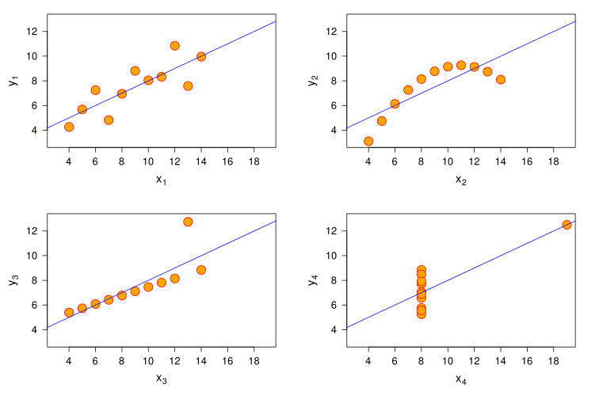
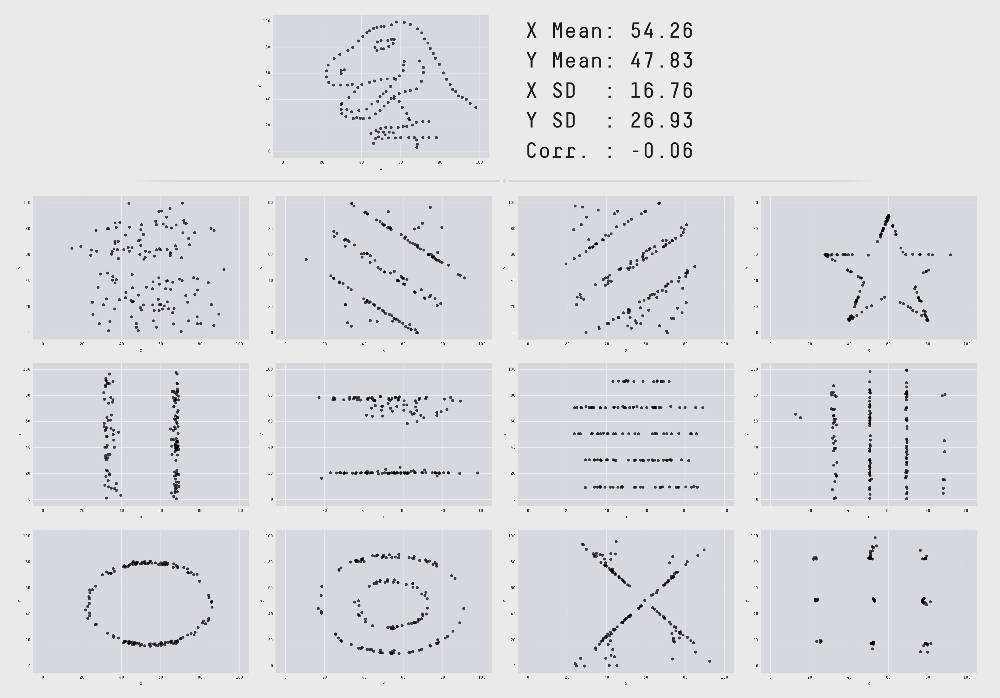
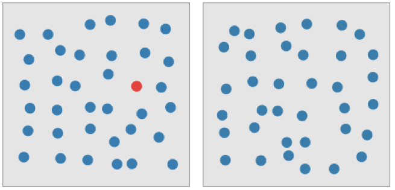
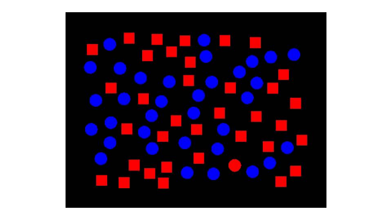
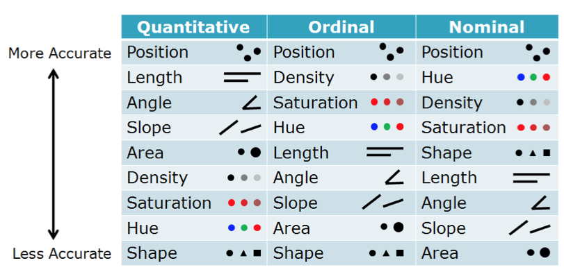

class: base24, middle, clear

```{r child="ch1_0.Rmd"}
```

---
class: inverse, center, middle

# Introduction to DataViz
## The What, the Why and the How

---

# What is a Graph?


--

.font170[
"Visual representation of information _to help people **make sense**
of complex phenomena through data_"
]

.right[—Enrico Bertini]

---
class: base24

# Acclaimed Historic Examples

- Joseph Priestley, 1765: first timeline chart as visual aid for his lectures

.center[]

---
class: base24

# Acclaimed Historic Examples

- William Playfair, 1786: first bar chart

.center[]

---
class: base24

# Acclaimed Historic Examples

- William Playfair, 1786: first line (timeseries) chart

.center[]

---
class: base24

# Acclaimed Historic Examples

- William Playfair, 1789: first pie chart (**sadly**)

.center[]

---
class: base24

# Acclaimed Historic Examples

- Florence Nightingale, 1858: polar area diagram that convinced the British
  Government to improve army hygiene

.center[]

---
class: base24

# Acclaimed Historic Examples

- John Snow, 1854: map of cholera cases that helped identify the source

.center[]

---
class: base24

# Acclaimed Historic Examples

- Charles Joseph Minard, 1869: first flow chart depicting Napoleon's 1812 Russian campaing

.center[]

---

# Why Graphs?


--

.font170[
Convert data that our working memory cannot retain into **direct visual stimuli**
that do not require "reading"
]

--

.font140[
- We have a poor working memory (~ 7 elements)...
]

--

.font140[
- but our eyes have **superpowers**!
  - ~ 30% of our brain is dedicated to visual processing
  - We can process ~ 100 Mbps
]

---

# Why Graphs?


.font170[
Visual reasoning is way **faster** and **more reliable** than mental reasoning
]

---

# Example: Find the Highest Number

.panelset[
.panel[.panel-name[Ready?]]
.panel[.panel-name[First try].remark-code[.font140[

|           |
|:---------:|
|    345    |
|    33.4   |
|  627.8654 |
| 1.0057632 |
|     9     |
|   9.5678  |
|    64.5   |
|    213    |
|    1000   |
| 125.89876 |

]]]
.panel[.panel-name[Second try].remark-code[.font140[

|         |
|--------:|
|   33.40 |
|  627.87 |
|    1.01 |
|    9.00 |
|  125.90 |
| 1000.00 |
|  345.00 |
|   64.50 |
|  213.00 |
|    9.57 |

]]]
.panel[.panel-name[Third try]
```{r example-barplot, echo=FALSE, fig.asp=0.7, out.width="80%"}
x <- c(33.40, 627.87, 1.01, 9.00, 125.90, 1000.00, 345.00, 64.50, 213.00, 9.57)
barplot(x)
```
]
]

---

# Example: The Game of 15

.footnote[From Prof. Pat Hanrahan's EuroVis'09 keynote talk]

.panelset[
.panel[.panel-name[Rules]
.font140[
1. There are 2 players

2. Each player takes a digit in turn

3. Once a digit is taken, it cannot be used again

4. The first player to get three digits that sum to 15 wins
]
.center.font200[
{1, 2, 3, 4, 5, 6, 7, 8, 9}
]
]
.panel[.panel-name[Another version]
.center[]
]
]

---

# Why Graphs?


.font170[
Visualization allows us to summarize information while retaining details...

... as such, it can reveal information that summary statistics may hide
]

---

# Example: Anscombe's Quartet



---

# Example: Datasaurus



---

# Why Graphs?


.font170[
Visualization can be faster than your eyes can move!
]

.font140[
- Preattentive features can be detected faster than eye movement (200 ms)
]

---

# Example: Preattentive Processing

.panelset[
.panel[.panel-name[Preattentive features]
.center[]
]
.panel[.panel-name[Serial search]
.center[]
]
]

---

# How to Make Graphs?


.font150.center[
Data -> **Mapping** -> **Visual Representation** -> Perception
]

--


.pull-left.font120[
- Opportunity + Responsibility
  - We can also easily fool ourselves
  - We need to know how our visual perception works
]
.pull-right.center[

]

---
class: base24

# Visual Representation


- Visual variables, marks and channels
- Their best use and limitations


.center[]

---
class: base24

# Visual Mapping


- How to best map data features to visual features
- What options are available (visualization toolbox)
- How computer algorithms realize the mapping and turn data into images

.center[]

---

# Effective Visualization


--

.font150[
- The extent to which it helps people carry out some data analysis or communication tasks better.
]

--

.font150[
- Better? Faster, more accurately, increased confidence, more insights, better decisions, etc.
]

--

.font150[
- It can be measured only in relation to these tasks and goals.
]

---
class: base24

# Principles of Graphical Excellence

.footnote[Tufte, E. R. (2018) _**The visual display of quantitative information**_. Graphics Press.]


--

- Graphical excellence is the **well-designed presentation** of **interesting
  data**—a matter of _substance_, of _statistics_, and of _design_.

--

- Graphical excellence consists of **complex ideas** communicated
  with **clarity, precision, and efficiency**.

--

- Graphical excellence is that which gives to the viewer the **greatest number
  of ideas** in the **shortest time** with the **least ink** in the **smallest space**.

--

- Graphical excellence is nearly always **multivariate**.

--

- And graphical excellence requires telling the **truth** about the data.

---
class: base24

# Summary

--

- A graph

  - is a **language** to encode information;
  - converts data into **direct visual stimuli** that do not require "reading";
  - has a purpose, which is to **communicate** a summary of **complex phenomena**
    without giving up on details.

--

- As a language, it has a series of elements, **visual features**.

--

- We need to learn what's the most appropriate use of such features, and what's
  the most effective way for **mapping** data features to visual features.

--

- A good visualization can only be measured in relation to its goals, and the
  **principles of graphical excellence** by Tufte are a good starting point as
  a reference.
