class: base24, middle, clear

```{r child="ch1_0.Rmd"}
```

---
class: inverse, center, middle

# Graphical Integrity
## How to Lie with Graphs

---
class: base24

# Bad Charts


- We live surrounded by bad charts

  - For many people, statistical charts = **lie**

--


- Deception vs. ineptitude
  - Lack of **quantitative skills**, _anumerism_
  - Lack of knowledge about **visual perception**
  - Lack of **visual skills**
  - Intention to **deceive**

---
class: base24

# Sources of Bad Charts

- For Tufte:

  - Distortion
  - Data variation
  - Visual area and numerical measure
  - Context

--

- But there are many more **common patterns**:

  - Bad representation (deception, sometimes)
  - Bad data
  - Too many data (optimism)
  - Too little data (optimism)
  - Hiding relevant data (deception)
  - Wrong representation (deception)
  - Creativity (without skill)

---

# Prologue: Pie Charts

.panelset[
.panel[.panel-name[See the pattern?]
.center[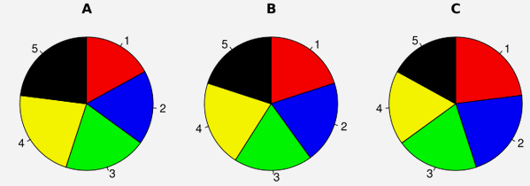]
]
.panel[.panel-name[Second try]
.center[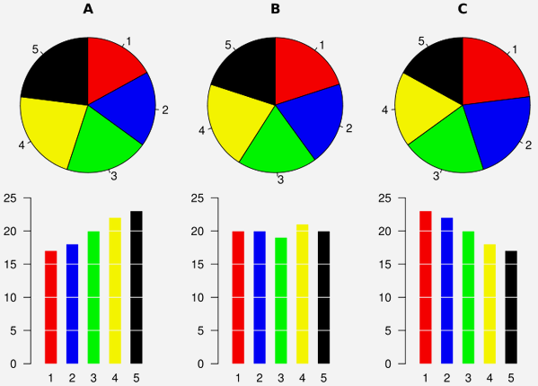]
]
.panel[.panel-name[The only acceptable one]
.center[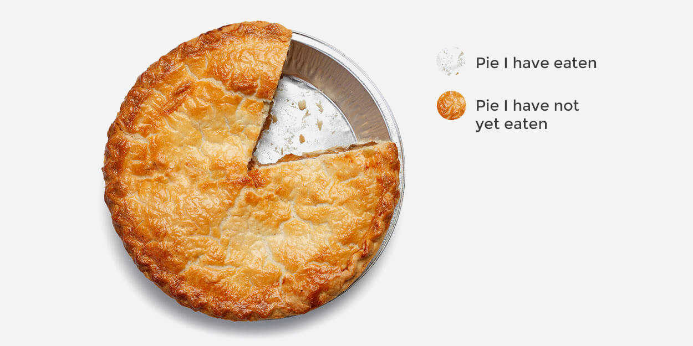]
]
]

---

# Bad Representation: Areas

.panelset[
.panel[.panel-name[See the pattern?]
.center[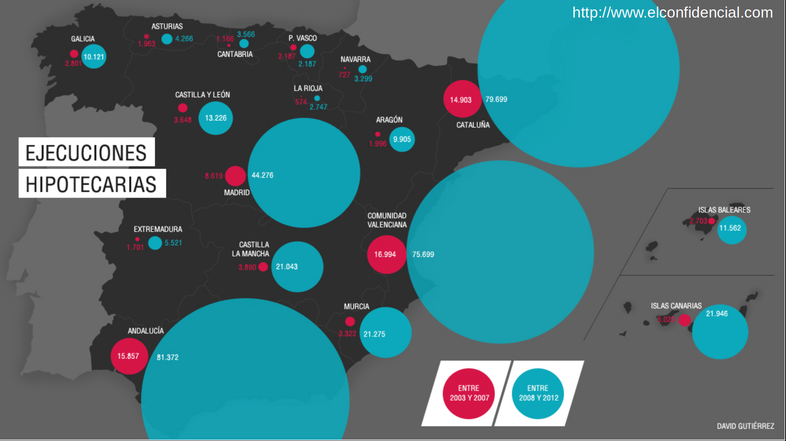]
]
.panel[.panel-name[Second try]
.center[]
]
]

---

# Bad Representation: Longitudes

.panelset[
.panel[.panel-name[Deception 1]
- Cutting the origin is the most common deception technique with bar plots


.pull-left[.center[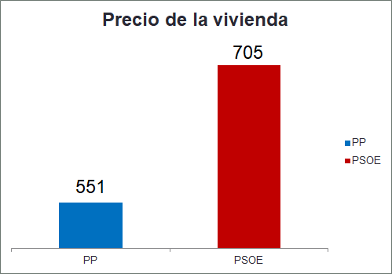]]
.pull-right[.center[]]
]
.panel[.panel-name[Deception 2]
.center[]
]
.panel[.panel-name[Ineptitude 1]
.center[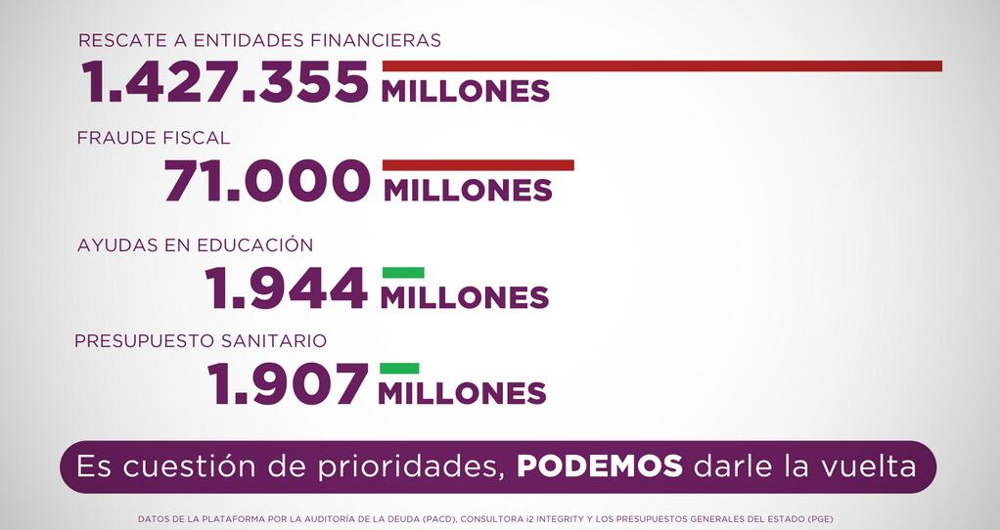]
]
.panel[.panel-name[Ineptitude 2]
- Some well-intentioned axis cuts may have nefarious consequences


.pull-left[.center[]]
.pull-right[.center[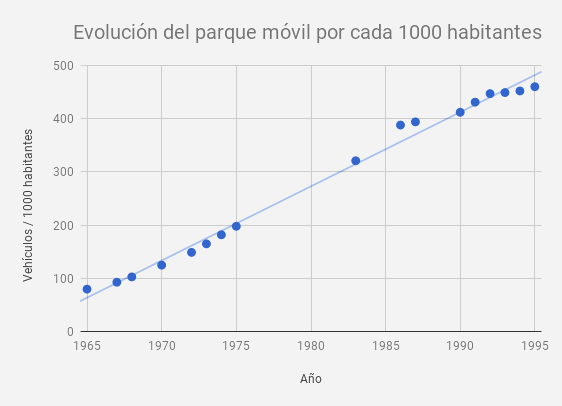]]
]
]

---

# Bad Data

.panelset[
.panel[.panel-name[Population maps]
.center[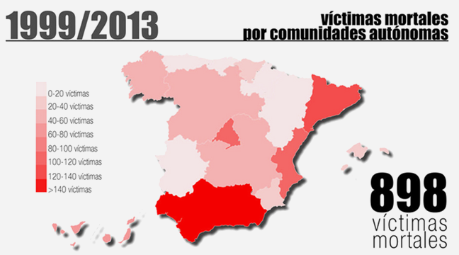]
]
.panel[.panel-name[Irrelevant data]
.center[]
]
.panel[.panel-name[Bonus]
.center[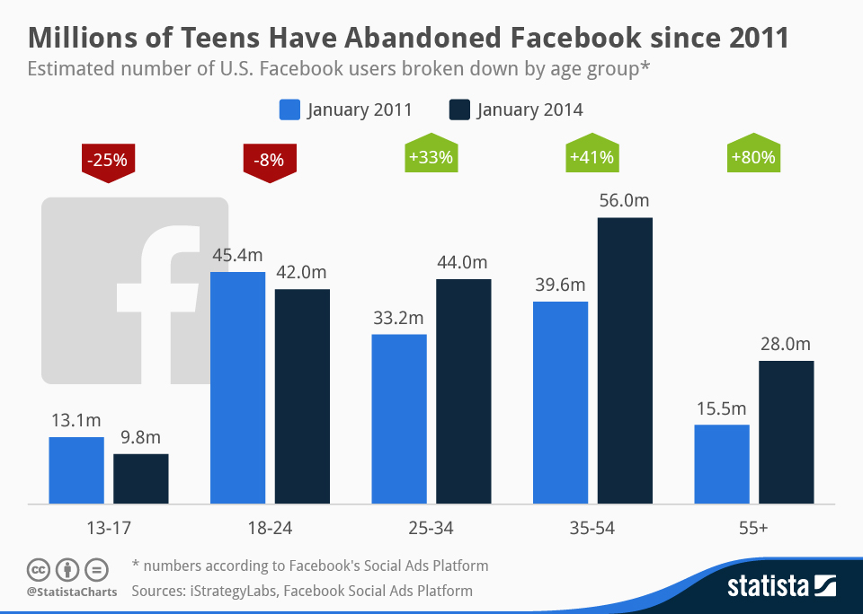]
]
.panel[.panel-name[Non-comparable]
.center[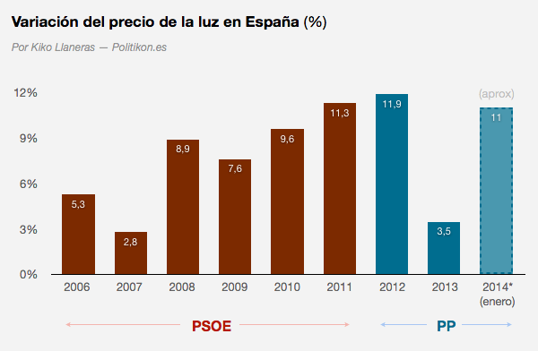]
]
.panel[.panel-name[Not related]
.center[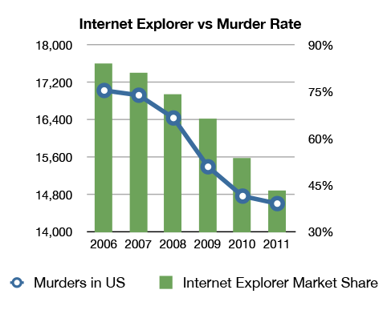]

- See [Spurious correlations](https://www.tylervigen.com/spurious-correlations) for more fun
]
]

---

# Too Many Data

.panelset[
.panel[.panel-name[Pie horror 1]
.center[]
]
.panel[.panel-name[Pie horror 2]
.center[]
]
]

---

# Too Little Data

.panelset[
.panel[.panel-name[Optimist 1]
.center[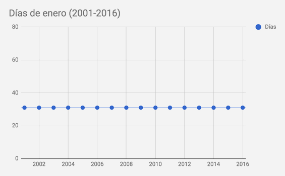]
]
.panel[.panel-name[Optimist 2]
.center[]
]
.panel[.panel-name[Scientific optimist]
.center[]
]
.panel[.panel-name[+bad interpretation]
.center[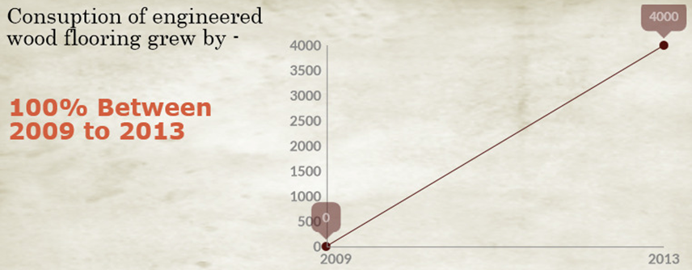]
]
]

---

# Hiding Relevant Data

.panelset[
.panel[.panel-name[No context]

.center[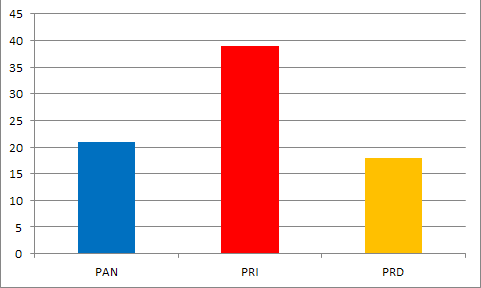]
]
.panel[.panel-name[More context]

.center[]
]
.panel[.panel-name[Complete picture]

.center[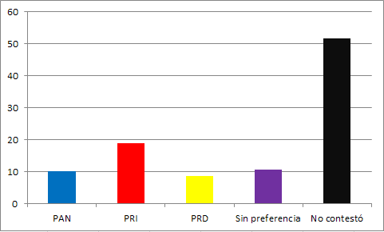]
]
.panel[.panel-name[Context!]
.center[]
]
]

---

# Wrong Representation

.panelset[
.panel[.panel-name[Level 1]
.center[]
]
.panel[.panel-name[Level 2]
.center[]
]
.panel[.panel-name[Level 3]
.center[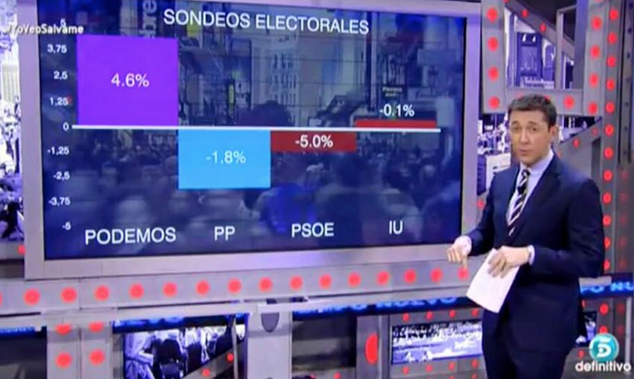]
]
.panel[.panel-name[Level 4]
.center[]
]
.panel[.panel-name[Level 5]
.center[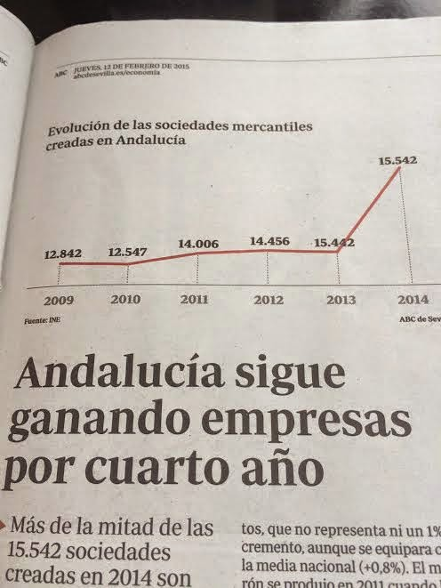]
]
.panel[.panel-name[Level 6]
.center[]
]
]

---

# Creativity

.panelset[
.panel[.panel-name[Level 1]
.center[]
]
.panel[.panel-name[Level 2]
.center[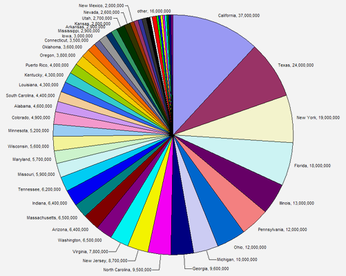]
]
.panel[.panel-name[Level 3]
.center[]
]
.panel[.panel-name[Level 4]
.center[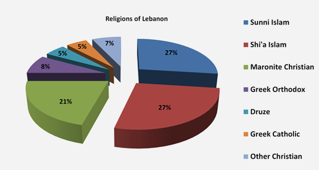]
]
.panel[.panel-name[Level 5]
.center[]
]
.panel[.panel-name[Level 6]
.center[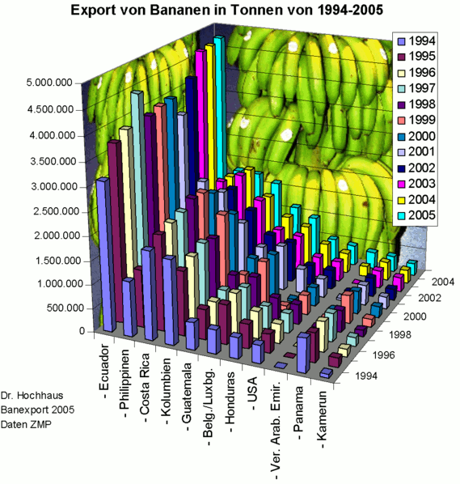]
]
]

---

# Bonus: Scientific Horrors

.panelset[
.panel[.panel-name[3D]
.center[]
]
.panel[.panel-name[Linear relationship?]
.center[]
]
.panel[.panel-name[Quadratic relationship?]
.center[]
]
.panel[.panel-name[Other?]
.center[]
]
.panel[.panel-name[Whatever]
.center[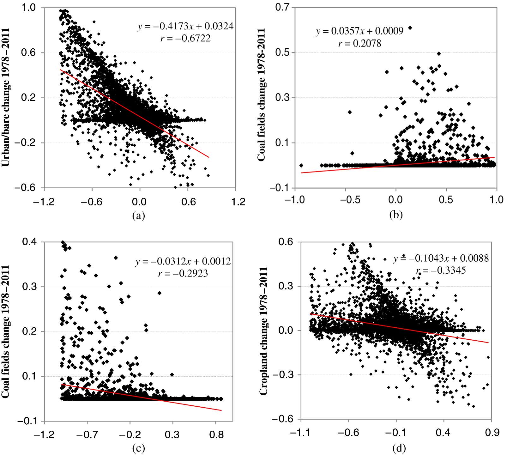]
]
]

---

# 12 Rules to Display Data Badly

.footnote[Wainer, H. (1984) **How to Display Data Badly**. _The American Statistician_ 38(2), pp. 137-147.]

--

.pull-left[
### Showing data

- Rule 1. Show as few data as possible (minimize the data density)
- Rule 2. Hide what data you do show (minimize the data-ink ratio)
]

--

.pull-right[
### Showing data accurately

- Rule 3. Ignore the visual metaphor altogether
- Rule 4. Only order matters
- Rule 5. Graph data out of context
]

--

### Showing data clearly

- Rule 6. Change scales in mid-axis
- Rule 7. Emphasize the trivial (ignore the important)
- Rule 8. Jiggle the baseline
- Rule 9. Austria first!
- Rule 10. Label illegibly, incompletely, incorrectly, and ambiguously
- Rule 11. More is murkier: more decimal places and more dimensions
- Rule 12. If it has been done well in the past, think of another way to do it

---

# Chart Rethinking: Exercise 1

.footnote[https://junkcharts.typepad.com]

.panelset[
.panel[.panel-name[Original]
.center[]
]
.panel[.panel-name[Iteration 1]
.center[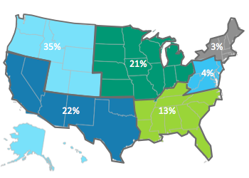]
]
.panel[.panel-name[Iteration 2]
.center[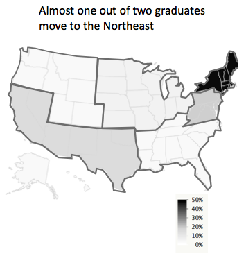]
]
]

---

# Chart Rethinking: Exercise 2

.footnote[https://junkcharts.typepad.com]

.panelset[
.panel[.panel-name[Original]
.center[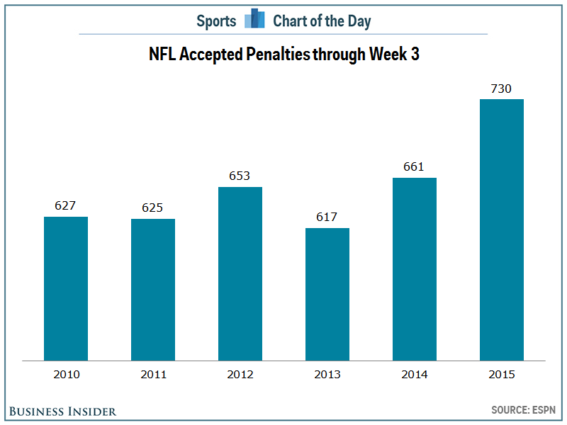]
]
.panel[.panel-name[Iteration 1]
.center[]
]
.panel[.panel-name[Iteration 2]
.center[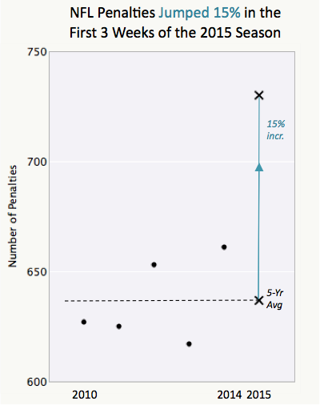]
]
]

---

# Chart Rethinking: Exercise 3

.footnote[https://www.datanalytics.com/]

.panelset[
.panel[.panel-name[Original]
.center[]
]
.panel[.panel-name[Original]
.center[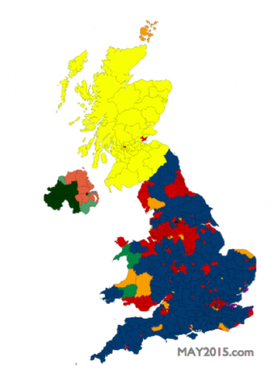]
]
.panel[.panel-name[Iteration 1]
.center[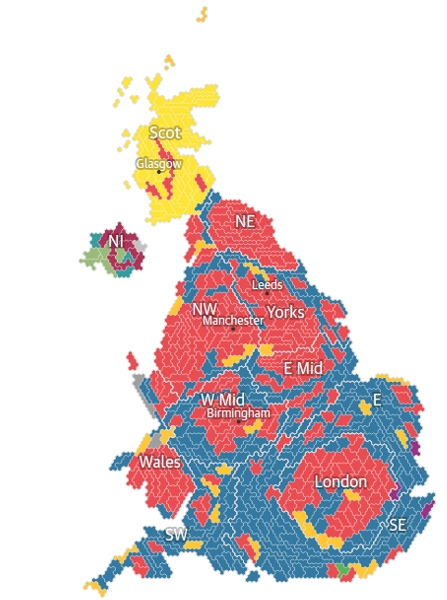]
]
]

---

# Chart Rethinking: Exercise 4

.footnote[https://junkcharts.typepad.com]

.panelset[
.panel[.panel-name[Original]
.center[]
]
.panel[.panel-name[Iteration 1]
.center[]
]
]

---

# Chart Rethinking: Exercise 5

.footnote[https://junkcharts.typepad.com]

.panelset[
.panel[.panel-name[Original]
.center[]
]
.panel[.panel-name[Iteration 1]
.center[]
]
.panel[.panel-name[A word of caution]
.center[]
]
]

---

# Chart Rethinking: Exercise 6

.footnote[Schwabish, J. A. (2014). _An Economist’s Guide to Visualizing Data_]

.panelset[
.panel[.panel-name[Original]
.center[]
]
.panel[.panel-name[Iteration 1]
.center[]
]
]

---

# Chart Rethinking: Exercise 7

.footnote[Schwabish, J. A. (2014). _An Economist’s Guide to Visualizing Data_]

.panelset[
.panel[.panel-name[Original]
.center[]
]
.panel[.panel-name[Iteration 1]
.center[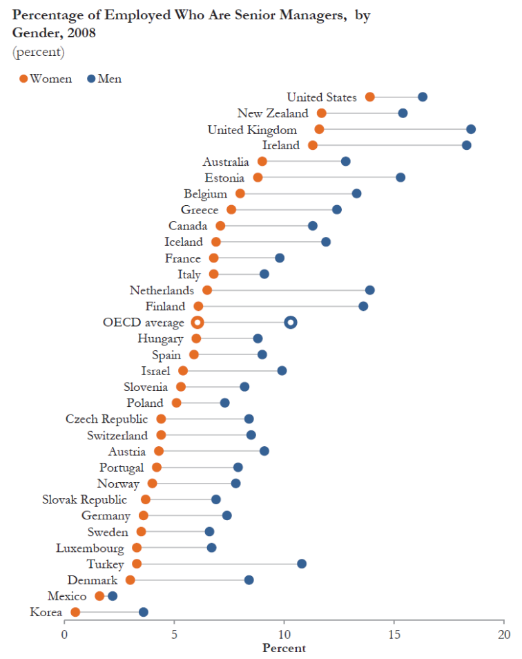]
]
]

---

# Chart Rethinking: Exercise 8

.footnote[Schwabish, J. A. (2014). _An Economist’s Guide to Visualizing Data_]

.panelset[
.panel[.panel-name[Original]
.center[]
]
.panel[.panel-name[Iteration 1]
.center[]
]
]

---
class: base24

# Summary

--

- We live surrounded by **bad charts**, either by deception or ineptitude.

--

- There are some **common patterns** to be aware of.<br>
  From those, we can distill a series of **basic rules**:

--

  - Pie charts are very rarely justified.
  - Areas are tricky.
  - 3D is rarely justified in 2D mediums.
  - Axes (cuts, scales...) should be clear.
  - Proper context should be shown when relevant.
  - Do not go beyond what data tells.
  - There are **well-established visual metaphors**.
      - E.g. up-down for positive-negative.
      - E.g. areas are perceived as whole quantities,<br>
        so cutting the axis is deceiving.
