class: base24, middle, clear

```{r child="ch1_0.Rmd"}
```

---
class: inverse, center, middle

# Graphical Perception
## Theory, Experimentation<br>and its Application to Data Display

---
class: base24

# Introduction

.footnote[Cleveland, W. S. (1985) _**The elements of graphing data**_. Wadsworth Inc.]


--

- When a graph is constructed, quantitative, categorical and ordinal data is
  **encoded** by symbols, geometry and color.

--

- _Graphical perception_ is the **visual decoding** of this encoded information.

--

- A graph is a _failure_ if the visual decoding fails.
  - No matter how intelligent the choice of information.
  - No matter how ingenious the encoding of information.
  - No matter how technologically impressive the production.

--

- Informed decisions about how to encode data must be based on knowledge of
  the visual decoding process.

---
class: base24

# Introduction

.footnote[Cleveland, W. S. (1985) _**The elements of graphing data**_. Wadsworth Inc.]

## Paradigm

1. A specification of **elementary graphical-perception tasks** (channels),<br>
  and an ordering of the tasks based on effectiveness.
  - Related to _pre-attentive vision_
  - As opposed to _graphical-cognition tasks_

2. A statement on the role of **distance** in graphical perception.

3. A statement on the role of **detection** in graphical perception.


The paradigm leads to principles of data display.

---

# Elements of Visual Encoding


.font170[
_Visual encoding_ is the (principled) way in which data is **mapped**
to visual structures:

- From _data items_ to **visual marks**
- From _data attributes_ to **visual channels**
]

---
class: base24

# Elements of Visual Encoding

.pull-left[
- **Data items**: sales
- **Data attributes**: price, profit, product type
].pull-left[
- **Visual marks**: point
- **Visual channels**: xy position, color
].pull-left[
.center[]
].pull-right[
- **Encoding rules**:
  - sale => point
  - price and profit => xy position
  - product type => color
]

---
class: base24

# Elements of Visual Encoding

.pull-left[
- **Data items**: co-occurrences
- **Data attributes**: name, cluster, frequency
].pull-left[
- **Visual marks**: point
- **Visual channels**: xy position, hue, intensity
].pull-left[
.center[]
].pull-right[
- **Encoding rules**:
  - co-occurrences => point
  - name => xy position
  - cluster => hue, _containment_
  - frequency => intensity
]

---

# Elements of Visual Encoding


.font170[
**Visual marks** are the basic visual objects/units
that represent data objects visually
]

.center[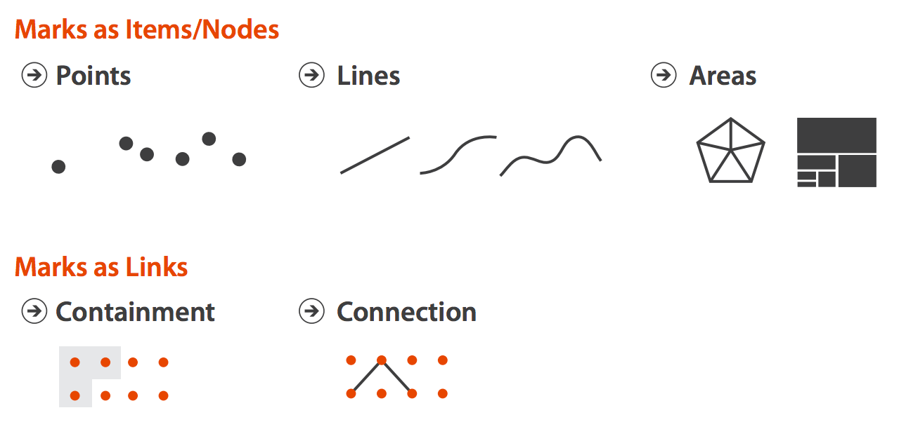]

---

# Elements of Visual Encoding

.font170[
**Visual channels** are visual variables we can use
to represent characteristics of visual objects
]

.center[]

---

# Elements of Visual Encoding


.center[]

---
class: base24

# Elements of Visual Encoding


.center[]

- **Identity channels**: information about _what_, _who_, _where_ something is
  - Example: color hue is suitable for _categories_

- **Magnitude channels**: information about _how much_
  - Example: position is suitable for _quantities_

---

# Elements of Visual Encoding

.panelset[
.panel[.panel-name[Exercises:]


.font140[
**For each of the following, identify**:

- Data item 1 => visual mark 1
- Data item 2 => visual mark 2
- ...
- Data attribute 1 => visual channel 1
- Data attribute 2 => visual channel 2
- ...
]
]
.panel[.panel-name[1]
.footnote[Source: [New York Times](https://www.nytimes.com/interactive/2012/08/05/sports/olympics/the-100-meter-dash-one-race-every-medalist-ever.html)]
.center[]
]
.panel[.panel-name[2]
.footnote[Source: [Gapminder](https://www.gapminder.org)]
.center[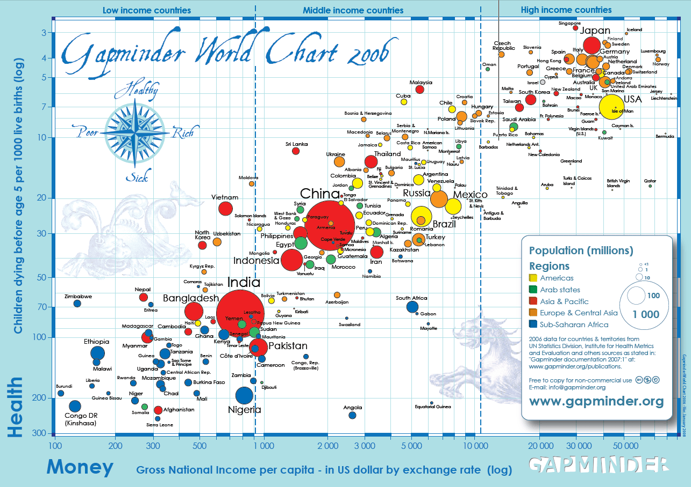]
]
.panel[.panel-name[3]
.footnote[Source: [Fathom](https://fathom.info/salaryper/)]
.center[]
]
.panel[.panel-name[4]
.footnote[Source: [Cargo Collective](https://payload.cargocollective.com/1/0/4829/577747/world-cup-infographic_8-1_xlarge_o.gif)]
.center[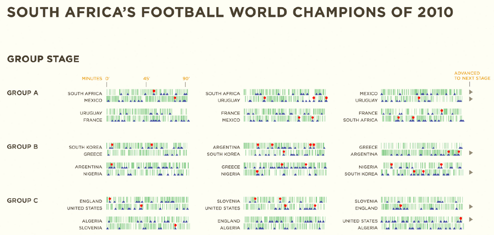]
]
.panel[.panel-name[5]
.footnote[Source: [New York Times](https://www.nytimes.com/interactive/2012/02/12/us/entitlement-map.html)]
.center[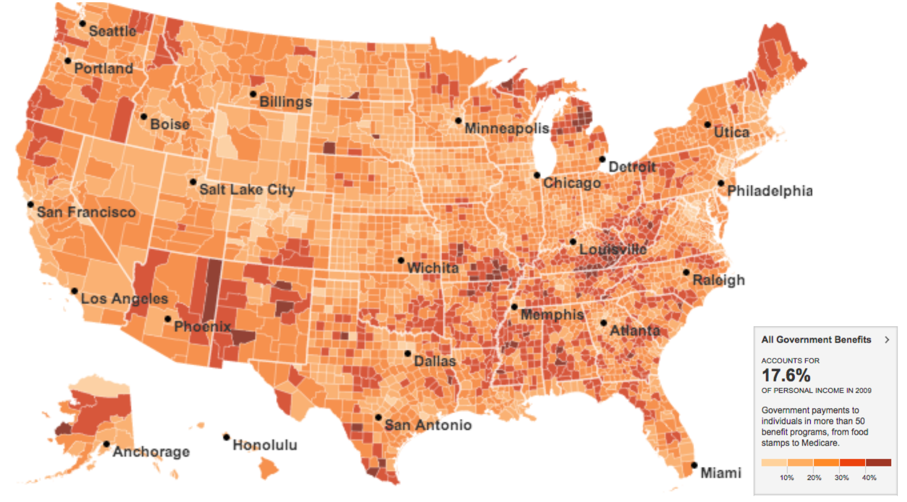]
]
.panel[.panel-name[6]
.footnote[Source: [Nature](https://www.nature.com/srep/2011/111215/srep00196/full/srep00196.html)]
.center[]
]
]

---

# Expressiveness Principle


.font170[
Visual information should express all and **only** the information in the data
]


.font140[
E.g., ordered data should not appear as unordered or vice versa
]

---

# Example: What Does Position Encode?

.center[]

---

# Effectiveness Principle


.font170[
The importance of the information should match the **salience** of the channel
]

---

# Effectiveness Rank

.center[]

---
class: base24

# Channel Effectiveness


- **Accuracy**: How accurately values can be estimated

- **Discriminability**: How many different values can be perceived

- **Separability**: How much interaction there is with multiple encodings

- **Popout**: How easy it is to spot some values from the rest

- **Grouping**: How good a channel is in conveying groups

---

# Accuracy

.center[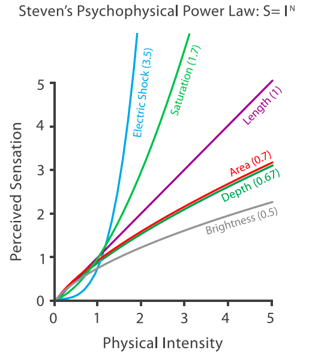]

---

# Accuracy

.center[]

---

# Accuracy


.font170[
**Implications for design**: be mindful of the ranking of visual variables.
**Use the highest ranked channels** for the most important information
whenever possible.
]


.font140[
Keep in mind: position and thus _spatial layout_ is the king of visual channels.
**Think about how you use space first**.
]

---
class: base24

# Accuracy

.footnote[Source: [Stephen Few](http://www.perceptualedge.com/articles/visual_business_intelligence/displays_for_combining_time-series_and_part-to-whole.pdf)]

- Which one is more effective to compare sale trends across regions? Why?


.center[]

---
class: base24

# Discriminability

- How many values can we distinguish for any given channel?
- **Rule**: the number of available bins should match the number of bins we
  want to be able to see from the data

.pull-left[
.center[]
]

.pull-right[
.center[]
]

---

# Discriminability


.font170[
**Implications for design**: do not overestimate the number of available bins.
For most visual channels, the number is surprisingly low.
]


.font140[
When you have too many categories, find a way to group/bin the data further
]

---
class: base24

# Discriminability

... or switch channels! (E.g. color-space trade-off)

.pull-left[
.center[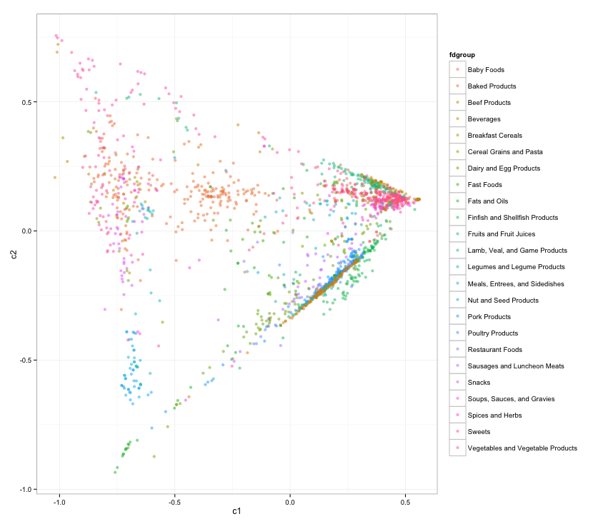]
]

.pull-right[
.center[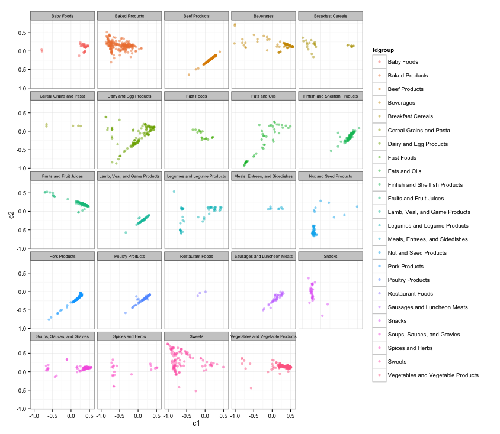]
]

---

# Separability


.center[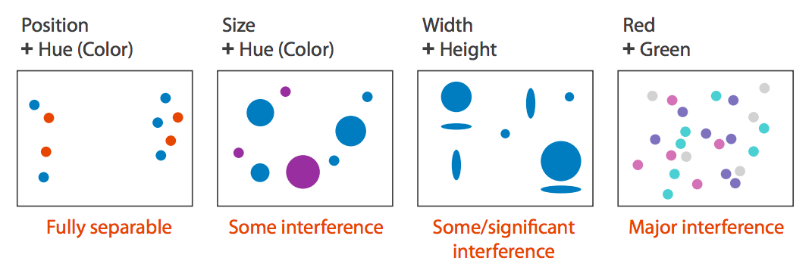]

---

# Separability


.center[
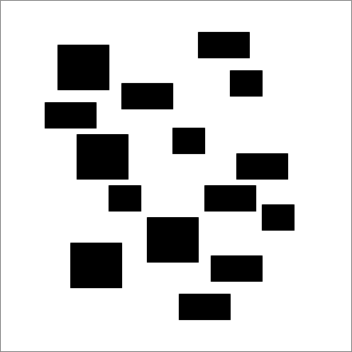
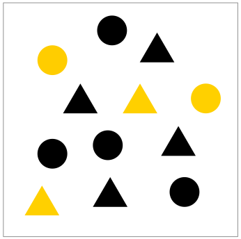

]


Width + height

Shape + color

Position + color

---

# Separability


.center[]

---
class: base24

# Popout

.pull-left[
- Preattentive features
- See [Perception in visualization](https://www.csc2.ncsu.edu/faculty/healey/PP/)
  by C. G. Healey
]

.pull-right[
.center[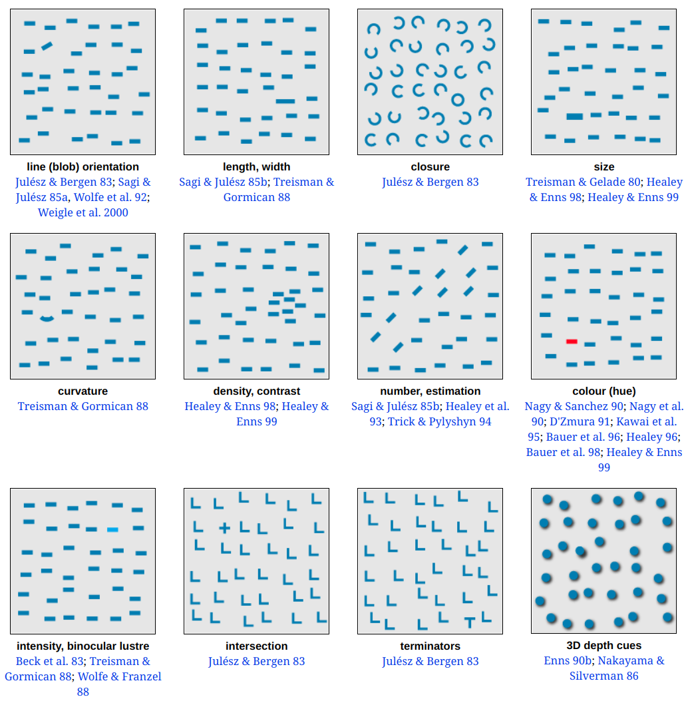]
]

---

# Separability, Popout


.font170[
**Implications for design**: do not encode data with too many non-spatial
visual channels.
]


.font140[
Use separable dimensions.<br>
To direct attention, use preattentive features.
]

---
class: base24

# Grouping


.pull-left[


- Containment and connection


- Proximity


- Similarity (identity)
]
.pull-right[
.center[]
]

---
class: base24

# Summary


--

- Visual encoding is the (principled) way in which data (items and attributes)
  is **mapped** to visual structures (marks and channels).

--

- Visual information should express all and **only** the information in the data,
  **highlighting** the important bits with effective channels.

--

- Channel **effectiveness** depends on accuracy, discriminability, separability,
  popout, and grouping, and there is a **ranking** based on scientific experiments
  to keep in mind for every visualization.
