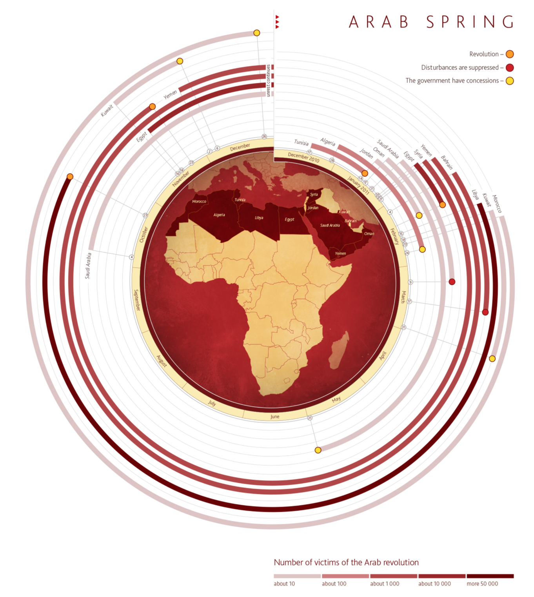

class: base24, middle, clear

```{r child="ch1_0.Rmd"}
```

---
class: inverse, center, middle

# Principles of Graphical Representation
## Some Useful General Guidelines

---
class: base24

# Attitude

There are three basic questions that is very useful to keep asking yourself
over and over again as you are designing new visual representations:

--

.font100[
- **What is it for?**
  - What is the problem that I am trying to solve?
  - What **questions** do I want my reader/user to be able to answer looking at this?
]

--

.font100[
- **What can I see here?**
  - What information can I extract out of this representation?
  - How much effort is it needed to extract such information?
  - How much confidence do I have in this information?
]

--

.font100[
- **How can I improve it?**
  - Being able to think about alternate solutions is<br>
    **the most important skill**
]

---

# Chart Rethinking: Exercise 9

.footnote[Source: [The Functional Art](http://www.thefunctionalart.com/2015/02/redesigning-circular-timeline.html), by Alberto Cairo]

.panelset[
.panel[.panel-name[Original]
.pull-left.font120[
- **What is it for?**


- **What can I see here?**


- **How can I improve it?**
]
.pull-right[
.center[]
]
]
.panel[.panel-name[Iteration 1]
.center[]
]
]

---
class: base24

# General Guidelines


--

- **Do not over-aggregate data**

--

- **Unit-based visualizations**
  - Every data item is represented by a single graphical mark
  - Every data attribute is represented by a single channel

--

- **Tufte's _high-information graphics_**
  - "Data-rich designs give **context and credibility** to statistical evidence"
  - "High-density graphics help us **compare** parts of the data by displaying
    much information **within the view of the eye**"

--

- **Keep a critical attitude**
