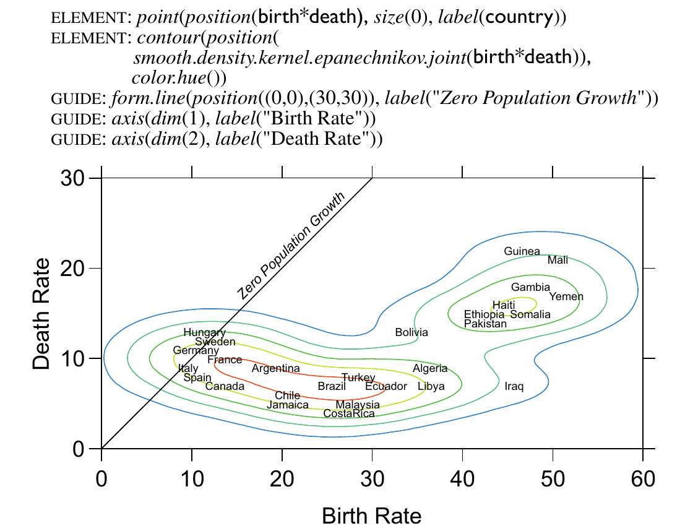
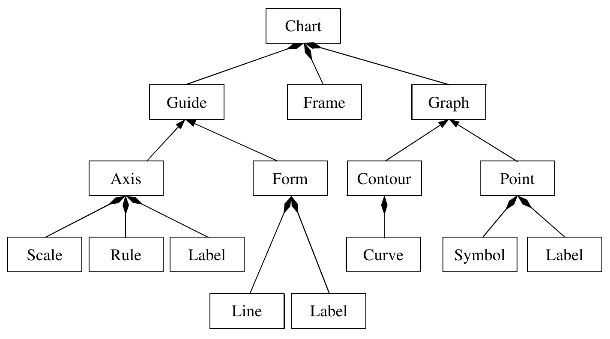

class: toc, base24, middle, clear

```{r setup, include=FALSE}
options(htmltools.dir.version=FALSE)
knitr::opts_chunk$set(message=FALSE, warning=FALSE, fig.align="center", dpi=150)

library(ggplot2)
theme_set(theme_gray(base_size=16))
```

```{r xaringanExtra, echo=FALSE}
xaringanExtra::use_share_again()
xaringanExtra::style_share_again(share_buttons="none")
xaringanExtra::use_scribble()
xaringanExtra::use_panelset(in_xaringan=TRUE)
```

---
class: intoc, inverse, center, middle

# Building Graphs Layer by Layer

---
class: base24

# An Object-Oriented Graphics System

.footnote[Wilkinson, L. (2005) _**The grammar of graphics**_. Springer New York.]

--

- Graphics are collections of **objects** that follow a set of rules, a **grammar**,
  so that they behave consistently and flexibly.

--

- The specification of the formal language is expressed in six statements:
  1. **DATA**: a set of data operations that create variables from datasets,
  2. **TRANS**: variable transformations (e.g., rank),
  3. **SCALE**: scale transformations (e.g., log),
  4. **COORD**: a coordinate system (e.g., polar),
  5. **ELEMENT**: marks (e.g., points) and their aesthetic attributes (e.g., color),
  6. **GUIDE**: one or more guides (axes, legends, etc.).

--

- These components link data to (visual) objects and specify a scene containing those.

---

# An Object-Oriented Graphics System

.center[]

---

# An Object-Oriented Graphics System

.center[]

---
class: base24

# About ggplot2

- An R package for producing statistical graphics

- Underlying grammar based on the **Grammar of Graphics** (thus GG)

--

- Instead of being limited to sets of pre-defined graphics, 
  it allows to **compose** graphs by combining (adding, `+`) components

--

- Simple set of core principles (+ some very few special cases)

- Carefully chosen defaults

--

- Good for **quick prototyping**, designed to work iteratively

- But also **publication-quality graphics**, with a comprehensive theming system

--

- Lots of [extensions](https://exts.ggplot2.tidyverse.org/)!

---
class: base24

# ggplot2 Basics

- Requires [**tidy data**](https://vita.had.co.nz/papers/tidy-data.html):
  1 observation per row, 1 variable per column:

```{r, echo=FALSE}
set.seed(2)
knitr::kable(gapminder::gapminder[sample(nrow(gapminder::gapminder), 3), ])
```

--

- All plots are composed of **data** and **mapping**, the description of how
  data attributes are mapped to **aes**thetic attributes (channels).

--

- Basic workflow:

```{r, eval=FALSE}
ggplot(data) + # create the graphic object with the data
  aes(x=..., y=..., color=...) + # add the general mapping
  ... # add more components (geoms, scales, coords, facets, themes...)
```

---
class: base24

# ggplot2 Basics

There are five types of components:

--

- A _layer_ is a collection of **geom**etric elements (points, lines...)
  and **stat**istical transformations (binning, counting...).

--

- A **scale** controls a channel, adds or modifies how attributes are mapped
  (position, color, shape, size...).

--

- A **coord**inate system describes how data coordinates are mapped to
  the plane of the graphic. It also provides axes and gridlines.

--

- A **facet** specifies how to break up and display subsets of data as small
  multiples (AKA _conditioning_, _latticing_ or _tresllising_).

--

- A **theme** controls the finer points of display to create attractive plots
  (background, fonts, guide aspect and positioning...).

---

# Aesthetic Specifications

.footnote[Read the comprehensive [guide on aesthetics](https://ggplot2.tidyverse.org/articles/ggplot2-specs.html).]

.font120[
- Mastering data **mappings** is an important (the most important?) skill.
]

--

.font120[
- Each **geom** is affected by **a different set of aesthetics**:
]

.pull-left[
From `?geom_point` (required in bold):

> - **`x`**
> - **`y`**
> - `alpha`
> - `colour`
> - .blue[`fill`]
> - `group`
> - .red[`shape`]
> - `size`
> - .blue[`stroke`]
]

.pull-right[
From `?geom_line` (required in bold):

> - **`x`**
> - **`y`**
> - `alpha`
> - `colour`
> - `group`
> - .red[`linetype`]
> - `size`
]

---

# Individual Geoms

| Geom | Result | Details |
|---|---|---|
| `geom_point()`<br>`geom_text()`<br>`geom_label()` | **scatterplot** | Understands `shape`.<br>Helper for text.<br>Helper for labels. |
| `geom_line()`<br>`geom_path()`<br>`geom_step()`<br>`geom_function()` | **line plot** | Connects points from left to right, understands `linetype`.<br>Connects points in order.<br>Produces a _stairstep_ plot.<br>Connects points of a given function of`x`. |
| `geom_bar()`<br>`geom_col()` | **bar chart** | `stat="count"` by default!<br>Multiple bars are stacked by default. |
| `geom_area()` | **area plot** | Line plot filled from 0 to `y`. |
| `geom_polygon()` |  | Filled path. |
| `geom_rect()`<br>`geom_tile()`<br>`geom_raster()` |  | Rectangle by `xmin`, `xmax`, `ymin`, `ymax`.<br>Rectangle by center (`x`, `y`) and size (`width`, `height`).<br>Faster tiles with constant size. |

---

# Individual Geoms

- Two dimensional: require `x` and `y`, understand `color` and `size`.
- Some of them can be `fill`ed.

```{r individual, echo=FALSE, fig.asp=0.3}
df <- data.frame(
  x = c(3, 1, 5),
  y = c(2, 4, 6),
  label = c("a","b","c")
)
p <- ggplot(df, aes(x, y, label = label)) +
  labs(x = NULL, y = NULL) + theme_light() +
  theme(plot.title = element_text(size = 12))
patchwork::wrap_plots(
  p + geom_point() + ggtitle("geom_point()"),
  p + geom_text() + ggtitle("geom_text()"),
  p + geom_col() + ggtitle("geom_col()"),
  p + geom_tile() + ggtitle("geom_tile()"),
  nrow = 1
)
patchwork::wrap_plots(
  p + geom_line() + ggtitle("geom_line()"),
  p + geom_area() + ggtitle("geom_area()"),
  p + geom_path() + ggtitle("geom_path()"),
  p + geom_polygon() + ggtitle("geom_polygon()"),
  nrow = 1
)
```

---

# Collective Geoms

- Dealing with point overplotting

| Geom | Result | Details |
|---|---|------|
| `geom_jitter()`<br>`geom_count()`<br>`geom_bin_2d()`<br>`geom_hex()` |  | `geom_point()`, but adds some jitter to each point.<br>Maps the count of overlapping points to `size`.<br>Maps the count of rectangles to `fill`.<br>Same, but using hexagons. |

```{r collective-1, echo=FALSE, fig.asp=0.3}
p <- ggplot(mpg, aes(hwy, cty)) +
  labs(x = NULL, y = NULL) + theme_light() +
  theme(plot.title = element_text(size = 10)) +
  theme(legend.position="none")
patchwork::wrap_plots(
  p + geom_point(alpha=0.2) + ggtitle("geom_point()"),
  p + geom_jitter(alpha=0.2) + ggtitle("geom_jitter()"),
  p + geom_count(alpha=0.2) + ggtitle("geom_count()"),
  p + geom_bin_2d() + ggtitle("geom_bin_2d()"),
  p + geom_hex() + ggtitle("geom_hex()"),
  nrow = 1
)
```

---

# Collective Geoms

- Dealing with uncertainty

| Geom | Result | Details |
|---|---|------|
| `geom_pointrange()`<br>`geom_linerange()`<br>`geom_errorbar()`<br>`geom_crossbar()` |  | Various ways of representing a vertical intervals defined by `x`, `ymin` and `ymax`. |
| `geom_ribbon()` |  | Special case of `geom_area()` with `ymin` too. |

```{r collective-2, echo=FALSE, fig.asp=0.3}
df <- data.frame(
  x = 1:3,
  y = c(18, 11, 16),
  se = c(1.2, 0.5, 1.0)
)
p <- ggplot(df, aes(x, y, ymin=y-se, ymax=y+se)) +
  labs(x = NULL, y = NULL) + theme_light() +
  theme(plot.title = element_text(size = 8))
patchwork::wrap_plots(
  p + geom_pointrange() + ggtitle("geom_pointrange()"),
  p + geom_linerange() + ggtitle("geom_linerange()"),
  p + geom_errorbar() + ggtitle("geom_errorbar()"),
  p + geom_crossbar() + ggtitle("geom_crossbar()"),
  p + geom_ribbon() + ggtitle("geom_ribbon()"),
  nrow = 1
)
```

---

# Collective Geoms

- Arbitrary segments

| Geom | Result | Details |
|---|---|------|
| `geom_segment()`<br>`geom_curve()`<br>`geom_spoke()` |  | Straight line between points (`x`, `y`) and (`xend`, `yend`).<br>Same, but curved line.<br>Polar parametrization of `geom_segment()`. |

```{r collective-3, echo=FALSE, fig.asp=0.35}
set.seed(1)
df <- expand.grid(x = 1:3, y=1:3)
df$angle <- runif(9, 0, 2*pi)
df$r <- runif(9, 0.2, 0.7)
df$xend <- df$x + df$r * cos(df$angle)
df$yend <- df$y + df$r * sin(df$angle)

p <- ggplot(df, aes(x, y, xend=xend, yend=yend, angle=angle, radius=r)) +
  geom_point() +
  labs(x = NULL, y = NULL) + theme_light() +
  theme(plot.title = element_text(size = 12))
patchwork::wrap_plots(
  p + geom_segment() + ggtitle("geom_segment()"),
  p + geom_curve() + ggtitle("geom_curve()"),
  p + geom_spoke() + ggtitle("geom_spoke()"),
  nrow = 1
)
```

---

# Collective Geoms

- Distributions

| Geom | Result | Details |
|---|---|------|
| `geom_histogram()`<br>`geom_freqpoly()`<br>`geom_dotplot()` | **histogram** | Distribution of a continuous variable by bins.<br>To display the counts with lines instead.<br>Histograms of stacked dots. |
| `geom_density()` | **density plot** | Smoothed version of the histogram. |
| `geom_rug()` |  | Draws ticks for marginal distributions. |

```{r collective-4, echo=FALSE, fig.asp=0.3}
p <- ggplot(mtcars, aes(x = mpg)) +
  labs(x = NULL, y = NULL) + theme_light() +
  theme(plot.title = element_text(size = 12))
patchwork::wrap_plots(
  p + geom_histogram(binwidth=1.5) + ggtitle("geom_histogram()"),
  p + geom_freqpoly(binwidth=1.5) + ggtitle("geom_freqpoly()"),
  p + geom_dotplot(binwidth=1.5) + ggtitle("geom_dotplot()"),
  p + geom_density() + geom_rug() +
    ggtitle("geom_density()") + labs(caption="+ geom_rug()"),
  nrow = 1
)
```

---

# Collective Geoms

- Boxplots

| Geom | Result | Details |
|---|---|------|
| `geom_boxplot()`<br>`geom_violin()` | **boxplot** | Compact display of the distribution of a continuous variable.<br>Mirrored density, displayed as a boxplot. |

```{r collective-5, echo=FALSE, fig.asp=0.4}
p <- ggplot(mtcars, aes(factor(cyl), mpg)) +
  labs(x = NULL, y = NULL) + theme_light() +
  theme(plot.title = element_text(size = 12))
patchwork::wrap_plots(
  p + geom_dotplot(binaxis="y", stackdir="center") +
    ggtitle("geom_dotplot()") + labs(caption='with binaxis="y", stackdir="center"'),
  p + geom_boxplot() + ggtitle("geom_boxplot()"),
  p + geom_violin() + ggtitle("geom_violin()"),
  nrow = 1
)
```

---

# Collective Geoms

- Smoothing lines

| Geom | Result | Details |
|---|---|------|
| `geom_smooth()`<br>`geom_quantile()` |  | Fits a model and draws a smoothing line.<br>Fits a quantile regression and draws the quantiles. |

```{r collective-6, echo=FALSE, fig.asp=0.4}
p <- ggplot(mpg, aes(displ, 1 / hwy)) + geom_point() +
  labs(x = NULL, y = NULL) + theme_light() +
  theme(plot.title = element_text(size = 12))
patchwork::wrap_plots(
  p + geom_smooth(method="lm") + ggtitle("geom_smooth(method=\"lm\")"),
  p + geom_quantile() + ggtitle("geom_quantile()"),
  nrow = 1
)
```

---

# Collective Geoms

- Contours

| Geom | Result | Details |
|---|---|------|
| `geom_contour()`<br>`geom_contour_filled()`<br>`geom_density_2d`<br>`geom_density_2d_filled()` | **contour plot** | 2D contours of 3D surfaces of regular `x`, `y`.<br>Filled version.<br>2D contours after computing the density.<br>Filled version. |

```{r collective-7, echo=FALSE, fig.asp=0.3}
p <- ggplot(faithfuld, aes(waiting, eruptions)) +
  labs(x = NULL, y = NULL) + theme_light() +
  theme(plot.title = element_text(size = 10)) +
  theme(legend.position="none")
patchwork::wrap_plots(
  p + geom_point(aes(color=density), size=0.01, shape=".") +
    scale_color_viridis_c() +
    geom_contour(aes(z=density)) + ggtitle("geom_contour()"),
  p + geom_contour_filled(aes(z=density)) + ggtitle("geom_contour_filled()"),
  p %+% faithful + geom_point(size=0.5) +
    scale_color_viridis_c() + geom_density2d() + ggtitle("geom_density2d()"),
  p %+% faithful + geom_density2d_filled() + ggtitle("geom_density2d_filled()"),
  nrow = 1
)
```

---

# Collective Geoms

- Maps

| Geom | Result | Details |
|---|---|------|
| `geom_map()`<br>`geom_sf()`<br>`geom_sf_text()`<br>`geom_sf_label()` | **map** | Old way to plot polygons as a map.<br>Current recommended way via `sf`.<br>Similar to `geom_text()` but for `sf`.<br>Similar to `geom_label()` but for `sf`. |

```{r collective-8, echo=FALSE, fig.asp=0.3}
nc <- sf::st_read(system.file("shape/nc.shp", package="sf"), quiet=TRUE)
ggplot(nc) +
  theme(plot.title = element_text(size = 10)) + theme_light() +
  geom_sf(aes(fill=BIR74)) + scale_fill_viridis_c() + ggtitle("geom_sf()")
```

---

# Geom vs. Stat

.pull-left[
```{r stat-identity-1}
ggplot(mpg, aes(displ, hwy)) +
  geom_point(stat="identity") #<<
```
]
.pull-right[
```{r stat-identity-2}
ggplot(mpg, aes(displ, hwy)) +
  stat_identity(geom="point") #<<
```
]

---

# Geom vs. Stat

.pull-left[
```{r stat-count-1}
ggplot(mpg, aes(hwy)) +
  geom_bar(stat="count") #<<
```
]
.pull-right[
```{r stat-count-2}
ggplot(mpg, aes(hwy)) +
  stat_count(geom="bar") #<<
```
]

---

# Geom vs. Stat

.pull-left[
```{r stat-smooth-1}
ggplot(mpg, aes(displ, hwy)) +
  geom_smooth(stat="smooth") #<<
```
]
.pull-right[
```{r stat-smooth-2}
ggplot(mpg, aes(displ, hwy)) +
  stat_smooth(geom="smooth") #<<
```
]

---
class: inverse, center, middle

# Tutorial 01
## [Building Graphs Layer by Layer](../tutorials/01/)

---
class: intoc, inverse, center, middle

# Scales and Guides

---
class: base24

# Scale Specification

A **scale** is a procedure that performs the mapping of data attributes into channels (position, color, size...):

- sets the **limits**;

- sets an optional **transformation** (without modifying the data);

- sets a **guide**.

--

.pull-left[
A **guide** allows us to revert the procedure and recover the data:

- an axis or a legend, depending on the channel;

- has a name, breaks, labels...
]
.pull-right[
.center[]
]

---

# Scale Specification

.font150[
Naming: `scale_<aes>_<type>(<arguments>)`
]


.font120[
| Element | Argument | Shortcut function |
|--------:|:---------|:------------------|
| Title   | `name=...`   | `labs(x=..., y=..., color=..., ...)` |
| Limits  | `limits=...` | `lims(x=..., y=..., color=..., ...)` |
| Breaks  | `breaks=...` | |
| Labels  | `labels=...` | |
| Guide   | `guide=...`  | `guides(x=..., y=..., color=..., ...)` |
| Transformation | `trans=...` | |
]

---
class: inverse, center, middle

# Tutorial 02
## [Scales and Guides](../tutorials/02/)

---
class: intoc, inverse, center, middle

# Coordinate Systems

---
class: base24

# Cartesian Coordinates


`coord_cartesian()`: default, no need to be specified

- ... although it is useful to set axes limits (via `xlim` and `ylim` arguments).

- Position given by orthogonal distances, `x` and `y`, to an origin.

--

Some helper functions:

- `coord_flip()`: helper to flip the axes.

- `coord_fixed()`: helper to fix the aspect ratio.

- `coord_trans()`: helper to transform the axes.

---
class: base24

# Other Coordinates


- `coord_polar()`: `x` is the angle, `y` is the radius (can be reverted).

- `coord_map()`: projections of the sphere into a plane.
  - Mercator, sinusoidal, cylindrical, rectangular...
  - Anything supported by the `mapproj` package.

- `coord_sf()`: modern way to deal with maps via **simple features**<br>
  (from `sf` package).

---
class: inverse, center, middle

# Tutorial 03
## [Coordinate Systems](../tutorials/03/)

---
class: intoc, inverse, center, middle

# Faceting

---
class: base24

# Facet Specification


.center[]

---

# Facet Specification

.pull-left[
```{r facet-grid, echo=FALSE, fig.asp=1.3}
df <- data.frame(
  year = c(2015, 2015, 2016, 2016),
  time = c("Day", "Night", "Day", "Night"),
  x = 0, y = 0
)
df$label = with(df, paste0("Subset for\n", time, " x ", year))
ggplot(df) + aes(x, y, label=label) + geom_text(size=6) +
  theme_bw(base_size = 30) + theme(
    axis.ticks = element_blank(),
    axis.text = element_blank(),
    axis.title = element_blank(),
    panel.grid = element_blank()) +
  facet_grid(time ~ year) + labs(title="facet_grid(time ~ year)")
```
]
.pull-right[
```{r facet-wrap, echo=FALSE, fig.asp=1.3}
df <- data.frame(
  season = c("Autumn", "Spring", "Summer", "Winter"),
  x = 0, y = 0
)
df$label = with(df, paste0("Subset for\n", season))
ggplot(df) + aes(x, y, label=label) + geom_text(size=6) +
  theme_bw(base_size = 30) + theme(
    axis.ticks = element_blank(),
    axis.text = element_blank(),
    axis.title = element_blank(),
    panel.grid = element_blank()) +
  facet_wrap(~ season) + labs(title="facet_wrap(~ season)")
```
]

---
class: inverse, center, middle

# Tutorial 04
## [Faceting](../tutorials/04/)

---
class: intoc, inverse, center, middle

# Themes

---
class: base24

# Theme Specification

.footnote[Source: [ggplot2 Theme Elements Demonstration](https://henrywang.nl/ggplot2-theme-elements-demonstration/) by Henry Wang]

.center[]

---
class: inverse, center, middle

# Tutorial 05
## [Themes](../tutorials/05/)

---
class: intoc, inverse, center, middle

# Annotations

---
class: base24

# Types of Annotations

.pull-left[

]
.pull-right[
```{r annotations0, echo=FALSE, fig.asp=1.25}
p <- ggplot(mpg) +
  aes(displ, hwy) +
  geom_point(aes(color=factor(cyl)))
p
```
]

---
class: base24

# Types of Annotations

.pull-left[
- Guides (axes and legend)
]
.pull-right[
```{r annotations1, echo=FALSE, fig.asp=1.25}
p <- p +
  labs(
    x = "Engine displacement [litres]",
    y = "Highway mileage [miles/gallon]",
    color = "Number of\ncylinders"
  )
p
```
]

---
class: base24

# Types of Annotations

.pull-left[
- Guides (axes and legend)

- Titles (title, subtitle and caption)
]
.pull-right[
```{r annotations2, echo=FALSE, fig.asp=1.25}
p <- p +
  labs(
    title = "Mileage by engine size and cylinders",
    subtitle = paste(
      "Highway mileage seems to be correlated with engine size,",
      "but differences are mostly driven by the number of cylinders",
      sep="\n"),
    caption = "Source: http://fueleconomy.gov"
  )
p
```
]

---
class: base24

# Types of Annotations

.pull-left[
- Guides (axes and legend)

- Titles (title, subtitle and caption)

- Text labels
]
.pull-right[
```{r annotations3, echo=FALSE, fig.asp=1.25}
p <- p +
  annotate("text", x=1.5, y=15, label="Very important point", hjust=0) +
  annotate("segment", x=2, y=16, xend=2.6, yend=19.6, arrow=arrow())
p
```
]

---
class: base24

# Types of Annotations

.pull-left[
- Guides (axes and legend)

- Titles (title, subtitle and caption)

- Text labels

- Reference lines
]
.pull-right[
```{r annotations4, echo=FALSE, fig.asp=1.25}
p <- p +
  geom_hline(yintercept=40, linetype="dashed") +
  annotate("text", x=2.2, y=41, hjust=0, label="Outliers")
p
```
]

---
class: base24

# Types of Annotations

.pull-left[
- Guides (axes and legend)

- Titles (title, subtitle and caption)

- Text labels

- Reference lines

- Reference areas
]
.pull-right[
```{r annotations5, echo=FALSE, fig.asp=1.25}
p <- p +
  annotate("rect", xmin=-Inf, xmax=Inf, ymin=40, ymax=Inf, color=NA, fill="red", alpha=0.2)
p
```
]

---
class: base24

# Types of Annotations

.pull-left[
- Guides (axes and legend)

- Titles (title, subtitle and caption)

- Text labels

- Reference lines

- Reference areas

- Direct labeling
]
.pull-right[
```{r annotations6, echo=FALSE, fig.asp=1.25}
p <- p +
  ggforce::geom_mark_ellipse(aes(label=cyl, group=cyl)) +
  theme(legend.position="none")
p
```
]

---
class: inverse, center, middle

# Tutorial 06
## [Annotations](../tutorials/06/)

---
class: intoc, inverse, center, middle

# Arranging Plots

---
class: base24

# Types of Arrangements

.pull-left[
- Compositions

```{r compositions, echo=FALSE, fig.asp=1.15}
library(patchwork)

p1 <- ggplot(mpg) +
  aes(displ, hwy) +
  geom_point() +
  labs(title="Plot 1")

p2 <- ggplot(mpg) +
  aes(as.character(year), fill=drv) +
  geom_bar(position="dodge") +
  labs(title="Plot 2", x="year")

p3 <- ggplot(mpg) +
  aes(hwy, fill=drv) +
  geom_density(color=NA) +
  facet_grid(drv~.) +
  labs(title="Plot 3")

p4 <- ggplot(mpg) +
  aes(drv, hwy) +
  stat_summary(aes(fill=drv), geom="col", fun.data=mean_se) +
  stat_summary(geom="errorbar", fun.data=mean_se, width=0.5) +
  labs(title="Plot 4")

layout <- "
AAB
CEB
CDD
"

p1 + p2 + p3 + p4 + guide_area() +
  plot_layout(guides="collect", design=layout) +
  plot_annotation(
    title="This is a patchwork composition of 4 plots",
    tag_levels="a", tag_suffix=")")
```
]
.pull-right[
- Insets

```{r insets, echo=FALSE, fig.asp=1.15}
xlim <- c(2.9, 3.2)
ylim <- c(23, 28)

zoom <- 3.5
xlim_zoom <- 4.5 + c(0, diff(xlim)*zoom)
ylim_zoom <- 45 - c(diff(ylim)*zoom, 0)

p_zoom <- p1 +
  coord_cartesian(xlim=xlim, ylim=ylim, expand=FALSE) +
  labs(title=NULL) +
  theme_light() +
  theme(
    axis.title = element_blank(),
    plot.background = element_blank(),
    plot.margin = unit(c(0, 0, 0, 0), "mm")
  )

p1 +
  annotate("rect", xmin=xlim[1], xmax=xlim[2], ymin=ylim[1], ymax=ylim[2],
           fill=NA, color="black") +
  annotate("segment", x=xlim[2], xend=xlim_zoom[2], y=ylim[1], yend=ylim_zoom[1], linetype="dashed") +
  annotate("segment", x=xlim[1], xend=xlim_zoom[1], y=ylim[2], yend=ylim_zoom[2], linetype="dashed") +
  annotation_custom(ggplotGrob(p_zoom), xlim_zoom[1], xlim_zoom[2], ylim_zoom[1], ylim_zoom[2])
```
]

---
class: base24

# Panel Alignment

.pull-left[
- None

```{r alignment-none, echo=FALSE, fig.asp=0.575, fig.show="hold"}
p1
p3 + labs(title=NULL)
```
]
.pull-right[
- With [`patchwork`](https://patchwork.data-imaginist.com/)

```{r alignment-patchwork, echo=FALSE, fig.asp=1.15}
p1 / (p3 + labs(title=NULL))
```
]

---
class: inverse, center, middle

# Tutorial 07
## [Arranging Plots](../tutorials/07/)
