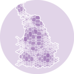

class: toc, base24, middle, clear

```{r setup, include=FALSE}
options(htmltools.dir.version=FALSE)
knitr::opts_chunk$set(message=FALSE, warning=FALSE, fig.align="center", dpi=150)

library(ggplot2)
theme_set(theme_gray(base_size=16))
library(dplyr)
set.seed(42)
```

```{r xaringanExtra, echo=FALSE}
xaringanExtra::use_share_again()
xaringanExtra::style_share_again(share_buttons="none")
xaringanExtra::use_scribble()
xaringanExtra::use_panelset(in_xaringan=TRUE)
```

---
class: intoc, inverse, center, middle

# Directory of Visualizations
## Based on [The R Graph Gallery](https://r-graph-gallery.com/)

---
class: base24

# Contents

.pull-left[
- .distribution[[Distribution](#5)].icons[
  
  
  
  
  
  ]

- .correlation[[Correlation](#32)].icons[
  
  
  
  
  
  
  ]

- .ranking[Ranking].icons[
  
  
  
  
  
  
  ]

- .part[Part of a Whole].icons[
  
  
  
  
  
  
  ]
]
.pull-right[
- .evolution[Evolution].icons[
  
  
  
  
  
  ]

- .map[Map].icons[
  
  
  
  
  
  
  ]

- .flow[Flow].icons[
  
  
  
  
  
  ]

- .other[Other resources].icons[
  
  
  
  
  ]
]

---
class: distribution

# Distribution
.footnote[[< Contents](#4)]

[](https://r-graph-gallery.com/violin.html)
[](https://r-graph-gallery.com/density-plot.html)
[](https://r-graph-gallery.com/histogram.html)
[](https://r-graph-gallery.com/boxplot.html)
[](https://r-graph-gallery.com/ridgeline-plot.html)

.bottom[Violin]
.bottom[Density]
.bottom[Histogram]
.bottom[Boxplot]
.bottom[Ridgeline]

<br>

.black.font120[
- Visualization of one or multiple **univariate distributions**

- Stacked versions are difficult to interpret and should be avoided

- Some require fine-tuning of the parameters to avoid being misleading
]

---
class: distribution

# Distribution  Histogram
.footnote[[< Contents](#4)]

.pull-left-mod[
```{r histogram, eval=FALSE}
ggplot(mpg) +
  aes(hwy) +
  geom_histogram() #<<
```
]
.pull-right-mod[
```{r histogram, echo=FALSE, fig.asp=1.25}
```
]

---
class: distribution

# Distribution  Histogram
.footnote[[< Contents](#4)]

.pull-left-mod[
```{r histogram-density, eval=FALSE}
ggplot(mpg) +
  aes(hwy, after_stat(density)) + #<<
  geom_histogram()
```
]
.pull-right-mod[
```{r histogram-density, echo=FALSE, fig.asp=1.25}
```
]

---
class: distribution

# Distribution  Histogram
.footnote[[< Contents](#4)]

.pull-left-mod[
```{r histogram-fill, eval=FALSE}
ggplot(mpg) +
  aes(hwy, fill=class) + #<<
  geom_histogram() +
  theme(legend.position=c(1, 1),
        legend.justification=c(1, 1))
```
]
.pull-right-mod[
```{r histogram-fill, echo=FALSE, fig.asp=1.25}
```
]

---
class: distribution

# Distribution  Histogram
.footnote[[< Contents](#4)]

.pull-left-mod[
```{r histogram-facet, eval=FALSE}
ggplot(mpg) +
  aes(hwy) +
  geom_histogram() +
  facet_grid(class ~ .) #<<
```
]
.pull-right-mod[
```{r histogram-facet, echo=FALSE, fig.asp=1.25}
```
]

---
class: distribution

# Distribution  Histogram
.footnote[[< Contents](#4)]

.pull-left-mod[
```{r histogram-reorder, eval=FALSE}
ggplot(mpg) +
  aes(hwy) +
  geom_histogram() +
  facet_grid(
    reorder(class, -hwy, median) ~ .) #<<
```
]
.pull-right-mod[
```{r histogram-reorder, echo=FALSE, fig.asp=1.25}
```
]

---
class: distribution

# Distribution  Density
.footnote[[< Contents](#4)]

.pull-left-mod[
```{r density, eval=FALSE}
ggplot(mpg) +
  aes(hwy) +
  geom_density() #<<
```
]
.pull-right-mod[
```{r density, echo=FALSE, fig.asp=1.25}
```
]

---
class: distribution

# Distribution  Density
.footnote[[< Contents](#4)]

.pull-left-mod[
```{r density-histogram, eval=FALSE}
ggplot(mpg) +
  aes(hwy, after_stat(density)) + #<<
  geom_histogram(fill="gray") + #<<
  geom_density()
```
]
.pull-right-mod[
```{r density-histogram, echo=FALSE, fig.asp=1.25}
```
]

---
class: distribution

# Distribution  Density
.footnote[[< Contents](#4)]

.pull-left-mod[
```{r density-adjust, eval=FALSE}
ggplot(mpg) +
  aes(hwy, after_stat(density)) +
  geom_histogram(fill="gray") +
  geom_density(adjust=0.2) #<<
```
]
.pull-right-mod[
```{r density-adjust, echo=FALSE, fig.asp=1.25}
```
]

---
class: distribution

# Distribution  Density
.footnote[[< Contents](#4)]

.pull-left-mod[
```{r density-bins, eval=FALSE}
ggplot(mpg) +
  aes(hwy, after_stat(density)) +
  geom_histogram(fill=NA) +
  geom_histogram(fill="gray", bins=10) + #<<
  geom_density()
```
]
.pull-right-mod[
```{r density-bins, echo=FALSE, fig.asp=1.25}
```
]

---
class: distribution

# Distribution  Boxplot
.footnote[[< Contents](#4)]

.pull-left-mod[
```{r boxplot, eval=FALSE}
ggplot(mpg) +
  aes(hwy, class) +
  geom_boxplot() + #<<
  labs(y=NULL)
```
]
.pull-right-mod[
```{r boxplot, echo=FALSE, fig.asp=1.25}
```
]

---
class: distribution

# Distribution  Boxplot
.footnote[[< Contents](#4)]

.pull-left-mod[
```{r boxplot-reorder, eval=FALSE}
ggplot(mpg) +
  aes(hwy, reorder(class, hwy, median)) + #<<
  geom_boxplot() +
  labs(y=NULL)
```
]
.pull-right-mod[
```{r boxplot-reorder, echo=FALSE, fig.asp=1.25}
```
]

---
class: distribution

# Distribution  Boxplot
.footnote[[< Contents](#4)]

.pull-left-mod[
```{r boxplot-outlier, eval=FALSE}
ggplot(mpg) +
  aes(hwy, reorder(class, hwy, median)) +
  geom_boxplot(outlier.color="red") + #<<
  labs(y=NULL)
```
]
.pull-right-mod[
```{r boxplot-outlier, echo=FALSE, fig.asp=1.25}
```
]

---
class: distribution

# Distribution  Boxplot
.footnote[[< Contents](#4)]

.pull-left-mod[
```{r boxplot-jitter, eval=FALSE}
ggplot(mpg) +
  aes(hwy, reorder(class, hwy, median)) +
  geom_boxplot(outlier.color="red") +
  geom_jitter(height=0.2, alpha=0.5) + #<<
  labs(y=NULL)
```
]
.pull-right-mod[
```{r boxplot-jitter, echo=FALSE, fig.asp=1.25}
```
]

---
class: distribution

# Distribution  Boxplot
.footnote[[< Contents](#4)]

.pull-left-mod[
```{r boxplot-varwidth, eval=FALSE}
ggplot(mpg) +
  aes(hwy, reorder(class, hwy, median)) +
  geom_boxplot(outlier.color="red",
               varwidth=TRUE) + #<<
  geom_jitter(height=0.2, alpha=0.5) +
  labs(y=NULL)
```
]
.pull-right-mod[
```{r boxplot-varwidth, echo=FALSE, fig.asp=1.25}
```
]

---
class: distribution

# Distribution  Boxplot
.footnote[[< Contents](#4)]

.pull-left-mod[
```{r boxplot-color, eval=FALSE}
ggplot(mpg) +
  aes(hwy, reorder(class, hwy, median)) +
  geom_boxplot(aes(color=drv)) + #<<
  labs(y=NULL) +
  theme(legend.position=c(1, 0),
        legend.justification=c(1, 0))
```
]
.pull-right-mod[
```{r boxplot-color, echo=FALSE, fig.asp=1.25}
```
]

---
class: distribution

# Distribution  Boxplot
.footnote[[< Contents](#4)]

.pull-left-mod[
```{r boxplot-fill, eval=FALSE}
ggplot(mpg) +
  aes(hwy, reorder(class, hwy, median)) +
  geom_boxplot(aes(fill=drv)) + #<<
  labs(y=NULL) +
  theme(legend.position=c(1, 0),
        legend.justification=c(1, 0))
```
]
.pull-right-mod[
```{r boxplot-fill, echo=FALSE, fig.asp=1.25}
```
]

---
class: distribution

# Distribution  Boxplot
.footnote[[< Contents](#4)]

.pull-left-mod[
```{r boxplot-fill-varwidth, eval=FALSE}
ggplot(mpg) +
  aes(hwy, reorder(class, hwy, median)) +
  geom_boxplot(aes(fill=drv),
               varwidth=TRUE) + #<<
  labs(y=NULL) +
  theme(legend.position=c(1, 0),
        legend.justification=c(1, 0))
```
]
.pull-right-mod[
```{r boxplot-fill-varwidth, echo=FALSE, fig.asp=1.25}
```
]

---
class: distribution

# Distribution  Violin
.footnote[[< Contents](#4)]

.pull-left-mod[
```{r violin, eval=FALSE}
ggplot(mpg) +
  aes(hwy, reorder(class, hwy, median)) +
  geom_violin() + #<<
  labs(y=NULL)
```
]
.pull-right-mod[
```{r violin, echo=FALSE, fig.asp=1.25}
```
]

---
class: distribution

# Distribution  Violin
.footnote[[< Contents](#4)]

.pull-left-mod[
```{r violin-fill, eval=FALSE}
ggplot(mpg) +
  aes(hwy, reorder(class, hwy, median)) +
  geom_violin(aes(fill=class)) + #<<
  labs(y=NULL) +
  theme(legend.position="none")
```
]
.pull-right-mod[
```{r violin-fill, echo=FALSE, fig.asp=1.25}
```
]

---
class: distribution

# Distribution  Violin
.footnote[[< Contents](#4)]

.pull-left-mod[
```{r violin-viridis, eval=FALSE}
ggplot(mpg) +
  aes(hwy, reorder(class, hwy, median)) +
  geom_violin(aes(fill=class)) +
  scale_fill_viridis_d() + #<<
  labs(y=NULL) +
  theme(legend.position="none")
```
]
.pull-right-mod[
```{r violin-viridis, echo=FALSE, fig.asp=1.25}
```
]

---
class: distribution

# Distribution  Violin
.footnote[[< Contents](#4)]

.pull-left-mod[
```{r violin-reorder, eval=FALSE}
mpg |> mutate(
  class=reorder(class, hwy, median)) |> #<<
ggplot() +
  aes(hwy, class) + #<<
  geom_violin(aes(fill=class)) +
  scale_fill_viridis_d() +
  labs(y=NULL) +
  theme(legend.position="none")
```
]
.pull-right-mod[
```{r violin-reorder, echo=FALSE, fig.asp=1.25}
```
]

---
class: distribution

# Distribution  Ridgeline
.footnote[[< Contents](#4)]

.pull-left-mod[
```{r ridgeline, eval=FALSE}
mpg |> mutate(
  class=reorder(class, hwy, median)) |>
ggplot() +
  aes(hwy, class, fill=class) +
  ggridges::geom_density_ridges() + #<<
  scale_fill_viridis_d() +
  labs(y=NULL) +
  theme(legend.position="none")
```
]
.pull-right-mod[
```{r ridgeline, echo=FALSE, fig.asp=1.25}
```
]

---
class: distribution

# Distribution  Ridgeline
.footnote[[< Contents](#4)]

.pull-left-mod[
```{r ridgeline-gradient, eval=FALSE}
mpg |> mutate(
  class=reorder(class, hwy, median)) |>
ggplot() +
  aes(hwy, class, fill=after_stat(x)) + #<<
  ggridges::geom_density_ridges_gradient() + #<<
  scale_fill_viridis_c() + #<<
  labs(y=NULL) +
  theme(legend.position="none")
```
]
.pull-right-mod[
```{r ridgeline-gradient, echo=FALSE, fig.asp=1.25}
```
]

---
class: distribution

# Distribution  Ridgeline
.footnote[[< Contents](#4)]

.pull-left-mod[
```{r ridgeline-scale, eval=FALSE}
mpg |> mutate(
  class=reorder(class, hwy, median)) |>
ggplot() +
  aes(hwy, class, fill=after_stat(x)) +
  ggridges::geom_density_ridges_gradient(
    scale=1) + #<<
  scale_fill_viridis_c() +
  labs(y=NULL) +
  theme(legend.position="none")
```
]
.pull-right-mod[
```{r ridgeline-scale, echo=FALSE, fig.asp=1.25}
```
]

---
class: distribution

# Distribution  Ridgeline
.footnote[[< Contents](#4)]

.pull-left-mod[
```{r ridgeline-quantile, eval=FALSE}
mpg |> mutate(
  class=reorder(class, hwy, median)) |>
ggplot() +
  aes(hwy, class, fill=after_stat(x)) +
  ggridges::geom_density_ridges_gradient(
    scale=1, quantile_lines=TRUE) + #<<
  scale_fill_viridis_c() +
  labs(y=NULL) +
  theme(legend.position="none")
```
]
.pull-right-mod[
```{r ridgeline-quantile, echo=FALSE, fig.asp=1.25}
```
]

---
class: distribution

# Distribution  Ridgeline
.footnote[[< Contents](#4)]

.pull-left-mod[
```{r ridgeline-tailprob, eval=FALSE}
mpg |> mutate(
  class=reorder(class, hwy, median)) |>
ggplot() +
  aes(hwy, class, fill=0.5 - abs( #<<
    0.5 - after_stat(ecdf))) + #<<
  ggridges::geom_density_ridges_gradient(
    scale=1, calc_ecdf=TRUE) + #<<
  scale_fill_viridis_c("Tail prob.") +
  labs(y=NULL) +
  theme(legend.position=c(1, 0),
        legend.justification=c(1, 0))
```
]
.pull-right-mod[
```{r ridgeline-tailprob, echo=FALSE, fig.asp=1.25}
```
]

---
class: correlation

# Correlation
.footnote[[< Contents](#4)]

[](https://r-graph-gallery.com/scatterplot.html)
[](https://r-graph-gallery.com/heatmap.html)
[](https://r-graph-gallery.com/correlogram.html)
[](https://r-graph-gallery.com/bubble-chart.html)
[](https://r-graph-gallery.com/connected-scatterplot.html)
[](https://r-graph-gallery.com/2d-density-chart.html)

.bottom[Scatter]
.bottom[Heatmap]
.bottom[Correlogram]
.bottom[Bubble]
.bottom[Connected scatter]
.bottom[Density 2D]

<br>

.black.font120[
]

---
class: ranking

# Ranking
.footnote[[< Contents](#4)]

[](https://r-graph-gallery.com/barplot.html)
[](https://r-graph-gallery.com/spider-or-radar-chart.html)
[](https://r-graph-gallery.com/wordcloud.html)
[](https://r-graph-gallery.com/parallel-plot.html)
[](https://r-graph-gallery.com/lollipop-plot.html)
[](https://r-graph-gallery.com/circular-barplot.html)

.bottom[Barplot]
.bottom[Spider/radar]
.bottom[Wordcloud]
.bottom[Parallel]
.bottom[Lollipop]
.bottom[Circular barplot]

<br>

.black.font120[
]

---
class: part

# Part of a Whole
.footnote[[< Contents](#4)]

[](https://r-graph-gallery.com/stacked-barplot.html)
[](https://r-graph-gallery.com/treemap.html)
[](https://r-graph-gallery.com/doughnut-plot.html)
[](https://r-graph-gallery.com/pie-plot.html)
[](https://r-graph-gallery.com/dendrogram.html)
[](https://r-graph-gallery.com/circle-packing.html)

.bottom[Grouped and Stacked barplot]
.bottom[Treemap]
.bottom[Doughnut]
.bottom[Pie chart]
.bottom[Dendrogram]
.bottom[Circular packing]

<br>

.black.font120[
]

---
class: evolution

# Evolution
.footnote[[< Contents](#4)]

[](https://r-graph-gallery.com/line-plot.html)
[](https://r-graph-gallery.com/area-chart.html)
[](https://r-graph-gallery.com/stacked-area-graph.html)
[](https://r-graph-gallery.com/streamgraph.html)
[](https://r-graph-gallery.com/time-series.html)

.bottom[Line plot]
.bottom[Area]
.bottom[Stacked area]
.bottom[Stream chart]
.bottom[Time series]

<br>

.black.font120[
]

---
class: map

# Map
.footnote[[< Contents](#4)]

[](https://r-graph-gallery.com/map.html)
[](https://r-graph-gallery.com/choropleth-map.html)
[](https://r-graph-gallery.com/hexbin-map.html)
[](https://r-graph-gallery.com/cartogram.html)
[](https://r-graph-gallery.com/connection-map.html)
[](https://r-graph-gallery.com/bubble-map.html)

.bottom[Map]
.bottom[Choropleth]
.bottom[Hexbin map]
.bottom[Cartogram]
.bottom[Connection]
.bottom[Bubble map]

<br>

.black.font120[
]

---
class: flow

# Flow
.footnote[[< Contents](#4)]

[](https://r-graph-gallery.com/chord-diagram.html)
[](https://r-graph-gallery.com/network.html)
[](https://r-graph-gallery.com/sankey-diagram.html)
[](https://www.data-to-viz.com/graph/arc.html)
[](https://r-graph-gallery.com/hierarchical-edge-bundling.html)

.bottom[Chord diagram]
.bottom[Network]
.bottom[Sankey]
.bottom[Arc diagram]
.bottom[Edge bundling]

<br>

.black.font120[
]

---
class: other

# Other Resources
.footnote[[< Contents](#4)]

[](https://r-graph-gallery.com/animation.html)
[](https://r-graph-gallery.com/interactive-charts.html)
[](https://www.data-to-viz.com/caveats.html)
[](https://www.data-to-art.com/)

.bottom[Animation]
.bottom[Interactive]
.bottom[Caveats]
.bottom[Data Art]

<br>

.black.font120[
]
