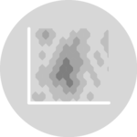
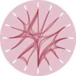

```{r setup, include=FALSE}
options(htmltools.dir.version=FALSE)
knitr::opts_chunk$set(message=FALSE, warning=FALSE, fig.align="center", dpi=150)
knitr::opts_chunk$set(cache=TRUE, cache.path="ch3_cache/html/")
knitr::opts_chunk$set(fig.path="ch3_files/figure-html/")

library(ggplot2)
theme_set(theme_gray(base_size=16))
library(dplyr)
library(tidyr)
set.seed(42)
```

```{r xaringanExtra, echo=FALSE, cache=FALSE}
xaringanExtra::use_share_again()
xaringanExtra::style_share_again(share_buttons="none")
xaringanExtra::use_scribble()
xaringanExtra::use_panelset(in_xaringan=TRUE)
```

# Directory of Visualizations
.footnote[Based on [The R Graph Gallery](https://r-graph-gallery.com/)]

.pull-left[
- .distribution[[Distribution](ch3_1.html#3)].icons[
  
  
  
  
  
  ]

- .correlation[[Correlation](ch3_2.html#3)].icons[
  
  
  
  
  
  
  ]

- .ranking[[Ranking](ch3_3.html#3)].icons[
  
  
  
  
  
  
  ]

- .part[[Part of a Whole](ch3_4.html#3)].icons[
  
  
  
  
  
  
  ]
]
.pull-right[
- .evolution[[Evolution](ch3_5.html#3)].icons[
  
  
  
  
  
  ]

- .map[[Map](ch3_6.html#3)].icons[
  
  
  
  
  
  
  ]

- .flow[[Flow](ch3_7.html#3)].icons[
  
  
  
  
  
  ]

- .other[[Other resources](ch3_8.html#3)].icons[
  
  
  
  
  ]
]
