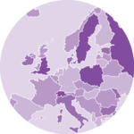
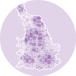

class: base24

```{r child="ch3_0.Rmd"}
```

---
class: map

# Map
.footnote[[< Contents](#2)]

[](https://r-graph-gallery.com/map.html)
[](https://r-graph-gallery.com/choropleth-map.html)
[](https://r-graph-gallery.com/hexbin-map.html)
[](https://r-graph-gallery.com/cartogram.html)
[](https://r-graph-gallery.com/connection-map.html)
[](https://r-graph-gallery.com/bubble-map.html)

.bottom[Map]
.bottom[Choropleth]
.bottom[Hexbin map]
.bottom[Cartogram]
.bottom[Connection]
.bottom[Bubble map]

<br>

.black.font120[
- Visualizaton of **geospatial data**
- Usually, the map is just a reference
- Sometimes, it **encodes** the information
]

---
class: map

# Map  Map
.footnote[[< Contents](#2) | Many resources and examples at [**r-spatial.org**](https://r-spatial.org/)]

.pull-left-mod[
```{r map, eval=FALSE}
world <- giscoR::gisco_get_countries()

ggplot(world) +
  geom_sf() #<<
```
]
.pull-right-mod[
```{r map, echo=FALSE, fig.asp=1.25}
```
]

---
class: map

# Map  Map
.footnote[[< Contents](#2)]

.pull-left-mod[
```{r map-usa, eval=FALSE}
usa <- sf::st_as_sf(maps::map( #<<
  "state", plot=FALSE, fill=TRUE))

ggplot(usa) +
  geom_sf()
```
]
.pull-right-mod[
```{r map-usa, echo=FALSE, fig.asp=1.25}
```
]

---
class: map

# Map  Map
.footnote[[< Contents](#2)]

.pull-left-mod[
```{r map-africa, eval=FALSE}
africa <- giscoR::gisco_get_countries(
    region="Africa") #<<

ggplot(africa) +
  geom_sf()
```
]
.pull-right-mod[
```{r map-africa, echo=FALSE, fig.asp=1.25}
```
]

---
class: map

# Map  Map
.footnote[[< Contents](#2) | See [**Coordinate Reference Systems**](https://en.wikipedia.org/wiki/Spatial_reference_system)]

.pull-left-mod[
```{r map-africa-cut, eval=FALSE}
africa <- giscoR::gisco_get_countries(
    region="Africa")

ggplot(africa) +
  geom_sf() +
  coord_sf(xlim=c(-20, 50), #<<
           ylim=c(-40, 40)) #<<
```
]
.pull-right-mod[
```{r map-africa-cut, echo=FALSE, fig.asp=1.25}
```
]

---
class: map

# Map  Choropleth
.footnote[[< Contents](#2)]

.pull-left-mod[
```{r choropleth, eval=FALSE}
africa <- giscoR::gisco_get_countries(
    region="Africa") |>
  left_join( #<<
    africamonitor::am_data( #<<
      series="SP_POP_TOTL", #<<
      from=2021, to=2021), #<<
    by=c("ISO3_CODE"="ISO3")) #<<

ggplot(africa) +
  geom_sf(aes(fill=SP_POP_TOTL)) + #<<
  coord_sf(xlim=c(-20, 50),
           ylim=c(-40, 40)) +
  scale_fill_viridis_c() +
  labs(fill="Population") +
  theme(legend.position=c(0, 0),
        legend.justification=c(0, 0))
```
]
.pull-right-mod[
```{r choropleth, echo=FALSE, fig.asp=1.25}
```
]

---
class: map

# Map  Cartogram
.footnote[[< Contents](#2)]

.pull-left-mod[
```{r cartogram, eval=FALSE}
africa <- giscoR::gisco_get_countries(
    region="Africa") |>
  left_join(
    africamonitor::am_data(
      series="SP_POP_TOTL",
      from=2021, to=2021),
    by=c("ISO3_CODE"="ISO3")) |>
  sf::st_transform(3857) |>
  cartogram::cartogram_cont( #<<
    "SP_POP_TOTL", itermax=5) |> #<<
  sf::st_transform(4326)

ggplot(africa) +
  geom_sf(aes(fill=SP_POP_TOTL)) + #<<
  coord_sf(xlim=c(-20, 50),
           ylim=c(-40, 40)) +
  scale_fill_viridis_c() +
  labs(fill="Population") +
  theme(legend.position=c(0, 0),
        legend.justification=c(0, 0))
```
]
.pull-right-mod[
```{r cartogram, echo=FALSE, fig.asp=1.25}
```
]

---
class: map

# Map  Bubble map
.footnote[[< Contents](#2)]

.pull-left-mod[
```{r bubble, eval=FALSE}
africa <- giscoR::gisco_get_countries(
    region="Africa") |>
  left_join(
    africamonitor::am_data(
      series="SP_POP_TOTL",
      from=2021, to=2021),
    by=c("ISO3_CODE"="ISO3"))
centroids <- africa |> #<<
  sf::st_centroid() #<<

ggplot(centroids) + #<<
  geom_sf(data=africa) +
  geom_sf(aes(size=SP_POP_TOTL)) + #<<
  coord_sf(xlim=c(-20, 50),
           ylim=c(-40, 40)) +
  labs(size="Population") +
  theme(legend.position=c(0, 0),
        legend.justification=c(0, 0))
```
]
.pull-right-mod[
```{r bubble, echo=FALSE, fig.asp=1.25}
```
]

---
class: map

# Map  Connection
.footnote[[< Contents](#2)]

.pull-left-mod[
```{r connection, eval=FALSE}
africa <- giscoR::gisco_get_countries(
    region="Africa") |>
  left_join(
    africamonitor::am_data(
      series="SP_POP_TOTL",
      from=2021, to=2021),
    by=c("ISO3_CODE"="ISO3"))
centroids <- africa |>
  sf::st_centroid()
lines <- centroids |> #<<
  sf::st_union() |> #<<
  sf::st_cast("LINESTRING") #<<

ggplot(lines) + #<<
  geom_sf(data=africa) +
  geom_sf(aes(size=SP_POP_TOTL),
          data=centroids) +
  geom_sf() + #<<
  coord_sf(xlim=c(-20, 50),
           ylim=c(-40, 40)) +
  labs(size="Population") +
  theme(legend.position=c(0, 0),
        legend.justification=c(0, 0))
```
]
.pull-right-mod[
```{r connection, echo=FALSE, fig.asp=1.25}
```
]

---
class: map

# Map  Hexbin map
.footnote[[< Contents](#2)]

.pull-left-mod[
```{r hexbin, eval=FALSE}
esp <- mapSpain::esp_get_country()
hexccaa <- mapSpain::esp_get_hex_ccaa() #<<

ggplot(hexccaa) + #<<
  geom_sf(data=esp) +
  geom_sf(aes(fill=codauto), #<<
          alpha=0.3,
          show.legend=FALSE) +
  geom_sf_text(
    aes(label=label),
    check_overlap=TRUE) +
  theme_void(base_size=16)
```
]
.pull-right-mod[
```{r hexbin, echo=FALSE, fig.asp=1.25}
```
]

---
class: map

# Map  Hexbin map
.footnote[[< Contents](#2)]

.pull-left-mod[
```{r hexbin-prov, eval=FALSE}
esp <- mapSpain::esp_get_country()
hexprov <- mapSpain::esp_get_hex_prov() #<<

ggplot(hexprov) + #<<
  geom_sf(data=esp) +
  geom_sf(aes(fill=codauto),
          alpha=0.3,
          show.legend=FALSE) +
  geom_sf_text(
    aes(label=label),
    check_overlap=TRUE) +
  theme_void(base_size=16)
```
]
.pull-right-mod[
```{r hexbin-prov, echo=FALSE, fig.asp=1.25}
```
]

---
class: map

# Map  Hexbin map
.footnote[[< Contents](#2)]

.pull-left-mod[
```{r hexbin-prov-grid, eval=FALSE}
esp <- mapSpain::esp_get_country()
gridprov <- mapSpain::esp_get_grid_prov() #<<

ggplot(gridprov) + #<<
  geom_sf(data=esp) +
  geom_sf(aes(fill=codauto),
          alpha=0.3,
          show.legend=FALSE) +
  geom_sf_text(
    aes(label=label),
    check_overlap=TRUE) +
  theme_void(base_size=16)
```
]
.pull-right-mod[
```{r hexbin-prov-grid, echo=FALSE, fig.asp=1.25}
```
]
