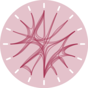
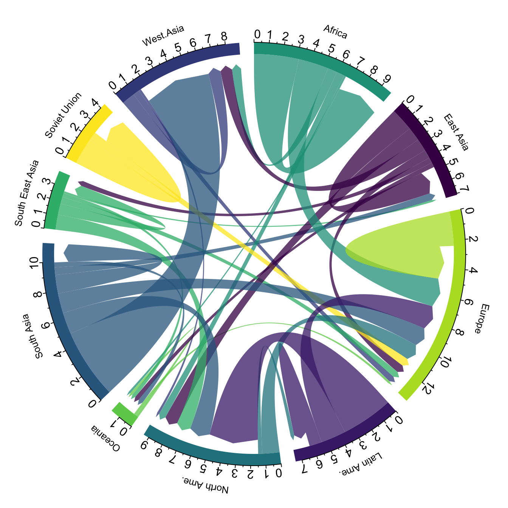
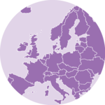

class: base24

```{r child="ch3_0.Rmd"}
```

---
class: flow

# Flow
.footnote[[< Contents](#2)]

[](https://r-graph-gallery.com/chord-diagram.html)
[](https://r-graph-gallery.com/network.html)
[](https://r-graph-gallery.com/sankey-diagram.html)
[](https://www.data-to-viz.com/graph/arc.html)
[](https://r-graph-gallery.com/hierarchical-edge-bundling.html)

.bottom[Chord diagram]
.bottom[Network]
.bottom[Sankey]
.bottom[Arc diagram]
.bottom[Edge bundling]

<br>

.black.font120[
- Visualization of **interconnection** between entities
- Generally, two datasets are required: **nodes** and **edges**
- Data wrangling is a bit different
]

---
class: flow

# Flow  Network
.footnote[[< Contents](#2)]

.pull-left-mod[
```{r network, eval=FALSE}
library(ggraph)
library(tidygraph)

as_tbl_graph(highschool) |> #<<
  mutate(Popularity = centrality_degree(
    mode="in")) |>
ggraph(layout="kk") + #<<
  geom_node_point( #<<
    aes(size=Popularity)) + #<<
  theme(legend.position="top")
```
]
.pull-right-mod[
```{r network, echo=FALSE, fig.asp=1.25}
```
]

---
class: flow

# Flow  Network
.footnote[[< Contents](#2)]

.pull-left-mod[
```{r network-edges, eval=FALSE}
library(ggraph)
library(tidygraph)

as_tbl_graph(highschool) |>
  mutate(Popularity = centrality_degree(
    mode="in")) |>
ggraph(layout="kk") +
  geom_node_point(
    aes(size=Popularity)) +
  geom_edge_link( #<<
    arrow=arrow( #<<
      length=unit(0.1, "inches"), #<<
      type="closed")) + #<<
  theme(legend.position="top")
```
]
.pull-right-mod[
```{r network-edges, echo=FALSE, fig.asp=1.25}
```
]

---
class: flow

# Flow  Network
.footnote[[< Contents](#2)]

.pull-left-mod[
```{r network-edges-fan, eval=FALSE}
library(ggraph)
library(tidygraph)

as_tbl_graph(highschool) |>
  mutate(Popularity = centrality_degree(
    mode="in")) |>
ggraph(layout="kk") +
  geom_node_point(
    aes(size=Popularity)) +
  geom_edge_fan( #<<
    aes(alpha=after_stat(index)), #<<
    show.legend=FALSE) + #<<
  theme(legend.position="top")
```
]
.pull-right-mod[
```{r network-edges-fan, echo=FALSE, fig.asp=1.25}
```
]

---
class: flow

# Flow  Network
.footnote[[< Contents](#2)]

.pull-left-mod[
```{r network-edges-color, eval=FALSE}
library(ggraph)
library(tidygraph)

as_tbl_graph(highschool) |>
  mutate(Popularity = centrality_degree(
    mode="in")) |>
ggraph(layout="kk") +
  geom_node_point(
    aes(size=Popularity)) +
  geom_edge_fan( #<<
    aes(alpha=after_stat(index), #<<
        color=factor(year)), #<<
    show.legend=FALSE) + #<<
  theme(legend.position="top")
```
]
.pull-right-mod[
```{r network-edges-color, echo=FALSE, fig.asp=1.25}
```
]

---
class: flow

# Flow  Network
.footnote[[< Contents](#2)]

.pull-left-mod[
```{r network-facet, eval=FALSE}
library(ggraph)
library(tidygraph)

as_tbl_graph(highschool) |>
  mutate(Popularity = centrality_degree(
    mode="in")) |>
ggraph(layout="kk") +
  geom_node_point(
    aes(size=Popularity)) +
  geom_edge_fan(
    aes(alpha=after_stat(index)),
    show.legend=FALSE) +
  facet_edges(~year, ncol=1) + #<<
  theme(legend.position="top")
```
]
.pull-right-mod[
```{r network-facet, echo=FALSE, fig.asp=1.25}
```
]

---
class: flow

# Flow  Network
.footnote[[< Contents](#2)]

.pull-left-mod[
```{r network-theme, eval=FALSE}
library(ggraph)
library(tidygraph)

as_tbl_graph(highschool) |>
  mutate(Popularity = centrality_degree(
    mode="in")) |>
ggraph(layout="kk") +
  geom_node_point(
    aes(size=Popularity)) +
  geom_edge_fan(
    aes(alpha=after_stat(index)),
    show.legend=FALSE) +
  facet_edges(~year, ncol=1) +
  theme_graph(base_size=16, #<<
              foreground="#a53253", #<<
              fg_text_colour="white") + #<<
  theme(legend.position="top")
```
]
.pull-right-mod[
```{r network-theme, echo=FALSE, fig.asp=1.25}
```
]

---
class: flow

# Flow  Arc diagram
.footnote[[< Contents](#2)]

.pull-left-mod[
```{r network-arc, eval=FALSE}
library(ggraph)
library(tidygraph)

as_tbl_graph(highschool) |>
  mutate(Popularity = centrality_degree(
    mode="in")) |>
ggraph(layout="linear") + #<<
  geom_node_point(
    aes(size=Popularity)) +
  geom_edge_arc( #<<
    aes(alpha=after_stat(index)),
    show.legend=FALSE) +
  facet_edges(~year, ncol=1) +
  theme_graph(base_size=16,
              foreground="#a53253",
              fg_text_colour="white") +
  theme(legend.position="top")
```
]
.pull-right-mod[
```{r network-arc, echo=FALSE, fig.asp=1.25}
```
]

---
class: flow

# Flow  Arc diagram
.footnote[[< Contents](#2)]

.pull-left-mod[
```{r network-circular, eval=FALSE}
library(ggraph)
library(tidygraph)

as_tbl_graph(highschool) |>
  mutate(Popularity = centrality_degree(
    mode="in")) |>
ggraph(layout="linear", circular=TRUE) + #<<
  coord_fixed() + #<<
  geom_node_point(
    aes(size=Popularity)) +
  geom_edge_arc(
    aes(alpha=after_stat(index)),
    show.legend=FALSE) +
  facet_edges(~year, ncol=1) +
  theme_graph(base_size=16,
              foreground="#a53253",
              fg_text_colour="white") +
  theme(legend.position="top")
```
]
.pull-right-mod[
```{r network-circular, echo=FALSE, fig.asp=1.25}
```
]

---
class: flow

# Flow  Edge bundling
.footnote[[< Contents](#2) | Data from [**ggraph manual**](https://ggraph.data-imaginist.com/reference/geom_conn_bundle.html)]

.pull-left-mod[
```{r, echo=FALSE}
flareGraph <- tbl_graph(
  flare$vertices, flare$edges) |>
  mutate(
    class = map_bfs_chr(node_is_root(), .f = function(node, dist, path, ...) {
      if (dist <= 1) {
        return(shortName[node])
      }
      path$result[[nrow(path)]]
    })
  )
importFrom <- match(flare$imports$from, flare$vertices$name)
importTo <- match(flare$imports$to, flare$vertices$name)
```
```{r network-bundle, eval=FALSE}
library(ggraph)
library(tidygraph)

# flareGraph <- ...
# importFrom <- ...
# importTo <- ...

ggraph(flareGraph, "dendrogram", #<<
       circular=TRUE) + #<<
  coord_fixed() + #<<
  geom_node_point() +
  theme_graph(base_size=16)
```
]
.pull-right-mod[
```{r network-bundle, echo=FALSE, fig.asp=1.25}
```
]

---
class: flow

# Flow  Edge bundling
.footnote[[< Contents](#2) | Data from [**ggraph manual**](https://ggraph.data-imaginist.com/reference/geom_conn_bundle.html)]

.pull-left-mod[
```{r network-bundle-nodes, eval=FALSE}
library(ggraph)
library(tidygraph)

# flareGraph <- ...
# importFrom <- ...
# importTo <- ...

ggraph(flareGraph, "dendrogram",
       circular=TRUE) +
  coord_fixed() +
  geom_node_point(
    aes(filter=leaf, color=class)) + #<<
  theme_graph(base_size=16) +
  theme(legend.position="top")
```
]
.pull-right-mod[
```{r network-bundle-nodes, echo=FALSE, fig.asp=1.25}
```
]

---
class: flow

# Flow  Edge bundling
.footnote[[< Contents](#2) | Data from [**ggraph manual**](https://ggraph.data-imaginist.com/reference/geom_conn_bundle.html)]

.pull-left-mod[
```{r network-bundle-edges, eval=FALSE}
library(ggraph)
library(tidygraph)

# flareGraph <- ...
# importFrom <- ...
# importTo <- ...

ggraph(flareGraph, "dendrogram",
       circular=TRUE) +
  coord_fixed() +
  geom_node_point(
    aes(filter=leaf, color=class)) +
  geom_conn_bundle( #<<
    aes(color=after_stat(index)), #<<
    data=get_con(importFrom, importTo), #<<
    edge_alpha=0.25) + #<<
  theme_graph(base_size=16) +
  theme(legend.position="top")
```
]
.pull-right-mod[
```{r network-bundle-edges, echo=FALSE, fig.asp=1.25}
```
]

---
class: flow

# Flow  Edge bundling
.footnote[[< Contents](#2) | Data from [**ggraph manual**](https://ggraph.data-imaginist.com/reference/geom_conn_bundle.html)]

.pull-left-mod[
```{r network-bundle-guide, eval=FALSE}
library(ggraph)
library(tidygraph)

# flareGraph <- ...
# importFrom <- ...
# importTo <- ...

ggraph(flareGraph, "dendrogram",
       circular=TRUE) +
  coord_fixed() +
  geom_node_point(
    aes(filter=leaf, color=class)) +
  geom_conn_bundle(
    aes(color=after_stat(index)),
    data=get_con(importFrom, importTo),
    edge_alpha=0.25) +
  scale_edge_colour_distiller( #<<
    NULL, guide="edge_direction") + #<<
  theme_graph(base_size=16) +
  theme(legend.position="top")
```
]
.pull-right-mod[
```{r network-bundle-guide, echo=FALSE, fig.asp=1.25}
```
]

---
class: flow

# Flow  Chord diagram
.footnote[[< Contents](#2)]

.pull-left-mod[
- Out of the scope
- Requires `circlize`, `chorddiag`
- See the [**source**](https://www.data-to-viz.com/graph/chord.html)
]
.pull-right-mod[
```{r chord, echo=FALSE, fig.asp=1.25}

```
]

---
class: flow

# Flow  Sankey / Alluvial
.footnote[[< Contents](#2)]

.pull-left-mod[
```{r sankey, eval=FALSE}
# remotes::install_github(
#   "davidsjoberg/ggsankey")
df <- mtcars |>
  ggsankey::make_long(
    cyl, vs, am, gear, carb)

ggplot(df) +
  aes(x, next_x=next_x, #<<
      node=node, next_node=next_node, #<<
      fill=factor(node)) +
  ggsankey::geom_sankey() + #<<
  scale_fill_viridis_d() +
  labs(x=NULL) +
  theme(legend.position="top")
```
]
.pull-right-mod[
```{r sankey, echo=FALSE, fig.asp=1.25}
```
]

---
class: flow

# Flow  Sankey / Alluvial
.footnote[[< Contents](#2)]

.pull-left-mod[
```{r sankey-nodes, eval=FALSE}
# remotes::install_github(
#   "davidsjoberg/ggsankey")
df <- mtcars |>
  ggsankey::make_long(
    cyl, vs, am, gear, carb)

ggplot(df) +
  aes(x, next_x=next_x,
      node=node, next_node=next_node,
      fill=factor(node)) +
  ggsankey::geom_sankey(
    flow.alpha=0.6, #<<
    node.color="gray30") + #<<
  scale_fill_viridis_d() +
  labs(x=NULL) +
  theme(legend.position="top")
```
]
.pull-right-mod[
```{r sankey-nodes, echo=FALSE, fig.asp=1.25}
```
]

---
class: flow

# Flow  Sankey / Alluvial
.footnote[[< Contents](#2)]

.pull-left-mod[
```{r sankey-labels, eval=FALSE}
# remotes::install_github(
#   "davidsjoberg/ggsankey")
df <- mtcars |>
  ggsankey::make_long(
    cyl, vs, am, gear, carb)

ggplot(df) +
  aes(x, next_x=next_x,
      node=node, next_node=next_node,
      fill=factor(node),
      label=node) + #<<
  ggsankey::geom_sankey(
    flow.alpha=0.6,
    node.color="gray30") +
  ggsankey::geom_sankey_label( #<<
    size=3, color="white", #<<
    fill="gray40") + #<<
  scale_fill_viridis_d() +
  labs(x=NULL) +
  theme(legend.position="none")
```
]
.pull-right-mod[
```{r sankey-labels, echo=FALSE, fig.asp=1.25}
```
]

---
class: flow

# Flow  Sankey / Alluvial
.footnote[[< Contents](#2)]

.pull-left-mod[
```{r sankey-theme, eval=FALSE}
# remotes::install_github(
#   "davidsjoberg/ggsankey")
df <- mtcars |>
  ggsankey::make_long(
    cyl, vs, am, gear, carb)

ggplot(df) +
  aes(x, next_x=next_x,
      node=node, next_node=next_node,
      fill=factor(node),
      label=node) +
  ggsankey::geom_sankey(
    flow.alpha=0.6,
    node.color="gray30") +
  ggsankey::geom_sankey_label(
    size=3, color="white",
    fill="gray40") +
  scale_fill_viridis_d() +
  ggsankey::theme_sankey(base_size=16) + #<<
  labs(x=NULL) +
  theme(legend.position="none")
```
]
.pull-right-mod[
```{r sankey-theme, echo=FALSE, fig.asp=1.25}
```
]

---
class: flow

# Flow  Geospatial network
.footnote[[< Contents](#2)]

.pull-left-mod[
```{r sfnetwork, eval=FALSE}
library(tidygraph)
library(sfnetworks) #<<

net <- as_sfnetwork(roxel, directed=F) |> #<<
  activate("nodes") |>
  mutate(bc = centrality_betweenness())

ggplot() +
  geom_sf(data=sf::st_as_sf(net, "edges"), #<<
          color="grey50") + #<<
  geom_sf(data=sf::st_as_sf(net, "nodes"), #<<
          aes(color=bc)) + #<<
  scale_color_viridis_c() +
  theme(legend.position=c(1, 0),
        legend.justification=c(1, 0))
```
]
.pull-right-mod[
```{r sfnetwork, echo=FALSE, fig.asp=1.25}
```
]

---
class: flow

# Flow  Geospatial network
.footnote[[< Contents](#2)]

.pull-left-mod[
```{r sfnetwork-ggraph, eval=FALSE}
library(ggraph) #<<
library(tidygraph)
library(sfnetworks)

net <- as_sfnetwork(roxel, directed=F) |>
  activate("nodes") |>
  mutate(bc = centrality_betweenness())

ggraph(net) + #<<
  geom_edge_link(color="grey50") + #<<
  geom_node_point(aes(color=bc)) + #<<
  scale_color_viridis_c() +
  theme(legend.position=c(1, 0),
        legend.justification=c(1, 0))
```
]
.pull-right-mod[
```{r sfnetwork-ggraph, echo=FALSE, fig.asp=1.25}
```
]

---
class: flow

# Flow  Geospatial network
.footnote[[< Contents](#2)]

.pull-left-mod[
```{r sfnetwork-ggraph-layout, eval=FALSE}
library(ggraph)
library(tidygraph)
library(sfnetworks)

net <- as_sfnetwork(roxel, directed=F) |>
  activate("nodes") |>
  mutate(bc = centrality_betweenness())

layout_sf <- function(graph) { #<<
  graph <- activate(graph, "nodes") #<<
  data.frame( #<<
    x=sf::st_coordinates(graph)[,"X"], #<<
    y=sf::st_coordinates(graph)[,"Y"]) #<<
} #<<

ggraph(net, layout=layout_sf) + #<<
  geom_edge_link(color="grey50") +
  geom_node_point(aes(color=bc)) +
  scale_color_viridis_c() +
  theme(legend.position=c(1, 0),
        legend.justification=c(1, 0))
```
]
.pull-right-mod[
```{r sfnetwork-ggraph-layout, echo=FALSE, fig.asp=1.25}
```
]

---
class: flow

# Flow  Geospatial network
.footnote[[< Contents](#2)]

.pull-left-mod[
```{r sfnetwork-ggraph-coord, eval=FALSE}
library(ggraph)
library(tidygraph)
library(sfnetworks)

net <- as_sfnetwork(roxel, directed=F) |>
  activate("nodes") |>
  mutate(bc = centrality_betweenness())

layout_sf <- function(graph) {
  graph <- activate(graph, "nodes")
  data.frame(
    x=sf::st_coordinates(graph)[,"X"],
    y=sf::st_coordinates(graph)[,"Y"])
}

ggraph(net, layout=layout_sf) +
  geom_edge_link(color="grey50") +
  geom_node_point(aes(color=bc)) +
  coord_sf(crs=sf::st_crs(net)) + #<<
  scale_color_viridis_c() +
  theme(legend.position=c(1, 0),
        legend.justification=c(1, 0))
```
]
.pull-right-mod[
```{r sfnetwork-ggraph-coord, echo=FALSE, fig.asp=1.25}
```
]
