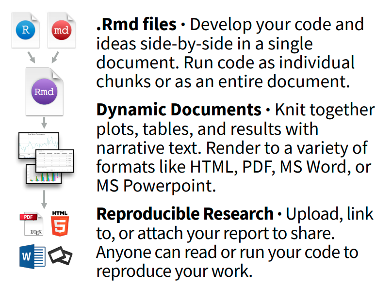

class: base24

```{r setup, include=FALSE}
options(htmltools.dir.version=FALSE)
knitr::opts_chunk$set(message=FALSE, warning=FALSE, fig.align="center", dpi=150)

library(ggplot2)
theme_set(theme_gray(base_size=16))
```

```{r xaringanExtra, echo=FALSE}
xaringanExtra::use_share_again()
xaringanExtra::style_share_again(share_buttons="none")
xaringanExtra::use_scribble()
xaringanExtra::use_panelset(in_xaringan=TRUE)
```

# Introduction

<div style="float:right; width:25%">
```{r smcr, echo=FALSE, fig.asp=2.5, dev.args=list(bg="transparent")}
ggraph::ggraph(data.frame(from=c("Source", "Message", "Channel"),
                          to=c("Message", "Channel", "Receiver"),
                          label=c("encode", "", "decode"))) +
  ggraph::geom_edge_link(aes(label=label), arrow=arrow(type="closed"),
                         end_cap=ggraph::circle(1.8, 'cm'), label_size=18) +
  ggraph::geom_node_label(aes(label=name, color=c("black", "blue", "red", "black")),
                          size=20, label.padding=unit(2, "lines")) +
  scale_color_identity() +
  ggraph::theme_graph() + theme(plot.background=element_rect(fill=NA))
```
</div>

## Goals

--

- How to _communicate_ data with a visualization, i.e. how to effectively
  _encode_ a visual .blue[**message**], was covered in chapter 1.

--

- Here, we refer to the .red[**channel**] used to _share_ that message.

--

- We will talk about
  - Document formats (e.g.: article, report, book, presentation, website...)
  - File formats (e.g.: HTML, PDF, EPUB, DOCX, PPTX...)
  - **Reproducibility** (and automation)

---
class: base24

# Introduction

## Markup language

.pull-left[
- "a **text-encoding system** consisting of a set of symbols inserted in a text
  document to control its **structure**, formatting, or the relationship between
  its parts."

- "Markup is often used to control the **display** of the document or to
enrich its content to facilitating **automated processing**."
]
.pull-right[
```html
<!DOCTYPE html>
<html>
<body>

<h2>My First Heading</h2>
<p>My first <b>paragraph</b></p>
<a href="#">This is a link</a>

</body>
</html>
```

<h2>My First Heading</h2>
<p>My first <b>paragraph</b>.</p>
<a href="#">This is a link</a>
]

---
class: base24

# Introduction

## Markdown

.pull-left[
- Gruber & Swartz, 2004

- A markup language<br>**appealing to human readers**.

- Rise, divergence, then standardization in 2012.

- Many flavors still today.

- Key component: **pandoc**,<br>by John MacFarlane.
]
.pull-right[
```markdown
## My First Heading

My first **paragraph**.

[This is a link](#)
```

.footnote[[Markdown Basics](https://rmarkdown.rstudio.com/lesson-8.html), [Pandoc's Markdown](https://pandoc.org/MANUAL.html#pandocs-markdown)]

## My First Heading

My first **paragraph**.

[This is a link](#)
]

---
class: base24

# Introduction

## YAML

.pull-left[
- _YAML Ain't Markup Language_

- Human-readable data-serialization language

- Configuration files, etc.

- Here, **document metadata**
]
.pull-right[
```yaml
title:  'Title: it contains a colon'
author:
- Author One
- Author Two
keywords: [nothing, nothingness]
abstract: |
  This is the abstract.

  It consists of two paragraphs.
```
]

.footnote[[YAML syntax](https://en.wikipedia.org/wiki/YAML#Syntax)]

---
class: base24

# R Markdown

.footnote[[Reference guide](https://www.rstudio.com/wp-content/uploads/2015/03/rmarkdown-reference.pdf), [Cheatsheet](https://github.com/rstudio/cheatsheets/raw/main/rmarkdown-2.0.pdf)]

.pull-left[
- An (optional) YAML header surrounded by `---`s

- Text mixed with simple text formatting in Markdown

- **Executable code chunks** surrounded by ` ``` `s
]

--

.pull-right[

]

--

.center[]

---
class: base24

# R Markdown

## Showcase

<div style="position:fixed; left:40%; width:86%">

</div>

- [Code chunks](https://rmarkdown.rstudio.com/lesson-3.html)
  - Chunk options
  - Figure output

- [Inline code](https://rmarkdown.rstudio.com/lesson-4.html)

- [Code languages](https://rmarkdown.rstudio.com/lesson-5.html)

- [Parameters](https://rmarkdown.rstudio.com/lesson-6.html)

- [Tables](https://rmarkdown.rstudio.com/lesson-7.html)

- [Output formats](https://rmarkdown.rstudio.com/lesson-9.html)

---
class: base24

# Documents and Notebooks

## Showcase

<div style="position:fixed; left:40%; width:86%">

</div>

- [HTML document](https://bookdown.org/yihui/rmarkdown/html-document.html)

- [Notebook](https://bookdown.org/yihui/rmarkdown/notebook.html)

- [PDF document](https://bookdown.org/yihui/rmarkdown/pdf-document.html)

- [Word document](https://bookdown.org/yihui/rmarkdown/word-document.html)

- Raw markup

---
class: base24

# Presentations

## Showcase

<div style="position:fixed; left:40%; width:86%">

</div>

- [ioslides](https://bookdown.org/yihui/rmarkdown/ioslides-presentation.html)

- [slidy](https://bookdown.org/yihui/rmarkdown/slidy-presentation.html)

- [Beamer (PDF)](https://bookdown.org/yihui/rmarkdown/beamer-presentation.html)

- [PowerPoint](https://bookdown.org/yihui/rmarkdown/powerpoint-presentation.html)

- [reveal.js](https://bookdown.org/yihui/rmarkdown/revealjs.html)

- [xaringan](https://bookdown.org/yihui/rmarkdown/xaringan.html)

---
class: base24

# Other Formats

## Showcase

<div style="position:fixed; left:40%; width:86%">

</div>

- [Tufte Handouts](https://bookdown.org/yihui/rmarkdown/tufte-handouts.html)

- [Websites](https://bookdown.org/yihui/rmarkdown/websites.html)

- [Books](https://bookdown.org/yihui/rmarkdown/books.html)

- [Journals](https://bookdown.org/yihui/rmarkdown/journals.html)

- [**Distill**](https://rstudio.github.io/distill/)
