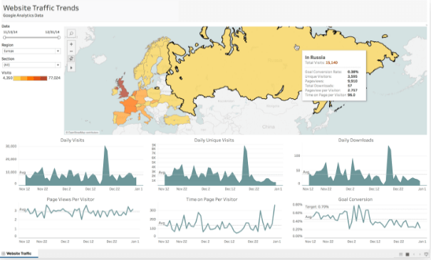
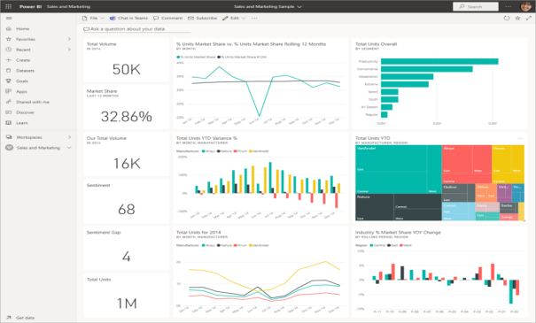
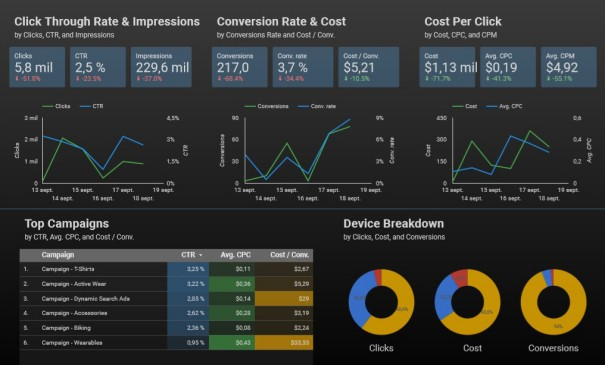
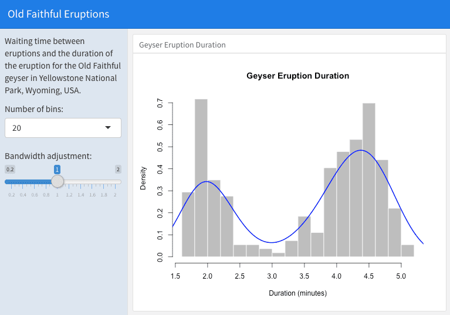

class: base24

```{r setup, include=FALSE}
options(htmltools.dir.version=FALSE)
knitr::opts_chunk$set(message=FALSE, warning=FALSE, fig.align="center", dpi=150)

library(ggplot2)
theme_set(theme_gray(base_size=16))
```

```{r xaringanExtra, echo=FALSE}
xaringanExtra::use_share_again()
xaringanExtra::style_share_again(share_buttons="none")
xaringanExtra::use_scribble()
xaringanExtra::use_panelset(in_xaringan=TRUE)
```

# Introduction

<div style="float:right; width:25%">
```{r smcr, echo=FALSE, fig.asp=2.5, dev.args=list(bg="transparent")}
ggraph::ggraph(data.frame(from=c("Source", "Message", "Channel"),
                          to=c("Message", "Channel", "Receiver"),
                          label=c("encode", "", "decode"))) +
  ggraph::geom_edge_link(aes(label=label), arrow=arrow(type="closed"),
                         end_cap=ggraph::circle(1.8, "cm"), label_size=18) +
  ggraph::geom_node_label(aes(label=name, color=c("black", "blue", "red", "black")),
                          size=20, label.padding=unit(2, "lines")) +
  scale_color_identity() +
  ggraph::theme_graph() + theme(plot.background=element_rect(fill=NA))
```
</div>

## Goals

--

- How to _communicate_ data with a visualization, i.e. how to effectively
  _encode_ a visual .blue[**message**], was covered in chapter 1.

--

- Here, we refer to the .red[**channel**] used to _share_ that message.

--

- We will talk about
  - Document formats (e.g.: article, report, book, presentation, website...)
  - File formats (e.g.: HTML, PDF, EPUB, DOCX, PPTX...)
  - **Reproducibility** (and automation)

---
class: base24

# Introduction

## Markup language

.pull-left[
- "a **text-encoding system** consisting of a set of symbols inserted in a text
  document to control its **structure**, formatting, or the relationship between
  its parts."

- "Markup is often used to control the **display** of the document or to
enrich its content to facilitating **automated processing**."
]
.pull-right[
```html
<!DOCTYPE html>
<html>
<body>

<h2>My First Heading</h2>
<p>My first <b>paragraph</b></p>
<a href="#">This is a link</a>

</body>
</html>
```

<h2>My First Heading</h2>
<p>My first <b>paragraph</b>.</p>
<a href="#">This is a link</a>
]

---
class: base24

# Introduction

## Markdown

.pull-left[
- Gruber & Swartz, 2004

- A markup language<br>**appealing to human readers**.

- Rise, divergence, then standardization in 2012.

- Many flavors still today.

- Key component: **pandoc**,<br>by John MacFarlane.
]
.pull-right[
```markdown
## My First Heading

My first **paragraph**.

[This is a link](#)
```

.footnote[[Markdown Basics](https://rmarkdown.rstudio.com/lesson-8.html), [Pandoc's Markdown](https://pandoc.org/MANUAL.html#pandocs-markdown)]

## My First Heading

My first **paragraph**.

[This is a link](#)
]

---
class: base24

# Introduction

## YAML

.pull-left[
- _YAML Ain't Markup Language_

- Human-readable data-serialization language

- Configuration files, etc.

- Here, **document metadata**
]
.pull-right[
```yaml
title:  "Title: it contains a colon"
author:
- Author One
- Author Two
keywords: [nothing, nothingness]
abstract: |
  This is the abstract.

  It consists of two paragraphs.
```
]

.footnote[[YAML syntax](https://en.wikipedia.org/wiki/YAML#Syntax)]

---
class: base24

# R Markdown

.footnote[[Reference guide](https://www.rstudio.com/wp-content/uploads/2015/03/rmarkdown-reference.pdf), [Cheatsheet](https://github.com/rstudio/cheatsheets/raw/main/rmarkdown-2.0.pdf)]

.pull-left[
- An (optional) YAML header surrounded by `---`s

- Text mixed with simple text formatting in Markdown

- **Executable code chunks** surrounded by ` ``` `s
]

--

.pull-right[

]

--

.center[]

---
class: base24

# R Markdown

## Showcase

<div style="position:fixed; left:40%; width:86%">

</div>

- [Code chunks](https://rmarkdown.rstudio.com/lesson-3.html)
  - Chunk options
  - Figure output

- [Inline code](https://rmarkdown.rstudio.com/lesson-4.html)

- [Code languages](https://rmarkdown.rstudio.com/lesson-5.html)

- [Parameters](https://rmarkdown.rstudio.com/lesson-6.html)

- [Tables](https://rmarkdown.rstudio.com/lesson-7.html)

- [Output formats](https://rmarkdown.rstudio.com/lesson-9.html)

---
class: base24

# Documents and Notebooks

## Showcase

<div style="position:fixed; left:40%; width:86%">

</div>

- [HTML document](https://bookdown.org/yihui/rmarkdown/html-document.html)

- [Notebook](https://bookdown.org/yihui/rmarkdown/notebook.html)

- [PDF document](https://bookdown.org/yihui/rmarkdown/pdf-document.html)

- [Word document](https://bookdown.org/yihui/rmarkdown/word-document.html)

- Raw markup

---
class: base24

# Presentations

## Showcase

<div style="position:fixed; left:40%; width:86%">

</div>

- [ioslides](https://bookdown.org/yihui/rmarkdown/ioslides-presentation.html)

- [slidy](https://bookdown.org/yihui/rmarkdown/slidy-presentation.html)

- [Beamer (PDF)](https://bookdown.org/yihui/rmarkdown/beamer-presentation.html)

- [PowerPoint](https://bookdown.org/yihui/rmarkdown/powerpoint-presentation.html)

- [reveal.js](https://bookdown.org/yihui/rmarkdown/revealjs.html)

- [xaringan](https://bookdown.org/yihui/rmarkdown/xaringan.html)

---
class: base24

# Other Formats

## Showcase

<div style="position:fixed; left:40%; width:86%">

</div>

- [Tufte Handouts](https://bookdown.org/yihui/rmarkdown/tufte-handouts.html)

- [Websites](https://bookdown.org/yihui/rmarkdown/websites.html)

- [Books](https://bookdown.org/yihui/rmarkdown/books.html)

- [Journals](https://bookdown.org/yihui/rmarkdown/journals.html)

- [**Distill**](https://rstudio.github.io/distill/)

---
class: base24

# HTML Widgets

- The `htmlwidgets` package provides a framework for creating R bindings to
  create **web components**.

- Charts, but also maps, diagrams, tables, forms... and even mini-apps.
  Basically, any HTML component with optional **JavaScript**.

--

- You don't generally need to use the `htmlwidgets` package directly.
  Many packages use it to provide many components.

--

- They can be
  - used at the R console for data analysis, just like conventional R plots;
  - embedded within any **HTML document**;
  - saved as standalone web pages for ad-hoc sharing.

---

# HTML Widgets

.pull-left-mod[
```{r plotly, eval=FALSE}
p <- ggplot(gapminder::gapminder) +
  aes(gdpPercap, lifeExp) +
  geom_point(aes(size=pop,
                 color=continent),
             alpha=0.7) +
  scale_size(range=c(2, 12), guide=NULL) +
  scale_x_log10() +
  theme_gray(base_size=10) +
  aes(frame=year, text=country)

library(plotly)

ggplotly(p) |>
 layout(legend=list(
   x=1, y=0, xanchor="right"))
```
]
.pull-right-mod[
```{r plotly, echo=FALSE, out.width="100%", out.height="550px"}
```
]

---

# HTML Widgets

.pull-left-mod[
```{r leaflet, eval=FALSE}
library(leaflet)

g <- c(
  "OpenStreetMap", "Stamen.Toner",
  "Stamen.TonerLite", "CartoDB.Positron")

leaflet() |>
  addProviderTiles(g[1], group=g[1]) |>
  addProviderTiles(g[2], group=g[2]) |>
  addProviderTiles(g[3], group=g[3]) |>
  addProviderTiles(g[4], group=g[4]) |>
  addLayersControl(g) |>
  addMarkers(lng=174.768, lat=-36.852,
             popup="The birthplace of R")
```
]
.pull-right-mod[
```{r leaflet, echo=FALSE, out.width="100%", out.height="550px"}
```
]

---

# HTML Widgets

.pull-left-mod[
```{r networkd3, eval=FALSE}
library(networkD3)

data(MisLinks)
data(MisNodes)

forceNetwork(
  Links = MisLinks, Nodes = MisNodes,
  Source = "source", Target = "target",
  Value = "value", NodeID = "name",
  Group = "group", opacity = 0.8)
```
]
.pull-right-mod[
```{r networkd3, echo=FALSE, out.width="100%", out.height="550px"}
```
]

---

# HTML Widgets

```{r dt}
DT::datatable(iris, options=list(pageLength=6))
```

---

# HTML Widgets

<iframe src="https://gallery.htmlwidgets.org/" style="position:relative;left:0;top:0;width:100%;height:100%" frameborder="0" scrolling="yes"></iframe>

---
class: base24

# Dashboards

- **Business-style reports** to highlight brief and key summaries.

--

<div style="float:right; width:30%; padding-left:20px">



</div>

- You may have heard of Salesforce's _Tableau_, Microsoft _Power BI_,
  Google _Data Studio_...

--

- Often, grid-based layout, components arranged in boxes.

--

- With the `flexdashboard` package, you can
  - use R Markdown to produce dashboards;
  - embed a wide variety of components, including HTML widgets;
  - specify flexible layouts that resize automatically;
  - use **Shiny** for dynamic content.

.footnote[[Documentation](https://pkgs.rstudio.com/flexdashboard/)]

---
class: inverse, center, middle

# Demo

---
class: base24

# Shiny

.footnote[[Documentation](https://shiny.rstudio.com/)]

## Static vs. Dynamic (!= interactive) content

.pull-left[
### Static HTML

```{r, echo=FALSE, out.width="40%"}

```
]
.pull-right[
### Shiny

```{r, echo=FALSE, out.width="83%"}

```
]

---

# Shiny

## Your first Shiny app

.footnote[Example from `rmdexamples::kmeans_cluster()`]

.pull-left[
### ui.R
.code50[
```r
library(shiny)
vars <- names(iris)

ui <- fluidPage(
  fluidRow(style = "padding-bottom: 20px;",
    column(4, selectInput("xcol", "X Variable", vars)),
    column(4, selectInput("ycol", "Y Variable", vars,
                          selected = vars[2])),
    column(4, numericInput("clusters", "Cluster count", 3,
                           min = 1, max = 9))
  ),
  fluidRow(
    plotOutput("kmeans", height = "400px")  
  )
)
```
]]
.pull-right[
### server.R
.code50[
```r
library(shiny)

server <- function(input, output, session) {
  selectedData = reactive({
    iris[, c(input$xcol, input$ycol)]
  })

  clusters = reactive({
    kmeans(selectedData(), input$clusters)
  })

  output$kmeans = renderPlot(height = 400, {
    res = clusters()
    par(mar = c(5.1, 4.1, 0, 1))
    plot(selectedData(),
         col = res$cluster, pch = 20, cex = 3)
    points(res$centers, pch = 4, cex = 4, lwd = 4)
  })
}
```
]]

---

# Dashboards

## Shiny dashboards!

<br>

<div style="float:right; width:44%; padding-left:20px">

</div>

1. Add `runtime: shiny` to the options declared at the top of the document
  (YAML metadata).

2. (Optional) Add the `{.sidebar}` attribute to the first column of the
  dashboard to make it a host for Shiny input controls.

3. Add Shiny inputs and outputs as appropriate.

4. When including plots, be sure to wrap them in a call to `renderPlot()`.

.footnote[[shinyapps.io](https://www.shinyapps.io/) | [Example app](https://enchufa2.shinyapps.io/ls-springs/)]

---

# Dashboards

<iframe src="https://pkgs.rstudio.com/flexdashboard/articles/examples.html" style="position:relative;left:0;top:0;width:100%;height:100%" frameborder="0" scrolling="yes"></iframe>
